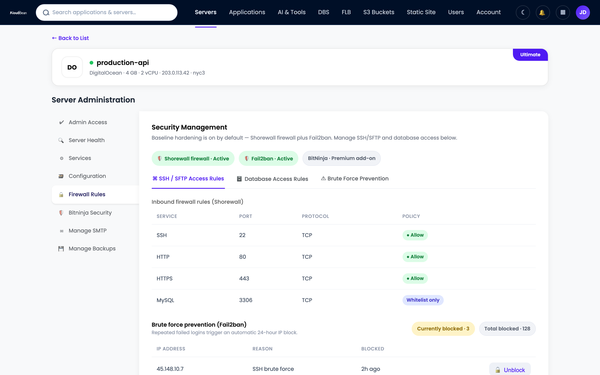
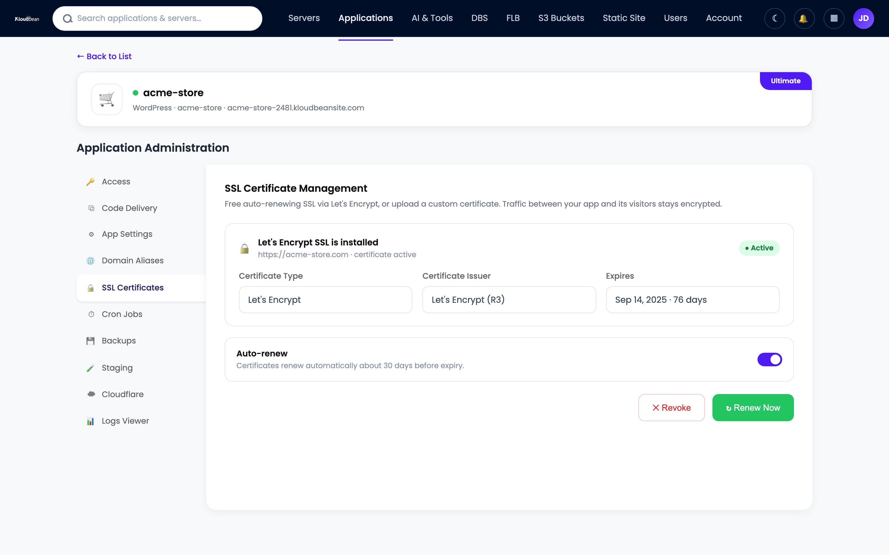
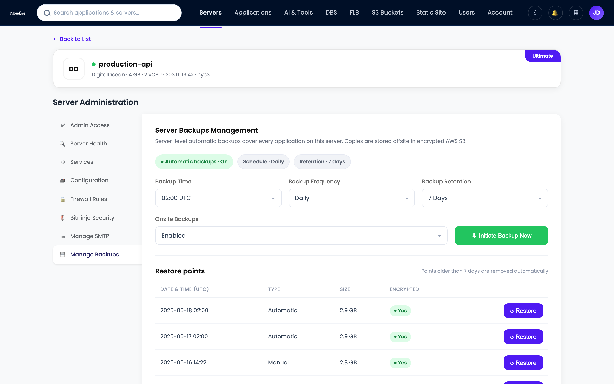

# Secure, Compliant Hosting: Who Actually Secures What

You picked a host, switched on SSL, and the marketing page promised enterprise-grade security. So you're covered, right? Not quite. Secure compliant hosting isn't a checkbox you buy once. It's a split of duties between the platform and you, and the breaches that make the news almost always land on the wrong side of that split. This is the trust hub for teams that answer to auditors, customers, or regulators: fintech, health, agencies holding client data, anyone shipping to the EU. We'll map who secures what, walk the layers of a hardened stack, and show honestly where GDPR, PCI DSS, and SOC 2 begin and end.

> **The short version.** Hosting is secure and compliant when two things line up. The platform hardens the infrastructure (network isolation, firewall, patching, encryption in transit, backups) and you handle the app-level parts (your code, who has access, what data you collect and keep). That division is the shared-responsibility model. No host can be compliant on your behalf. It gives you the controls, and you build compliance on top.

## What secure compliant hosting actually means

Two words, two jobs. **Secure** is about controls: firewalls, encryption, access limits, backups, the machinery that keeps attackers out and keeps you running. **Compliant** is about proof: showing an auditor that those controls exist, work, and are followed. You can be secure without a single certificate. You cannot be compliant without being secure first.

A host can hand you excellent security and you can still fail an audit, because half the requirements are about your app, your team, and your data handling. Secure cloud hosting gives you a strong foundation. It does not fill in the forms for you. So the useful question is never whether a host is secure. It's where the platform's job ends and yours begins.

## The shared-responsibility model: platform versus you

Every serious cloud runs on a shared responsibility model, and it's worth internalizing because it decides who gets the 2am call. The platform owns the layers under your app: datacenter, network, operating system, backups. You own the layers inside it: your code, your users, your data, your decisions about what to collect. Managed hosting shifts more of the middle (patching, the stack, SSL) onto the platform than raw infrastructure does, but it never absorbs the top. The table below is the whole article in one grid.

| Area | Platform provides | You own |
|---|---|---|
| **Physical + datacenter** | Tier-1 provider facilities (AWS, Google Cloud, Linode, Vultr, DigitalOcean, UpCloud, Lightsail) | Nothing at this layer. You inherit it. |
| **Network isolation** | VPC / private networking so services talk internally | Don't expose what should be private; keep the database off the public internet |
| **Firewall + intrusion** | Shorewall firewall and Fail2ban, on by default | IP allowlists and app-level rate limits you choose to add |
| **OS + stack patching** | Kernel, runtime, and stack updates handled for you | Your dependencies and framework versions, your package CVEs |
| **Encryption in transit** | Free, auto-renewing SSL/TLS | Force HTTPS, set HSTS, encrypt sensitive fields in your app |
| **Backups** | Automatic, restorable backups | Test a restore, set retention, back up anything you add outside |
| **Access control** | Subusers, UAC, 2FA, social login, HttpOnly sessions | Who you invite, least-privilege roles, removing people who leave |
| **Secrets** | Environment variable storage outside your code | Never commit a .env file, rotate keys, scope tokens |
| **Data + privacy** | Infrastructure to store data in a region you choose | What you collect, consent, retention, DSARs, your processor agreements |
| **Audit + evidence** | Audit trail (Enterprise), access logs | Your policies, monitoring, incident response, the audit itself |

**The number-one misconception:** "our host is compliant, so we're compliant." No host makes you compliant. It supplies the infrastructure controls an auditor wants to see, and you supply everything above the app boundary. Read the right column as your homework.

<!-- ADD IMAGE: a one-page shared-responsibility matrix you can share with an auditor or a client -->

## Defense in depth: the layers a platform should give you

Security isn't one wall. It's a stack of them, so when one fails (and one eventually does) the next still holds. Attackers call it work; defenders call it defense in depth. A managed platform should hand you most of these layers already switched on, not as a paid upsell you find after an incident.

<!-- SVG diagram: defense-in-depth stack. Edge (Cloudflare) -> Firewall (Shorewall + Fail2ban) -> Encryption in transit (SSL/TLS) -> Access (UAC + 2FA) -> Private network (VPC) -> Resilience (backups + audit trail) -> core: your app and your data (you own this). -->

### The edge: soak up floods, filter bad requests

The outermost layer sits in front of your server and screens traffic before it lands. On Kloudbean that's the Cloudflare add-on: edge caching, plus the ability to absorb volumetric DDoS and filter malicious requests. A web application firewall lives here too, watching for the patterns behind SQL injection and cross-site scripting. Want the mechanics? Start with [what a WAF actually does and when you need one](https://www.kloudbean.com/blog/what-a-waf-does/). One honest note: the baseline hardening below is always on, and true edge WAF and DDoS scrubbing come through Cloudflare, a paid add-on that's free for Enterprise. No separate magic appliance beyond that.

### The firewall: Shorewall and Fail2ban, on by default

Under the edge sits the firewall on the server itself. Every Kloudbean server ships with a Shorewall firewall and Fail2ban, on from the first minute. Shorewall decides which ports are reachable. Fail2ban watches the logs and bans an IP that keeps failing to log in, which is exactly what a brute-force bot looks like. Turn that off and your SSH port becomes a 24/7 guessing game for every scanner online.

Want an extra layer? BitNinja is available as an added security option on Premium and Enterprise. Treat it as a bonus, not the baseline. The firewall and Fail2ban are the floor, and they're already under your feet.

### Encryption in transit: free, auto-renewing SSL

Every byte between a visitor and your app should be encrypted, always, no exceptions. That's SSL/TLS, and on Kloudbean it's free and renews itself, so you never wake up to an expired certificate and a browser scaring your users away. Without it, logins and session cookies travel as plain text that anyone on the network path can read. With it, that traffic is unreadable in flight. If a certificate ever misbehaves, the usual suspects are DNS, mixed content, or a stale cache, and the fixes live in [how to fix common SSL certificate errors](https://www.kloudbean.com/blog/fix-ssl-certificate-errors/).

One boundary worth stating. Encryption in transit is the platform's job, and it's handled. Encryption at rest for the fields you consider sensitive, a national ID, a card token, is an app-level decision you make in your own code. The platform protects the pipe. You decide what deserves an extra lock inside the payload.

### Least-privilege access: subusers, UAC, and 2FA

Most incidents you'll ever read about aren't exotic zero-days. They're a leaked password or a token with far more power than it needed. The fix is old and it works: give every person and every key the least privilege that still lets them do the job. Kloudbean does this with subusers and User Access Control, granular permissions set per resource and per action. Your junior dev can deploy one app without touching billing, the database, or the other twenty projects.

Layer identity on top. Two-factor authentication means a stolen password alone isn't enough to get in. Social login (Google, GitHub, LinkedIn) leans on providers that already do hard identity work. And sessions use HttpOnly cookies, so a cross-site scripting bug can't read the session token out of JavaScript. None of it is flashy. All of it closes the doors attackers use most.

### Lock the doors you rarely use

Admin panels, staging sites, and internal dashboards don't need to greet the whole internet. Two cheap controls shrink that surface fast. IP Access Control allows or denies by address or CIDR range, so only your office or VPN reaches a sensitive path. A Basic Auth gate puts a username and password wall in front of an app before anyone sees it, ideal for staging you don't want indexed or probed. Neither is fancy. The bots can't attack a door they can't reach.

### Private networking: keep the database off the public internet

The most common self-inflicted wound in hosting is a database with a public IP and a weak password. Scanners find it in hours. So keep internal services internal. On Kloudbean your app talks to its database over a VPC and private networking, so the database isn't sitting on the open web waiting to be discovered. The app reaches it on the inside; the internet can't. For admin work you tunnel in through the server rather than exposing a port to the world.

<!-- ADD IMAGE: network topology showing app and database on a private network, public internet blocked from the database -->

### Backups: the first step of resilience

People file backups under "recovery," but they belong in any honest security conversation. Ransomware, a bad migration, a fat-fingered delete: what saves you is a clean, recent, restorable copy. Kloudbean backs up automatically. The step almost everyone skips is testing a restore before they actually need one. Do it once, so the path is proven. A backup you've never restored is a hope, not a plan. There's more on cadence and retention in the [guide to server backups and restore testing](https://www.kloudbean.com/blog/server-backups-guide/).

### Audit trail: proof of who did what

When something changes, compliance and incident response ask the same question: who did that, and when? An audit trail answers it. Kloudbean's Audit Trail, on Enterprise, is an immutable, searchable, account-wide log of activity with CSV export, built with compliance in mind. For a SOC 2 review or a post-incident timeline, that log is the difference between "we think" and "we can show you." It's the layer that turns a pile of good controls into evidence an auditor accepts.

<!-- ADD IMAGE: the audit trail view with a searchable, timestamped activity log and a CSV export button (Enterprise) -->

## Your side of the line: what no host can do for you

Now the right column of that table, because this is where audits are won or lost. The platform hands you a hardened base. Your application is still yours to secure.

- **Your code.** Injection, broken access checks, and cross-site scripting are app bugs, not server bugs. Validate input, use parameterized queries, and set proper HTTP security headers so browsers help defend your users. Start with the [security headers guide](https://www.kloudbean.com/blog/security-headers-guide/) for CSP, HSTS, and the rest.
- **Your dependencies.** A patched server won't save you from a known CVE in a package you shipped. Run your language's audit (`npm audit`, `pip-audit`) and keep libraries current. If you ship containers, scan the images before they go out.
- **Your secrets.** API keys and connection strings live in environment variables, never in the repo. A leaked key in Git history is one of the fastest ways to get breached, and it's entirely on your side of the line.
- **Your access hygiene.** Least-privilege only works if you actually use it. Remove people when they leave, review who has what, and turn on 2FA for everyone, not just admins.
- **Your data decisions.** What you collect, how long you keep it, who you share it with, and whether you have consent are legal and product choices. No infrastructure control makes them for you.

<!-- ADD IMAGE: a terminal showing an npm audit or pip-audit run flagging a vulnerable dependency -->

## How GDPR, PCI DSS, and SOC 2 map to shared responsibility

Compliance frameworks look scary from outside, but each one splits along the same platform-versus-you line. Read them as two columns, not one wall. Here's how GDPR, PCI DSS, and SOC 2 hosting map to who does what.

| Framework | Platform provides (infra controls) | You own (app + process) |
|---|---|---|
| **GDPR** | Data stored in a region you choose, encryption in transit, access controls, backups | Lawful basis, consent, data minimization, DSAR handling, your processor agreements |
| **PCI DSS** | Network segmentation, firewall, TLS, patched infrastructure | Scope of cardholder data, tokenizing or outsourcing card capture, not storing what you don't need |
| **SOC 2** | Infrastructure controls, audit trail, access logs, backups as evidence | Your written policies, onboarding and offboarding, monitoring, and the audit itself |

### GDPR: where the data lives and what you collect

GDPR cares a lot about where personal data sits and how it's handled. The platform side is picking a region and keeping data encrypted and access-controlled once it's there. Kloudbean spans seven clouds, so you can place workloads in the region your policy calls for. The rest is yours: a lawful basis for processing, honest consent, collecting the minimum you need, and answering data subject access requests. Deeper detail lives in the [guide to GDPR-compliant hosting](https://www.kloudbean.com/blog/gdpr-compliant-hosting/).

### PCI DSS: shrink the scope, then defend it

The best PCI move most teams can make is to touch as little card data as possible. Hand card entry to a payment provider, store tokens instead of PANs, and your compliance scope shrinks dramatically. The platform supports you with network segmentation, a firewall, TLS, and patched infrastructure. You own keeping cardholder data out of places it shouldn't be. See the [PCI-compliant hosting breakdown](https://www.kloudbean.com/blog/pci-compliant-hosting/) for the full split.

### SOC 2: controls plus the evidence they ran

SOC 2 is less about a specific technology and more about proving your controls operate over time. This is where the audit trail, access logs, and backups earn their keep as evidence. The platform provides those controls and their records; you provide the policies, the process, and the discipline to follow them. The [SOC 2 hosting guide](https://www.kloudbean.com/blog/soc2-compliant-hosting/) walks through the Trust Services Criteria and who covers each one.

## The honest answer on certifications

Straight talk, because this is where a lot of hosting copy quietly lies. Kloudbean provides the infrastructure controls that support GDPR, PCI DSS, and SOC 2. That does not mean your app is certified, and it does not mean you can skip your own work. Certification and attestation are a shared, ongoing effort, and some certifications are in progress rather than finished. Any vendor that says their hosting alone makes you "certified" is selling a story an auditor will unwind in five minutes.

What you can lean on: a hardened base, encryption in transit, private networking, least-privilege access, automatic backups, and, on Enterprise, an audit trail that produces the evidence an assessor asks for. That's a real, defensible starting position. If you're weighing managed platforms on security posture rather than logos, a like-for-like read such as [Kloudbean vs Cloudways](https://www.kloudbean.com/blog/kloudbean-vs-cloudways/) beats any badge on a homepage.

## A practical hardening checklist

If you do nothing else this week, do these.

- Turn on [2FA or social login](https://www.kloudbean.com/blog/two-factor-and-social-login/) for every account, not just the owner.
- Create least-privilege [subusers with UAC](https://www.kloudbean.com/blog/subuser-and-uac-guide/); delete access nobody uses anymore.
- Restrict admin panels and staging to trusted addresses with [IP allowlisting](https://www.kloudbean.com/blog/ip-allowlisting-guide/), and hide pre-launch sites behind a [Basic Auth gate](https://www.kloudbean.com/blog/basic-auth-gate-guide/).
- Put the database on the private network; confirm it has no public IP.
- Verify HTTPS is forced and the certificate auto-renews, and know your [encryption at rest and in transit](https://www.kloudbean.com/blog/data-encryption-at-rest-and-in-transit/).
- Set your app's [security headers](https://www.kloudbean.com/blog/security-headers-guide/) (CSP, HSTS) and validate all input.
- Move every secret into environment variables and [manage them properly](https://www.kloudbean.com/blog/secrets-management-guide/); scrub keys from Git history.
- Confirm your [firewall and brute-force protection](https://www.kloudbean.com/blog/fail2ban-and-shorewall-guide/) are on, and restore a backup on purpose, once, to prove the path works.

That is the short version. The full, categorized audit, with the reasoning behind each item and a map of what the platform covers versus what you own, is in the [server security audit checklist](https://www.kloudbean.com/blog/security-audit-checklist/). And for proving your controls actually held, an [immutable audit trail](https://www.kloudbean.com/blog/audit-trail-for-compliance/) is what turns them into evidence.

---

**A hardened base, on day one.** Ship on infrastructure that arrives secured, so you can spend your effort on the app-level controls only you can own. Start free at [kloudbean.com](https://www.kloudbean.com/); see plans on [pricing](https://www.kloudbean.com/pricing/), and always verify current details there.

Firewall + Fail2ban baseline · Free auto-renewing SSL · Private networking · Subusers + UAC · 2FA · Automatic backups · Audit trail (Enterprise)

## FAQ

### What makes hosting secure and compliant?

Two jobs done together. The platform hardens the infrastructure with network isolation, a firewall, patching, encryption in transit, and backups. You handle the app-level parts: your code, who has access, and what data you collect and keep. Secure means the controls exist and work. Compliant means you can prove it to an auditor. You need both, and they sit on opposite sides of the shared-responsibility line.

### What is the shared-responsibility model in hosting?

It's the split of security duties between the platform and the customer. The platform owns the layers under your app: the datacenter, network, operating system, and backups. You own the layers inside it: your code, your users, your data, and your decisions about what to collect. Managed hosting moves more of the middle, like patching and SSL, onto the platform, but it never takes over your application.

### Is Kloudbean GDPR, PCI, or SOC 2 certified?

Kloudbean provides the infrastructure controls that support GDPR, PCI DSS, and SOC 2, such as encryption in transit, private networking, access controls, backups, and an Enterprise audit trail. Certification and attestation are a shared, ongoing effort, and some certifications are in progress. No host makes your application compliant on its own. You still own the app-level and process requirements each framework asks for.

### What security is on by default?

Every Kloudbean server ships with a Shorewall firewall and Fail2ban already enabled, plus free, auto-renewing SSL for your domains. You can also keep your database on a private network so it never faces the public internet. Extra layers like BitNinja are available on Premium and Enterprise, but the firewall, Fail2ban, and SSL are the baseline you start with.

### Does secure hosting include a WAF?

The always-on baseline is the Shorewall firewall plus Fail2ban on the server. A web application firewall and DDoS scrubbing at the edge come through the Cloudflare add-on, which is paid and free for Enterprise. That is the honest scope. There is no separate managed WAF appliance beyond the baseline hardening and the Cloudflare edge.

### Who is responsible for encrypting my data?

Encryption in transit is the platform's job and it is handled with free, auto-renewing SSL/TLS on every domain. Encrypting specific sensitive fields inside your data, like a card token or a national ID, is an app-level decision you make in your own code. The platform protects the connection. You decide what deserves an extra lock inside the payload.

### How do I limit who can access my servers?

Use least privilege. Create subusers with User Access Control so each person gets only the permissions their task needs, set per resource and per action. Turn on two-factor authentication for everyone, and use IP Access Control or a Basic Auth gate to keep admin and staging paths off the open internet. Remove access promptly when someone leaves.

### What is an audit trail and do I need one?

An audit trail is an immutable, searchable log of who did what and when, with CSV export, available on Enterprise. You need it when you have to prove your controls operated over time, which is central to SOC 2, and it is invaluable for reconstructing an incident timeline. It turns a set of good controls into evidence an assessor will accept.

### Does compliance mean my app is automatically secure?

No. Compliance shows that a defined set of controls exists and is followed, but plenty of the requirements live in your application and your process. A platform can give you a hardened, well-documented foundation, and you can still ship an insecure app on top of it. Security and compliance are shared. The platform covers the infrastructure, and the rest is yours.

By Kloudbean Security · Shared responsibility, minus the hand-waving. What we secure, what you own, and where the line sits.
