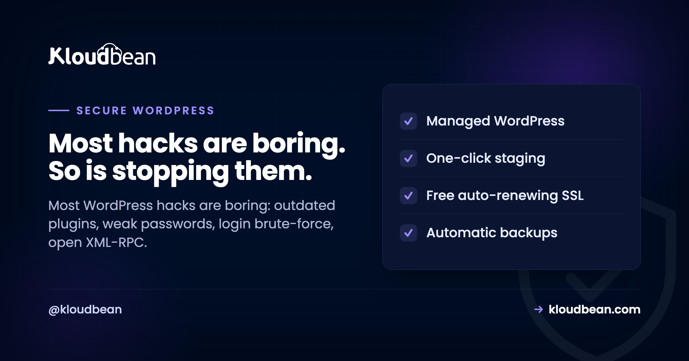

# Secure WordPress Hosting: Close the Doors Attackers Actually Use

Most WordPress sites don't get hacked by geniuses. They get hacked by scripts. A bot finds a plugin three versions out of date, or guesses a password that leaked in some unrelated breach, and that's the whole story.

Secure WordPress hosting is mostly about closing the handful of doors those scripts actually try, then keeping a tested backup for the day one slips through. This is a field guide to those doors: which you own, which your host should, and how to tell whether yours does.

> **The short version:** The common WordPress hacks are dull: outdated plugins or themes, weak or reused admin passwords, login brute-force, and open XML-RPC. Split the defense in two. Your host owns the server layer (firewall, patching, SSL, isolation, backups). You own the app layer (updates, strong logins, least privilege, a locked-down wp-admin). Neither half secures a site on its own.

## How WordPress sites actually get hacked

Before you buy a single security product, look at what the attacks are. They're depressingly repetitive, and that repetition is good news, because a short list of fixes covers most of it.

- **Outdated plugins, themes, and core.** This is number one, and it isn't close. A plugin ships a security fix, the changelog quietly names the hole, and bots start scanning for sites still running the old version. Automated tools probe thousands of sites an hour looking for exactly that gap. The scariest breach we help clean up is almost never a clever zero-day. It's a plugin that was months behind.
- **Weak or reused admin passwords.** If your admin password also protects an old forum account that leaked, it's effectively public. Attackers feed those leaked lists straight at your login. This is called credential stuffing, and it's cheap to run at scale.
- **Login brute-force.** Bots hammer `/wp-login.php` with guesses, thousands per hour, hoping for a weak one. No skill involved. Just volume.
- **XML-RPC abuse.** The old `xmlrpc.php` endpoint lets a single request try many passwords at once (the `system.multicall` trick), which turns slow brute-force into fast brute-force. It can also be abused to bounce junk traffic at other sites. If you don't use it, it's pure liability.
- **Nulled or abandoned plugins.** A pirated "pro" plugin often ships with a backdoor baked in. An abandoned one stops getting fixes while the holes keep getting found. Both are slow-motion breaches.

Notice what's missing from that list: exotic anything. Nearly every one is neglect, not wizardry, which is why the fixes are cheap.

<!-- Inline SVG in the HTML version: attacks on the left pass through a purple platform defense layer and a green app defense layer before reaching WordPress core, with off-site backups as the safety net beneath. -->

## Secure WordPress hosting is a shared responsibility

Here's where "secure WordPress" and "secure WordPress hosting" pull apart, and it trips up almost everyone. Securing WordPress is the app work: updates, logins, roles, config. Secure hosting is the server work underneath: patching, firewall, SSL, isolation, backups. A brilliantly tended WordPress site on an unpatched server is still exposed. A hardened server running a plugin from 2021 is still exposed. You need both halves, and they belong to different owners.

So ask any host bluntly: which half are you doing, and can you show it? A confident answer names where their job stops and yours starts. A vague one is a red flag.

## What a good host handles: the server layer

This is the half people forget while installing security plugins. On managed hosting it mostly happens without you thinking about it.

- **OS and stack patching.** The server's operating system and web stack get security fixes constantly. Miss them and you're running a known hole no plugin can patch over. On managed hosting this is handled for you.
- **A firewall and brute-force banning.** Every Kloudbean server ships with a **Shorewall** firewall and **Fail2ban** configured automatically. Fail2ban watches for repeated failed logins and connection abuse, then bans the offending IP for a while. That quietly kills a lot of brute-force before it ever reaches WordPress.
- **Enforced, free SSL.** Auto-renewing certificates so traffic is encrypted and you're not shipping login credentials in plain text. If you want the mechanics, see [custom domains and SSL](https://www.kloudbean.com/blog/custom-domain-and-ssl-for-your-app/).
- **Isolation and locked-down database access.** One site's problem shouldn't reach another, and your database shouldn't sit on the public internet where scanners find it. A [database exposed to the open web](https://www.kloudbean.com/blog/fix-error-establishing-database-connection-wordpress/) is an invitation. Whitelist your app server's IP so only it can connect.
- **Off-site automatic backups.** A backup on the same box that just got ransomed is not a backup. Off-site, automatic, restorable. The full story is in the [backups guide](https://www.kloudbean.com/blog/server-backups-guide/).
- **An optional edge layer.** Cloudflare (including its Enterprise edge caching) is a paid add-on, included for Enterprise accounts. At the edge it soaks up floods and filters junk before it reaches your origin. See [DDoS protection](https://www.kloudbean.com/blog/ddos-protection-explained/) and [what a WAF does](https://www.kloudbean.com/blog/what-a-waf-does/).

Let me be straight, because the industry oversells this. A firewall plus Fail2ban plus an edge network is a strong baseline, not a magic shield. It's layers doing their jobs, with the app layer you own sitting on top.


## What only you can do: the app layer

No host can do these for you, because they live inside your WordPress. None are hard. Skipping them is what fills the "how they got in" section of an incident report.

- **Update everything, promptly.** Core, plugins, themes. Test on **staging** first, then push. Kloudbean gives you one-click staging for WordPress, and the rule that saves weekends is simple: if it's touching the live site, it goes through staging first.
- **Delete what you don't use.** An inactive plugin is still code on disk, and still attackable. Fewer plugins, smaller attack surface. Cut what you're not running.
- **Strong, unique admin password plus 2FA.** This one step defeats the overwhelming majority of automated login attacks, because a guessed or stolen password alone stops being enough. Never use `admin` as the username. Turning on two-factor is the highest-value five minutes on this whole page.
- **Least privilege for every account.** An editor should be an editor, not an administrator. Fewer admins means fewer keys to the kingdom. On the hosting side, **subusers with User Access Control** scope who can touch the server and deploys, so a freelancer gets exactly the access their job needs and nothing more.
- **Lock down your config and secrets.** Set unique authentication keys and salts in `wp-config.php` (never the defaults), and keep credentials in environment configuration rather than committed to a repo.


Two one-line hardening moves worth pasting into `wp-config.php`:

```php
// Block editing plugin and theme code from the dashboard
define( 'DISALLOW_FILE_EDIT', true );

// Go further: block dashboard-driven plugin/theme installs and updates
define( 'DISALLOW_FILE_MODS', true );
```

Why the first one matters: by default an admin can edit live theme and plugin code from the dashboard, so a single compromised account can inject code instantly. Turning it off removes a favourite foothold.

## Lock down the login, because it's the front door

The login page is where most of the noise lands, so give it extra walls. A few options, roughly in order of impact:

- **IP Access Control.** Allow or deny by address or CIDR range. Fence `/wp-admin` and `/wp-login.php` to your office and VPN, and the bots simply can't reach the form. This is the single cleanest lockdown if your team logs in from known networks.
- **A Basic Auth gate.** Put a server-level password prompt in front of the app (or a staging site) so nothing unauthenticated even loads WordPress. Great for previews and internal environments you don't want crawled.
- **Rate-limit or move the login.** Limiting attempts slows guessing; Fail2ban already bans repeat offenders at the server. Moving the login URL is minor obscurity, not real security, but it does cut the log noise.
- **HttpOnly cookie sessions.** On the platform side, session cookies are HttpOnly, which hardens against common XSS and CSRF session-theft tricks. Pair that with sensible [security headers](https://www.kloudbean.com/blog/security-headers-guide/) on your site.

<!-- ADD IMAGE: the IP Access Control screen locking wp-admin and wp-login to your office CIDR range, showing allow/deny rules. -->

## Threat to fix, at a glance

The whole thing on one screen. The middle column matters most.

| Threat | What actually stops it | Whose job |
|---|---|---|
| Login brute-force | Fail2ban bans, limit attempts, 2FA, IP allow-list | Shared |
| Outdated plugin or theme | Prompt updates, remove unused, test on staging | You |
| Open XML-RPC | Disable it if unused; edge and Fail2ban dampen abuse | You + platform |
| Stolen or reused password | Unique password, 2FA, least-privilege roles | You |
| Server or OS exploit | Automatic patching, firewall, site isolation | Platform |
| Traffic flood (DDoS) | Edge network plus tier-1 cloud infrastructure | Platform |
| Exposed database | IP allow-listing, database off the public internet | Platform |
| Defacement or ransom | A tested off-site backup and a fast restore | Shared |

## If you're already hacked: the recovery order

Landed here because a site is *already* compromised? Do these in order, and don't delete files in a panic.

1. **Take it offline or into maintenance.** Stop it harming visitors and spreading before you do anything else.
2. **Rotate every password.** Admin users, the database, hosting, SFTP. You don't yet know which one was the way in, so assume all of them.
3. **Restore from a clean backup** taken before the compromise. Almost always faster and safer than hand-cleaning an infected install, and exactly why off-site backups matter.
4. **Update everything and remove anything you can't account for.** Any plugin or theme you don't recognise is a suspect. That's usually the entry point.
5. **Bring it back, then harden** using the app-layer list above so it doesn't happen twice.

A calm, ordered recovery beats frantic clicking. And if step three failed because your only backup lived on the same box, that's the lesson for next time.

<!-- ADD IMAGE: the one-click restore screen, picking a clean restore point from before the compromise. -->

## The opinion I'll defend

A backup you've actually test-restored, plus plugins that are current, beats any "magic" security plugin. Security plugins help with parts of the app layer: 2FA, login limits, malware scanning. But a plugin can't patch the OS, isolate you from a noisy neighbour, or be your only backup. The sites that get hurt almost always installed a security plugin and called it done, while the server sat unpatched. Do the boring list. It works.

---

**You mind the site. We keep the stack hardened.** Run WordPress on hosting that owns the server layer for you at [kloudbean.com](https://www.kloudbean.com/). Plans on [pricing](https://www.kloudbean.com/pricing/).

Auto firewall + Fail2ban · Free SSL · Off-site backups · Staging · Free migration · Free trial

## FAQ

**What is secure WordPress hosting?**
It's hosting where the provider owns the server-layer security so you can focus on the app layer. The host handles patching, a firewall and brute-force banning, SSL, isolation, IP allow-listing, and off-site backups. You still handle updates, strong logins, roles, and config. It's both halves working together, not one.

**How do WordPress sites usually get hacked?**
Almost always through boring, automated attacks: an outdated plugin, theme, or core with a known hole; a weak or reused admin password; brute-force on the login; or an open XML-RPC endpoint. Novel attacks are rare, which is why keeping software current, using strong logins with 2FA, and locking the login covers most of the risk.

**How do I lock down wp-admin and wp-login?**
The cleanest option is IP Access Control: allow only your office and VPN addresses or CIDR ranges to reach wp-admin and wp-login, so bots can't touch the form. Add a Basic Auth gate in front of the app for another wall, enable two-factor, and limit login attempts. Fail2ban on the server also bans IPs that repeatedly fail.

**Is a security plugin enough to protect WordPress?**
No. A security plugin helps with app-layer tasks like 2FA, login limiting, and malware scanning, but it can't patch the operating system, isolate your site from others, or replace real backups. Treat it as one tool in the checklist. The server layer has to be handled too, and a tested backup matters more than any single plugin.

**Does 2FA really help WordPress security?**
Yes, a lot. Two-factor authentication defeats the overwhelming majority of automated login attacks, because a guessed or stolen password alone is no longer enough to get in. Combined with a strong, unique admin password and login rate-limiting, it closes the single most common route attackers take. It's five minutes well spent.

**Should I disable XML-RPC?**
If nothing you run needs it, yes. The xmlrpc.php endpoint can be abused to try many passwords in one request and to bounce traffic at other sites. Some older apps and a few plugins still use it, so check first. If you're unsure and your site is a normal website, disabling it removes a real attack vector with no downside.

**What does the host handle versus what do I handle?**
The host owns the server layer: patching, firewall, SSL, isolation, IP allow-listing, and off-site backups. You own the app layer: updating core, plugins, and themes, using strong logins with 2FA, assigning least-privilege roles, locking down wp-config, and removing unused code. Security is shared, and a site is only as safe as the weaker of the two halves.

**How often should I update plugins and core?**
As soon as practical after an update lands, especially anything flagged as a security release. The window between a fix being published and bots scanning for the old version is short. Test updates on staging first so nothing breaks the live site, then push. Delete plugins and themes you no longer use rather than leaving them to rot.

**My WordPress site is already hacked. What do I do first?**
Take it offline, rotate every password (admin, database, hosting, SFTP), then restore from a clean backup taken before the compromise. Restoring is usually faster and safer than cleaning an infected install by hand. After that, update everything, remove anything you don't recognise, and harden the app layer so it doesn't recur.

**Does an SSL certificate make my site secure?**
SSL encrypts traffic between the visitor and the server, which is essential and non-negotiable, but it's one layer, not the whole thing. A site with valid SSL can still be broken into through an outdated plugin or a weak password. Treat SSL as table stakes, then do the updates, logins, and server hardening that actually stop the common attacks.

---

*Kloudbean · Most hacks are boring. So is stopping them.*
