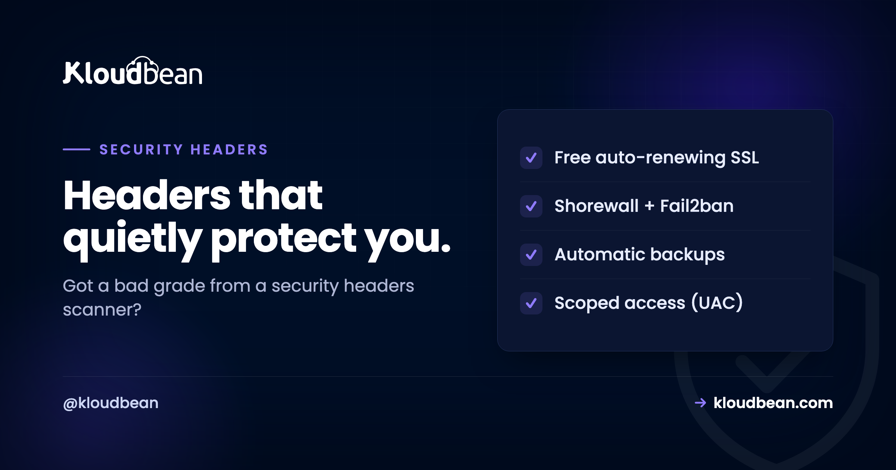

# Security Headers: The Checklist That Turns an F into an A

You ran your site through a free scanner and it handed you an F. Rude. But also the easiest security win you'll get all week. **Security headers** are short instructions your server attaches to every response, telling the browser to behave more carefully, and switching on the right ones takes minutes and closes off whole classes of attack.

This is the working checklist: each HTTP security header, what it actually stops, the real value to set, and the one that needs care before you flip it on. Five of them you can turn on today without breaking a thing. One of them can break your own site if you rush it, so I'll be honest about which is which.

> **Short version:** Turn on five headers now: `Strict-Transport-Security`, `X-Content-Type-Options: nosniff`, `X-Frame-Options: SAMEORIGIN`, `Referrer-Policy`, and `Permissions-Policy`. They're low risk and rarely break anything. Then treat `Content-Security-Policy` as a small project: start it in report-only mode so it can't break your scripts, tune it against real traffic, and only then enforce. HSTS needs HTTPS first, which is free on any decent host.

## If you just want to paste something

Fine. Here's a sensible Nginx block that lifts most sites straight to a good grade. Drop it in your `server { }` block and reload.

```nginx
# the five safe ones
add_header Strict-Transport-Security "max-age=31536000; includeSubDomains" always;
add_header X-Content-Type-Options "nosniff" always;
add_header X-Frame-Options "SAMEORIGIN" always;
add_header Referrer-Policy "strict-origin-when-cross-origin" always;
add_header Permissions-Policy "camera=(), microphone=(), geolocation=()" always;

# CSP: start in report-only so it CANNOT break your site
add_header Content-Security-Policy-Report-Only "default-src 'self'; img-src 'self' data:; style-src 'self' 'unsafe-inline'" always;
```

One detail people miss and then spend an hour debugging: that `always` keyword matters. Without it, Nginx skips `add_header` on error responses like 404s and 500s, so your headers vanish on exactly the pages an attacker probes. Keep `always` on every line.

On Apache the same idea, different syntax:

```apache
Header always set X-Content-Type-Options "nosniff"
Header always set X-Frame-Options "SAMEORIGIN"
Header always set Referrer-Policy "strict-origin-when-cross-origin"
```

On a Node app, the `helmet` middleware sets most of these for you with `app.use(helmet())`. Same headers, set in code instead of the web server. Pick whichever layer owns your responses.

## One thing has to be true first: HTTPS

None of this means much without **HTTPS**. Security headers assume an encrypted connection, and the most important one flat out enforces it. If your site still answers on plain `http://`, fix that first. It's free and automatic on any decent host with a Let's Encrypt certificate, and it's the prerequisite for HSTS below. If you're wrestling with certificate warnings, we wrote up the common ones in [fixing SSL certificate errors](https://www.kloudbean.com/blog/fix-ssl-certificate-errors/), and the setup itself in [custom domain and SSL for your app](https://www.kloudbean.com/blog/custom-domain-and-ssl-for-your-app/).

```
Strict-Transport-Security   ->  HTTPS downgrade / SSL strip
Content-Security-Policy     ->  Cross-site scripting (XSS)
X-Content-Type-Options      ->  MIME-type sniffing
X-Frame-Options             ->  Clickjacking
Referrer-Policy             ->  URL / referrer leakage
Permissions-Policy          ->  Camera, mic, geo abuse
```
*Six headers, six doors. Five of them are safe to set today; CSP is the one that rewards a careful rollout.*

## The security headers, one by one

### Strict-Transport-Security (HSTS)

Forces browsers to only ever reach your site over HTTPS, even if someone types `http://` or clicks an old link. Once a browser has seen the header, it refuses an insecure connection to your domain, which kills SSL-strip and downgrade attacks. Set `max-age=31536000; includeSubDomains` (that's a year). One caution: HSTS is sticky. Browsers remember it for the whole `max-age`, so only add `includeSubDomains` once every subdomain is genuinely on HTTPS, or you'll lock out the ones that aren't. There's also an optional `preload` token that bakes your domain into browsers directly, but don't add it until you're certain, because getting off the preload list is slow.

### Content-Security-Policy (CSP)

Controls exactly which sources of scripts, styles, images, and other content the browser may load. This is the heavyweight against **cross-site scripting**. Even if an attacker manages to inject a `<script>`, a good CSP stops the browser from running it. It's also the one header that can break your own site, so it gets its own section below. Don't paste a strict CSP straight into production and hope.

### X-Content-Type-Options

One value, `nosniff`, and you're done. It tells browsers to stop guessing the type of a file. Without it, a browser might decide an uploaded image is actually JavaScript and run it. With it, the declared content type is respected and that trick dies. No downside, no tuning. Set it and move on.

### X-Frame-Options

Stops other sites from loading yours inside an invisible frame to trick your users into clicking things they can't see. That's **clickjacking**. Use `SAMEORIGIN` for most sites (you can still frame your own pages) or `DENY` if you never frame yourself. Modern browsers also honor the CSP directive `frame-ancestors 'self'`, which does the same job with more control. Setting both is common and harmless; older browsers read one, newer ones read the other.

### Referrer-Policy

Controls how much of your URL gets sent to another site when a user clicks away. URLs sometimes carry things you'd rather not leak, like tokens or IDs in a query string. The value `strict-origin-when-cross-origin` is a good private default: it sends the full path within your own site and only the bare origin to everyone else.

### Permissions-Policy

Switches off browser features your site never uses, so nothing sneaky can quietly ask for them. If you don't use the camera, microphone, or geolocation, disable them outright: `camera=(), microphone=(), geolocation=()`. Free protection for features you weren't going to touch anyway.

| Header | Stops | Effort |
| --- | --- | --- |
| **Strict-Transport-Security** | HTTPS downgrade, SSL strip | Set and forget (needs HTTPS) |
| **X-Content-Type-Options** | MIME sniffing | Set and forget |
| **X-Frame-Options** | Clickjacking | Set and forget |
| **Referrer-Policy** | URL leakage to third parties | Set and forget |
| **Permissions-Policy** | Camera, mic, geolocation abuse | Set and forget |
| **Content-Security-Policy** | Cross-site scripting (XSS) | A project: report-only, then enforce |

## Cookies ride along with these

Headers harden the page. Your cookies deserve the same treatment, because a stolen session cookie is a logged-in attacker. Three flags do the heavy lifting. `HttpOnly` keeps JavaScript from reading a cookie, which blunts what an XSS attack can steal. `Secure` means the cookie only travels over HTTPS. `SameSite=Lax` (or `Strict`) limits when the cookie is sent cross-site, which takes the edge off CSRF. If you run WordPress, a lot of this is handled for you, and the plugin side is covered in [secure WordPress hosting](https://www.kloudbean.com/blog/secure-wordpress-hosting/).

<!-- ADD IMAGE: a securityheaders.com scan of your site before and after, an F next to an A -->

## Why CSP breaks your own site (and how to roll it out)

CSP is the highest-value header and the one people quietly give up on. Here's why. A strict policy like `default-src 'self'` tells the browser to only run scripts served from your own domain. Great against attackers. Also fatal to your inline `<script>` tags, your analytics snippet, that one Stripe or Google widget, and any `onclick="..."` in your HTML. Ship that cold and half your site stops working.

So don't ship it cold. Roll it out in three steps:

1. **Report-only first.** Use `Content-Security-Policy-Report-Only`. The browser reports what *would* be blocked without blocking anything, so nothing breaks while you learn.
2. **Read the violations, then widen.** Add the legitimate sources your site actually needs (your CDN, your payment widget). Use a `nonce` or a hash for inline scripts you can't remove rather than opening the floodgates.
3. **Enforce.** Once the reports are quiet, switch the header from report-only to `Content-Security-Policy` and you're protecting for real.

The anti-pattern to avoid: slapping `'unsafe-inline'` on `script-src` to make the errors go away. That switch re-permits exactly the inline injection CSP exists to stop, so you've kept the header and thrown out the protection. If you must allow inline for styles, scope it there, not to scripts.

<!-- ADD IMAGE: DevTools console showing Content-Security-Policy-Report-Only violations, the sources your policy would block before you enforce -->


## Check your grade

The feedback loop here is genuinely satisfying. Paste your URL into a free scanner like **securityheaders.com** or **Mozilla Observatory**, and it grades you and lists exactly what's missing. Add the flagged headers, reload your config, re-scan, and watch the letter climb. Few security tasks give you a visible score in under a minute, which is why this one's easy to knock out in a single sitting.

One family sits outside that easy win, because tightening it can break your own page rather than just improve a grade. The cross-origin isolation headers, `Cross-Origin-Embedder-Policy` and `Cross-Origin-Resource-Policy`, change the default rule for every third-party image, font, and script you load, and the failure shows up in the console as [ERR_BLOCKED_BY_RESPONSE](https://www.kloudbean.com/blog/err-blocked-by-response/). Worth reading before you add them, especially if a security middleware is setting them for you.

## Where you actually set them

Headers live at the **web server** level (Nginx, Apache) or in your **application's** response config, and they apply to every response your site sends. On a managed stack you edit that config alongside your other app settings, reload, and the headers take effect immediately.


<!-- ADD IMAGE: browser DevTools Network tab Response Headers, the security headers now present on a request -->

## Where Kloudbean fits

Security headers are your policy to write, and that stays true anywhere. What a managed stack removes is the friction around them. **Free SSL** gets you the HTTPS that HSTS depends on, and it renews itself. Sessions run on **HttpOnly cookies**, so the cookie side of this is already hardened. The Linux web-server stack underneath is kept patched, so you're setting headers on a current server rather than babysitting the OS too. You still own your CSP, because only you know which scripts your site legitimately loads. Fair split. Headers are a layer, not the whole fortress, so keep them next to the rest of your hygiene: patched software, strong logins, and the filtering in front covered in [what a WAF does](https://www.kloudbean.com/blog/what-a-waf-does/) and [container security scanning](https://www.kloudbean.com/blog/container-security-scanning/).

**Turn that F into an A in one sitting.** Serve your site over HTTPS and set sensible security headers on a managed stack at [kloudbean.com](https://www.kloudbean.com/). Free SSL · HttpOnly cookie sessions · Managed, patched stack · Automatic backups · Free migration · Free trial. Plans on [pricing](https://www.kloudbean.com/pricing/).

## FAQ

**What are HTTP security headers?**
They're short instructions your server sends with each response that tell the browser to behave more safely: enforce HTTPS, restrict what content can load, block clickjacking, and more. Adding the right ones closes off whole categories of attack like cross-site scripting and clickjacking, and it usually takes minutes.

**Which security headers should I add first?**
Start with the five that rarely break anything: Strict-Transport-Security (HSTS), X-Content-Type-Options set to nosniff, X-Frame-Options set to SAMEORIGIN, Referrer-Policy, and Permissions-Policy. Add those today for an instant grade jump, then take on Content-Security-Policy as a separate, careful project.

**What is HSTS and how do I set it?**
HSTS (Strict-Transport-Security) tells browsers to only ever connect to your site over HTTPS. Set it with a max-age, a year is common, and add includeSubDomains once every subdomain is on HTTPS. It's sticky, so browsers remember it for the whole max-age. Only add the optional preload token when you're certain, because removing your domain from the preload list is slow.

**Why does Content-Security-Policy break my site?**
Because a strict policy only allows scripts and styles from sources you name, and most sites have inline scripts, analytics snippets, and third-party widgets that suddenly aren't allowed. Roll it out in report-only mode first so it reports violations without blocking, add the legitimate sources you actually use, then switch to enforcing. Avoid adding 'unsafe-inline' to script-src, since that re-opens the hole CSP exists to close.

**How do I check my site's security headers?**
Paste your URL into a free scanner like securityheaders.com or Mozilla Observatory. It grades your site and lists exactly which headers are missing or weak. Add the flagged headers, reload your web-server config, and re-scan to confirm the grade improves. It's a fast, visible feedback loop.

**Is X-Frame-Options still needed if I use CSP frame-ancestors?**
Modern browsers honor CSP's frame-ancestors directive, which supersedes X-Frame-Options and gives you more control. But older browsers still read X-Frame-Options, so setting both is common and harmless: newer clients use frame-ancestors, older ones fall back to X-Frame-Options. Together they cover clickjacking across the widest range of browsers.

**Do security headers require HTTPS?**
Effectively, yes. The headers assume an encrypted connection and HSTS literally enforces HTTPS, so it's meaningless without a valid certificate. Get your site onto HTTPS first, which is free and automatic with a Let's Encrypt certificate on most hosts, then layer the headers on top.

**Where do I set security headers?**
At the web-server level (Nginx add_header, Apache Header set) or in your application (for example the helmet middleware in Node). They apply to every response. Keep the always keyword on Nginx add_header lines so the headers are also sent on error responses like 404s and 500s, not just successful pages.

**What's the difference between X-Frame-Options DENY and SAMEORIGIN?**
DENY means your pages can't be framed by anyone, including you. SAMEORIGIN means your pages can only be framed by pages on your own domain, which is the right choice for most sites because you can still embed your own pages while blocking strangers. Pick DENY only if you never frame your own content anywhere.

**Do security headers replace a WAF or secure code?**
No. Headers are instructions to the browser, so they're one layer of defense in depth, not the whole thing. They complement, rather than replace, keeping software patched, writing secure code, using strong authentication, and filtering malicious traffic with a web application firewall. Add the headers, and keep the rest of your hygiene up too.

---

*By Kloudbean · Headers that quietly protect you.*
