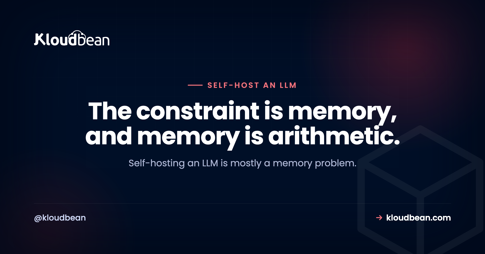

# Self-Host an LLM: When It Pays Off, and How to Run One on a GPU

You can self-host an LLM. The harder question is whether you should, and the answer shifts with what you're protecting and how much you'll actually use it. Open models like Llama, Mistral, and DeepSeek got good enough that running your own AI model on a GPU server you control is a real option now, not a science project. But a hosted API from OpenAI or Anthropic is still the simpler, cheaper path for plenty of apps. So this page is the decision, not a tutorial: when a self-hosted LLM is worth it, what you need, and the ways to run one on Kloudbean.

> **Short version:** Yes, you can self-host an open LLM on your own GPU server. On Kloudbean, DeepSeek installs in one click from the tool picker, and any other or custom model gets installed by the support team when you ask. It runs on a GPU machine you provision. On Enterprise it can sit inside a private VPC pinned to your region, so prompts and data never leave. Self-host for privacy, data residency, or steady high volume. At low volume a hosted API is cheaper and simpler, so don't self-host just to save a few dollars.

## Should you self-host an LLM at all?

Start with the honest version, because most "self-host your AI" posts skip it. Three reasons to self-host an LLM hold up under pressure: privacy, control, and cost at real volume. Everything else is noise. If your prompts carry customer records, source code, or anything that legally can't leave a region, a self-hosted LLM keeps all of it on hardware you control. That's the strongest reason, and it isn't really about money.

Control is next. You pick the model, you pin the version, and nobody deprecates it out from under you or reprices it next quarter. Cost is third, and it's the one people get backwards. A GPU server is a flat monthly bill. A hosted API meters every token. So self-hosting wins on cost only once your volume is high and steady. At a few calls a week, a hosted API is cheaper and far less hassle, full stop.

My blunt take: don't self-host to save money on a small app. Do it for privacy, residency, or genuinely heavy, steady usage. And go in clear-eyed about quality. Open models got good, good enough for most real work, but the very top frontier models still lead on the hardest reasoning. Self-hosting usually means trading a little peak quality for control and privacy. For a support bot over your own docs, that trade is easy. For a research assistant chasing the single smartest answer, maybe not.

Here's the decision in one table.

| What you care about | Self-host on a GPU server | Hosted API (OpenAI, Anthropic) |
| --- | --- | --- |
| Privacy and data residency | Prompts and data stay on your box, in your region | Prompts leave your network to a third party |
| Cost at low volume | You pay for the GPU whether you use it or not | Cheap; you pay per token |
| Cost at high steady volume | Flat monthly, so it wins as usage climbs | Metered, so the bill grows with every call |
| Top-end answer quality | Strong, usually a step behind the best frontier model | Access to the largest, smartest models |
| Setup and ops effort | You run the server and size the GPU | Sign up and call it |
| Control over model and versions | Full; you choose and pin the model | The vendor's roadmap and pricing |

<!-- SVG diagram in the HTML: a decision flow. If prompts and data must stay private or in-region, or if you have high steady volume, self-host an open model on a Kloudbean GPU server (VPC and region pinning on Enterprise). Otherwise call a hosted API, which is simpler and cheaper at low volume. -->

*Two questions decide it: privacy or data residency, and steady volume. A yes to either points to self-hosting on a GPU server. Two nos point back to a hosted API.*

## What you need: a GPU server sized to the model

The thing that makes or breaks a self-hosted LLM is hardware. A model needs memory to load its weights and compute to generate tokens. Undersize the box and it crawls. Size it right and it feels quick. You want a GPU server for AI work here, not a general CPU box, unless you're only kicking the tires. Keep the sizing qualitative, because exact needs shift with the model and how it's quantized:

| Model size | Roughly wants | Good for |
| --- | --- | --- |
| Small (about 7B) | A modest GPU | Drafting, summarizing, classification, internal chat |
| Mid (about 13B) | More GPU memory | Better reasoning and richer answers |
| Large (30B and up) | Serious GPU memory | Highest quality, and a real hardware cost |

Pick the model to fit the server, not the other way round. Start smaller than you think, watch how it feels under your real prompts, and resize up if you need more. On Kloudbean you provision the GPU server from the console and size it up front.


Here's where people faceplant. They grab a giant model, drop it on a GPU that's too small, watch it swap or crash, and conclude self-hosting is broken. It isn't. The box was wrong for the model. A 70B model on an undersized GPU will disappoint every time. Match them, or run a smaller model that actually fits the hardware you're paying for.

<!-- ADD IMAGE: The console tool picker showing the one-click DeepSeek and Open WebUI tiles. -->

## The ways to run a model on Kloudbean

There isn't one way to run a model. There are a few, and they trade ease for control. From easiest to most hands-on:

| Way to run it | Best for | Effort |
| --- | --- | --- |
| One-click: DeepSeek plus Open WebUI | A working private LLM and a chat UI, fast | Lowest, no terminal |
| Ollama | Running open models simply on a server | Low, a few commands |
| vLLM | Higher throughput and concurrency in production | Higher, heavier to run |
| Any other or custom model on request | A specific model the tiles don't list | You ask, support installs it |

The one-click route is the fastest way in. DeepSeek (listed as the DeepSeek r1-1.5b model) and Open WebUI install straight from the console tool picker, so you get a private LLM and a chat interface without touching a terminal. For running open models simply on a server, Ollama is the friendly default, and the full step-by-step lives in the [concrete Ollama and Open WebUI walkthrough](https://www.kloudbean.com/blog/self-host-ollama-open-webui/), so I won't repeat it here. When you outgrow that and need real throughput, vLLM is the heavier, production-grade server. And for any other or custom model, you don't have to fight it alone. Start a chat and Kloudbean's support team installs it and makes it available on your server.

## Serving the model to your app

Running the model is half the job. Your app has to reach it. The clean pattern is the same one you'd use with a hosted API: the model listens on an endpoint, and your backend calls it. Most open-model servers, Ollama and vLLM included, speak the OpenAI-style API, so your existing code barely changes. You point it at your own base URL instead of the vendor's.

```bash
# Your app calls the model on your own server, not a public API
curl http://127.0.0.1:8000/v1/chat/completions \
  -H "Content-Type: application/json" \
  -d '{
    "model": "your-open-model",
    "messages": [{"role": "user", "content": "Summarize this ticket."}],
    "stream": true
  }'
```

In your app, that's usually just environment variables. Keep the model on the same box as the app for the simple case, or put it on a separate GPU server locked down so only your app's IP can reach it.

```bash
# .env for your app (never commit this)
LLM_BASE_URL=http://127.0.0.1:8000/v1   # model runs on this box
LLM_API_KEY=set-your-own-gateway-key    # a key you choose, not a public vendor key
LLM_MODEL=your-open-model
```

**Keep the browser out of it.** The browser should call your backend, and only your backend should call the model. That's how you add auth, rate limits, and a spend cap in one place. Same rule as any AI endpoint: don't hand the model or its key to the public.

Two things are worth getting right early. Stream the tokens back so long replies don't look frozen; the how is in [streaming LLM responses in production](https://www.kloudbean.com/blog/llm-streaming-in-production/). And put rate limits and a cost cap in front of the endpoint so nobody hammers it, which [rate limiting and cost control for AI APIs](https://www.kloudbean.com/blog/rate-limit-and-cost-control-for-ai-apis/) covers. Keep whatever key or gateway you put in front server-side, never in the browser, the same discipline as [deploying an AI agent without exposing API keys](https://www.kloudbean.com/blog/deploy-ai-agent-without-exposing-api-keys/).

## Keeping the model and data in your region

This is why a lot of teams self-host in the first place: a private LLM that never phones home. When the model runs on your server, the prompt goes to your box, gets an answer, and stops there. Nothing crosses a border you didn't choose. You can pin the server to a specific region across any of the clouds, including in-Kingdom in Dammam, so both the model and the data stay where your rules say they must. That's the whole data-residency story, and it goes deeper in [hosting AI apps in Saudi Arabia](https://www.kloudbean.com/blog/hosting-ai-apps-saudi-arabia/).

Want to wall the model off from the public internet entirely? On Enterprise, the model can run inside a private network, a VPC, so it's reachable only from inside your own network. If the term is new, [what a VPC is and why it helps](https://www.kloudbean.com/blog/what-is-a-vpc/) has the explainer. On standard plans the practical lock-down is IP allow-listing: you whitelist your app server's address so only it can reach the model or the database, and everything else is refused. For most setups that's plenty, without needing Enterprise.

<!-- ADD IMAGE: The region picker with an in-region location selected, for example Dammam. -->

## Where a self-hosted LLM fits a bigger AI app

A model on its own is just a smart text box. Real AI features need the rest of the stack around it. If the bot should answer from your own documents, that's retrieval, RAG for short, and you'll want a vector store. You usually don't need a separate product for it. The pgvector extension keeps embeddings inside Postgres next to your normal data, which the [pgvector for AI apps](https://www.kloudbean.com/blog/pgvector-for-ai-apps/) guide walks through. Managed Postgres sits in the same dashboard as the GPU server, so it's one place, not four.


Layer in conversation history, sessions, and caching, and the model becomes one component in a familiar shape: frontend, backend, database, cache, and the model behind your API. If you want the whole picture drawn out, the [AI app reference architecture](https://www.kloudbean.com/blog/ai-app-reference-architecture/) lays out how the pieces fit and where the boundaries go.

## The cost reality

So is it cheaper? Depends entirely on volume. A GPU server is a fixed monthly cost whether you send it ten prompts or ten million. A hosted API is metered: cheap when quiet, expensive when busy. Draw those two lines on a graph and they cross somewhere. Below the crossover, the API wins. Above it, the flat GPU box wins, and the gap gets wide for heavy, constant jobs like classifying or summarizing at scale.

I won't invent numbers, because the crossover moves with your model, your usage, and GPU pricing, and a made-up figure would just mislead you. The honest rule holds anyway: if you're doing trivial volume with no privacy or residency reason, self-hosting to "save money" usually costs more once you count the GPU and your own time. Privacy and residency can justify the server on their own. Pure penny-pinching at low volume usually can't.

## Where hosting fits, honestly

Time to be precise about what Kloudbean does and doesn't do here, because the boundary is the trust. Managed means we run the box: the server, the OS, the stack, free SSL, patching, and server-level backups. We can also install the model for you, DeepSeek in one click, or any other or custom model when you start a chat and ask support. What stays yours is the model you pick, your prompts, your data, and the ongoing job of sizing and scaling the GPU as your use grows.

One thing Kloudbean is not: a per-token model API like OpenAI or Anthropic. We don't hand you a metered endpoint, and we don't fine-tune or build the model for you. You self-host the open model you chose, on hardware you rent from us. Under the hood there are 7 clouds (AWS, AWS Lightsail, Google Cloud, Linode, Vultr, DigitalOcean, and UpCloud). For bigger or enterprise workloads we standardize on AWS or GCP, where there's no fixed product-tier ceiling on GPU or CPU; it scales with your plan and the underlying cloud capacity. Standard plans start from $8/mo, though a GPU box costs more than a small CPU one, so check the pricing page for current numbers. If you're moving in from elsewhere, migration help is on the house.

---

**Run your own model, on a box you control.** Provision a GPU server, install DeepSeek in one click or ask support for any other model, and serve it to your app from one dashboard. Start free at [kloudbean.com](https://www.kloudbean.com/); see plans on [pricing](https://www.kloudbean.com/pricing/) and check there for current numbers.

GPU servers · One-click DeepSeek and Open WebUI · Any model installed on request · Free SSL · Automatic backups · Free migration · Free trial

## FAQ

**Can I self-host an LLM on my own server?**
Yes. You provision a GPU server, put an open model on it, and your app talks to it over a local endpoint. On Kloudbean, DeepSeek and Open WebUI install in one click, and support installs any other or custom model on request. The model runs on your box, so prompts and data stay there.

**Should I self-host an LLM or just use a hosted API?**
Self-host for privacy, data residency, or high steady volume. Use a hosted API when you want the simplest path, the very best model quality, or you're at low volume where per-token pricing is cheap. If none of the self-host reasons apply to you, an API is the easier call.

**Do I need a GPU to self-host an LLM?**
For anything beyond a quick test, yes. A small model can limp along on CPU, but it answers slowly. A GPU is what makes generation feel quick, so a GPU server is the right home for a self-hosted model you'll actually use.

**What size GPU server do I need to run an open model?**
It scales with the model. A small model around 7B runs on a modest GPU. A mid model around 13B wants more GPU memory. Large models of 30B and up need serious GPU memory. Pick the model to fit the server you're comfortable paying for, then resize up if you need to.

**Which open models can I run on Kloudbean?**
Any open model you like. DeepSeek installs one-click from the tool picker alongside Open WebUI, and for any other or custom model you start a chat and the support team installs it and makes it available on your server.

**Is a self-hosted LLM as good as GPT-4 or Claude?**
Not quite at the frontier. The largest hosted models still lead on the hardest reasoning and broadest knowledge. But for drafting, summarizing, classification, coding help, and answering over your own documents, a good open model is more than enough. Many teams run open models for the bulk of the work and a hosted model for the rare heavy lift.

**How do I keep my prompts and data private and in-region?**
Run the model on your own server and pin that server to your chosen region, including in-Kingdom in Dammam, so nothing crosses a border. On Enterprise the model can sit inside a private VPC, off the public internet. On standard plans you lock things down with IP allow-listing so only your app server can reach the model or database.

**Is self-hosting an LLM cheaper than a per-token API?**
Only at real volume. A GPU server is a flat monthly cost, while an API charges per token. So the server wins once usage is high and steady, and the API wins when you're quiet. Don't self-host purely to save money at trivial volume, since the GPU and your time usually cost more than a light API bill.

**Can my app call a self-hosted model like it calls OpenAI?**
Usually yes. Ollama and vLLM expose an OpenAI-style API, so you change the base URL to your own server and keep most of your code. Put the model behind your backend, stream the tokens, and keep any key you set on the server rather than in the browser.

**Does Kloudbean fine-tune or build the model for me?**
No. Kloudbean runs the server and can install a model for you, one-click or via support, but you choose and own the model, the prompts, and the data. Kloudbean is not a per-token model API and does not train or fine-tune models on your behalf.

---

*By Kloudbean Engineering · You own the model, we run the box it lives on.*
