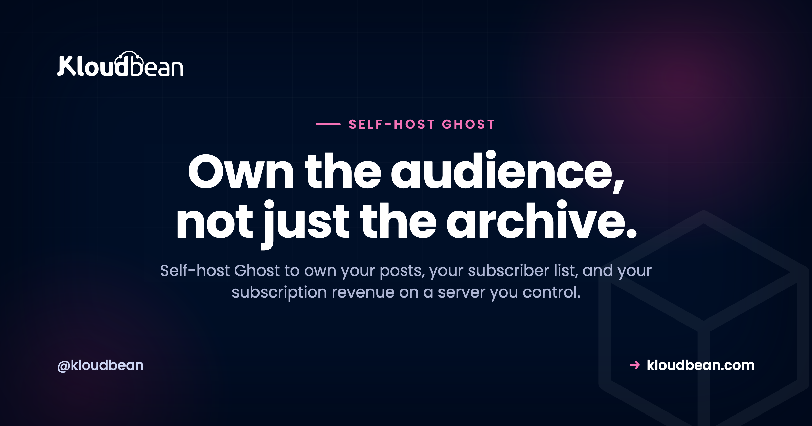

# Self-Host Ghost: Own Your Audience, Skip the Cut

Substack takes a percentage of every paid subscription. Ghost(Pro) charges you more as your member list grows. Both keep your audience on infrastructure you don't own. If you publish seriously, or you're building toward it, that setup quietly works against you.

Self-hosting Ghost flips the arrangement. Your posts, your subscriber list, and your subscription revenue all live on a server you control, at your own domain, for a flat cost that doesn't climb with every new signup. This guide covers how to do that properly, including the one email step that catches almost everyone.

> **Short version:** Self-host Ghost when you publish regularly and have (or want) paying members. You run a small Node.js server plus a managed MySQL database, and you connect an email provider such as Mailgun so newsletters actually send. The trade: a flat server bill instead of per-member pricing or a percentage cut, and a list that's genuinely yours to export.

## So what is Ghost, actually?

Most people file Ghost under "blog software." That undersells it. Ghost is a publishing business in one app: a fast content site, an email newsletter system, and paid memberships through Stripe. Write a post, email it to your subscribers, and charge for the premium ones, all from the same place.

Under the hood it's a Node.js app backed by a MySQL database. That's the whole footprint. It's open source, so you run the same software the hosted product runs, on a box that's yours. For a writer or a small media outfit, publishing plus paid email is the product, and owning it end to end is the appeal.

## Run the money math before anything else

This is the part that decides whether self-hosting is worth your time, so start here. The three ways to run Ghost (or a Ghost-shaped publication) bill you very differently.

Substack is free to start, then takes roughly 10% of your subscription revenue. That percentage never stops, and it grows precisely as you succeed. Ghost(Pro), the official hosted version, prices in tiers based on how many members you have, so the bill steps up as your list grows. Self-hosted Ghost costs the same whether you have 500 subscribers or 50,000, because you're paying for a server, not for people.

| How you're billed | Substack | Ghost(Pro) | Self-hosted Ghost |
| --- | --- | --- | --- |
| Cost model | ~10% of subscription revenue + payment fees | Monthly fee, tiered by member count | Flat server cost + payment fees |
| As your list grows | Cut grows with revenue | You climb tiers | Same small server until traffic demands more |
| Your email list | Lives on their platform | Yours, exportable | Yours, in a database you control |
| Custom domain and theming | Limited | Good | Full control |
| Who sends the email | They do | They do | You wire up a provider |

Payment processing fees (Stripe's cut) apply to all three, so that's a wash. The real difference is the platform layer on top. If you have even a modest base of paying members, the flat server cost usually beats a percentage or a per-member tier, and the gap widens as you grow. My honest read: past a few hundred paying members, renting your audience gets expensive for no extra benefit.

## How self-hosted Ghost fits together

The architecture is small and easy to hold in your head. A reader hits your site, Ghost serves the pages and runs the membership logic, and two outside services do the jobs Ghost deliberately doesn't: an email provider sends your newsletters, and Stripe collects the money into your account.

```
                          +----------------------+
   You publish  ------->  |  Ghost (Node.js app) |  ------>  Email provider (Mailgun)
                          |    on your server    |           sends newsletters to inboxes
                          +----------+-----------+  ------>  Stripe (your account)
                                     |                       subscription money to you
                                     v
                             Managed MySQL
                        posts, members, subscriptions

                 Your list, your revenue, your domain.
```

Notice what lives where. Your members and their subscription status sit in *your* MySQL database. Your money lands in *your* Stripe account. The email relationship is with a provider you sign up for directly. Nobody sits between you and your audience taking a slice.

## The one thing that trips everyone up: sending email

You can install Ghost, log in, write a beautiful post, and then discover you can't email it to anyone. This is the single most common self-hosted Ghost surprise, and it's worth understanding before you start.

Ghost splits email into two jobs, and they're configured in different places:

- **Transactional email** covers login links, signup confirmations, and staff invites. This runs through standard SMTP, set in Ghost's config file. Any SMTP provider works here.
- **Bulk newsletter email** is the actual "send this post to my 4,000 members" job. Ghost sends this through Mailgun specifically, configured with a Mailgun API key and sending domain in the admin settings. No Mailgun key, no newsletter button. The feature simply stays switched off.

So a "finished" install still can't publish a newsletter until you add Mailgun. There's a good reason Ghost pushes you toward a real email service: a fresh server IP has no sending reputation, so blasting a few thousand emails from it lands you in spam, or gets you blocked. A dedicated provider handles deliverability, bounces, and unsubscribes so your posts reach the inbox.

Transactional SMTP goes in your config like this:

```json
// config.production.json
"mail": {
  "transport": "SMTP",
  "options": {
    "host": "smtp.eu.mailgun.org",
    "port": 587,
    "auth": {
      "user": "postmaster@mg.yourdomain.com",
      "pass": "your-smtp-password"
    }
  }
}
```

Bulk newsletters get set up separately, in Ghost admin under Settings, Email newsletter, where you paste your Mailgun API key, sending domain, and region. Do both and email just works. Skip the second and you'll be puzzled why your first post never went out.

<!-- ADD IMAGE: Ghost admin Email newsletter settings, showing the Mailgun API key and sending domain fields -->

Payments are the friendlier cousin. You connect your own Stripe account once, and subscription revenue flows directly to you. Because it's your Stripe, there's no platform cut on top of Stripe's normal processing fee.

## What it takes to self-host Ghost

The footprint is genuinely light. Ghost is happy on around **1 GB of RAM** to start. The one firm production rule: use MySQL, not SQLite. SQLite is fine for kicking the tires locally, but a real publication belongs on MySQL. On a managed platform you launch a [managed MySQL](https://www.kloudbean.com/blog/managed-mysql-hosting/) in a click and hand Ghost the connection details.


Ghost ships an official command-line installer that does the heavy lifting on a standard Linux server. Because a managed server gives you a real box with root, the installer runs exactly as the Ghost docs describe:

```bash
# on a fresh Ubuntu/Debian server, as a non-root sudo user
sudo npm install ghost-cli@latest -g
sudo mkdir -p /var/www/ghost
sudo chown $USER:$USER /var/www/ghost
cd /var/www/ghost
ghost install
# the installer asks for your domain, your MySQL details, and sets up SSL
```

The pattern is the same as running any [Node app on a managed server](https://www.kloudbean.com/blog/deploy-node-app-to-managed-cloud/): a right-sized box, a database, a domain. Point your domain at the server, grab free SSL, and you're live at `yourdomain.com` with the padlock. It's your own server, so Ghost can share the box with your other apps if you're already [running several on one server](https://www.kloudbean.com/blog/host-multiple-apps-one-server/).

<!-- ADD IMAGE: Ghost admin Members dashboard with total subscribers and paid tier breakdown -->

The whole thing is an afternoon, much of it just waiting on DNS. Connect Mailgun and Stripe, pick a theme, publish. Serve images and media from [object storage](https://www.kloudbean.com/blog/s3-compatible-object-storage/) or a CDN rather than the app server, and Ghost stays snappy even under a traffic spike.

> **Coming from Substack?** Substack lets you export your posts and your subscriber list, including who's paying. That export is exactly what Ghost's importer expects, so your audience comes with you rather than starting from zero.

## Bringing your existing audience across

Migrating in is usually smooth, because Ghost has well-worn paths from the places writers start. WordPress, Substack, and Medium all have importers or export formats Ghost understands. You pull your posts (and, from a newsletter platform, your subscriber list) out of the old home and import them into Ghost, then check formatting and set up redirects so old links don't break.

Moving from a paid newsletter, your paying members can usually come across too, so you keep the business you've built. Do it while the old site is still live: confirm the imported posts and members look right, then switch your domain over. Everything lands in a MySQL database you control, so it's yours and exportable again anytime. No lock-in.

## When Ghost(Pro) or Substack still wins

I'm not going to pretend self-hosting is always right. It isn't.

If you never want to touch a server, and per-member pricing doesn't bother you, Ghost(Pro) is a genuinely good home, and your money supports the people building Ghost. Brand new with no list yet? Substack's zero upfront cost and built-in discovery can help you find your first readers, and there's no shame in starting there. The honest cutoff: once you have a real list and paying members, the fully-owned setup wins on money and control. Before that, convenience can matter more. If you're still deciding, our walkthrough of [launching a paid newsletter on a platform or self-hosted](https://www.kloudbean.com/blog/launch-a-paid-newsletter/) works the same call from the revenue side rather than the tooling side.

## Keeping it updated without drama

Ghost ships new versions often, and its command-line tool makes updating a single command. One habit worth building: snapshot first, so a bad surprise is a one-command rollback rather than a bad evening.

```bash
ghost backup     # snapshot content + database first
ghost update     # pull and apply the new version
```

Pair that with the platform's automatic [server-level backups](https://www.kloudbean.com/blog/server-backups-guide/) and you've got two safety nets: the platform protecting the box, your snapshot protecting the publication. Managed hosting keeps the server, OS, web layer, and SSL healthy. The Ghost app and its content backups stay yours.

<!-- ADD IMAGE: A published Ghost post on your own domain with the membership signup bar visible -->

## So, should you self-host Ghost?

If you're building an audience or a paid publication and you want to own it (your content, your list, your revenue, your domain) then self-hosting Ghost is a strong move, and the software itself is first-class. Get a right-sized Node server, a managed MySQL beside it, wire up Mailgun and Stripe, and you stop renting your own audience.

Ghost is one of several tools that reward owning them outright. If you're mapping out a stack, our roundup of the [best self-hosted tools](https://www.kloudbean.com/blog/best-self-hosted-tools/) puts it in context alongside the rest. And if what you actually want is a dedicated mailing list manager rather than a website with a newsletter, [self-hosting Listmonk](https://www.kloudbean.com/blog/self-host-listmonk/) is the pure-list tool for sending at scale.

---

**Own the audience, not just the archive.** Stand up a Ghost-ready stack (a Node server, a managed MySQL, free SSL, and automatic backups) at [kloudbean.com](https://www.kloudbean.com/). Start on a free trial, with free migration help if you're moving in. See plans on [pricing](https://www.kloudbean.com/pricing/).

Managed MySQL · Free SSL · Automatic backups · Object storage for media · Free migration · Free trial

## FAQ

**Is self-hosted Ghost free?**
The Ghost software is free and open source. You pay for the server it runs on and for any email or payment providers you connect. There's no per-subscriber fee like the hosted Ghost(Pro) plans, and no percentage cut like Substack takes.

**Does Ghost really need MySQL?**
Yes, for production. Ghost uses MySQL as its database, and SQLite is only meant for local testing. Launch a managed MySQL and hand Ghost the connection details during install. That's the standard, supported production setup.

**How do newsletters work when I self-host Ghost?**
Ghost handles the newsletter logic, but it sends bulk email through Mailgun, which you configure with an API key and sending domain in the admin settings. Transactional emails like login links use standard SMTP in your config. Until you add the Mailgun key, the newsletter feature stays disabled, which is the number one thing new self-hosters miss.

**Can I charge for memberships on my own server?**
Yes. You connect your own Stripe account, and subscription payments flow directly to you. Because it's your Stripe, there's no platform cut on top of Stripe's normal processing fee. Your members and their subscription status live in your database.

**How much server does Ghost need?**
It's light. Around 1 GB of RAM is enough to start, plus a MySQL database. A small server runs Ghost comfortably, and it can share the box with your other apps. If a post goes viral, you resize the server up rather than re-platforming.

**Ghost self-hosted vs Ghost(Pro): what's the difference?**
Same software, different responsibilities. Ghost(Pro) is the official hosted version where the Ghost team runs updates and backups and bills you by member tier. Self-hosted means you run the updates and keep your own content backups, in exchange for a flat server cost and full control. Managed hosting handles the server, OS, and SSL, so what's left on you is the Ghost app itself.

**Can I migrate my Substack or WordPress audience to Ghost?**
Usually, yes. Ghost has importers for WordPress, Substack, and Medium, and you can bring your posts and subscriber list (including paying members from a newsletter platform). Migrate while the old site is live, verify the import on the new Ghost, then switch your domain over. Free migration assistance can handle the move for you.

**Will my self-hosted Ghost site be fast?**
Ghost is a lean Node app that serves pages quickly. Keep it fast by putting the server in a region near most of your readers and serving images from object storage or a CDN rather than off the app server. A modest, well-placed server handles a surprising amount of traffic before you need to size up.

---

*By Kloudbean · Own the audience, not just the archive.*
