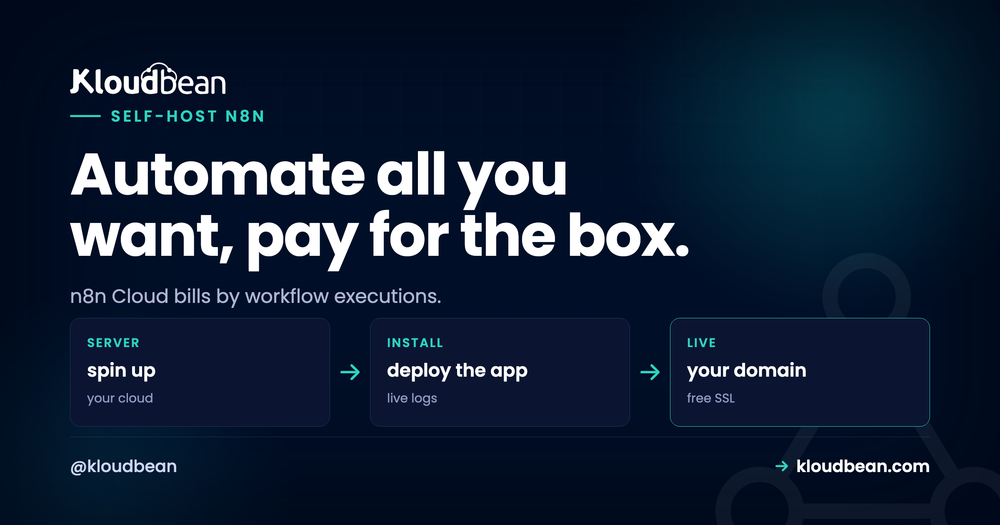

# Self-Host n8n: The Cost Math That Changes Minds

Here's the moment people decide to self-host n8n: a workflow that felt free suddenly isn't. n8n Cloud counts **executions**, and a busy automation that polls, loops, or fires on every webhook chews through an allowance faster than anyone expects. The plan that was plenty last month is throttling you this month. Self-hosted n8n doesn't count executions at all. Run ten workflows or ten thousand, the cost is the server. Let's do the actual math, because the math is the whole argument.

> **Short version:** n8n is an open-source workflow automation tool, a Zapier or Make alternative you can run yourself. Cloud plans bill per execution, which gets expensive as volume climbs. Self-hosted n8n runs unlimited executions for a flat server price, and your credentials and data stay on your box. On Kloudbean you launch n8n in one click, give it a managed Postgres, and set two environment variables. If you run more than a trickle of automations, it pays for itself fast.

## What n8n actually does

If you've used Zapier or Make, you know the shape. n8n connects apps and APIs into workflows: a trigger fires (a webhook, a schedule, a new row somewhere), then a chain of nodes does the work (call an API, transform the data, post to Slack, write to a database, branch on a condition). The difference is that n8n is open source and runs on your own server, so you're not renting the automation by the task.

People use it for the unglamorous glue that keeps a business running. Syncing leads into a CRM. Posting daily reports. Enriching signups. Watching an inbox. Wiring an internal tool to five SaaS products that don't talk to each other. It's genuinely capable, and that capability is exactly what makes the metered pricing bite.

## Why cost is the reason people self-host n8n

n8n comes in two forms, and the gap between them is the entire story:

- **n8n Cloud**: hosted for you, billed on plans with monthly execution limits. Convenient, and metered.
- **n8n Community (self-hosted)**: the same core software, free to run on your own server, with no execution cap.

Same editor, same nodes, same workflows. Self-hosting just moves where it runs onto a box you own. And once you see cost as a curve rather than a number, the decision mostly makes itself.

<!-- SVG diagram in the HTML: a cost curve, n8n Cloud per-execution cost climbing in steps vs a flat self-hosted server line, crossing at a break-even point. -->

*Cloud is cheaper when you barely use it. Push volume up and the metered bill climbs in steps, while a flat server holds its line. The crossover comes sooner than most people guess.*

| | n8n Cloud | Self-hosted n8n |
| --- | --- | --- |
| Billed on | Monthly execution allowance | Flat server price |
| A workflow that runs every 5 min | About 8,600 executions a month, eating your cap | Free, it's just a process running |
| Add 10 more workflows | More executions, likely a higher tier | No change |
| A chatty webhook (thousands a day) | Can blow the cap on its own | Still just the server |
| Where your data goes | Through n8n's cloud | Your server only |

The pattern: Cloud pricing tracks how hard your automations work, which is the one number you can't predict. A flat server tracks nothing. It costs the same whether your workflows sit idle or run all night.

## A worked example: how the bill sneaks up

Say you build three ordinary automations. One syncs new leads from a form into your CRM and checks every five minutes. One posts a daily summary to Slack. One is a webhook that fires whenever someone submits a support ticket.

The daily Slack post is nothing, about 30 executions a month. But the five-minute lead check runs roughly 8,600 times a month whether or not a lead actually came in. And on a busy week the support webhook might fire a few thousand times. None of these feels "heavy" in your head. They're just useful little helpers. Yet together they can quietly cross a Cloud plan's execution line, and the fix on Cloud is to move up a tier for automations that are mostly checking whether there's anything to do.

On a self-hosted box, that same trio costs exactly what the server costs. Add ten more like them and it still costs what the server costs. The executions you couldn't easily predict simply stop being a billing input. That's the move, in one paragraph.

<!-- ADD IMAGE: The n8n workflow editor with a real automation, a schedule trigger feeding a couple of nodes into a Slack or HTTP action. -->

## The other reason people move: the data

Cost gets people looking. Data is what makes them commit. Think about what an n8n workflow actually holds: API keys to your CRM, tokens for your email, database credentials, customer records flowing through every run. That's some of the most sensitive material in your business, and on a hosted plan it passes through someone else's infrastructure. Self-hosted, all of it stays on a server you control. For a workflow that touches customer data or internal systems, that alone is worth the switch, cost aside.

## When self-hosting wins, and when Cloud is genuinely fine

I'll take a clear position here, because balanced-both-ways advice is useless. Self-host n8n when:

- **You have high-volume or frequent workflows.** Polling, loops, busy webhooks, anything that racks up executions.
- **Your workflows touch sensitive data.** Customer records, internal systems, credentials to everything.
- **You want one predictable bill** instead of a tier that creeps up every quarter.

Stay on Cloud when you have a few light workflows that fit comfortably in a plan's allowance, or you simply never want to run a server. Both are valid. This is a cost-and-control decision, not a moral one. But if your executions are already climbing, you passed break-even a while ago.

## What n8n needs from a server

Good news: n8n is light. It runs happily on a roughly **1 GB** server for personal use, a bit more if you run many workflows at once. The one upgrade that matters for real use is the database.

By default n8n stores everything in a SQLite file. Fine for testing. Wrong for anything you depend on, because it handles concurrent executions poorly and a single file is a fragile place to keep your automation history and credentials. For production you want **PostgreSQL** behind it, and on a managed platform that's a one-click launch:


Spin up a managed Postgres and point n8n at it with a few environment variables (`DB_TYPE=postgresdb` and the connection details). Now your automation history and saved credentials sit in a real database that's backed up for you. The [managed database guide](https://www.kloudbean.com/blog/add-managed-database-to-your-app/) covers the connection details, and there's a dedicated [managed PostgreSQL](https://www.kloudbean.com/blog/managed-postgresql-hosting/) page.

## The one-click way to run it

You don't have to hand-install anything. Add an application, choose n8n, and the platform stands it up on your server. The stack, the web layer, and a free SSL certificate come ready, so you're not configuring a reverse proxy by hand.


Four moves and you're done: launch a small server, deploy n8n in one click, give it managed Postgres, and reach it at `n8n.yourdomain.com` over HTTPS. Because n8n is so light, it can share that server with your other tools, which is the whole idea behind [hosting multiple apps on one server](https://www.kloudbean.com/blog/host-multiple-apps-one-server/).

<!-- ADD IMAGE: The n8n editor open on your own domain, right after the one-click deploy. -->

## The two settings everyone trips on

Get these right on day one. They cause most of the "why is it broken?" moments in self-hosted n8n:

- **`N8N_ENCRYPTION_KEY`**: n8n encrypts your saved credentials with this key. Set it once and keep it safe. If it changes or gets lost, n8n can't decrypt your stored credentials and every connected account breaks at once. Treat it like a password you can never rotate casually.
- **`WEBHOOK_URL`**: n8n needs to know its own public address to build webhook URLs that external services can reach. Set it to your real domain. Skip it and your webhooks point at the wrong place and fail silently, which is the worst kind of failure because nothing errors out.


```bash
# Set these before you build important workflows
N8N_ENCRYPTION_KEY=a-long-stable-secret-you-never-lose
WEBHOOK_URL=https://n8n.yourdomain.com/

# Point n8n at managed Postgres instead of the default SQLite
DB_TYPE=postgresdb
DB_POSTGRESDB_HOST=your-managed-postgres-host
DB_POSTGRESDB_DATABASE=n8n
DB_POSTGRESDB_USER=n8n_user
DB_POSTGRESDB_PASSWORD=a-strong-password
```

Both the key and the webhook URL live in environment variables, not in the UI or the code. There's a fuller mental model in [environment variables done right](https://www.kloudbean.com/blog/environment-variables-done-right/). Set them once and you'll skip the two most common self-hosted n8n headaches.

<!-- ADD IMAGE: n8n settings or a terminal showing the Postgres connection succeeding and the encryption key loaded. -->

## Scaling past one box: queue mode

Most people never need this, and I'd rather you know that than over-build on day one. A single n8n process handles a surprising amount. But if you genuinely push high volume, n8n has a **queue mode**: the main instance hands executions to a shared queue, and separate worker processes pick them up and run them in parallel. That queue runs on **Redis**, which you can add as a [managed Redis](https://www.kloudbean.com/blog/managed-redis-hosting/) instance, and the workers can spread across cores or servers. So the growth path is real without changing tools: one process to start, workers plus Redis when the volume actually demands it. Don't reach for it early. Reach for it when a single process starts falling behind.

## The honest part

Self-hosting shifts a little responsibility onto you, and it's fair to name it. You own the n8n app: its occasional updates, and making sure its database is backed up. The platform keeps the server underneath healthy, which means the OS, the web stack, SSL, and server-level backups. It's a Linux app, which is exactly what n8n is built for, running on your box under your control. In return you get unlimited executions and data that never leaves your server. For anyone running real automation volume, that's barely a trade. Keep an eye on [backups](https://www.kloudbean.com/blog/server-backups-guide/) and you're set.

---

**Unlimited executions. One flat bill.** Launch n8n in one click, give it a managed Postgres, and run every workflow you want on a server you own. Start free at [kloudbean.com](https://www.kloudbean.com/); plans on [pricing](https://www.kloudbean.com/pricing/).

One-click n8n · Managed PostgreSQL · Unlimited executions · Automatic backups · Free trial

## FAQ

**Is self-hosted n8n free?**
The Community edition is free to run, so you only pay for the server. It has no execution limits, unlike the metered Cloud plans. Some advanced enterprise features are paid, but core automation is fully available in the self-hosted version.

**How much server does n8n need?**
Not much. Around 1 GB of RAM covers personal use, a little more if many workflows run at once. It's one of the lighter tools to self-host, which is why it happily shares a box with other apps.

**Do I need PostgreSQL, or is SQLite okay?**
SQLite (the default) is fine for testing. For anything you depend on, use PostgreSQL. It handles concurrent executions reliably and keeps your history and credentials in a real, backed-up store. Launch a managed Postgres and point n8n at it with DB_TYPE=postgresdb and the connection variables.

**What are the two settings I must set?**
N8N_ENCRYPTION_KEY, which encrypts your saved credentials and must stay stable and safe, and WEBHOOK_URL, n8n's real public address so webhooks resolve correctly. Both go in environment variables before you build important workflows. Losing the encryption key breaks every connected account, so guard it.

**When should I just use n8n Cloud?**
When you have a few light workflows that fit a plan's execution allowance and you'd rather not run a server at all. Self-hosting wins once executions climb, workflows touch sensitive data, or you want one flat, predictable bill.

**How many workflows can self-hosted n8n run?**
As many as your server can handle, with no per-execution cap. That's the core reason to self-host. Ten workflows or ten thousand executions, the cost is the same flat server. Volume simply stops being a billing question.

**Is self-hosted n8n secure?**
It's as secure as your server, and a managed platform gives you a good starting point: a firewall, free SSL, and IP allow-listing so only your app server can reach the database. Set a strong N8N_ENCRYPTION_KEY, keep credentials in environment variables, and your workflow data and API keys stay on infrastructure you control rather than passing through a third party.

**Can n8n handle high volume, and how do I scale it?**
Yes. A single process handles a lot, and for real scale n8n has a queue mode where worker processes pull executions from a Redis-backed queue and run them in parallel. Add managed Redis, run workers, and you can spread load across cores or servers without changing tools.

**Can n8n share a server with my other apps?**
Yes, and that's a common setup because n8n is light. The same box that runs your site, your analytics, or a status page can run your automations too, at no extra cost. See hosting multiple apps on one server for how to stack them cleanly.

---

*Kloudbean · Automate all you want, pay for the box.*
