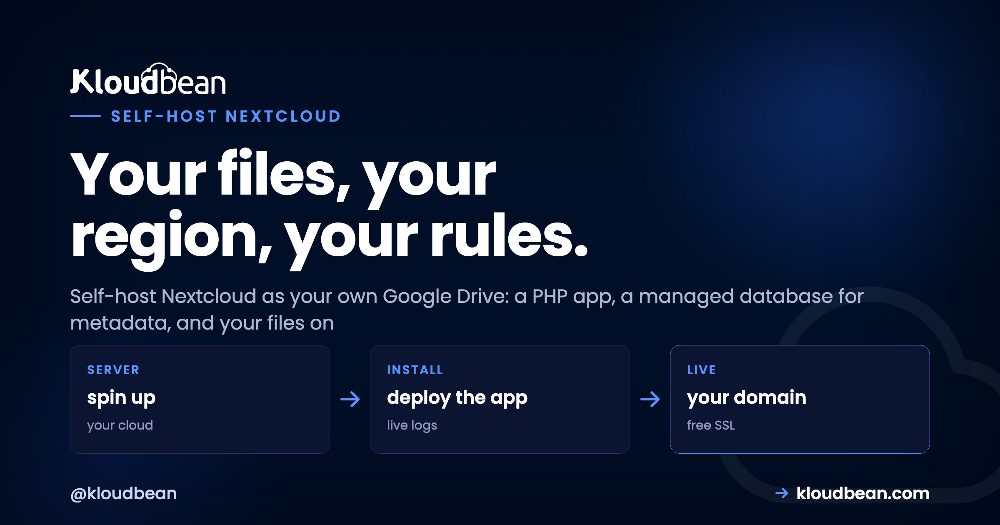

# Self-Host Nextcloud and Own Your Team's Files

Ask a ten-person team where their files live and you'll get six answers: somebody's personal Google Drive, a Dropbox nobody pays attention to, a Slack thread, email attachments, a USB stick in a drawer. Meanwhile the Drive and Dropbox bills climb every time you add a seat. There's a cleaner answer.

Self-host Nextcloud and you get your own Drive: file sync, sharing, calendars, and document editing, running on a server you control, at your own domain. One place for the files, one bill that doesn't rise per person, and your data in a region you chose. This is a build guide with a strong opinion baked in about the one decision that matters most.

> **Start here:** Nextcloud is a PHP app with a database for metadata and storage for the actual files. The decision that defines everything: keep the files on S3-compatible object storage, not the server's disk. Then the app server stays small and cheap while storage scales on its own. Add HTTPS, 2FA, a real cron job, and Redis, and you've got a private cloud you can trust a team to.

## What Nextcloud actually is

Under the friendly Drive-like interface, Nextcloud is three moving parts, and it helps to see them separately:

- **A PHP application.** This is Nextcloud itself, the thing serving the web UI and talking to the sync clients. It runs on a standard PHP web stack, the same kind that runs WordPress or Laravel.
- **A database for metadata.** Nextcloud stores users, shares, and file paths in MariaDB or MySQL. Note the word metadata. The database tracks *where* files are and who can see them, not the file contents.
- **Storage for the actual files.** The bytes your team uploads have to physically live somewhere, and this is the choice that shapes the whole setup.

That separation between metadata and file bytes is the key to running Nextcloud well. Get it right and the rest is a checklist.

## The one decision that defines everything

Every file your team uploads lands in one of two places: on the server's own disk, or in object storage that Nextcloud treats as its primary store. This single choice decides how your setup grows, so it's worth more than any other step.

```
   [ Desktop sync ] --\
                       \
   [ Mobile app    ] -----> [ Nextcloud (PHP app) ] --> Managed MariaDB
                       /        on your server      \    metadata: users, shares, paths
   [ Web browser   ] --/                             \
                                                       --> Object storage bucket
                                                           the actual files (scale on their own)

   Small app server. Storage that grows without resizing the box.
```

Look at where the arrows go. The database only ever holds metadata, which stays small. The heavy stuff, the actual files, goes to the bucket. That's why the app server can stay modest even as your file library balloons.

## Why object storage should be the primary store

Putting files on the server disk is simple and fast, and it's fine for small volumes. The catch is that file storage only ever grows. Do it on disk and every gigabyte your team adds pushes you toward a bigger, pricier server, and resizing to add disk is clumsy.

Nextcloud has a better option that many people don't realize exists: it can use an [S3-compatible object storage](https://www.kloudbean.com/blog/s3-compatible-object-storage/) bucket as its *primary* file store. Every uploaded file goes to the bucket instead of the disk. Now the app server just runs the app (a small, cheap box is plenty), and storage grows in the bucket without you touching the server at all. On the right provider you also dodge the egress fees that make some clouds punish you for reading your own files.

On a managed platform you create a bucket and point Nextcloud at it:


The config lives in Nextcloud's `config.php` and looks roughly like this:

```php
// config.php: files go to the bucket, not the server disk
'objectstore' => [
  'class' => '\OC\Files\ObjectStore\S3',
  'arguments' => [
    'bucket'   => 'nextcloud-files',
    'hostname' => 's3.your-region.example.com',
    'port'     => 443,
    'use_ssl'  => true,
    'use_path_style' => true,
    'key'    => 'YOUR_ACCESS_KEY',
    'secret' => 'YOUR_SECRET_KEY',
  ],
],
```

Set that before your team uploads much, because it defines where files land from then on. My honest advice: if you expect more than a few gigabytes, and a file store always ends up there, start with object storage. You'll never have the "we're out of disk" morning.

## The build, in order

With the storage decision made, the rest is a short sequence. Nextcloud runs on the same PHP stack a managed server already provides, so you're mostly installing one app and choosing storage.

1. **Launch a server.** A 2 GB box is a comfortable start for a small team, because the files aren't living on it. Pick the region nearest the people using it.
2. **Create a managed database.** Nextcloud uses [MariaDB or MySQL](https://www.kloudbean.com/blog/managed-mysql-hosting/). Launch a managed one so it's tuned and backed up from day one.
3. **Install Nextcloud.** Drop in the official package; its setup connects to your database and creates the admin account.
4. **Point your files at object storage** using the config above.
5. **Add your domain and free SSL.** Logins and file transfers must run over HTTPS. This is not optional for anything private.


<!-- ADD IMAGE: The Nextcloud files web interface with folders, sharing icons, and the upload button -->

## The performance fixes almost everyone misses

A fresh Nextcloud works, but out of the box it's slower than it should be, and there are three fixes that account for most "why is this sluggish" complaints. Do them once and forget them.

**Switch background jobs to a real cron.** By default Nextcloud runs its housekeeping tasks on page loads (the "AJAX" mode), which is both slow and unreliable. Move them to a system cron job instead:

```bash
# run Nextcloud's background jobs every 5 minutes
*/5 * * * * php -f /var/www/nextcloud/cron.php
```

Then set the mode to Cron in the admin settings. This single change is the most common speed fix there is.

**Add Redis for caching and file locking.** Redis makes the interface noticeably snappier and, just as important, prevents the file-lock errors that pop up when several people edit at once. It's a light service and well worth it. A [managed Redis](https://www.kloudbean.com/blog/managed-redis-hosting/) wires in through a few lines of config:

```php
'memcache.local'   => '\OC\Memcache\APCu',
'memcache.locking' => '\OC\Memcache\Redis',
'redis' => [ 'host' => '127.0.0.1', 'port' => 6379 ],
```

**Raise the PHP memory limit.** Big uploads and image previews need headroom. Bump PHP's `memory_limit` to 512M so large files and thumbnail generation don't quietly fail. That's the trio. Miss them and Nextcloud feels heavy; apply them and it feels like a product.

<!-- ADD IMAGE: The Nextcloud desktop sync client showing a synced folder and its status -->

## Locking it down for team files

This is your team's files, so security isn't a nice-to-have. The good news is the list is short:

- **HTTPS everywhere.** Free SSL on your domain, no exceptions. Files and logins over plain HTTP is a non-starter.
- **Two-factor authentication.** Nextcloud has 2FA built in. Turn it on and require it for accounts that can see sensitive folders.
- **Keep the database on a private network.** Your MariaDB should talk to Nextcloud over a [private network](https://www.kloudbean.com/blog/what-is-a-vpc/), not the public internet, so it's never exposed to scanners.
- **Back up both halves.** Two things matter: the database (metadata, users, shares) and the files. If files live in object storage they're already durable, so make sure the database is dumped on a schedule alongside the platform's [server-level backups](https://www.kloudbean.com/blog/server-backups-guide/).

<!-- ADD IMAGE: Nextcloud security settings with two-factor authentication being enabled for a user -->

## Getting your team onto it

A file platform is only worth anything if people actually use it, so make switching painless. Nextcloud has proper desktop apps for Windows, Mac, and Linux that sync a folder exactly the way Dropbox does, plus mobile apps for phones. From a user's point of view it behaves like the cloud drive they already know, so there's nothing new to learn.

Moving files in is easy too. People drag their folders into the desktop client, or you bulk-import from an old Drive or Dropbox. Set up shared folders per team, give everyone an account, and flip on the calendar and contacts apps if you want those off third-party services too. One tip from experience: migrate one team or folder at a time rather than everything at once. Get a single group happily synced, let them vouch for it, and the rest follow without drama.

## The per-seat math

The financial case is simple, and it's why most teams look. Google Drive and Dropbox for Business charge per user, every month. Add people and the bill climbs. Self-hosted Nextcloud charges you for a server and a storage bucket, the same whether five people use it or fifty. A new hire is a new account, not a new invoice line.

| What you pay for | Drive / Dropbox for Business | Self-hosted Nextcloud |
| --- | --- | --- |
| Pricing basis | Per user, per month | Flat: server + storage |
| Adding the 20th user | Another monthly seat | Just another account |
| Where the files live | Their infrastructure | Your bucket, your region |
| Storage growth | Per-user quotas and upsells | Grows in the bucket |

## Is self-hosting Nextcloud worth it?

For a privacy-conscious team, or anyone tired of per-seat Drive and Dropbox fees, yes. Nextcloud on a small managed server with object storage behind it is a genuinely strong alternative that you own outright. The cost is that you run the app and mind its backups, which the platform's server-level protections make lighter than it sounds.

Where it isn't the answer: if you just need personal file sync for one person and never want to see a server, a consumer cloud is simpler and fine. The moment files become *team* files that matter, and the seat count starts to sting, owning them looks wise. Nextcloud is one of a handful of tools that pay off when you run them yourself; our [best self-hosted tools](https://www.kloudbean.com/blog/best-self-hosted-tools/) roundup shows where it sits, and if code is next, [self-hosting GitLab](https://www.kloudbean.com/blog/self-host-gitlab/) follows the same own-it logic.

---

**One answer to "where are our files?"** Stand up your own Drive at [kloudbean.com](https://www.kloudbean.com/). A small server, a managed database, and an object-storage bucket is the whole recipe. Start on a free trial, with free migration help if you're moving off Drive or Dropbox. See plans on [pricing](https://www.kloudbean.com/pricing/).

S3-compatible object storage · Managed MariaDB · Private networking · Free SSL · Automatic backups · Free trial

## FAQ

**What does Nextcloud need to run?**
A PHP web stack, a MariaDB or MySQL database for metadata, and somewhere to store the files. A 2 GB server is a fine start, and the PHP stack comes ready on a managed server, so you're mostly installing Nextcloud and choosing where files live.

**Can Nextcloud store files in object storage instead of on the server?**
Yes, and it's the setup I'd recommend for any real team. Nextcloud supports S3-compatible object storage as its primary file store, so all uploaded files go to a bucket instead of the server disk. Storage then scales independently and the app server stays small and cheap.

**Why is my Nextcloud slow?**
Almost always two things: background jobs are running on page loads instead of via a real cron, and caching isn't set up. Switch background jobs to a system cron every five minutes and add Redis for caching and file locking. Raising PHP's memory limit helps with big uploads and previews too.

**Is self-hosted Nextcloud secure enough for team files?**
Yes, with the basics: HTTPS on your domain, two-factor authentication on logins, the database on a private network rather than the public internet, and regular backups. Managed hosting also keeps the underlying server patched and firewalled.

**What do I need to back up?**
Two things: the database (metadata, users, and shares) and the files themselves. If files are in object storage they're already durable, so the important habit is dumping the database on a schedule, alongside the platform's server-level backups.

**How much does self-hosting Nextcloud cost?**
You pay for a server and a storage bucket, not per user. That's the whole appeal versus Drive or Dropbox for Business, where every seat adds to the monthly bill. Adding people to Nextcloud is just adding accounts.

**Does Nextcloud have desktop and mobile sync apps?**
Yes. There are official desktop clients for Windows, Mac, and Linux that sync a folder just like Dropbox, plus mobile apps for phones and tablets. To users it behaves like the cloud drive they already know.

**Can I migrate from Google Drive or Dropbox?**
Yes. People can drag folders into the desktop client, or you can bulk-import from an existing Drive or Dropbox. The smoothest approach is to move one team or folder at a time rather than everything at once, so a group can settle in before the next joins.

**MariaDB or MySQL for Nextcloud?**
Either works well; MariaDB is the common default and Nextcloud documents both. Launch whichever you prefer as a managed database so it's tuned and backed up, and point Nextcloud at it during setup.

**Can Nextcloud replace calendars and contacts too?**
Yes. Alongside files, Nextcloud includes calendar and contacts apps, so you can move those off third-party services and keep them on the same server you own. It also has document editing if you want a full office suite in one place.

---

*By Kloudbean · Your files, your region, your rules.*
