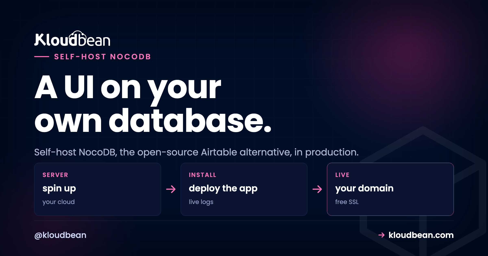

# How to Self-Host NocoDB in Production (the Open-Source Airtable Alternative)

_By Kloudbean Engineering · A UI on your own database_



NocoDB turns a plain SQL database into a friendly, no-code spreadsheet. Point it at Postgres or MySQL and you get sortable grids, forms, kanban boards, and shareable views on top of your real tables, which is exactly why teams reach for it as an open-source Airtable alternative. The part most guides skip: NocoDB keeps its own settings in a database too, and out of the box that's a local SQLite file that disappears on your next redeploy. This guide is how to self-host NocoDB in production properly, with its metadata on a managed database you actually own.

> **Short version:** Run the NocoDB Node app on a managed Node server. Back its metadata database with a managed MySQL or PostgreSQL instead of the default SQLite, and set that connection through the `NC_DB` environment variable. Set `NC_AUTH_JWT_SECRET` so logins survive a restart, put SSL in front, and keep everything on the private network. Then add your existing SQL databases as data sources so NocoDB puts a spreadsheet UI on tables you already run.

## The Airtable problem NocoDB fixes

Airtable is lovely to start with. You sign up, you're building in minutes, and there's genuinely nothing to run. Credit where it's due. The trouble shows up later, and it shows up in three places.

- **The bill scales with people and rows.** Pricing is per-seat, so every collaborator you add costs more each month, whether or not they log in that week.
- **Records are capped on the cheaper tiers.** Bases have record limits, and the moment a real dataset grows you're nudged up a plan to keep writing rows.
- **Your data lives in their cloud.** Customer records, internal ops, the spreadsheet that quietly runs half the company. All of it sits in a vendor's account, in their region, under their export rules.

NocoDB is the open-source answer to that. It's the same idea, a no-code grid over structured data, except the grid sits on your own SQL database and runs on your own server. No per-record ceiling. No per-seat meter. And the data underneath is ordinary Postgres or MySQL you can query, dump, and back up like any other database.

## Why self-host NocoDB

Self-hosting isn't about the software being better when you run it. It's the same NocoDB either way. What changes is who holds the data and who sends the invoice. A few reasons actually move teams:

- **You own the data.** Everything lives in a database on infrastructure you control, in the region you choose. For regulated or privacy-sensitive work, that alone is the whole argument.
- **Flat cost instead of a meter.** A server you rent for a fixed price doesn't care how many seats or rows you have. Past a handful of editors, that math tips hard in your favour.
- **A UI on databases you already run.** This is the underrated one. You probably have a Postgres or MySQL sitting behind an app right now. NocoDB can put a spreadsheet front end on it so non-developers can browse and edit real production tables, safely and with permissions.
- **Custom access and no lock-in.** Open source, real SQL underneath, your own auth. You can shape access per table and leave whenever you like, because there's nothing proprietary to escape.

The honest tradeoff: you take on a little operations. Someone has to update NocoDB now and then, and someone has to make sure the metadata database is backed up. A managed platform shrinks that to almost nothing, but it never quite hits zero. If you're just kicking the tyres, hosted Airtable or NocoDB Cloud is the faster start and that's fine.

## The two databases NocoDB touches (this is the part people miss)

Here's the mental model that saves you a bad afternoon. NocoDB talks to _two different kinds_ of database, and confusing them is the number one self-host mistake we see.

**1. The metadata database.** This is NocoDB's own bookkeeping: your bases, views, column config, filters, sort orders, users, and permissions. It is not your business data, it's the description of how NocoDB is set up. If you don't tell NocoDB where to keep this, it falls back to a local SQLite file (`noco.db`) sitting on the server's disk. On a managed Node runtime that disk is rebuilt on redeploy, so every push can wipe your entire NocoDB setup: bases gone, views gone, users gone. The app still boots, which is what makes it sneaky. It just boots empty.

**2. The data sources.** These are the SQL databases NocoDB reads and writes to give you the grid. This is your actual content. You connect one or more existing managed Postgres or MySQL databases as a NocoDB data source, and NocoDB renders their tables as editable spreadsheets. Your data never moves into NocoDB. NocoDB just draws a friendly window onto it.

So the fix is simple to say and easy to get wrong: put the metadata database on a managed MySQL or PostgreSQL, and add your real databases as data sources. My blunt take, the SQLite default is fine for a five-minute look. It's the wrong choice for anything you'd be sad to lose.

```
             NC_DB (views · users · config)
   You  →  NocoDB  ───────────────────────────►  Metadata DB
 (HTTPS)  (Node :8080)                            managed MySQL / Postgres

                 reads / writes your tables
          NocoDB  ◄──────────────────────────►  Data sources
                                                 your existing SQL databases
          └──────────── private network (VPC) ────────────┘
```

_NocoDB stores its own config in the metadata database (set with NC_DB) and renders your existing databases as editable grids by adding them as data sources. Back up the metadata DB and you've backed up your NocoDB setup._

<!-- ADD IMAGE: A NocoDB grid view rendering a real Postgres table, with columns, filters, and a form view in the sidebar. -->

## Set NC_DB: the config that keeps your setup

Everything above comes down to one environment variable. `NC_DB` tells NocoDB where its metadata store lives. Set it to a connection string that points at your managed Postgres or MySQL, and NocoDB writes its bookkeeping there instead of a throwaway file. Miss it, and you're back on SQLite by default.

NocoDB uses its own compact connection-string format for `NC_DB`. Postgres uses the `pg://` scheme, MySQL and MariaDB use `mysql2://`, and the credentials ride as query params (`u` user, `p` password, `d` database). Point the host at the private address of your managed database, not a public one.


```bash
# NocoDB metadata store on managed Postgres (recommended)
NC_DB=pg://10.0.0.5:5432?u=nocodb&p=your-strong-password&d=nocodb

# ...or on managed MySQL / MariaDB (same idea, mysql2 scheme)
NC_DB=mysql2://10.0.0.5:3306?u=nocodb&p=your-strong-password&d=nocodb

# Sign auth tokens with a STABLE secret. Set this or logins drop on every restart.
NC_AUTH_JWT_SECRET=a-long-random-string-at-least-32-chars

# Port your managed Node runtime routes traffic to (NocoDB defaults to 8080)
PORT=8080

# The public URL NocoDB builds links and invites against
NC_PUBLIC_URL=https://data.yourdomain.com
```

Two of these matter more than they look. If `NC_DB` is unset, NocoDB silently creates `noco.db` (SQLite) on local disk, which is the redeploy trap from the last section. And if `NC_AUTH_JWT_SECRET` is unset, NocoDB generates a random one at boot, so every restart invalidates every session and kicks everyone out. Set both, save, restart. Keep them in the environment, never in a Git repo. The general habit is worth reading once in [environment variables done right](https://www.kloudbean.com/blog/environment-variables-done-right/).

NocoDB is a plain Node app, so there's no special installer. You install dependencies, run the start script, and it listens on a port. The programmatic bootstrap is a handful of lines:

```js
// package.json  ->  "start": "node index.js"   (a normal Node app)
const { Noco } = require("nocodb");
const express = require("express");

const app = express();
app.enable("trust proxy");               // you sit behind managed SSL / a proxy

(async () => {
  app.use(await Noco.init({}));           // NC_DB + NC_AUTH_JWT_SECRET read from env
  app.listen(process.env.PORT || 8080, () => console.log("NocoDB up"));
})();
```

That's the whole app. Kloudbean's managed Node runtime runs the build and start for you and routes the port, so you're deploying a Node service, not wrangling containers. If you want the fuller picture of the Node side, see [deploying a Node app to managed cloud](https://www.kloudbean.com/blog/deploy-node-app-to-managed-cloud/).

## Self-hosted NocoDB vs Airtable, honestly

Neither is strictly better. They optimise for different things. Airtable optimises for zero operations. Self-hosted NocoDB optimises for ownership and cost control. Here's the fair split:

| | Airtable / hosted no-code SaaS | Self-hosted NocoDB |
| --- | --- | --- |
| **Data ownership** | Your data in the vendor's cloud | On a database you own, in your region |
| **Cost model** | Per-seat and per-record, climbs with use | Flat server price; seats and rows don't move it |
| **Sits on your own SQL database** | No, it's a proprietary store | Yes, points at your Postgres or MySQL |
| **Customization** | What the product chooses to expose | Open source, real SQL underneath, scriptable |
| **Who runs it** | The vendor | You, on a managed server (mostly handled) |
| **Ease of start** | Sign up and build in minutes, zero ops | Deploy the Node app and set NC_DB first |

If your team is three people and a couple of hundred rows and the bill isn't stinging, Airtable is genuinely the easier life. The move to self-hosted NocoDB pays off when seats multiply, the record cap starts biting, or the data simply has to live somewhere you control.

## Deploy NocoDB on a managed server, step by step

Four steps. Metadata database first, then the app, then the config, then ship it behind SSL.

1. **Launch the metadata database.** Open the DBS section and hit Launch Database. Create a managed PostgreSQL or MySQL, give it a name like `nocodb`, and note the private host, port, database name, user, and password. It's provisioned, on a private network, and backed up from the start. This is where NocoDB's config will live, not SQLite.


2. **Create the NocoDB Node application.** Add an application on your server and pick the Node runtime. This is the important framing: you're running the NocoDB Node app on a managed Node runtime, not clicking a canned NocoDB button. Connect the repo that holds your NocoDB start script (the few lines above) and the platform handles the build.


<!-- ADD IMAGE: Your NocoDB sign-in screen loading on your own domain over HTTPS. -->

3. **Set NC_DB and the secrets.** In Runtime Configuration, add `NC_DB` pointing at the managed database from step 1, plus `NC_AUTH_JWT_SECRET`, `PORT`, and `NC_PUBLIC_URL`. Save and restart so NocoDB reads them on boot. Confirm it's on the real database by creating a base, redeploying, and checking the base is still there.

4. **Deploy from Git and put SSL in front.** Wire up deploys so a push to your branch builds and restarts NocoDB. Add your domain, issue free SSL, and you have an encrypted, self-hosted NocoDB on a URL you own. The auto-deploy flow is covered in [CI/CD auto-deploy from GitHub](https://www.kloudbean.com/blog/ci-cd-auto-deploy-from-github/).


## Lock it down

A NocoDB instance is a window onto real data, so treat it like one. None of this is exotic, it's just the checklist people skip when they're moving fast.

- **Keep both databases private.** The metadata database and every data source should sit on the private network, reachable by the app and not the public internet. NocoDB connects over the internal address, so nothing needs a public port.
- **Secrets in the environment.** `NC_DB` and `NC_AUTH_JWT_SECRET` go in the env config, never in the repo. A leaked `NC_DB` is a leaked database, and a leaked JWT secret means someone can forge a login.
- **SSL in front, always.** Free SSL on your domain so traffic to the grid is encrypted. Shorewall and Fail2ban run on the server underneath by default.
- **Strong admin, least-privilege DB users.** Lock the first NocoDB super-admin account with a real password. Give each data source a scoped database user with only the rights it needs, not a superuser.
- **Back up the metadata DB.** Your bases and views live there. Managed backups cover it, and it's worth keeping your own periodic dump too. More in the [server backups guide](https://www.kloudbean.com/blog/server-backups-guide/).

<!-- ADD IMAGE: The SSL screen showing an issued certificate on your NocoDB domain. -->

## Point NocoDB at databases you already run

This is where NocoDB earns its keep. Once it's live, open the base settings and add a data source pointing at one of your existing managed databases. NocoDB introspects the tables and gives you an instant spreadsheet UI over them, editable grids, forms, and views, without touching your schema. Give it a scoped database user so non-technical editors can browse and update rows while the credentials stay narrow. It's the fastest way to hand a friendly interface to a database that only had a psql prompt before.

If you don't have a database to point at yet, spin one up first: [managed PostgreSQL](https://www.kloudbean.com/blog/managed-postgresql-hosting/) or [managed MySQL](https://www.kloudbean.com/blog/managed-mysql-hosting/), both on a private network and backed up. NocoDB then becomes the front door.

<!-- ADD IMAGE: The NocoDB add-data-source dialog with host, port, user, and database filled in for a managed Postgres. -->

Weighing other tools to run yourself? The [best self-hosted tools](https://www.kloudbean.com/blog/best-self-hosted-tools/) roundup is good company, and if you want a full backend rather than a grid, the [self-host Supabase](https://www.kloudbean.com/blog/self-host-supabase/) guide is the sibling piece.

## A spreadsheet UI on a database you own

Run the NocoDB Node app on a managed server, back it with a managed MySQL or PostgreSQL, and point it at the databases you already have. The OS, SSL, and backups are handled while your data stays yours. Start free at [kloudbean.com](https://www.kloudbean.com/); plans on [pricing](https://www.kloudbean.com/pricing/).

Managed Node runtime · Managed MySQL & PostgreSQL · Private networking · Automatic backups · Free SSL · Free migration · Free trial

## FAQ

### Is NocoDB a good Airtable alternative?
Yes, for most spreadsheet-database use cases. NocoDB gives you the same grid, form, and view experience as Airtable, but it runs on your own server and sits on your own SQL database. You trade Airtable's zero-ops convenience for data ownership, a flat cost, and no per-record ceiling.

### What database does NocoDB need?
NocoDB needs a metadata database to store its bases, views, users, and config. It defaults to a local SQLite file, but in production you should point it at a managed MySQL or PostgreSQL instead. That's separate from your actual data, which stays in whatever databases you connect as data sources.

### Why not use the default SQLite?
Because the SQLite file lives on the server's local disk, and on a managed runtime that disk is rebuilt on redeploy. When it's wiped, your NocoDB setup goes with it: bases, views, and users. The app still starts, just empty, which makes the loss easy to miss until it's too late. A managed database avoids the whole problem.

### Can NocoDB connect to my existing database?
Yes, and it's one of the best reasons to use it. Add your existing managed Postgres or MySQL as a data source and NocoDB renders its tables as editable grids without changing your schema. Use a scoped database user so editors can work with the data while the credentials stay least-privilege.

### What is the NC_DB environment variable?
NC_DB is the connection string that tells NocoDB where to keep its metadata. Postgres uses a pg scheme and MySQL uses a mysql2 scheme, with the user, password, and database name passed as parameters. Set it to your managed database's private address and NocoDB stops falling back to SQLite.

### Does NocoDB support both PostgreSQL and MySQL?
Yes. NocoDB works with PostgreSQL, MySQL, and MariaDB for both its metadata store and its data sources. On Kloudbean all three are available as managed engines with backups and private networking, so you can mix and match freely.

### Is self-hosted NocoDB free?
NocoDB itself is open source, so the software is free to run. What you pay for is the server and the managed database it runs on, which is a flat, predictable cost rather than a per-seat or per-record charge. For most teams past a few editors that works out cheaper than a hosted no-code plan.

### How do I deploy NocoDB?
Launch a managed Postgres or MySQL for the metadata, create a Node application to run the NocoDB app, set NC_DB and NC_AUTH_JWT_SECRET in the environment, then deploy from Git and put SSL in front. NocoDB is a normal Node service, so it deploys like any other Node app on a managed runtime.

### How do I back up self-hosted NocoDB?
Back up the metadata database, because that holds your bases, views, and users. Managed backups cover it automatically, and keeping your own periodic dump is smart insurance. Your data sources are separate databases with their own backups, so protect those too.

---

_By Kloudbean Engineering · A UI on your own database._
