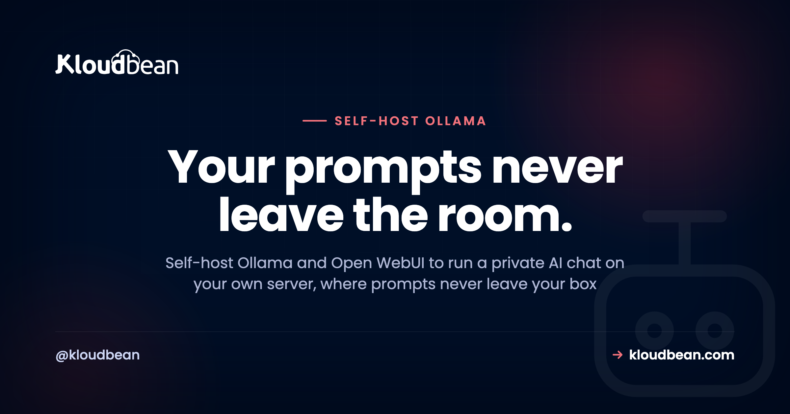

# Self-Host Ollama and Open WebUI: Your Own Private AI Chat

Every prompt your team pastes into a public AI tool is data leaving the building. Sometimes that's fine. Sometimes it's customer records, unreleased code, or a strategy doc, and it really isn't. That's the case for a private AI chat: self-host Ollama and Open WebUI, and the model runs on your server while the conversations stay there. This walks through what each piece does, the one thing that genuinely matters (hardware), and where people get it wrong.

> **Short version:** Ollama is the runtime that serves open AI models on your server. Open WebUI is the ChatGPT-style interface in front of it. Together they're a private AI chat where prompts and history never leave your box and there's no per-token bill. On Kloudbean, Open WebUI with the DeepSeek model deploys in one click, with the model runtime on a server you size. Self-host for privacy, control, and cost at volume, not to beat the biggest hosted models on a small box.

## The two pieces: Ollama and Open WebUI

People say "self-host Ollama" and "self-host Open WebUI" as if they're one thing. They're two, and knowing which does what saves a lot of confusion.

- **Ollama is the engine.** It downloads open models and serves them, exposing them on a local port. You talk to it with simple commands (`ollama pull`, `ollama run`) or over its local API. One job, done well: run models.
- **Open WebUI is the face.** It's the chat your team actually uses: conversations, history, multiple models, user accounts. It connects to the model runtime over a local port on the same server, so that link never touches the public internet.

On Kloudbean the one-click app is **Open WebUI with DeepSeek**, an open model, already wired together. The chat interface is the part you deploy in a click; the model runtime sits on the server behind it, serving the model locally. The point is the same either way: everything runs on your box.

<!-- SVG diagram in the HTML: two topologies side by side. Private (user, Open WebUI, Ollama runtime all on your server, nothing leaves) vs public API (prompt crossing the internet to a third-party AI cloud). -->

*Left: user, chat, and model all sit on one server you own, so prompts never leave. Right: a hosted API sends every prompt across the internet to someone else's cloud. That gap is the whole reason to self-host.*

## Why self-host Ollama and Open WebUI

Four reasons, and I'll rank them by how often they're the real motive:

- **Privacy.** Prompts, responses, and history stay on your server. Nothing is sent to an outside AI provider, because the model is running locally. For teams handling anything sensitive, this is the whole game.
- **No per-token bill.** A hosted API charges for every token in and out. A local model charges nothing per token. You pay for the server, then use it as hard as you like.
- **You pick the models.** Open models improve constantly. Swapping one for another is a download, not a contract. You're not tied to a single vendor's roadmap or pricing.
- **Control.** No rate limits you didn't set, no model deprecations sprung on you.

My honest position: privacy and control are the reasons that hold up. "It'll be cheaper" is true only at real volume, because the server (especially with a GPU) is not free. More on that below.

## The one decision that matters: hardware

Every other self-hosted tool in this category is light. This one isn't, and pretending otherwise sets you up to fail. Models need memory to load and compute to think. Size the server right and it feels great. Under-size it and it's painfully slow.

Here's the honest, jargon-free version. Treat these as rough guides, not promises, since exact needs vary by model and how it's quantized:

| What you run | Roughly needs | Feels like |
| --- | --- | --- |
| A small model (about 7B), CPU only | 8 GB RAM | Works, but replies come slowly |
| A small model with a GPU | GPU plus 8 to 16 GB | Fast, snappy replies |
| A mid model (about 13B) | 16 GB or more, GPU strongly preferred | Better answers, needs the muscle |
| A large model (30B and up) | Serious GPU memory | Best quality, real hardware cost |

The rule of thumb: CPU-only is fine for trying it out and for light, patient use. A GPU is what makes it feel instant. Pick your model to match your server, not the other way around, and size the memory (and GPU, where available) up front:

Start modest, run a small model, see how it feels, and scale up if you want it faster or smarter. Learning on a small box beats over-buying on day one, and moving to a bigger box later is a resize, not a rebuild.

<!-- ADD IMAGE: Terminal running ollama pull for a model, then the model responding to a first prompt. -->

## What a local model is good at, and where it isn't

Set expectations right and you'll be happy. Expect it to beat the biggest commercial models and you won't. A small-to-mid open model on your own server is genuinely good at the everyday stuff: drafting and rewriting text, summarizing documents, answering questions about your own material, helping with code, classifying or extracting data, powering internal chat where privacy is the point. That's most of what teams actually use AI for.

Where it lags is the frontier. The hardest reasoning and the broadest world knowledge still favor the largest hosted models, which run on hardware you would not put in one box. So the split many teams land on is simple: private model for anything sensitive or high-volume, and a hosted model only for the occasional heavy lift. If you're building AI features into a product rather than just chatting, the [deploy an AI-built app](https://www.kloudbean.com/blog/deploy-ai-built-app-to-production/) guide picks up there, and [self-hosting Langflow](https://www.kloudbean.com/blog/self-host-langflow/) is the natural next tool.

## The one-click path: Open WebUI with DeepSeek

You don't have to assemble this by hand. Add an application, choose Open WebUI with DeepSeek, and the platform stands up the chat interface with an open model behind it on your server, free SSL included.

From there you reach it at `chat.yourcompany.com` with a login, and you can pull additional open models through the runtime whenever you like.

<!-- ADD IMAGE: The Open WebUI chat running on your own domain, mid-conversation, with a model picker visible. -->

## Where people get this wrong

I've watched the same handful of mistakes turn a promising setup into "this is useless." None of them are hard to avoid once you know them:

- **Under-sizing the box.** Running a mid model on a tiny CPU server, then concluding local AI is slow. It's not slow. The server was too small. Match the model to the hardware.
- **Expecting frontier quality from a 7B model.** A small local model is a capable assistant, not the largest hosted model. Judge it on the everyday tasks, not on the hardest reasoning puzzle you can invent.
- **Leaving it open to the internet.** A chat UI with no login, reachable by anyone who finds the URL, is a data leak waiting to happen. Put it behind a domain with SSL and real accounts before you share the link.
- **Forgetting it's still a server.** Your conversations and settings live in storage on the box. It needs [backups](https://www.kloudbean.com/blog/server-backups-guide/) like anything else you'd miss.

## Give your team access, safely

Open WebUI has real user accounts, so you don't hand everyone the same door. Make yourself admin, add teammates, and put the whole thing behind your domain with SSL so logins are encrypted. For an extra layer, keep it on a private network so the model runtime isn't exposed at all; here's [what a VPC is](https://www.kloudbean.com/blog/what-is-a-vpc/) and why it helps. Now it's a shared internal tool with the data staying in-house. For a lot of companies, that's the entire reason to self-host this.

<!-- ADD IMAGE: Open WebUI admin panel showing user accounts and roles for a team. -->

## Is it actually cheaper?

Sometimes, and it's worth being straight about when. A per-token API is cheap when you barely use it and expensive under heavy, constant use. A server is flat: pay monthly, run it as hard as you like. So at real volume the local box wins, especially for high-throughput jobs like summarizing or classifying at scale. At light use, a hosted API is often cheaper than a capable server, and a GPU is a real expense. Don't self-host purely to save money on a few chats a week. It's the same flat-versus-metered logic behind [self-hosting n8n](https://www.kloudbean.com/blog/self-host-n8n/).

## What stays private, and what you own

The point of all this is privacy, so let's be precise. Prompts, responses, and chat history live on your server. Nothing goes to a third-party AI provider, because the model runs locally. That's genuinely different from calling a hosted API.

What you own is the setup: the server, the models you pull, and the updates. The platform keeps the box itself healthy, meaning the OS, networking, free SSL, and server-level backups, and lets you pick the memory (and GPU, where offered) the models need. You bring the models. You keep the conversations. If you're assembling a wider set of tools you run yourself, the [best self-hosted tools](https://www.kloudbean.com/blog/best-self-hosted-tools/) roundup and the [self-host Supabase](https://www.kloudbean.com/blog/self-host-supabase/) guide pair well with this one.

---

**A ChatGPT-style assistant that keeps its mouth shut.** Deploy Open WebUI with DeepSeek in one click on a memory-ready server, with the model runtime on a box you size and control. Start free at [kloudbean.com](https://www.kloudbean.com/); plans on [pricing](https://www.kloudbean.com/pricing/).

One-click Open WebUI · Your models, your server · No per-token bill · Private networking · Free SSL · Free trial

## FAQ

**Can I really run a private ChatGPT on my own server?**
Yes. Ollama runs open models locally and Open WebUI gives you a ChatGPT-style chat on top, both on your server, so prompts and history never leave it. It won't match the very largest commercial models unless you have serious hardware, but for most everyday use it's more than enough.

**Do I need a GPU to self-host Ollama?**
No, but it helps a lot. A small model runs on a CPU-only server with around 8 GB of RAM, it just answers more slowly. A GPU makes replies feel instant. Start on CPU to try it, and add a GPU if speed matters for how you'll actually use it.

**How much RAM do local models need?**
As a rough guide: about 8 GB for a small (7B) model, 16 GB or more for a mid-size one, and much more for large models. Match the model to a server you're comfortable paying for, and scale up only if you need better speed or answers.

**What's the difference between Ollama and Open WebUI?**
Ollama is the runtime that downloads and serves the models. Open WebUI is the chat interface your team uses, sitting in front of the runtime. You need both for a full private AI chat: one to run the model, one to talk to it comfortably.

**Is my data really private?**
Yes. The model runs locally, so nothing is sent to an outside AI provider, and conversations stay in Open WebUI's storage on your server. Keep it behind a login and SSL, and ideally on a private network, and it stays that way. This is the core reason teams self-host it.

**Is a local model as good as GPT-4 or GPT-5?**
Not at the frontier. The largest hosted models still lead on the hardest reasoning and broadest knowledge. But for drafting, summarizing, coding help, and internal chat, a good open model is plenty. The smart pattern is a local model for the bulk of the work and a hosted model only for the occasional heavy lift.

**How do I give my team access?**
Open WebUI has built-in user accounts. Add teammates, keep yourself as admin, and put it behind your domain with SSL so access is private and encrypted. That turns it from a single-user toy into a shared internal tool.

**Is self-hosting cheaper than a paid AI API?**
At real volume, usually yes, because the server is a flat cost while an API charges per token. At light or occasional use, a hosted API is often cheaper than paying for a capable server, and a GPU is a genuine expense. Privacy can justify the server on its own, but don't self-host purely to save money on a few chats a week.

**What is DeepSeek, and can I run other models?**
DeepSeek is an open model that ships with the one-click Open WebUI deploy, so you have a working chat immediately. You're not locked to it. Through the runtime you can pull other open models and switch between them, keeping whichever fit your hardware and answer well.

**Do I still need to back up an AI chat server?**
Yes. Your conversations, users, and settings live in storage on the server, so it needs backups like any other app you'd hate to lose. Server-level backups come with the platform; make sure they're on before the setup becomes something your team relies on.

---

*Kloudbean · Your prompts never leave the room.*
