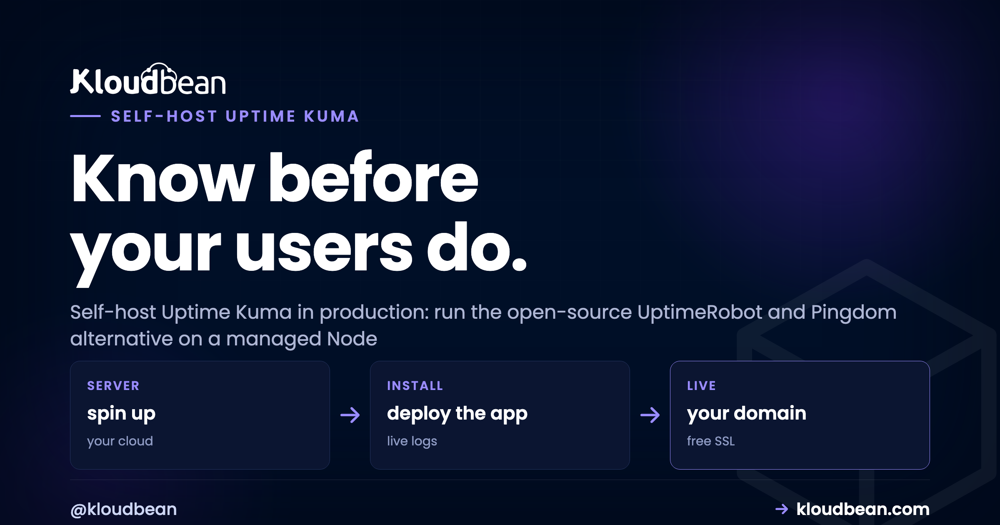
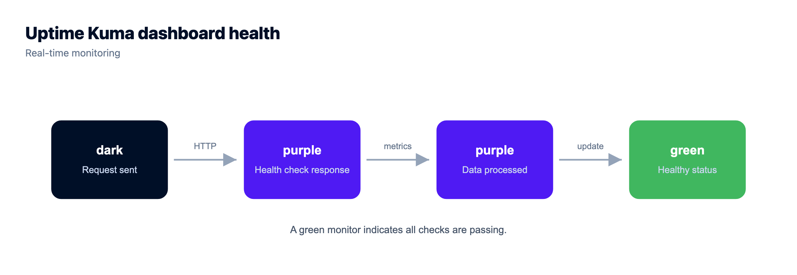
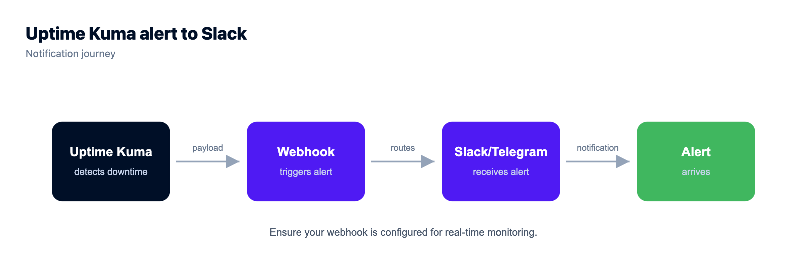

# How to Self-Host Uptime Kuma in Production

Uptime Kuma is an open-source, self-hosted uptime monitoring tool, and it's the one most people reach for once they're tired of paying per monitor for UptimeRobot or Pingdom. Point it at your sites, APIs, and ports, and it checks each on a schedule, draws a clean dashboard, and can publish a status page. This guide covers how to self-host Uptime Kuma in production, a very different job from running it on your laptop for an afternoon. The tool is easy; keeping it durable, reachable, and able to reach you when something breaks is the real work.

I'll say the uncomfortable part early. Most self-hosted uptime monitors are quietly broken in the one way that matters, and their owners don't find out until an outage proves it.

> **Short version:** Run the Uptime Kuma Node app on a managed Node server. Keep its data durable, either managed MariaDB or a persistent volume, never an ephemeral SQLite file that gets wiped on redeploy. Put free SSL in front of the dashboard. And the step almost everyone skips: host it on a different server, ideally a different provider or region, from the apps it watches. A monitor that dies alongside your app tells you nothing.

## Why self-host Uptime Kuma

Hosted monitors are fine until their pricing starts shaping your behavior. You stop adding checks because each one costs money. You skip the internal API because you're rationing monitors. That's backwards. Monitoring should watch everything that can break, and a per-monitor bill quietly pushes you to watch less. Self-hosting Uptime Kuma flips that:

- **Unlimited monitors, no per-monitor fee.** Watch every site, API, port, and cron target you have. The cost is the small server it runs on, not the count of things you watch.
- **Your monitoring data stays in-house.** Response times, incident history, every up and down event, all in a database you own. Nobody else holds your reliability record.
- **Status pages, public or private.** Publish a clean status page for customers, or keep an internal one for your team. You pick what's exposed.
- **Rich checks and 90+ alert channels built in.** HTTP(s), keyword, TCP port, ping, DNS, and database checks, wired to Slack, email, Telegram, Discord, or a webhook.

The honest tradeoff: you're running a small service now, so its database has to survive and its process has to stay up. A managed platform carries most of that weight (the server, the OS, SSL, backups), which leaves you a light amount of app-level care.

## The mistake that makes your monitor useless

This is the section I wish more Uptime Kuma tutorials led with. You can follow every install step perfectly and still end up with monitoring that's pure theatre. A monitor on the same box as the app it watches is theatre, not monitoring.

Picture it. You run your app on one server and, to save a few dollars, install Uptime Kuma right next to it. The server has a bad night: the disk fills, the kernel panics, the provider has a regional incident. Your app goes down, and so does the monitor that was supposed to tell you. No alert fires, because the thing that fires alerts is face-down in the same outage. You find out from a customer. That failure mode is incredibly common.

The fix is architectural, not a setting. The monitor has to be independent of what it watches. Same idea as a smoke detector: you don't wire it to the circuit most likely to catch fire.

Three more ways a self-hosted monitor quietly betrays you, all avoidable:

- **SQLite on ephemeral disk.** Uptime Kuma writes to a local SQLite file by default. If that file sits on disk that resets on every deploy or restart, your entire monitoring history vanishes on the next push. You keep the tool, you lose the memory.
- **No SSL on the dashboard.** Your admin login and your whole infrastructure map crossing the network in the clear. Free certificates make this a non-issue.
- **No notifications wired up.** A dashboard nobody is staring at is not an alerting system. If you haven't connected at least one channel and tested it, you've built a pretty page that watches your outage in silence.

<!-- SVG diagram in the HTML: Uptime Kuma on its own independent monitoring host, a dashed divider separating it from the app server, website, and API it reaches out to check (green HTTP / keyword / TCP arrows), and a purple "alerts when down" arrow to Slack, email, and Telegram. -->

*Uptime Kuma sits on its own host, apart from everything it watches. It reaches out to check your app server, website, and API on a schedule, and pushes an alert to Slack, email, or Telegram the moment one stops responding. If the monitored server dies, the monitor stays up to tell you.*

## What you're running when you self-host Uptime Kuma

Uptime Kuma is a single Node.js application with a Vue frontend. That's the whole thing, and it runs anywhere Node runs, which is why it lives comfortably on a managed Node server. By default it listens on port `3001`, and a managed platform puts a web layer and SSL in front so you reach it at your own domain over HTTPS.

The interesting decision is storage. Out of the box, Uptime Kuma keeps everything in a local **SQLite** file inside its data directory (`DATA_DIR`, holding `kuma.db`). SQLite is fine for a small single instance, as long as that directory lives on storage that persists. It also supports an external **MariaDB**, and for anything you depend on that's the sturdier choice: managed MariaDB is backed up for you, locks down to your app server's IP, and survives redeploys. Everything else (monitors, notifications, status pages, even the database choice) is set in the web UI after first launch. What you decide at deploy time is where data lives, the port, and that it's reachable over SSL.

## Self-hosted Uptime Kuma vs a hosted monitor

Uptime Kuma is a strong UptimeRobot alternative and a credible self-hosted Pingdom alternative, but a fair comparison names what the hosted services do well. Here's the honest side by side.

| | Self-hosted Uptime Kuma | Hosted monitor (UptimeRobot / Pingdom) |
| --- | --- | --- |
| Cost model | Flat cost of one small server | Per-monitor or per-check fees that climb with usage |
| Monitor limits | Unlimited, bounded only by your server | Capped by plan tier |
| Data ownership | Your database, your server | Held in the vendor's cloud |
| Status pages | Public or private, included | Included, often on higher tiers |
| Who runs it | You (a managed platform does the heavy lifting) | The vendor |
| External vantage point | Wherever you host it, so plan the location | Checks from many global locations you never manage |

The one real edge a hosted monitor has: it checks from many global locations you never have to run. That matters for a worldwide audience, and you can only approximate it by running Uptime Kuma in a couple of regions yourself. For most teams the ownership, unlimited monitors, and flat cost still win. Plenty of people run both, Uptime Kuma for the deep internal picture and a light external monitor for a distant second opinion.



## Deploy Uptime Kuma on a managed Node server

Here's the production path end to end. Five steps, and the order is deliberate: durable data first, then the app, then config, then the deploy, then SSL.

### 1. Launch managed MariaDB for durable history

Start with the database, the piece you least want to lose. Provision a managed MariaDB instance, create a database named `uptimekuma`, and note its internal host and credentials. Managed means it's provisioned, patched, and backed up for you, and you whitelist your monitor's IP so it reaches the database without a public port. Prefer SQLite? Skip this and make sure the data directory lands on a persistent volume instead.


Launch managed MariaDB first. Your monitoring history lives here, so it's the piece you back up and keep. Details in the [managed MariaDB hosting](https://www.kloudbean.com/blog/managed-mariadb-hosting/) guide.

### 2. Add the Uptime Kuma Node app

Add an application as a Node app and point it at the Uptime Kuma source (the official `louislam/uptime-kuma` repo, or your fork). Worth being straight: there's no magic one-click Uptime Kuma button. You're running the real Node app on a managed Node runtime, which lets you update on your own schedule. The [deploy a Node app](https://www.kloudbean.com/blog/deploy-node-app-to-managed-cloud/) guide has the long form.


### 3. Point it at the database with environment variables

To use managed MariaDB, set Uptime Kuma's database environment variables in the console, not in a file you might commit. Skip these and Uptime Kuma falls back to its default SQLite file.


```bash
# Point Uptime Kuma at managed MariaDB instead of the default SQLite file.
# Set these as environment variables in the console (never in a committed file).
UPTIME_KUMA_DB_TYPE=mariadb
UPTIME_KUMA_DB_HOSTNAME=10.0.0.7        # internal address of managed MariaDB
UPTIME_KUMA_DB_PORT=3306
UPTIME_KUMA_DB_NAME=uptimekuma
UPTIME_KUMA_DB_USERNAME=kuma
UPTIME_KUMA_DB_PASSWORD=a-long-random-password
```

Prefer to keep it simple with SQLite? Leave the database variables unset and make sure the data directory is durable. This is the single most important line in the whole deploy:

```bash
# The default: no DB vars set, so Uptime Kuma writes a local SQLite file.
DATA_DIR=./data/       # holds kuma.db; this path MUST be a persistent volume
UPTIME_KUMA_PORT=3001  # Uptime Kuma listens on 3001 by default
```

Either way, the data has to outlive a redeploy. Managed MariaDB gives you that plus backups for free; a persistent volume gives you that only if you configure and back it up yourself; an ephemeral disk gives you a monitor with amnesia. Our [environment variables done right](https://www.kloudbean.com/blog/environment-variables-done-right/) guide covers keeping config out of code.

### 4. Build and deploy from GitHub

Connect the repository and let the platform build and start the app, with the build logs streaming in the console. Uptime Kuma installs its dependencies, builds the frontend, then starts the server process, which the platform keeps alive for you.

```bash
# Install, build the frontend, then start the server.
npm ci
npm run build
node server/server.js   # starts Uptime Kuma on port 3001
```


Connect GitHub and every push rebuilds and redeploys Uptime Kuma. The live build logs show it installing, building the frontend, and starting the server on port 3001.

### 5. Add your domain and free SSL

Point a subdomain like `status.yourdomain.com` at the app, issue a free SSL certificate, and the dashboard is now served over HTTPS. On the first visit Uptime Kuma runs a short setup wizard where you create the admin account. Choose a strong password right there, because this dashboard maps out your whole infrastructure.


## Set up your monitors, and the keyword trick

Monitors are created in the web UI, not a config file, so this part is quick. For each thing you care about, add a monitor, pick a type, set an interval, save. Uptime Kuma allows intervals down to about 20 seconds, though 60 is a sensible default that keeps noise and load reasonable. The types you'll use most:

- **HTTP(s)** for a site or API. Up if the request returns a healthy status code.
- **HTTP(s) keyword** for the check that actually catches trouble. It fetches the page and confirms a specific word is present, which catches a page returning a 200 while rendering an error, the classic "up but broken" state a plain status check sails right past.
- **TCP Port** for a database or service that isn't HTTP, like checking that MariaDB answers on 3306.
- **Ping** for a basic "is the host reachable at all" signal.

```text
# Monitors live in the web UI, not a config file. A typical set for one app:
#  Type             Target                                     Interval
#  HTTP(s)          https://app.example.com/health             60s
#  HTTP(s) keyword  https://app.example.com/   word: Sign in   60s
#  TCP Port         db.internal : 3306                         60s
#  Ping             203.0.113.10                               60s
```

My advice: don't just monitor the homepage. Monitor a real health endpoint that touches your database, and put a keyword monitor on a page that only renders correctly when the app is genuinely working. That pairing catches the failures a naive ping misses.


## Notifications: wire one before you need it

A monitor that notices an outage and tells no one is decoration. Uptime Kuma ships with over 90 notification integrations, including Slack, email (SMTP), Telegram, Discord, and webhooks. Wire up at least one, attach it to your monitors, then test it on purpose. Trigger a failure and confirm the message lands where your team will see it at an awkward hour. An alert you've never seen arrive is one you can't trust.

A couple of channels beats one, since people miss email. A Slack or Telegram ping is harder to sleep through, and a webhook can escalate to an on-call tool.



## Security: lock the dashboard, protect the data

Self-hosting means the security defaults are yours to set. None of this is heavy, and skipping it is how a quiet monitoring box turns into a liability.

- **SSL in front of everything.** Serve the dashboard over HTTPS so your admin login and infrastructure map aren't traveling in the clear. Free certificates remove the excuse.
- **A strong admin login.** Set a real password in the first-run wizard and enable two-factor auth, which Uptime Kuma supports. You create the account, so don't hand it a weak password.
- **Reachable, not wide open.** The dashboard reveals a lot about your systems. If it doesn't need to face the public internet, put it behind an IP allowlist or a basic auth gate. A public status page is fine to expose; the admin dashboard is not.
- **Database credentials in env vars.** The MariaDB connection details belong in environment variables, never in a config file that could land in Git.
- **Back up the monitoring database.** Managed MariaDB is backed up for you; if you run SQLite, back up that data directory on a schedule. Your incident history is the one thing you can't recreate. The [server backups guide](https://www.kloudbean.com/blog/server-backups-guide/) has sane defaults.

The platform helps at the baseline too. A Shorewall firewall and Fail2ban come switched on, and SSL is free, so a chunk of the hardening is done before you touch anything.

## Host it somewhere independent (yes, really)

Back to the point that matters most, the one people rationalize away to save a few dollars. Put Uptime Kuma on a small, separate server, ideally a different region or provider from the apps it watches. It's a light app, so the box can be tiny and cheap.

The reasoning is boring and correct. If your monitor shares fate with your app, it can't warn you about the failures that take them both down together, and those hurt most. A small box in another region that only runs Uptime Kuma is some of the cheapest reliability insurance going. You can even watch that server's own health from the console, so the watcher doesn't go dark unnoticed.


Run Uptime Kuma on its own small server and keep an eye on that server's health too. The watcher needs watching, lightly.

If this is your first self-hosted tool, you're in good company. The [best self-hosted tools](https://www.kloudbean.com/blog/best-self-hosted-tools/) roundup is worth a browse, [self-hosting Supabase](https://www.kloudbean.com/blog/self-host-supabase/) is a natural next step for a backend you own, and for the broader theory of what to watch and how to alert without crying wolf, read [uptime monitoring](https://www.kloudbean.com/blog/uptime-monitoring/).

<!-- cta:start -->
**Take it off localhost for good.**

Move the whole thing onto a managed server you own: always-on processes, a managed database for real data, object storage for uploads, and Git deploys with live build logs.

- Managed databases
- Always-on processes
- Object storage
- Automatic backups
- Free SSL
- Git deploy
- Free migration

[Start free](https://console.kloudbean.com/register) · [See plans](https://www.kloudbean.com/pricing/)
<!-- cta:end -->

## FAQ

**Is Uptime Kuma free?**
Yes. It's open source and free to run, so you only pay for the small server and, optionally, a managed database for durable history. There are no per-monitor fees, which is why people move to it from paid monitors.

**What database does Uptime Kuma use?**
By default it stores everything in a local SQLite file in its data directory. It also supports an external MariaDB, which is sturdier for production because it backs up cleanly and survives redeploys. Either way, the data must live on storage that persists.

**Should I run Uptime Kuma on the same server as my app?**
No, and this is the biggest self-hosted monitoring mistake. If the monitor shares a server with the app it watches, one outage takes down both and no alert fires. Run it on a separate server, ideally a different region or provider from what it watches.

**Is Uptime Kuma a good UptimeRobot alternative?**
For most teams, yes. You get unlimited monitors, status pages, and 90+ notification channels with no per-monitor pricing, and your data stays in-house. Hosted monitors like UptimeRobot and Pingdom do check from many global locations more easily, so some people run both.

**How do I get alerts from Uptime Kuma?**
Add a notification in the settings and attach it to your monitors. It supports Slack, email, Telegram, Discord, webhooks, and dozens more. Wire up at least one, then trigger a test failure to confirm the alert actually reaches you.

**Can Uptime Kuma make a status page?**
Yes. It can publish status pages, public for customers or internal for your team, and you choose which monitors appear on each. So you can show a clean customer-facing status while keeping sensitive internal checks private.

**How do I connect Uptime Kuma to MariaDB?**
Set the database environment variables at deploy time: UPTIME_KUMA_DB_TYPE=mariadb plus the hostname, port, database name, username, and password. Point the hostname at your managed MariaDB internal address. Leave them unset and it uses the default SQLite file.

**Do I need Docker to self-host Uptime Kuma?**
No. Docker is one common way to run it, but Uptime Kuma is a plain Node.js app, so you can run it directly on a managed Node runtime. That keeps updates on your schedule while the platform handles the server, SSL, and backups.

---

*Kloudbean · Watch everything, own the data.*
