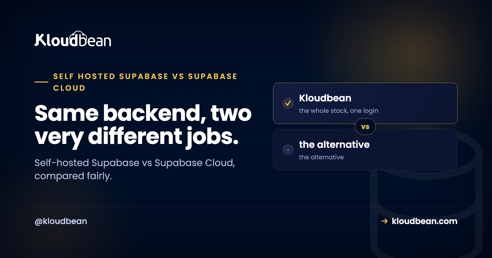

# Self-Hosted Supabase vs Supabase Cloud: An Honest Decision Guide

By Kloudbean Engineering · Same backend, two very different jobs.

Supabase is one of the nicest ways to get a backend going. A Postgres database with authentication, file storage, realtime, and edge functions, all behind one tidy API, and you're shipping the same afternoon. But there are two ways to run it, and people mix them up. You can use Supabase Cloud, their fully managed hosted service, or you can self-host the open-source stack yourself. This is the honest comparison of self-hosted Supabase vs Supabase Cloud, with no thumb on the scale, so you can pick the one that actually fits what you're building.

> **The short answer.** Supabase Cloud wins when you want the quickest start, zero operations, and the newest features the day they ship. Self-hosting wins when you need data residency or compliance control, want to avoid per-project pricing climbing at steady scale, want full control, or already run your own infrastructure. It's the same open-source software either way. The real question is who runs it, and where your data lives.

## What Supabase actually is, and what you're choosing between

Here's the detail that makes this whole decision simpler than it looks: Supabase is open source. It isn't a single closed product. It's a set of services stacked around one Postgres database, and all of them are code you can read and run. PostgreSQL at the core, Auth for logins and tokens, PostgREST turning your tables into an API, Realtime for websocket updates, Storage for files, and Studio for the dashboard.

Supabase Cloud and self-hosted Supabase run that same software. So the choice isn't "which one has more features," because the feature set is largely the same. The choice is about who operates the stack and where the data physically sits. That's it. Once you frame it that way, the loud "self-host everything" and "just use the cloud" camps both start to sound a little dogmatic.

Two things this guide is deliberately not. It's not a how-to; the mechanics of standing the stack up, setting the keys, and migrating a project live in the [self-host Supabase](https://www.kloudbean.com/blog/self-host-supabase/) walkthrough. And it's not about swapping Supabase for a plain database of your own; the two paths for that are in the [Supabase alternative](https://www.kloudbean.com/blog/supabase-alternative/) guide. This page is only the Cloud-versus-self-host call.

## Self-hosted Supabase vs Supabase Cloud: the honest tradeoff

The tradeoff is convenience against control. Supabase Cloud hands you the whole backend and quietly does the operations in the background. Self-hosting hands you the keys, the server, and the responsibilities that come with both. Neither is the "smart" choice in the abstract. They fit different situations.

| | Supabase Cloud | Self-hosted Supabase |
| --- | --- | --- |
| Time to first deploy | Click a project, live in minutes | One-click install or docker-compose, then set your keys |
| Who runs servers, upgrades, backups | Supabase | You, or your managed platform |
| Newest features | Land here first | Arrive when you update your stack |
| Where your data lives | Their available regions | Any region you can run a server in |
| Cost shape | Scales with rows, storage, users, bandwidth | Flat server cost, whatever your usage |
| Control over the stack | What the platform exposes | Full, it's your box |
| Best for | Prototypes, small teams, hands-off | Residency, cost control at scale, full ownership |

Read the last row twice. It's doing most of the work. If you see yourself on the left, Supabase Cloud is probably right for you, and reaching for a self-hosted setup would just add chores. If you see yourself on the right, the ownership is worth the operational weight. Most people know which row is theirs the moment they read it.

<figure>
  <svg viewBox="0 0 820 340" role="img" aria-labelledby="sb-t sb-d" xmlns="http://www.w3.org/2000/svg" style="width:100%;height:auto;background:#f6f7fb;border:1px solid #e6e9f2;border-radius:16px">
    <title id="sb-t">Supabase Cloud versus self-hosted Supabase, who operates what</title>
    <desc id="sb-d">Both run the same open-source Supabase stack of Postgres, auth, auto APIs, realtime, and storage. On Supabase Cloud the provider runs the servers, upgrades, and backups. When you self-host, you or your managed platform run the server, the stack, and the backups, and your data sits in the region you choose.</desc>
    <text x="30" y="38" fill="#000f27" font-family="Poppins,sans-serif" font-size="16" font-weight="700">Same software. The difference is who runs it.</text>
    <text x="30" y="74" fill="#0a7d33" font-family="Poppins,sans-serif" font-size="13" font-weight="700">Supabase Cloud: they run it</text>
    <rect x="30" y="86" width="360" height="214" rx="10" fill="#ffffff" stroke="#40b75f"/>
    <rect x="52" y="108" width="316" height="40" rx="6" fill="#4F1AF3"/><text x="210" y="133" text-anchor="middle" fill="#ffffff" font-family="Poppins,sans-serif" font-size="12">Postgres + Auth + APIs + Realtime + Storage</text>
    <rect x="52" y="160" width="316" height="34" rx="6" fill="#40b75f"/><text x="210" y="182" text-anchor="middle" fill="#ffffff" font-family="Poppins,sans-serif" font-size="12">servers, upgrades, backups handled for you</text>
    <text x="210" y="230" text-anchor="middle" fill="#000f27" font-family="Poppins,sans-serif" font-size="12">You call the API. You skip the ops.</text>
    <text x="210" y="256" text-anchor="middle" fill="#5b6472" font-family="Poppins,sans-serif" font-size="12">Data lives in their available regions.</text>
    <text x="210" y="282" text-anchor="middle" fill="#5b6472" font-family="Poppins,sans-serif" font-size="12">Newest features land here first.</text>
    <text x="430" y="74" fill="#000f27" font-family="Poppins,sans-serif" font-size="13" font-weight="700">Self-hosted: you run it</text>
    <rect x="430" y="86" width="360" height="214" rx="10" fill="#ffffff" stroke="#c9cede"/>
    <rect x="452" y="108" width="316" height="40" rx="6" fill="#000f27"/><text x="610" y="133" text-anchor="middle" fill="#ffffff" font-family="Poppins,sans-serif" font-size="12">Postgres + Auth + APIs + Realtime + Storage</text>
    <rect x="452" y="160" width="150" height="34" rx="6" fill="#000f27"/><text x="527" y="182" text-anchor="middle" fill="#ffffff" font-family="JetBrains Mono,monospace" font-size="11">your server</text>
    <rect x="618" y="160" width="150" height="34" rx="6" fill="#000f27"/><text x="693" y="182" text-anchor="middle" fill="#ffffff" font-family="JetBrains Mono,monospace" font-size="11">your backups</text>
    <text x="610" y="230" text-anchor="middle" fill="#000f27" font-family="Poppins,sans-serif" font-size="12">You run the box, the stack, the upgrades.</text>
    <text x="610" y="256" text-anchor="middle" fill="#5b6472" font-family="Poppins,sans-serif" font-size="12">Your data, in the region you pick.</text>
    <text x="610" y="282" text-anchor="middle" fill="#5b6472" font-family="Poppins,sans-serif" font-size="12">Flat server cost, full control.</text>
  </svg>
  <figcaption>The software is identical. What changes is who operates it, where your data sits, and how the bill is shaped.</figcaption>
</figure>

## What Supabase Cloud does better

Let me be fair here, because Supabase Cloud is genuinely good and pretending otherwise would waste your time. Three things it does better than a self-hosted setup, plainly.

It gets you started quickest. You click a project and you have a database, auth, storage, and an API in a minute, with nothing to install. For a prototype or an early product, that head start is real and it matters.

It removes operations entirely. Supabase runs the servers, patches the engines, handles the platform's backups, and scales the underlying infrastructure. You never think about a full disk or a major version upgrade. When it's just you and a deadline, that's a lot of weight you don't carry.

And it gets new features first. Supabase ships to their hosted platform before those changes flow into the self-hosted release. If you want the newest capabilities the day they land, Cloud is where they land. So if speed, zero ops, and being on the latest version are what you value most, Cloud is a strong, honest answer.

## What self-hosting gives you

The flip side is just as real. Self-hosting isn't about the software being better. It's the same software. What you gain is control over the things a hosted plan decides for you.

You choose where the data lives. Self-hosting lets you put the server in a specific country and keep every user record there, which is the whole game for data residency and many compliance requirements. You control the stack. It's your box, your config, your versions, your tuning, on infrastructure you can see and reason about. Your cost shape changes. A flat server doesn't care whether you have a hundred users or a hundred thousand, so as steady usage grows, a fixed server price tends to behave more like a flat line than a usage meter that keeps nudging upward. And there's no lock-in worth the name, because it's plain Postgres plus open-source services. You can dump it, move it, or inspect it whenever you want.

If your product leans on Postgres extensions too, that control extends there. Teams building AI features on [pgvector for embeddings and semantic search](https://www.kloudbean.com/blog/pgvector-for-ai-apps/) sometimes self-host precisely so they own the database the vectors live in.

## The real cost of self-hosting, said out loud

Now the part the "self-host everything" crowd tends to skip. Self-hosting Supabase is not a free lunch, and going in with clear eyes saves you a bad month later.

Supabase is several services, not one app. When you self-host, you run Postgres, plus Auth, the API layer, Realtime, and Storage, together. That means you own the upgrades, the monitoring, and the recovery when something breaks at an odd hour. Above all, you own the database backups. Almost everyone who loses data had backups configured; what they didn't have was a backup they'd ever restored. That failure mode is the single most expensive lesson in self-managing a database, and it's worth reading the broader version in [managed database vs self-managed](https://www.kloudbean.com/blog/managed-database-vs-self-managed/) before you commit.

A managed platform softens this a lot. If the server underneath is managed, the OS, patching, free SSL, and server-level backups are handled, and the Supabase stack can go up in one click instead of hand-assembled. But it doesn't erase the fact that the Supabase services and your data are now yours to look after. So don't self-host by accident. Do it because you want what it gives you, not because a prototype tempted you into running production data on a box nobody's watching.

## Choose Supabase Cloud if...

Be honest with yourself against this list. If most of it sounds like you, stay on Cloud and don't feel like you're missing out.

- You want the shortest path to a running backend and would rather spend your energy on the product.
- You don't want to operate servers, or babysit upgrades and backups.
- You want the newest Supabase features as soon as they're released.
- You're comfortable with usage-based pricing and with where their regions place your data.
- You're prototyping, or your usage sits comfortably inside a plan and the bill isn't stinging.

There's no prize for self-hosting when hosted fits. For a lot of apps, this is the right and grown-up answer.

## Consider self-hosting if...

And if most of this list is you, the operational weight is probably worth carrying.

- A rule, a client, or a regulator says your users' data must stay in a specific country.
- You want predictable, flat cost as steady usage grows, rather than a bill that tracks your traffic.
- You want full control over the stack, the versions, and the box it all runs on.
- You already run your own infrastructure, so this is one more service on a setup you operate anyway.
- Lock-in makes you uneasy and you want plain Postgres you can move any day.

Notice none of these is "because self-hosting is more hardcore." They're concrete needs. If you have one, self-hosting earns its keep. If you don't, it's cost without a matching benefit.

## If you self-host, where does it run?

If you land on the self-host path, you still need somewhere to run it, and you don't have to assemble the stack by hand. Supabase is a one-click app on Kloudbean, deployed onto a managed server. The OS, free SSL, patching, and server backups come with the box, while the Supabase project and its data stay yours, on the cloud and region you pick from seven providers. That's the honest boundary of managed: the platform runs the server, the stack, SSL, and backups; you own your app and your data.

If, when you're honest, you mostly used Supabase for its database, the leaner route is a plain managed PostgreSQL instead of the whole bundle. Kloudbean runs that as its own product, backed up and locked to your app server's IP. The hands-on version is in [add a managed database to your app](https://www.kloudbean.com/blog/add-managed-database-to-your-app/), and there's a dedicated [managed PostgreSQL hosting](https://www.kloudbean.com/blog/managed-postgresql-hosting/) page. None of this makes Kloudbean a replacement for Supabase Cloud. It's simply one place to run Supabase if you've decided self-hosting is your path.

<!-- cta:start -->
**Bring the app. Keep the deploy flow.**

Migration assistance is free and there is a free trial to prove the setup first. You keep Git-based deploys, get managed databases beside the app, and pay a flat monthly price on the cloud you choose.

- Free migration assistance
- Free trial
- Seven cloud providers
- Flat monthly price
- Managed databases
- Git deploy

[Start free](https://console.kloudbean.com/register) · [See plans](https://www.kloudbean.com/pricing/)
<!-- cta:end -->

## FAQ

**Self-hosted Supabase vs Supabase Cloud: which should I choose?**
Choose Supabase Cloud if you want the quickest start, zero operations, and the newest features first, and you're fine with usage-based pricing and their regions. Choose self-hosting if you need data residency, want flat cost as usage grows, want full control, or already run your own infrastructure. It's the same open-source software either way, so the decision is really about who operates it and where your data lives.

**Is self-hosting Supabase worth it?**
It's worth it when you have a concrete reason: data residency or compliance, cost predictability at steady scale, full control of the stack, or an existing infrastructure you already operate. It isn't worth it just to feel more in control. If you're prototyping or a hosted plan fits comfortably, self-hosting mostly adds chores without a matching benefit.

**Is self-hosted Supabase cheaper than Supabase Cloud?**
Past a certain size it often is, because a self-hosted server is a flat cost while hosted pricing scales with rows, storage, users, and bandwidth. For a small app the hosted option is usually the better deal once you count your own time. Model your realistic busy month rather than your quiet one, and compare current pricing yourself instead of trusting a rule of thumb.

**Does self-hosted Supabase have the same features as Supabase Cloud?**
Largely yes, because it's the same open-source stack: Postgres, auth, storage, realtime, the auto-generated API, and Studio. The main practical difference is timing. New features tend to land on Supabase Cloud first and reach the self-hosted release later, so self-hosting can trail the hosted platform by a version or two.

**Is self-hosting Supabase hard?**
It's the most involved tool in this category because it's several services running together, not one app. You're not building it from scratch, though. There's an official docker-compose stack, and a one-click deploy stands the whole thing up for you. The real work is setting your secrets correctly and keeping the database backed up.

**Can I move from Supabase Cloud to self-hosted later?**
Yes, and it's a normal path. Supabase is Postgres underneath, so moving a Cloud project to your own instance is an ordinary database export and import, then you copy your storage files and point your app at the new URL. Do it while the Cloud project is still live and verify before you switch over, so starting on Cloud never locks you in.

**Does Supabase Cloud get new features before self-hosted?**
Generally yes. Supabase ships to its hosted platform first, and those changes flow into the self-hosted release afterward. If being on the newest version the day it drops matters to you, that's a genuine point in Cloud's favour. If you're happy updating your stack on your own schedule, the lag rarely matters.

**Do I need to self-host Supabase for data residency?**
Not necessarily, since Supabase Cloud offers a choice of regions. You self-host when you need to keep data in a specific country that a hosted region doesn't cover, or when a compliance rule requires the server to sit on infrastructure you control. If a hosted region already meets your requirement, Cloud can be simpler.

**Where can I self-host Supabase?**
Anywhere you can run a server, from a raw VPS you configure yourself to a managed platform that stands the stack up for you. On Kloudbean, Supabase is a one-click app on a managed server, so the OS, SSL, patching, and server backups are handled while your project and data stay yours. If you mostly need the database, a managed PostgreSQL is the leaner option.

---

*Kloudbean Engineering · Pick the model that fits the product, not the hype.*
