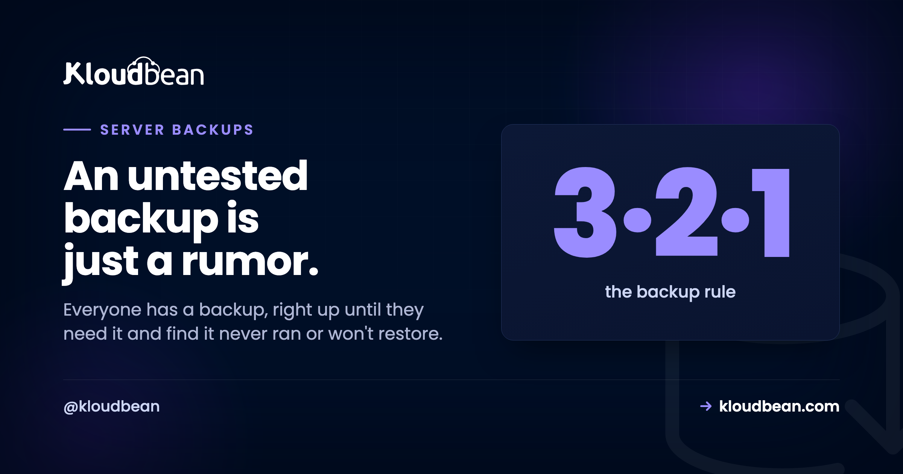

# Server Backups That Actually Restore: A Practical Guide

Everyone has backups. Right up until the day they reach for one and find it never ran, or it ran fine but won't restore, or it was quietly sitting on the same disk that just died. That last one really stings.

Server backups are one of those jobs that feel finished the moment you flip a switch, which is exactly why so many of them silently aren't. This guide is about the gap between having a backup and having one you'd bet the business on. We'll cover what to protect, where copies belong, the old 3-2-1 rule in plain English, how long to keep things, and the one habit that turns a backup from a hope into a safeguard.

> **Short version:** Back up the three things you can't regenerate: your database, user uploads, and config. Keep them off the server they protect, in object storage. Automate the schedule, keep a rolling set of versions, and here's the part almost everyone skips: restore one on purpose before you ever need to. A backup you've never restored is a guess.

## Why the backups people already have still fail them

Nearly every backup horror story is one of a few predictable failures. Not exotic ones. The boring, avoidable kind.

- **The restore was never tested.** The job runs, a file appears, everyone relaxes. Then the day comes, the file is truncated or the dump is from a schema three migrations ago, and you find out live. The most common thing we see isn't a missing backup. It's a backup nobody has ever restored, quietly failing for weeks.
- **The backup lived on the same box.** A copy on the same disk, or even the same server, shares fate with the thing it's protecting. One dead volume, one compromised server, one `rm -rf` in the wrong directory, and both the original and the "backup" are gone together.
- **Nobody thought about versions.** If you only keep the latest copy, a problem that hid for a few days (a bad migration, creeping corruption, ransomware) gets faithfully backed up too. Now your newest backup holds the broken state and you've no clean point to fall back to.
- **It stopped running and no one noticed.** Cron jobs die. Credentials expire. Disks fill. A backup with no success alert can be broken for months in total silence.

None of these are hard to prevent. They just need a plan that treats "the backup exists" as step one, not the finish line.

## The one question that tells you if you're actually covered

Skip the checklists for a second and ask this: **could a single bad day destroy every copy of my data at once?** A failed disk, a hacked server, one wrong command. If the honest answer is yes, you don't have backups yet. You have copies sitting in the blast radius. Everything below is really just ways of answering "no" to that question with confidence. The 3-2-1 rule is the fastest way there.

## The 3-2-1 rule, without the jargon

It's an old rule and it has aged well: **3 copies** of your data, on **2 different kinds of media**, with **1 copy kept off-site.** That's it. Here's what each part means for a server.

<!-- ADD IMAGE: the 3-2-1 rule diagram. Three brand-colored panels: a big "3" (three stacked copy cards: live data, backup, another backup), a big "2" (a server-disk cylinder next to an object-storage bucket), and a green-highlighted "1" (a location pin, labelled the one people skip). -->
*Diagram: the 3-2-1 rule on one screen. Three copies of the data, on two kinds of media (server disk vs object storage), with one copy kept off-site (the part most people drop).*

**Three copies** means the live data plus two backups, so losing any one still leaves you covered. **Two media** means don't keep both backups on the same kind of storage that can fail the same way. Your server's disk is one; durable object storage is a good second. **One off-site** is the part people quietly drop, and it's the one that saves you when a whole server or region has a bad day. You don't have to be religious about the exact numbers. Treat 3-2-1 as a sanity check: if any single event could wipe all your copies, you're not there yet.

## What to actually back up (and what you can skip)

Not everything on a server is equally precious. Backing up the wrong things wastes storage and, worse, distracts you from the data that genuinely can't be replaced. Three things need a real plan.

- **The database.** Almost always the crown jewels. It's your users, orders, posts, the stuff that changes every minute and can't be recreated from anywhere else. If you back up one thing, back up this.
- **Uploads and user files.** Avatars, PDFs, invoices, anything people put into the app. These usually live outside the database, and they're just as irreplaceable. If your app writes uploads to local disk, they're one redeploy away from gone, which is its own reason to move them to [object storage](https://www.kloudbean.com/blog/s3-compatible-object-storage/).
- **Configuration.** Environment variables, web server config, cron jobs, the small settings that make the app actually run. Losing these turns a restore into an archaeology project. Keep a copy of your env somewhere safe (never in the repo), and see [environment variables done right](https://www.kloudbean.com/blog/environment-variables-done-right/) for how to handle them without leaking secrets.

What you can usually skip: your application code (it lives in Git already), and anything the server can rebuild on its own, like installed packages or `node_modules`. Write your short list down. In a real recovery you'll want to tick items off, not trust your memory at 3am.

## Where backups belong: anywhere but the server they protect

This is the rule that turns a copy into a backup. **The backup has to live somewhere other than the machine it's protecting.** A backup on the same disk dies with the disk. A backup on the same server dies with the server. If you are rolling your own with tar, [the archive reference](https://www.kloudbean.com/blog/extract-zip-and-tar-gz-on-linux/) covers the silent mistake where a file named .tar.gz was never actually compressed. So send them off-box, to object storage: a bucket that's separate, durable, and cheap enough that keeping several versions doesn't hurt.


Object storage fits backups almost perfectly. It's off the box, so a total server loss doesn't touch it. It's durable, replicated across hardware rather than trusting one fragile drive. And it's inexpensive at the sizes backups reach, so keeping history is affordable. On Kloudbean the buckets are S3-compatible and sit in the same dashboard as your servers and databases, so shipping a nightly dump to a bucket is a short script, not a separate vendor contract. If you remember one line from this guide, make it this: a backup that shares a disk with the original is just a second copy of the same risk.

## How often to run server backups, and how many to keep

Frequency comes down to a single honest question: **how much data can you afford to lose?** If an hour of lost orders would hurt, you need frequent or continuous backups. If it's a slow-moving brochure site, nightly is plenty. There's a fancy term for this (your recovery point), but you don't need the jargon, just the answer to "if we restore, how far back is acceptable?" Match the schedule to that. More frequent means less lost data and more storage. Pick the point that fits what the data is worth.

Retention is the other half, and it's where the "keep versions" lesson pays off. Keep a rolling set rather than a single latest file: frequent recent backups, thinning out as they age into a few older ones. That way a problem you didn't catch for days still has a clean point behind it to recover from. I won't hand you a magic number of days, because the right window depends on your data and your rules. The shape is what matters: enough recent history to undo a mistake you spotted late, without hoarding every backup forever.

## Test a restore before you need one

Here's the founder-level opinion, and I'll say it plainly: **an untested backup is a rumor, not a backup.** It's the single most skipped step and the single most important one. Backups fail silently in a dozen ways, and the only way to know yours works is to use it on purpose, before the day you're forced to.

So run a restore drill. Pull a recent backup, restore it into a scratch database (not production), and check that the data comes back whole. For a Postgres or MySQL dump that's a couple of commands:

```
# PostgreSQL: restore into a throwaway database and sanity-check it
createdb restore_test
psql restore_test < backup.sql
psql restore_test -c "SELECT count(*) FROM users;"   # does that number look right?

# MySQL / MariaDB: same idea
mysql -e "CREATE DATABASE restore_test;"
mysql restore_test < backup.sql
mysql restore_test -e "SELECT COUNT(*) FROM users;"
```

Then do the part people forget: point a copy of the app at that restored database and confirm it actually boots and behaves. A dump that imports without error but breaks the app on a missing table hasn't really passed. Two things worth noticing while you're in there. First, *time it*. How long a full restore takes is your real recovery time, and "longer than I thought" is the usual verdict. Second, do this soon after you set backups up, and again every so often, because a restore that worked in March can quietly rot by September. If you're restoring onto fresh infrastructure, the same muscle covers a [zero-downtime migration](https://www.kloudbean.com/blog/how-to-migrate-hosting-zero-downtime/) too.

<!-- ADD IMAGE: a terminal running the restore drill, psql importing a dump into restore_test then a row count coming back with a believable number -->

## How this looks on a managed host

The point of a managed platform is that most of this runs without you babysitting it. On Kloudbean, servers get automatic backups, and every managed database (Postgres, MySQL, MariaDB, Redis, Elasticsearch, MongoDB) is backed up on its own, so your data layer isn't riding on you remembering. Your off-server copies go to S3-compatible object storage in the same console, which handles the "different media, off the box" half of 3-2-1 without a second provider. Servers, databases, and buckets all live under one login, so there's no stitching three dashboards together to answer "is this protected?" And if you're moving in from somewhere else, migration help is free, restored and verified for you.

Here's the honest division, because "managed" isn't magic. The platform handles the automated server and database backups and keeps them off-box. It's a Linux server underneath, and your data stays yours to export whenever you like. What stays your job is the thinking: knowing what's on your short list, deciding how far back you need to go, and, non-negotiably, running that restore drill so you know the path works. Do those, lean on the automation for the rest, and a disaster shrinks to a minor inconvenience. Setting up the database side from scratch? The [managed database guide](https://www.kloudbean.com/blog/add-managed-database-to-your-app/) and the [managed PostgreSQL](https://www.kloudbean.com/blog/managed-postgresql-hosting/) walkthrough pick up there, and keeping the data on a [private network](https://www.kloudbean.com/blog/what-is-a-vpc/) keeps it off the open internet in the first place.

**Backups you don't have to think about, and a restore you've proven.** Run on a managed host with automatic backups, S3-compatible object storage for off-server copies, and managed databases backed up on their own. Start free at [kloudbean.com](https://www.kloudbean.com/), plans on [pricing](https://www.kloudbean.com/pricing/). Then go test a restore.

One-line feature recap: Automatic backups · Off-server object storage · Managed database backups · Private networking · Free migration · Free trial

## FAQ

**How do I back up a server?**
Back up the three things you can't regenerate: the database, uploaded files, and configuration (your code already lives in Git). Send those copies off the server into durable object storage, run them on an automatic schedule, keep a rolling set of versions, and test a restore so you know they actually work. That sequence is the whole job.

**Why should backups be stored off the server?**
Because a backup on the same disk or server shares fate with the thing it protects. A disk failure, a compromised server, or an accidental wipe takes the original and the backup together. Storing copies in separate object storage means they survive a total loss of the server, which is the entire reason to have them.

**What is the 3-2-1 backup rule?**
Keep 3 copies of your data, on 2 different kinds of media, with 1 copy off-site. For a server that's usually your live data, an automated backup in off-server object storage, and a further copy in another location or region. It's a sanity check: if one event could destroy every copy at once, you don't yet have real protection.

**How often should I back up a server?**
As often as your tolerance for lost data demands. If losing an hour would hurt, back up hourly or continuously. For a slow-moving site, nightly is fine. Ask "if we restore, how far back is acceptable?" and set the frequency to match. More frequent means less potential loss but more storage.

**How do I test that a backup works?**
Restore it on purpose, into a scratch environment, not production. Import a recent backup into a throwaway database, check row counts and key tables look right, then point a copy of the app at it and confirm it boots. Time how long the restore takes, since that's your real recovery time, and repeat the drill periodically.

**How many backups should I keep?**
Keep a rolling set, not just the latest file. Frequent recent backups thinning out to a few older ones lets you roll back to a clean point if a problem hid for days. The exact window depends on your data and any rules you're held to, so tune it to "enough history to undo a mistake I caught late" without keeping everything forever.

**What should I back up, and what can I skip?**
Back up the database, user uploads, and configuration. Skip things the server can rebuild, like installed packages or `node_modules`, and skip your code if it's already in Git. Backing up only what's irreplaceable keeps restores fast and storage sane.

**Are managed database backups enough on their own?**
They're a strong foundation, since your most valuable data is covered automatically. But "enough" also means the copies live off the box, you keep multiple versions, and you've tested a restore. On Kloudbean, managed databases are backed up on their own and servers get automatic backups, and you still own deciding retention and proving the restore.

**What's the difference between a backup and a snapshot?**
A snapshot is a point-in-time image of a disk or server, great for fast rollback but often stored near the thing it captures. A backup is a separate, restorable copy of your actual data, ideally off-site. Snapshots are convenient; backups are what save you when the whole server is gone. Use both, and don't mistake one for the other.

Byline: Kloudbean · An untested backup is just a rumor.
