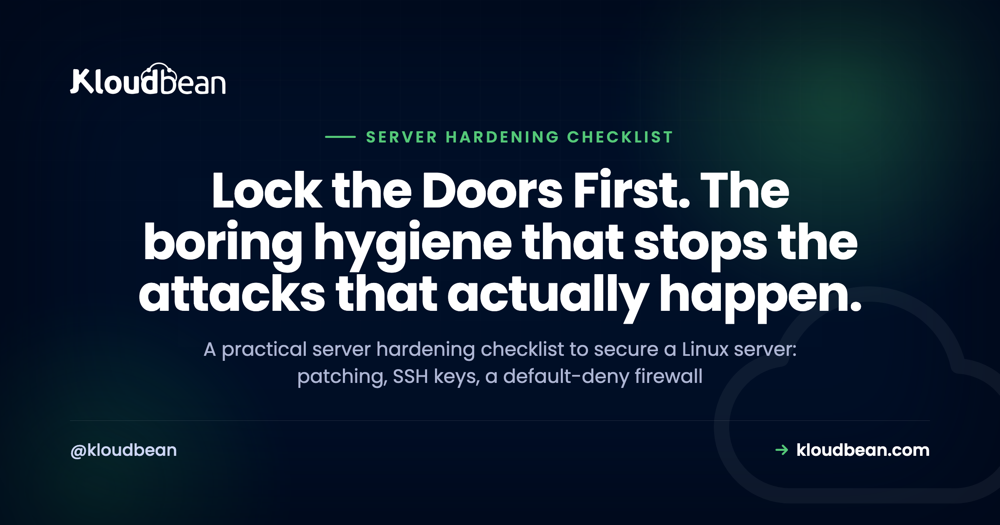

# The Server Hardening Checklist: How to Secure a Linux Server



Spin up a fresh Linux box, give it a public IP, and the scanners find it within minutes. Not hours. Minutes. This is the server hardening checklist I wish more people worked through before they point a domain at a new VPS. It's ordered, it explains why each step matters, and it's honest about what breaks if you skip one.

> **The short version:** Hardening a Linux server is mostly boring hygiene done in the right order: patch it and keep it patched, lock SSH down to keys and no root login, run a default-deny firewall that only opens 22, 80, and 443, add Fail2ban, run apps as least-privilege users, force TLS, back up and test the restore, and watch your logs. SSH hardening is the single highest-value step. A managed platform does the server baseline for you, so you can spend your time on app-level security instead.

## Why most servers actually get breached (it's boring)

Forget the movie version. Almost nobody loses a box to a clever zero-day. They lose it to an unpatched service with a year-old CVE, a database port left open to the whole internet, an SSH login with a guessable password, or an API key committed to a public repo. That's it. That's the top of the list, over and over.

So here's my opinion, and I'll defend it: boring hygiene beats fancy tooling. A patched box with keys-only SSH and a tight firewall is harder to crack than a neglected server running three security products. Skip the basics and buy the tools, and you've bought a very good lock for a door you left open. These are the server security best practices that stop the attacks that actually happen.

```
        Attack surface reduction: each ring is one less way in
        (work from the outside in)

   ┌─────────────────────────────────────────────┐
   │  1. Patched OS        closes known CVEs       │
   │   ┌───────────────────────────────────────┐  │
   │   │ 2. Firewall, default-deny             │  │
   │   │   ┌───────────────────────────────┐   │  │
   │   │   │ 3. SSH keys + Fail2ban        │   │  │
   │   │   │   ┌───────────────────────┐   │   │  │
   │   │   │   │ 4. Least-privilege app │  │   │  │
   │   │   │   │   ┌───────────────┐   │   │   │  │
   │   │   │   │   │ 5. TLS        │   │   │   │  │
   │   │   │   │   │  [ YOUR DATA ] │  │   │   │  │
   │   │   │   │   └───────────────┘   │   │   │  │
   │   │   │   └───────────────────────┘   │   │  │
   │   │   └───────────────────────────────┘   │  │
   │   └───────────────────────────────────────┘  │
   └─────────────────────────────────────────────┘
```

*Hardening isn't one wall. It's rings. Every layer you add removes another way in, so a single mistake doesn't hand over the whole box.*

## The server hardening checklist, in order

Do these top to bottom. The order matters, because the early items shrink the attack surface the most for the least effort. You don't need all ten done before lunch. You do need the first three before that box takes real traffic.

### 1. Patch it, then keep patching it

Updates are the least glamorous and most effective thing on this list. A public server with an out-of-date package is a soft target, because automated scanners hunt for exactly that: a known CVE with a known exploit, sitting unpatched. The fix is old news and it works. Patch on install, then automate it so you never rely on remembering.

On Ubuntu or Debian, turn on unattended security upgrades so the box patches itself:

```bash
sudo apt update && sudo apt upgrade -y
sudo apt install unattended-upgrades
sudo dpkg-reconfigure --priority=low unattended-upgrades
```

What breaks if you skip it: nothing, for a while. Then one morning a widely used library has a critical advisory, the exploit is public within a day, and every unpatched box gets swept up by a bot that doesn't care how small your site is. Patching is how you stay off that list.

### 2. Lock down SSH (the single highest-value step)

If you do one thing on this page, do this. SSH is the front door to the whole server, and by default it accepts passwords, which means bots can guess. Switch to key-based auth, turn passwords off, and stop root from logging in directly. Keys are effectively unguessable compared to any password a human will actually type.

Copy your key up first (`ssh-copy-id user@your-server`), confirm you can log in with it, then edit `/etc/ssh/sshd_config`:

```
# /etc/ssh/sshd_config
PermitRootLogin no
PasswordAuthentication no
PubkeyAuthentication yes
ChallengeResponseAuthentication no
```

Then reload with `sudo systemctl restart ssh`. Keep your current session open and test a new one in a second terminal before you close anything, so a typo doesn't lock you out.

Why block root specifically? Because "root" is the one username every attacker already knows. Force logins through a normal account that uses `sudo`, and a bot now has to guess both a valid username and a key it can't have. Skip it and your auth log fills with root password attempts all day. That's not paranoia. That's Tuesday.

<!-- ADD IMAGE: a terminal showing a key-based SSH login working, with password auth and root login switched off. -->

### 3. Turn on a firewall and default to deny

A server should answer on the ports it needs and go silent on everything else. The rule is default-deny: block all inbound traffic, then open only what you use. For a typical web server that's SSH on 22, HTTP on 80, and HTTPS on 443. Nothing else faces the internet.

The simplest tool on Ubuntu is `ufw`:

```bash
sudo ufw default deny incoming
sudo ufw default allow outgoing
sudo ufw allow 22
sudo ufw allow 80
sudo ufw allow 443
sudo ufw enable
```

The most common self-inflicted breach is a database listening on a public IP with a weak password. Postgres on 5432, MySQL on 3306, Redis on 6379, Mongo on 27017, all wide open because someone bound it to 0.0.0.0 and forgot. Scanners find those in hours. Keep your database on a private network, off the public firewall entirely. If it doesn't need a public port, it shouldn't have one.


*On a managed platform the firewall is already on. Kloudbean ships a Shorewall firewall and Fail2ban enabled from the first minute, so default-deny isn't a step you have to remember.*

### 4. Add brute-force protection with Fail2ban

Even with key-only SSH, bots will hammer your login. They don't know you turned passwords off. Fail2ban reads your auth logs, notices an IP failing over and over, and bans it at the firewall for a while. It turns an endless guessing game into a few attempts and a door slammed shut.

```bash
sudo apt install fail2ban
sudo systemctl enable --now fail2ban
sudo fail2ban-client status sshd
```

"But I already use keys, so why bother?" Two reasons. It trims the noise so real problems stand out in your logs. And it covers more than SSH, because you can point it at your web server or app logs to ban IPs abusing a login form or an API. Defense doesn't stop at the SSH port.

### 5. Give every user the least privilege that works

Least privilege is the quiet principle behind half of good security. Nobody and nothing should have more access than the job needs. Run your app as a dedicated service user, never as root. Give each human their own account, so you can see who did what and remove one person without resetting shared credentials. Use `sudo` for the rare admin task instead of living as root.

Why it matters: blast radius. If an app running as root gets popped, the attacker owns the machine. If that same app runs as a limited `www-data`-style user, they're stuck with far less to steal or wreck. You can't prevent every break-in. You can stop one from becoming total.

<!-- ADD IMAGE: app running as a dedicated non-root service user, with one sudo-capable account per person. -->

### 6. Close unused services and delete default accounts

Every service you run is a door someone could try. So run fewer of them. That old FTP daemon nobody uses, the sample database from a tutorial, the default "admin" account that shipped with a package: all attack surface, none of it earning its keep. See what's listening and shut down what shouldn't be:

```bash
sudo ss -tulpn        # what's listening, and which process
sudo systemctl disable --now <service>
```

Then remove or lock default accounts, and make sure none kept a default password. The math is simple: fewer services and accounts means fewer things to patch, fewer to misconfigure, and fewer ways in. Reducing the attack surface is free, and it pays off every day the box is online.

### 7. Force TLS everywhere

Every connection should be encrypted, no exceptions, and no plaintext admin panels. Without TLS, logins and session cookies cross the network as readable text anyone on the path can grab. With it, that traffic is gibberish in flight. Get a free certificate, redirect HTTP to HTTPS, and set it to auto-renew so you never wake up to an expired cert scaring users off.

Certificates do occasionally misbehave, and it's usually DNS, mixed content, or a stale cache rather than anything dramatic. When that happens, the fixes live in [how to fix common SSL certificate errors](https://www.kloudbean.com/blog/fix-ssl-certificate-errors/). The goal is boring: HTTPS on, plaintext off, renewal on autopilot.

### 8. Back up, then actually test the restore

Backups belong in any honest security checklist, because ransomware, a bad migration, and a fat-fingered `DROP TABLE` all end the same way: you need a clean, recent copy. Automate them and store them off the box, so a compromised server can't take your backups down with it.

Here's the step almost everyone skips, and it's the one that counts. Restore a backup on purpose, once, before you ever need it. An untested backup is a guess, not a plan, and the worst time to learn it doesn't restore is the day you depend on it. There's a proper method in the [server backups and restore-testing guide](https://www.kloudbean.com/blog/server-backups-guide/).

### 9. Watch your logs and your resources

You can't respond to what you can't see. Basic monitoring tells you when auth failures spike, when the disk is nearly full, or when CPU and memory pin for no reason, before your users do. Watch `/var/log/auth.log` for login attempts, check disk with `df -h`, and set an alert for when a box is in trouble.

A sudden flood of failed logins is a brute-force attempt in progress. A disk quietly filling to 100% takes your app down as surely as any attacker, and that's a preventable outage. Monitoring is how the small problem stays small.


*Server health at a glance: CPU, memory, and disk. On a managed dashboard the graphs and alerts are already wired up, so you're watching trends instead of building a monitoring stack from scratch.*

### 10. Keep secrets off the box and out of the repo

Database passwords, API keys, and tokens do not belong in your code, and they definitely don't belong in a file sitting in the webroot where a path bug could serve it. A leaked key in Git history is one of the fastest ways to get breached, and it's entirely self-inflicted. Put config in environment variables or a runtime config store, keep `.env` out of version control, and scope every token to the least it needs to do.

If a key does leak, rotate it immediately and assume it's already been scraped, because public repos are crawled constantly. The full method, including how to structure config per environment, is in [environment variables done right](https://www.kloudbean.com/blog/environment-variables-done-right/).

## Who does each step: managed vs unmanaged

Here's the part the sticker price hides. On an unmanaged VPS, every row below is your job to set up, watch, and keep working. On a managed platform, the server baseline is handled and you spend your effort further up the stack. This is the honest split.

| Hardening step | Unmanaged VPS | Managed platform (Kloudbean) |
| --- | --- | --- |
| **OS + stack patching** | You install and automate updates | Managed patching handled for you |
| **Firewall, default-deny** | You configure ufw or nftables | Shorewall firewall, on by default |
| **Brute-force protection** | You install and tune Fail2ban | Fail2ban, on by default |
| **SSL / TLS** | You install certs and set renewal | Free, auto-renewing SSL |
| **Backups** | You build, store, and test them | Automatic backups |
| **Access control** | You manage users and SSH keys | Subusers + UAC, IP Access Control, Basic Auth gate |
| **Your app, code, deps, secrets** | You own it | You own it |

> **The line that never moves:** notice the last row is the same in both columns. A managed platform hardens the server baseline. It cannot secure your application code, your dependencies, your auth logic, or your secrets. That half is yours no matter who runs the box.

## What a managed platform hardens for you (and what it doesn't)

This is where a managed host earns its keep: the tedious, easy-to-forget baseline arrives already done. On Kloudbean, every server ships with a Shorewall firewall and Fail2ban on from the first minute, plus free auto-renewing SSL, automatic backups, and managed OS and stack patching. So the first eight items on this checklist, the ones that stop most real attacks, are handled before you deploy a line of code.

Access control comes with tools too. Subusers and User Access Control give each person only the permissions their task needs. IP Access Control allows or denies by address or CIDR range, so an admin path only answers your office or VPN. A Basic Auth gate puts a username-and-password wall in front of an app or staging site before anyone can probe it. The bots can't attack a door they can't reach.

Now the honest boundary. The platform hardens the server. You still own app-level security: your dependencies and their CVEs, your code, your auth logic, and your secrets. Run `npm audit` or `pip-audit`, set your [HTTP security headers](https://www.kloudbean.com/blog/security-headers-guide/), and keep keys out of Git. That's the shared-responsibility model, laid out in full in the guide to [secure, compliant hosting and who secures what](https://www.kloudbean.com/blog/secure-compliant-hosting/). Managed is worth it because that baseline is genuinely tedious to run yourself, which is the argument in [what a managed server actually is](https://www.kloudbean.com/blog/what-is-a-managed-server/) and [the real cost of an unmanaged VPS](https://www.kloudbean.com/blog/the-real-cost-of-unmanaged-vps/).

<!-- ADD IMAGE: a two-column split: server baseline the platform handles vs app-level security you own. -->

## The five-minute version, if you only do a handful

If the whole list feels like a lot, collapse it to three: patch the box, switch SSH to keys, and turn on a default-deny firewall. Those three take an afternoon and shut out most automated attacks. When you have more time, add the rest, in this order.

- Update everything, then turn on automatic security updates.
- Switch SSH to keys only, and disable direct root login.
- Enable a firewall with default-deny; open only 22, 80, and 443.
- Install Fail2ban and confirm it's watching your auth log.
- Force HTTPS, and confirm the certificate auto-renews.
- Move every secret into environment variables; scrub keys from Git history.
- Restore one backup on purpose, to prove the path works.

---

**Skip the baseline grind. Ship on a server that arrives hardened.** Launch on infrastructure where the firewall, Fail2ban, free SSL, backups, and patching are already handled, so your effort goes to the app-level security only you can own. Start at [kloudbean.com](https://www.kloudbean.com/); see plans on [pricing](https://www.kloudbean.com/pricing/), and verify current details there.

Shorewall firewall + Fail2ban baseline · Free auto-renewing SSL · Automatic backups · Managed patching · IP Access Control · Subusers + UAC · Free migration · Free trial

## FAQ

### What is a server hardening checklist?

It's an ordered list of the steps that reduce a server's attack surface: patching, SSH hardening, a default-deny firewall, brute-force protection, least-privilege users, closing unused services, TLS, backups, monitoring, and keeping secrets off the box. Working through it in order matters, because the early steps shut out the most attacks for the least effort. The goal is fewer ways in and less damage if someone does get in.

### How do I secure a Linux server?

Start with the three that matter most: patch the OS and keep it patched, switch SSH to key-based auth with root login disabled, and run a firewall that denies everything except the ports you use. Then add Fail2ban, run your apps as non-root users, force HTTPS, automate backups you have actually tested, and monitor your logs. Those steps handle the attacks that happen in the real world.

### What is the highest-value hardening step?

SSH hardening. It's the front door to the whole machine, so moving to key-based authentication, disabling password login, and blocking direct root login removes the single most common way servers get taken over. Passwords can be guessed by bots around the clock; a key effectively cannot. If you only have time for one step, make it this one.

### Should I disable root SSH login?

Yes. Root is the one username every attacker already knows exists, so leaving it able to log in directly hands them half the puzzle for free. Log in as a normal user and use sudo for admin tasks instead. Set PermitRootLogin no in sshd_config, and confirm your regular account works before you close your session.

### Do I still need Fail2ban if I use SSH keys?

It's still worth running. Key-based auth stops the guessing from succeeding, but bots will keep trying and flooding your logs, and Fail2ban bans the repeat offenders so real events stand out. It also protects more than SSH, since you can point it at web server or application logs to ban IPs abusing a login form or API. Think of it as noise reduction plus a wider net.

### What ports should I leave open on a web server?

For a typical web server, just SSH on 22, HTTP on 80, and HTTPS on 443, with everything else blocked by a default-deny rule. Database ports like 5432, 3306, 6379, and 27017 should never face the public internet; keep the database on a private network instead. The rule of thumb is simple: if a port doesn't need to be public, close it.

### Does managed hosting harden the server for me?

The server baseline, yes. On Kloudbean a Shorewall firewall and Fail2ban are on by default, SSL is free and auto-renewing, patching is managed, and backups run automatically, so most of this checklist is handled before you deploy. What no host can do for you is app-level security: your code, your dependencies, your auth logic, and your secrets. That half is always yours.

### How often should I patch a Linux server?

As soon as security updates land, which in practice means automating it. Turn on unattended security upgrades so the box patches itself, and reboot when a kernel update needs it. The risk isn't routine updates, it's the gap between a public exploit and your next manual patch, and automation closes that gap. Unpatched services are how most boxes actually get compromised.

### What's the difference between hardening and a firewall?

A firewall is one step inside hardening, not the whole thing. Hardening is the full set of measures that reduce risk across the server, from patching and SSH to least privilege and backups. The firewall specifically controls which ports are reachable. You need the firewall, but a firewall alone in front of an unpatched box with password SSH is not a hardened server.

### Is server hardening a one-time task?

No. The initial checklist is one-time, but patching, log monitoring, access reviews, and backup testing are ongoing. New vulnerabilities appear, people join and leave your team, and configs drift, so hardening is a habit more than a task you finish. A managed platform keeps the baseline current for you, which is a big part of why it's worth the fee.

---

*By Kloudbean Security · Lock the Doors First. The boring hygiene that stops the attacks that actually happen.*
