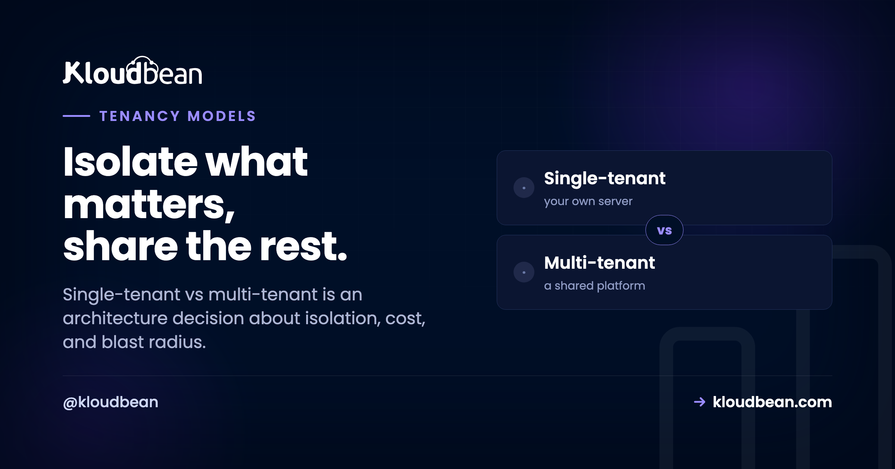

# Single-Tenant vs Multi-Tenant: The Architecture Choice, Explained

Every SaaS makes this call, usually before it knows it did. Single-tenant vs multi-tenant is the question of whether each customer gets their own isolated stack, or everyone shares one and your code keeps them apart.

It sounds like a hosting question. It's really an architecture decision, and it shapes your cost, your security story, your compliance answers, and how bad your worst day gets. Let's go deeper than the usual "house vs apartment" analogy, down to what actually happens in the app and the database, then map it back to where you run it.

> **Short answer:** Multi-tenant means many customers share one running app and one database, with isolation enforced in software (usually a tenant_id on every row). It's cheap, dense, and simple to maintain, but everyone shares a blast radius. Single-tenant means each customer gets their own isolated instance and database: stronger isolation, easier compliance and data residency, per-tenant customization, at higher cost and more moving parts. Most SaaS should start multi-tenant. Single-tenant earns its cost when isolation becomes a real requirement, not a nice-to-have.

## What each really means, at the data layer

The analogies gloss over the part that matters, so here's the concrete version.

In a **multi-tenant** app, there's one process serving everyone and one database holding everyone's data. Rows carry a `tenant_id`, and every query is supposed to filter on it. That "supposed to" is doing heavy lifting, which we'll get to. One codebase, one schema, one deploy. Add a customer and you add rows, not infrastructure.

In a **single-tenant** app, each customer gets their own copy of the stack. Their own app instance, their own database, sometimes their own server. Tenant B literally cannot see tenant A's data, because it lives somewhere else entirely. Isolation isn't enforced by a `WHERE` clause, it's enforced by the fact that the data isn't even in the same place.

That single distinction (isolation by code versus isolation by separation) drives every tradeoff below.

## One diagram: N stacks versus one shared stack

Left, single-tenant: a full stack per customer. Right, multi-tenant: one stack serving all of them, kept apart in software.

```
SINGLE-TENANT (a stack per customer)      MULTI-TENANT (one shared stack)

 Tenant A   Tenant B   Tenant C            A   B   C   (tenants)
 [ App ]    [ App ]    [ App ]               \  |  /
 [ DB  ]    [ DB  ]    [ DB  ]              [ One shared app ]
 isolated   isolated   isolated            [ One shared DB  ]
                                            rows tagged tenant_id: A B C

Left: isolation by separation. Right: isolation by a tenant_id, enforced in code.
```

Left, adding a customer means another stack. Right, it means more rows. That's the cost-versus-isolation trade in one picture.

## The multi-tenant spectrum (it isn't one thing)

Worth knowing, because "multi-tenant" hides three quite different designs, ordered from most shared to most isolated:

- **Shared schema, shared database.** Everyone in the same tables, separated by a `tenant_id` column. Cheapest and densest. Also the design where a single missing filter leaks data across tenants.
- **Schema per tenant.** One database, a separate schema for each customer. More isolation, more objects to migrate.
- **Database per tenant.** A separate database for each customer, often on shared servers. Getting close to single-tenant at the data layer while keeping one app.

Postgres row-level security (RLS) can enforce the shared-schema separation in the database itself, which is a real safety net rather than trusting every query to remember its `WHERE` clause. If you take shared-schema multi-tenancy seriously, RLS is worth the setup.

## The tradeoffs that actually bite

Read this as isolation versus efficiency. Almost everything else follows from that one tension.

| | Single-tenant | Multi-tenant |
| --- | --- | --- |
| **Isolation** | Physical, by separation | Logical, enforced in code |
| **Cost per customer** | Higher, you fund each stack | Lower, hardware is shared |
| **Blast radius** | One tenant at a time | A bad migration can hit everyone |
| **Noisy neighbor** | Not a thing | Possible under shared load |
| **Customization** | Per-tenant, easy | Limited to config flags |
| **Data residency** | Pin each tenant to a region | Harder in one shared store |
| **Maintenance** | N instances to patch and deploy | One codebase, one deploy |
| **Density / efficiency** | Lower, capacity sits idle | Higher, hardware well used |

Two rows deserve more than a table cell. **Blast radius** is the one people learn the hard way: in a shared-everything design, one bad migration, one runaway query, or one leaked `WHERE` clause is an all-customers event. And the classic multi-tenant bug is exactly that, a query that forgot `WHERE tenant_id = ?` and quietly returned another customer's rows. That's not hypothetical, it's the reason RLS exists. Single-tenant makes that specific catastrophe structurally impossible, which is precisely why regulated buyers ask for it.

<!-- ADD IMAGE: a simple whiteboard sketch, three boxed tenant stacks on one side, one shared app plus a tenant_id table on the other -->

## Which layer are we even talking about?

This is the part that muddles most discussions, and clearing it up makes you sound like you know what you're doing in a design review. "Tenant" can mean different layers, and they're independent.

At the **application** layer, tenancy is about whether customers share one running app and database. At the **infrastructure** layer, it's about whether they share the physical server or VM. You can mix them freely. A multi-tenant SaaS app can run on a single-tenant (dedicated) server. A single-tenant app design can be packed onto shared hardware. So when someone asks "are you single-tenant or multi-tenant?", the sharp reply is "at which layer?" Answer that first and the real requirement usually falls out. Buyers who say "single-tenant" often mean "our data must be isolated and in our region," which is a data-layer and residency requirement, not necessarily a demand for dedicated silicon.

## My take: start multi-tenant, earn single-tenant

Here's an opinion, not a hedge. Most SaaS should start multi-tenant. It's cheaper, it's one codebase to ship, and it's how the overwhelming majority of software you use every day is built. Paying for a dedicated stack per customer before anyone has asked for one is optimizing for a problem you don't have yet, at the expense of the problem you do have, which is shipping.

Single-tenant earns its cost when isolation stops being a preference and becomes a requirement. That's a big regulated customer with contract language about dedicated environments. It's a [data-residency](https://www.kloudbean.com/blog/data-residency-explained/) obligation that says this tenant's data lives in this country, full stop. It's a workload heavy and predictable enough that sharing genuinely hurts, or a customer who needs the app customized beyond a feature flag. When one of those shows up, single-tenant isn't a luxury, it's the spec. Before then, it's usually money set on fire.

<!-- ADD IMAGE: a short decision cue, three yes-or-no triggers (regulated contract, data-residency clause, heavy predictable load) pointing to single-tenant, everything else to multi-tenant -->

## How hosting maps to tenancy

Once you've decided at which layer you need isolation, hosting is how you deliver it. A managed platform lets you build either shape deliberately, on the cloud you pick.

For single-tenant isolation, you give a customer their own server and their own managed database, locked down so only their app server's IP can reach it, and you can pin the region for residency. Granular User Access Control (UAC) and subusers let you scope who can touch which resource, which matters when "isolated" also means "only these people administer it." Enterprise and government setups can go further, putting each tenant on a [private network or dedicated VPC](https://www.kloudbean.com/blog/what-is-a-vpc/) with custom architectures.


Or you run a shared app efficiently, and here's the pragmatic middle a lot of teams and agencies land on: rent one dedicated server (single-tenant to the outside world, so it's isolated and predictable) and run several of your own apps or clients on it (multi-tenant to you, so it's economical). You get isolation from everyone else and efficiency inside your own box.


If that agency-style split is your model, [reseller hosting versus managed cloud](https://www.kloudbean.com/blog/reseller-hosting-vs-managed-cloud/) digs into it, and the whole managed-versus-raw question sits in [managed vs unmanaged hosting](https://www.kloudbean.com/blog/managed-vs-unmanaged-hosting/). I won't oversell the point: Kloudbean gives you the building blocks (isolated servers, managed databases, IP allow-listing, UAC, and private networking on Enterprise) to implement whichever tenancy your architecture calls for. The design decision is still yours.

## You're not locked into your first choice

Don't agonize over day one. This isn't a one-way door. Most teams start multi-tenant and move a demanding customer to a single-tenant setup the day a real requirement appears. Because your app and its data are standard and portable, promoting one tenant onto a dedicated server and database is a migration, not a rewrite. Pick what fits where you are now. Revisit it when a concrete need, not a hypothetical one, changes the answer.

The boundary, plainly: there's no universal winner, only a trade you make on purpose. Isolation costs money, sharing saves it. A managed host on a Linux stack can support both: a dedicated server with the database locked to its app server's IP (and private networking or dedicated VPCs plus custom setups on Enterprise) when isolation is the requirement, or efficient shared use of a box you own when it isn't. Either way, your application and data stay yours while the platform runs the server, stack, SSL, and backups underneath. Decide by asking what you actually need to isolate, and what that isolation is worth.

---

**Isolate what matters. Share the rest.** Build single-tenant isolation or an efficient shared setup on the cloud you choose, with dedicated servers, managed databases, and IP allow-listing (private networking on Enterprise). Start free at [kloudbean.com](https://www.kloudbean.com/), or see plans on [pricing](https://www.kloudbean.com/pricing/).

Dedicated servers · Managed databases · IP allow-listing · User Access Control · Free migration help · Free trial

## FAQ

**What's the difference between single-tenant and multi-tenant?**
Single-tenant means each customer gets their own isolated instance and database, so isolation comes from separation. Multi-tenant means many customers share one app and one database, with isolation enforced in software, usually a tenant_id on every row. Single-tenant favors isolation and customization at higher cost. Multi-tenant favors efficiency and simple maintenance.

**Is single-tenant more secure than multi-tenant?**
It has a smaller blast radius, because a problem is contained to one customer rather than potentially touching everyone, which is why regulated industries often require it. But well-built multi-tenant platforms are secure for the vast majority of apps. Single-tenant is about guaranteed isolation and meeting specific rules, not about multi-tenant being inherently unsafe.

**Does multi-tenant mean my data is mixed with other customers'?**
You share the same database and app, but your data is separated in software, typically by a tenant_id filter on every query, and often reinforced with database row-level security. Tenants can't see each other's data when it's built correctly. The efficiency comes from sharing infrastructure, not from commingling data.

**What is the noisy neighbor problem?**
In a shared environment, one tenant's heavy load can consume resources and slow things down for others. That's the noisy neighbor. Single-tenant setups don't have it, because nobody else is on your stack. Good multi-tenant platforms manage it with limits and capacity headroom.

**When should I choose single-tenant?**
When isolation is a real requirement, not a preference: a regulated customer whose contract demands a dedicated environment, a data-residency obligation, a heavy predictable workload that shouldn't compete, or a customer needing customization beyond configuration. If "we can't share infrastructure" is an actual requirement, single-tenant is the answer.

**What's the difference between multi-tenant at the app layer and the infrastructure layer?**
App-layer tenancy is whether customers share one running app and database. Infrastructure-layer tenancy is whether they share the physical server. They're independent: a multi-tenant app can run on a dedicated (single-tenant) server, and a single-tenant design can sit on shared hardware. When someone asks which you are, ask back: at which layer?

**Can I run single-tenant on a managed host?**
Yes. You give each customer their own server and managed database, locked down so only their app server's IP can reach it, and pin the region for residency. User Access Control scopes who can administer what. On Kloudbean you build that on the cloud you choose, and enterprise setups can add private networking, dedicated VPCs, and custom architectures.

**Can I switch from multi-tenant to single-tenant later?**
Usually yes. Because your app and data are standard and portable, promoting a demanding tenant onto a dedicated server and database is a migration, not a rewrite. Many teams start multi-tenant and move specific customers to single-tenant when a real requirement appears.

---

*Kloudbean · Isolate what matters, share the rest.*
