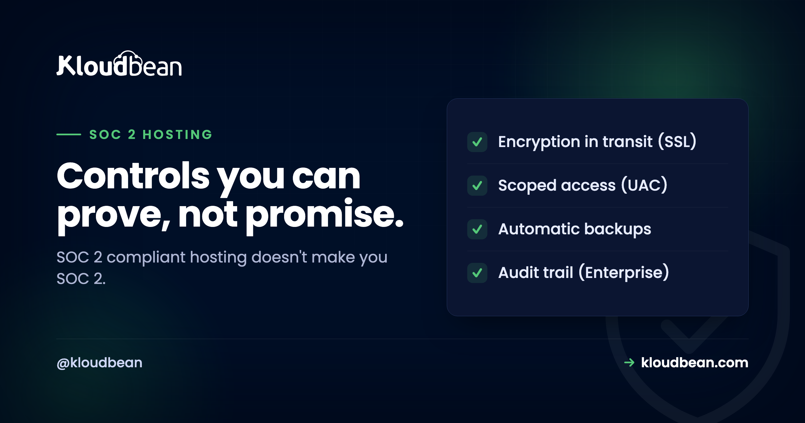

# SOC 2 Compliant Hosting: 80% Process, 20% Infrastructure

It usually arrives as one email. A prospect, or their security team, wants to know: is your hosting SOC 2 compliant? Suddenly a deal hangs on a term most founders never had to define. So people search for "SOC 2 compliant hosting" hoping to buy a quick yes. That's the wrong instinct, and I'll explain why, because the answer that actually closes the deal is more honest and less scary than it looks.

Short version up front: SOC 2 is about **your** company's controls, proven over time, not a box your host ticks for you. A host can hand you a strong foundation and, crucially, the evidence trail. It can't hand you your report.

> **The short version**
>
> SOC 2 is an independent auditor's report on how well your controls meet the Trust Services Criteria, evidenced over a period. Running on well-run infrastructure helps, but roughly 80% of the work is your process and evidence: policies, access rules, change management, and running those controls over months. The 20% a host covers is the infrastructure and the evidence trail. Choose a host that produces that evidence so you're not screenshotting it by hand.

## SOC 2, in one honest sentence

SOC 2 is a report written by an independent auditor describing how well an organisation's controls meet a set of Trust Services Criteria: security first, then optionally availability, confidentiality, processing integrity, and privacy. It isn't a licence or a sticker. It's an outside expert examining how you actually run things and writing down what they found. When a vendor says they're "SOC 2 compliant," they mean an auditor reviewed their controls and produced a report you can read.

Notice the subject of that sentence. The report is about the *organisation's* controls. When you buy hosting, the host's report covers the host's controls. It says nothing about the code you deploy on top. That's the whole reason compliance is a shared job.

## Why it's 80% process, 20% infrastructure

Here's the position I'll defend: most of SOC 2 is operational discipline, not servers. The auditor wants to see that people get access based on their role and lose it when they leave, that changes to production are tracked and reviewed, that you have policies and actually follow them, and that you can prove all of this happened consistently over the observation window. Very little of that is the box your app runs in. Most of it is how your team behaves, recorded as evidence.

The infrastructure is real, though, and it's the part a host can genuinely own. The trick is that good infrastructure doesn't just *be* secure, it *produces evidence* that it's secure. That evidence is what turns a stressful audit into a boring one.

<!-- DIAGRAM: your controls produce evidence over the Type II window, an auditor turns it into a SOC 2 report -->

## What the host actually gives you: the evidence, not the badge

A good managed host covers the infrastructure controls you'd otherwise have to build and prove alone, and it leaves a trail while doing it. Here's the mapping I'd point an auditor at.

| Control the host provides | The evidence it produces for your SOC 2 |
| --- | --- |
| Subusers and granular access control (UAC) | Exactly who can reach production, and with what permission |
| Immutable audit trail (enterprise) | A tamper-resistant record of who did what, and when, exportable to CSV |
| CI/CD deployment history | Change management: every release logged and reviewable |
| Automatic backups | Availability and recoverability you can actually demonstrate |
| Encryption in transit (free SSL) | Data protected on the wire, on by default |
| Firewall plus brute-force blocking | Baseline hardening of the servers |

Two of those are worth dwelling on. Change management is where a lot of teams flail, because "we deploy from Git" only counts if you can show the history. A managed [backup](https://www.kloudbean.com/blog/server-backups-guide/) schedule plus deploy logs give you that for free. And the audit trail is the single most auditor-friendly thing on the list: it answers "who touched this, and when" without anyone reconstructing it from memory.

Be careful reading the second row, though, because vendors blur it. On Kloudbean the immutable, searchable, CSV-exportable audit trail is an Enterprise capability, not something on a standard plan. The rest of that table, subusers with per-resource permissions, Git deployment history, automatic and on-demand backups, free SSL, Shorewall and Fail2ban, is standard. If your buyer's questionnaire specifically asks for a tamper-resistant activity log, that's the line to check on any platform you're evaluating, before you promise it in a security review.

<!-- ADD IMAGE: your access-control matrix, who on the team can reach production and with which role -->

## Then what's still your job?

The bigger half, and it's the half your customers' data flows through. Your own access policies (who gets production access, and how they lose it). How you store secrets. How your code handles and protects user data. Your logging of application-level events. Your onboarding and offboarding. Your risk assessment and the policies that back all of it. The platform hands you the tools, managed secrets, access control, backups, monitoring. Using them correctly is the work only you can do.

The most basic control here is unglamorous: don't scatter credentials through your codebase. Keep them in managed environment variables with least-privilege access, so who can reach what is a setting you control, not a guess. Two console-level habits make this easy to evidence: set the values as environment variables rather than in code, so rotating one is a config change nobody has to commit, and put IP allow-listing on the managed database so only your app server's address can connect. Both are things you can screenshot and hand to an auditor in about a minute.

## Type I or Type II, and why you can't cram

You'll be asked for one or the other.

| | Type I | Type II |
| --- | --- | --- |
| What it checks | Controls are designed and in place | Controls operated effectively over time |
| Time frame | A single point in time | A window, often 3 to 12 months |
| What it proves | A snapshot | The controls are lived, not just written |
| What buyers ask for | Sometimes, as a start | Usually this one |

The Type II detail catches people out. It checks that your controls *worked over a period*, which means you cannot backfill it the week before the audit. If your audit trail only starts the day you got serious, you have no history to show. So the practical move is to run on infrastructure that has been quietly logging access, changes, and backups all along, before you ever needed it. That accumulated evidence is the thing you can't fake and can't rush.

> **The mistake we see most.** A team lands a big customer, gets asked for a SOC 2 Type II, and only then goes looking for evidence of the last six months. There isn't any, because nothing was recording it. The fix is boring and it works: deploy through tracked CI/CD so every release is logged, keep automatic backups running, and if you're on an Enterprise account turn the audit trail on well before anyone asks. Evidence you didn't collect is evidence you can't produce, and no amount of budget in month seven buys back month one.

## What about "WordPress hosting with SOC 2 certification"?

People search that exact phrase, and always for the same reason: a client asked. Two honest notes. First, SOC 2 is technically an attestation report, not a pass or fail "certification," so the word is a little off even though everyone uses it. Second, the same split applies with a WordPress twist. The host's controls can cover the servers and stack your site runs on. They can't cover your plugins, your theme, or the data your forms collect, and WordPress risk usually lives right there in third-party plugins. So your side of the work is keeping plugins updated, limiting who has admin access, and being careful what personal data you collect. Solid infrastructure gives your site a clean foundation to point at. See [secure WordPress hosting](https://www.kloudbean.com/blog/secure-wordpress-hosting/) and [enterprise WordPress hosting](https://www.kloudbean.com/blog/enterprise-wordpress-hosting/) for the WordPress-specific angle.

## So what is "SOC 2 compliant hosting"?

It's hosting whose own controls are run and documented well, and that leaves behind the evidence your audit needs. It shrinks your work because the infrastructure layer is handled, so you're left proving your application-layer controls rather than the whole stack. It's still real effort. You still pick your scope, write your policies, run your controls over the window, and bring in an auditor. You're just not starting from bare ground.

## Who actually has to own each control

Print this and argue about it with your team, because most SOC 2 panic comes from a row nobody had claimed. Three owners, and only one of them is your host.

| Control area | Owner | What that looks like in practice |
| --- | --- | --- |
| Scope, policies, risk register | You, alone | Written documents. No product generates these, and an auditor reads them first. |
| People: vetting, onboarding, offboarding, training | You, alone | HR process and records, entirely outside any hosting account. |
| Application code and data handling | You, alone | Input validation, field-level encryption, app-level event logging, session logic. |
| Commissioning and paying for the audit | You, alone | You choose the auditor, the window, and the Trust Services Criteria in scope. |
| Who can reach production | Shared | Subusers and per-resource access control exist in the console; the grant and the quarterly review are your call. |
| Change management | Shared | Git deployment history records every release. Reviewing and approving changes is your process. |
| Availability and recovery | Shared | Automatic and on-demand backups run for you. Testing a restore, and writing down that you did, is yours. |
| Encryption in transit | Host | Free SSL with HTTP redirected to HTTPS, on by default. |
| Server hardening and patching | Host | Shorewall and Fail2ban on every server, OS and stack patching handled. |
| Tamper-resistant activity record | Host, Enterprise only | The searchable, CSV-exportable audit trail. Confirm your plan includes it before you cite it. |
| Physical data centre security | The underlying cloud | You're running on one of seven major providers, each of which publishes its own compliance documentation. |

Two things no host fixes, ours firmly included. Nobody can write your policies or run your offboarding for you, so the top four rows never move however much you spend on infrastructure. And a platform's own posture is not your report: Kloudbean is built to align with SOC 2 and supports the infrastructure controls in that table, but it isn't SOC 2 certified, and certification is assessed against an organisation rather than granted to a hosting account. Anyone selling "compliant hosting" as a shortcut to your own attestation is selling you the wrong thing. What you can reasonably expect from a host is that the shared rows produce evidence without you screenshotting anything by hand. Working through several frameworks at once? The siblings pair well: [GDPR compliant hosting](https://www.kloudbean.com/blog/gdpr-compliant-hosting/), [PCI compliant hosting](https://www.kloudbean.com/blog/pci-compliant-hosting/), and sensible [security headers](https://www.kloudbean.com/blog/security-headers-guide/) on the app itself.

<!-- ADD IMAGE: an export of your audit trail or activity log covering the observation window -->

**Inherit the foundation, own your half.** Build on managed infrastructure that leaves the evidence trail your SOC 2 needs, all on one dashboard. Start free at [kloudbean.com](https://www.kloudbean.com/) and see plans on [pricing](https://www.kloudbean.com/pricing/).

Access control · Enterprise audit trail · CI/CD deploy history · Automatic backups · Free SSL · Firewall + brute-force blocking

## SOC 2 hosting FAQ

**What does SOC 2 compliant hosting mean?**

It means the provider has been examined by an independent auditor and has a report describing how it protects data at the infrastructure level: data centres, staff access, monitoring, change management. It's not a sticker you buy. It's an outside review of the provider's controls that you can read, covering the infrastructure layer only.

**Does running on SOC 2 hosting make my application SOC 2 compliant?**

No. Compliance follows a shared-responsibility model. The host's report covers the infrastructure layer. Your application, access controls, and data handling are still your responsibility. Well-run infrastructure is a real head start, but your own controls and your own audit are still up to you.

**What is the difference between SOC 2 Type I and Type II?**

Type I checks that the right controls are designed and in place at a single point in time, a snapshot. Type II checks that those controls actually operated effectively over a period, usually three to twelve months. Type II is stronger and more respected because it shows the controls are lived, and it's what most buyers ask for.

**Do I need SOC 2 for my app?**

Only if your customers require it. SOC 2 is voluntary, with no law behind it. You typically pursue it when you start selling to larger companies whose security teams ask for it before trusting you with their data. If you're small or B2C, you may never be asked. Let real customer demand decide the timing.

**How does SOC 2-compliant hosting help me get there?**

It shrinks the work. If the infrastructure layer is already run and documented well, you're left proving your application-layer controls rather than the whole stack. Just as important, a host that logs access, changes, and backups gives you the evidence trail, so you're not reconstructing months of history by hand.

**How long does SOC 2 take?**

A Type I can be relatively quick because it's a point-in-time check. A Type II needs an observation window, often three to twelve months, because it proves your controls worked over time. You can't backfill that window, which is why running the right controls early matters so much.

**Is SOC 2 a certification?**

Not exactly. SOC 2 is an attestation: an auditor examines your controls and issues a report with their opinion, rather than granting a pass or fail certificate. People say certified as shorthand, but the deliverable is a report you share with customers, not a badge.

**What does WordPress hosting with SOC 2 certification actually get me?**

The host's controls can cover the servers your WordPress site runs on, but not your plugins, theme, or the data your forms collect. WordPress risk usually lives in third-party plugins, so keeping them updated, limiting admin access, and minimising the personal data you collect stays your job. The infrastructure is a clean foundation, not a finished result.

**What evidence does an auditor actually want?**

Typically your access-control lists (who can reach what), change history for production, backup and recovery records, logs or an audit trail of significant actions, and your written policies. A host that produces access records, deploy history, backups, and an audit trail hands you a big chunk of that evidence directly.

**Is SOC 2 the same as ISO 27001 or GDPR?**

No. SOC 2 is a US-oriented attestation about your controls, common in B2B SaaS. ISO 27001 is an international certification of an information-security management system. GDPR is an EU data-protection law. They overlap on good security practice, but they're separate goals with separate deliverables. Pursue the one your customers or your market actually require.

*Kloudbean · Controls you can prove, not promise.*
