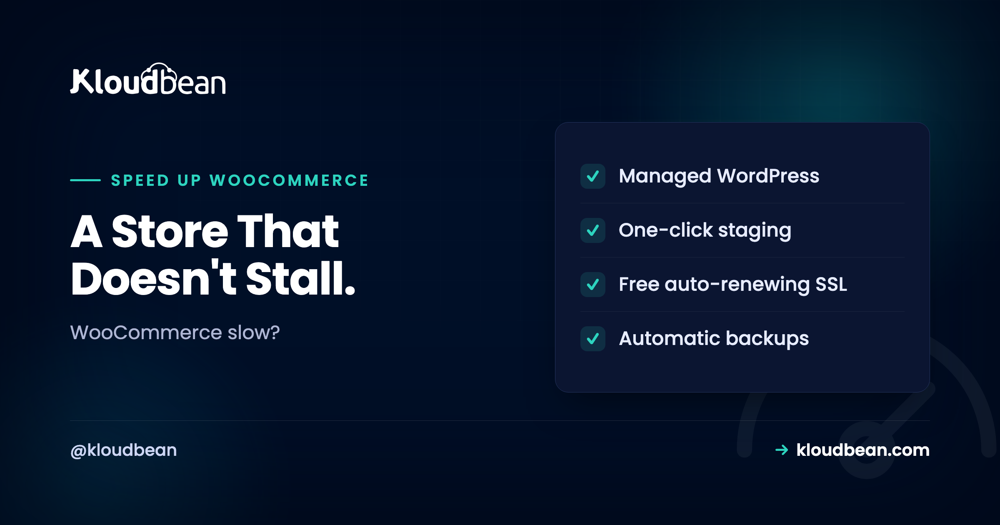

# How to Speed Up WooCommerce When a Cache Plugin Isn't Enough

By Kloudbean · A Store That Doesn't Stall.



Your blog loads fast. Your store crawls. Same WordPress underneath, very different behavior, and it catches a lot of people off guard.

The generic advice to speed up WooCommerce (install a cache plugin, compress a few images, call it done) fixes maybe half the problem. A store is full of pages a page cache can't touch. Cart, checkout, My Account: all different for every visitor, all bypassing full-page cache by design. So a WooCommerce store gets slow in ways a blog never does. This guide goes straight at the store-specific bottlenecks that actually move WooCommerce performance, in priority order, with the reasons behind each one.

> **The short version**
> The biggest WooCommerce speed win is a persistent object cache (Redis or Memcached), because your dynamic pages fire the same database queries over and over and a page cache can't hold them. After that: full-page cache with cart, checkout, and account excluded; clear `wp_options` autoload bloat; drain the Action Scheduler backlog; tame cart fragments; keep the database tidy; and run a current PHP. Most "WooCommerce slow" tickets are a database and plugins problem, not a theme problem.

## Why a WooCommerce store gets slow in ways a blog doesn't

A blog is mostly static. Once a post is published, the HTML is the same for every reader, so a page cache can store one finished copy and serve it to everyone in milliseconds. No PHP runs. The database is barely touched. That's why a well-cached blog feels instant on a tiny server.

A store is a different animal. The moment someone adds an item, their cart is theirs alone. The checkout shows their address, their shipping, their totals. My Account shows their orders. None of that can be shared with the next visitor, so WooCommerce marks those pages as uncacheable. Every hit runs PHP, opens a session, and queries the database. That's the half a cache plugin was never going to fix.

Here's the split that explains almost every slow store.

<!-- DIAGRAM: the two halves of a WooCommerce store. Left (green, cacheable): Storefront (Home, Shop, Category, Product) -> Full-page cache -> served in milliseconds, no PHP, no DB. Right (purple, per-user, never cached): Cart, Checkout, My Account -> PHP builds the page -> Object cache (Redis/Memcached) -> Database (MySQL/MariaDB). Left half is fixed by one cache plugin; the right half is the WooCommerce tax that needs an object cache. -->

Left half is easy: cache it once, serve it to everyone. Right half is the WooCommerce tax. It runs PHP and hits the database on every load, which is exactly why an object cache matters more here than on a blog.

If you want the general WordPress basics first (measuring, page caching, images, CDN), read [how to speed up WordPress](https://www.kloudbean.com/blog/speed-up-wordpress/). This guide assumes you've done that groundwork and now need the store-specific layer on top.

## A priority order to speed up WooCommerce

Not every fix is worth the same. I've put these roughly in order of payoff, because the classic mistake is spending a weekend on the last item while the first one sits switched off. Start at the top.

### 1. A persistent object cache (this is the big one)

If you do one thing for a store, do this. A page cache serves whole finished pages, which covers the storefront. An **object cache** is different. It keeps the results of individual database queries in memory, so WooCommerce stops re-running the same lookups on the pages a page cache can't hold. Cart, checkout, account, and every logged-in view lean on it.

WooCommerce is query-heavy by nature. Building a single product page can mean loading the product, its variations, stock, tax rules, shipping zones, active coupons, and a stack of options. Without a persistent object cache, WordPress throws a lot of that away at the end of each request and rebuilds it on the next one. Redis or Memcached holds it between requests instead. On a busy store the drop in database load is the difference you actually feel.

The usual setup is a managed Redis plus the Redis Object Cache plugin. Point WordPress at the instance in `wp-config.php`:

```php
// wp-config.php
define( 'WP_REDIS_HOST', '10.0.0.5' ); // private network address
define( 'WP_REDIS_PORT', 6379 );
define( 'WP_CACHE', true );
```

Then enable the drop-in from the plugin and confirm it connects. Memcached works too if that's what you know. Both are solid; Redis is the more common default because the tooling around it is richer. There's more on when each fits in [Redis caching patterns](https://www.kloudbean.com/blog/redis-caching-patterns/), and the provisioning side in [managed Redis hosting](https://www.kloudbean.com/blog/managed-redis-hosting/) and [managed Memcached hosting](https://www.kloudbean.com/blog/managed-memcached-hosting/).


*DBS then Launch Database: a managed Redis (or Memcached) becomes your object cache. This is the single biggest WooCommerce win on a database-heavy store.*

<!-- ADD IMAGE: the Redis Object Cache plugin in wp-admin showing a connected, active status. -->

### 2. Full-page cache with cart, checkout, and account excluded

Cache the storefront hard. Home, shop, category, and product pages are the same for everyone until stock or price changes, so a full-page cache serves them without ever running PHP. That covers most of your traffic and most of your crawl budget.

But you have to **exclude the dynamic pages**, and this is where stores break themselves. If you accidentally cache the checkout, one shopper can be served a page built for another, complete with someone else's cart contents or session. It's the scariest WooCommerce caching bug there is, and it's entirely self-inflicted. Any decent cache plugin knows to skip Cart, Checkout, and My Account, but verify it rather than assuming.

Exclude these pages by their slug or ID, and make sure the cache also bypasses when a WooCommerce session cookie is present. The cookies to watch for are the ones WooCommerce sets once a cart is active:

```text
# Never cache a response that carries these cookies
woocommerce_items_in_cart
woocommerce_cart_hash
wp_woocommerce_session_*

# And always exclude these pages
/cart/  /checkout/  /my-account/
```

WooCommerce also sets the `DONOTCACHEPAGE` constant on its own dynamic pages, which good caching layers respect. The rule to remember: cache what's identical for everyone, never cache what's personal.

### 3. Clear `wp_options` autoload bloat

This one is quiet, common, and genuinely underrated. WordPress keeps site-wide settings in the `wp_options` table. Any row marked `autoload = 'yes'` gets loaded into memory on *every single request*, before your app even decides what page it's showing. That's fine when it's a few kilobytes. It's a problem when it's several megabytes.

How does it get big? Plugins. You install a plugin, it writes autoloaded options, you delete the plugin, and the options stay behind. Do that fifty times over a store's life and you're loading megabytes of dead settings on every hit, including on those uncacheable checkout pages that already run PHP. Find the offenders with a quick query:

```sql
-- The 20 largest autoloaded options
SELECT option_name, LENGTH(option_value) AS size_bytes
FROM wp_options
WHERE autoload = 'yes'
ORDER BY size_bytes DESC
LIMIT 20;

-- Total weight loaded on every request
SELECT COUNT(*) AS rows, SUM(LENGTH(option_value)) AS autoload_bytes
FROM wp_options
WHERE autoload = 'yes';
```

If that total is into the megabytes, you've found real work. Track each large row back to a plugin. If it belongs to something you removed, it's safe to delete or flip its autoload off. One caution: WordPress 6.6 and later can store the flag as `'on'` or `'auto'` too, not only `'yes'`, so check for those values on newer installs. Back up before you delete anything, which brings us to a habit worth keeping: read the [server backups guide](https://www.kloudbean.com/blog/server-backups-guide/) and take a snapshot before touching the database directly.

<!-- ADD IMAGE: a database client showing the autoload query result, with a couple of oversized rows highlighted. -->

### 4. Drain the Action Scheduler backlog

WooCommerce runs background jobs through **Action Scheduler**: things like sending emails, syncing orders, cleaning sessions, and running extension tasks. It stores every job in the database, in the `wp_actionscheduler_actions` table. On a healthy store that table stays small. On a store where cron is misfiring or an extension queues faster than it completes, it can swell to hundreds of thousands of rows, and that drags every query that touches it.

Check the state from wp-admin under WooCommerce, Status, Scheduled Actions, or straight from SQL:

```sql
-- How many scheduled actions, grouped by status
SELECT status, COUNT(*) AS total
FROM wp_actionscheduler_actions
GROUP BY status;
```

A big pile of `pending` actions usually means WordPress cron isn't firing, so nothing is getting processed. A big pile of `complete` or `failed` means the cleanup isn't keeping up. The fix is to make cron reliable (a real server cron hitting `wp-cron.php` beats the default visitor-triggered cron on a busy store) and to let Action Scheduler purge old records. You can set cron jobs from the dashboard without SSH. Once the backlog clears, admin pages that were crawling often snap back.

### 5. Tame cart fragments

WooCommerce keeps the little cart total in your header live with an AJAX call to `?wc-ajax=get_refreshed_fragments`. Every page load fires it at `admin-ajax.php`. On a fast, well-cached store that's fine. On a slow one it's a tax on every single view, and because `admin-ajax.php` is dynamic, it never gets cached.

You don't always need it. If your cart total doesn't have to update without a page reload, or you only show it on the shop and cart pages, you can stop cart fragments from loading everywhere else. Limit it to the pages that need it. It's a small win on its own, but on a store already fighting to keep `admin-ajax.php` responsive, cutting needless calls to it helps.

### 6. Keep the database clean

WooCommerce stores grow cruft faster than blogs do. Expired transients, abandoned sessions, old completed orders, order notes, spam, and a heap of post revisions all pile into the database and slow the queries that scan those tables. A periodic tidy keeps things lean:

```bash
# With WP-CLI
wp transient delete --expired      # clear stale transients
wp transient delete --all          # clear them all (they regenerate)

# Then optimize the tables (or use your DB client's Optimize)
wp db optimize
```

Two WooCommerce-specific notes. First, transients are cached values with an expiry, and a lot of them live in `wp_options`, so a bloated transient set feeds straight back into the autoload problem above. Second, modern WooCommerce uses High-Performance Order Storage (HPOS), which keeps orders in dedicated `wp_wc_orders` tables instead of jamming them into `wp_posts` alongside your content. If you're on an older store still using the legacy post-based orders, enabling HPOS is one of the better structural speedups available to a store with a lot of order history. For the wider picture of keeping the engine itself healthy, see [managed MySQL hosting](https://www.kloudbean.com/blog/managed-mysql-hosting/).

### 7. The usual suspects that still matter

The store-specific fixes come first because they're what a blog never needs. But the general performance basics still apply, and skipping them undoes the rest:

- **A current PHP version.** Each recent PHP release runs meaningfully faster than the last. Running something old like PHP 7.x leaves easy speed on the table, and WooCommerce, with all its per-request PHP work, feels the difference more than a blog does.
- **Enough PHP workers and RAM.** Uncacheable checkout traffic is all concurrent PHP. Too few workers and requests queue behind each other during a rush. This is the setting people forget when a sale suddenly triples traffic.
- **Image optimization.** Product catalogs are image-heavy. Compress, serve WebP, and don't push a 3000px photo into a 400px thumbnail slot.
- **A CDN for static assets.** Offload images, CSS, and JS to the edge so the origin only handles the dynamic work. Cloudflare's edge cache is available as a paid add-on if you want pages held at the edge too.

You watch a lot of this from the server itself. If PHP workers are saturated or the database is pinned, the CPU and memory graphs tell you before your customers do.


*The server health view. When a store feels slow, this is where you see whether it's CPU, memory, or database pressure rather than guessing.*

<!-- ADD IMAGE: the PHP runtime settings, version on a current 8.x release, memory limit visible. -->

## Quick reference: symptom to cause to fix

When a store slows down, the symptom usually points at the cause. Use this to jump to the right fix instead of trying everything.

| Symptom | Likely cause | Fix |
| --- | --- | --- |
| Storefront fast, cart and checkout slow | No object cache; dynamic pages hitting the DB raw | Add a persistent Redis or Memcached object cache |
| Whole site slow, even the homepage | Full-page cache off or misconfigured | Cache the storefront, exclude cart/checkout/account |
| Everything slow by a constant amount | `wp_options` autoload bloat | Find and clear large autoloaded rows |
| wp-admin crawls, orders screen lags | Action Scheduler backlog, unreliable cron | Fix server cron, drain scheduled actions |
| Every page load pings admin-ajax | Cart fragments firing everywhere | Limit cart fragments to pages that need it |
| Gradual slowdown over months | Database cruft, legacy order storage | Clean transients, optimize tables, enable HPOS |
| Slow only during sales and spikes | Too few PHP workers, undersized server | Raise workers/RAM, resize, or scale out |

## The real number-one slowdown, in my experience

I'll take a position, because it holds up across almost every slow-store ticket. The number one WooCommerce slowdown isn't the theme. It's the database plus a pile of plugins, each one quietly adding autoloaded options and firing its own queries on every request.

Themes get blamed because they're visible. You can see a heavy theme. You can't see thirty plugins each adding a few queries and a few hundred kilobytes of autoloaded settings, but that's usually where the time actually goes. So audit plugins ruthlessly. Deactivate what you don't use and delete it, because an inactive plugin still leaves rows behind and still carries risk. Then profile what's left with a tool like Query Monitor and find the two or three plugins doing the most work. Fixing or replacing those beats every micro-optimization on this page combined. A store with twelve lean, necessary plugins will nearly always beat a store with forty, no matter how good the hosting is.

## Where the hosting actually helps

A good managed stack quietly handles a chunk of this so you're left with the store-side calls. On Kloudbean, the pieces line up with the fixes above.

- **Managed Redis and Memcached** for the object cache, launched from the same dashboard as everything else and reachable over a private network.
- **Managed MySQL and MariaDB** for the store database, with room to **resize** as your catalog and order history grow.
- **A tuned PHP runtime** kept on a current version, so the general basics are handled for you.
- **The server health view** to spot CPU, memory, or database pressure before customers do, plus **cron jobs from the dashboard** so Action Scheduler runs reliably.
- **Staging sites** so you can test a caching change or a plugin cull on a copy before it ever touches the live store.
- **Automatic backups and free SSL**, and if a store outgrows one box, a built-in **Flexible Load Balancer** to put more servers behind it. (Autoscaling is an enterprise and custom option, not something a standard store toggles on.)

One dashboard for the app, the database, and the object cache is the practical part. You're not stitching a store together from three providers and hoping the private networking lines up. If genuine traffic growth is your problem rather than tuning, that's a scaling question, and [scalable WordPress hosting](https://www.kloudbean.com/blog/scalable-wordpress-hosting/) picks up where this guide stops. And if you have not settled on the platform itself yet, [WooCommerce vs Shopify](https://www.kloudbean.com/blog/woocommerce-vs-shopify/) is the choice that comes first.

<!-- ADD IMAGE: the dashboard with the store app, its MySQL database, and a Redis object cache side by side. -->

---

**A store that stays quick under real traffic.**

Run WooCommerce on a stack with a managed object cache and database on the same private network, tuned PHP, and staging to test changes safely. Start at [kloudbean.com](https://www.kloudbean.com/); plans on [pricing](https://www.kloudbean.com/pricing/).

Managed Redis & Memcached · Managed MySQL & MariaDB · Automatic backups · Staging · Free SSL · Free migration · Free trial

## FAQ

### Why is my WooCommerce store slow?

Usually because the dynamic pages (cart, checkout, My Account) run PHP and query the database on every visit, and there's no object cache to absorb the repeated queries. Add to that autoload bloat in `wp_options`, an Action Scheduler backlog, and a few heavy plugins, and a store crawls even when a blog on the same server is fast. Start with an object cache, then work down the priority list.

### Can you cache WooCommerce?

You cache the storefront, not the whole store. Home, shop, category, and product pages are the same for everyone, so a full-page cache serves them fast. Cart, checkout, and My Account are personal and must be excluded, or you risk showing one shopper another shopper's cart. The dynamic half is handled by an object cache instead of a page cache.

### Do I need Redis for WooCommerce?

For anything beyond a small catalog, yes, a persistent object cache makes a real difference. Redis (or Memcached) stores repeated database query results in memory, so WooCommerce stops rebuilding the same data on the pages a page cache can't hold. It's the single biggest speedup on a database-heavy store. A tiny store with light traffic can survive without it, but most benefit.

### Why is my WooCommerce admin slow?

Admin pages are never cached, so they feel every underlying problem directly. The common culprits are an Action Scheduler backlog bloating `wp_actionscheduler_actions`, autoload bloat loading on every request, and heavy plugins adding queries to admin screens. Check Scheduled Actions under WooCommerce Status, fix your cron, and clear autoloaded junk. Admin usually recovers once those are sorted.

### What is autoload bloat?

WordPress loads every option marked `autoload = 'yes'` from `wp_options` on every request. Deleted plugins often leave their autoloaded settings behind, so over time you can be loading megabytes of dead data on every page load. Run a query to find the largest autoloaded rows, trace them to plugins, and remove what belongs to software you no longer use.

### What is Action Scheduler in WooCommerce?

It's the background job system WooCommerce and many extensions use for tasks like emails, syncs, and cleanup, all queued in the `wp_actionscheduler_actions` table. When cron misfires or jobs queue faster than they finish, that table balloons and slows queries across the store, especially in wp-admin. Reliable server cron and letting old actions purge keeps it healthy.

### How do I speed up WooCommerce checkout?

Checkout can't be page-cached, so speed comes from the layers underneath: a persistent object cache, a clean and well-sized database, enough PHP workers so requests don't queue, and a current PHP version. Cutting autoload bloat helps because that weight loads on the checkout page too. Also trim plugins that hook into checkout, since each adds work to a page that already runs PHP every time.

### What are cart fragments and should I disable them?

Cart fragments are an AJAX call (`wc-ajax=get_refreshed_fragments`) that updates the mini-cart without a page reload, and it fires on every page against `admin-ajax.php`. If your theme doesn't need a live cart count on every page, limiting it to the shop and cart pages removes a repeated uncacheable request. It's a small gain, but useful on a store already under load.

### Does the object cache also speed up the storefront?

It helps, though the storefront gets most of its speed from the full-page cache since those pages are identical for everyone. The object cache shines on the dynamic and logged-in pages a page cache can't store, and it lowers overall database load, which indirectly helps everything. Run both: page cache for the storefront, object cache for the rest.

### My store is still slow under heavy sale traffic. What now?

If you've cached properly, added an object cache, and cleaned the database, and it still buckles during a big sale, that's a capacity issue, not a tuning one. Raise PHP workers and RAM, resize the server, or put more servers behind a load balancer. That's a scaling conversation covered in scalable WordPress hosting, and most stores reach it only during genuine spikes.

By Kloudbean · A Store That Doesn't Stall.
