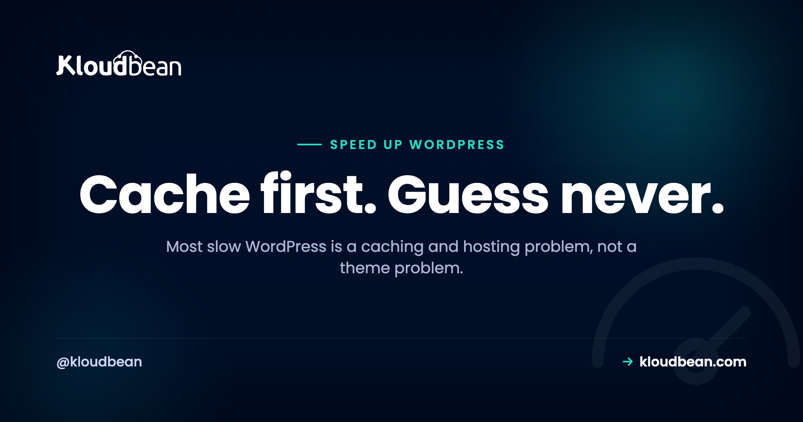
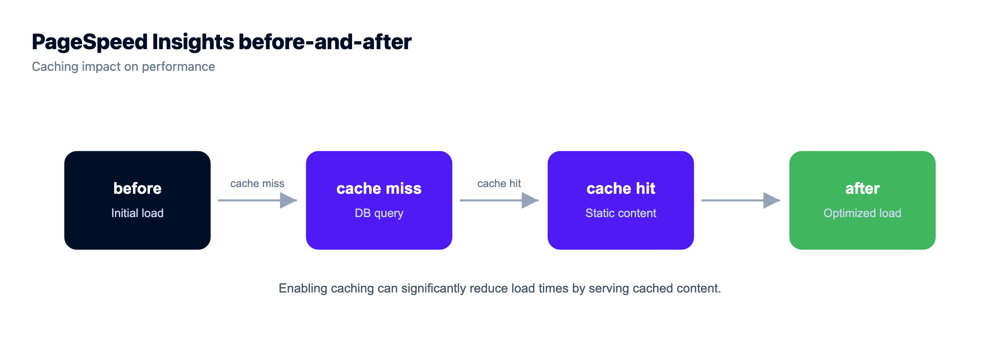
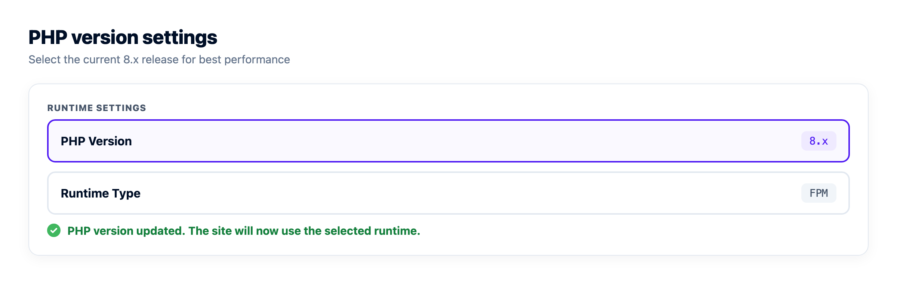

# How to Speed Up WordPress: Measure First, Then Fix the Big Things

Before you install a single "speed" plugin, open a page-speed tool and look at the actual numbers. Nine times out of ten the story is the same. Either the server spends half a second rebuilding a page it could have served from cache, or a single 2MB hero image is dragging the whole thing down.

That's the trap with most advice on how to speed up WordPress. It hands you ninety-nine tips and buries the two that matter. So this is ordered by real impact, and it starts with a rule nobody wants to hear: measure first, guess never.

> **The short version:** Measure with a page-speed tool so you know what's actually slow. Then fix the big things in order: turn on page caching and a Redis object cache, run a right-sized host with a current PHP, and shrink your images. A CDN helps for reach and spikes. Minifying and database cleanup are polish, not the main event. Most "slow WordPress" is a caching and hosting problem, not a theme problem.

## Measure before you try to speed up WordPress

Optimizing without measuring is how people waste a weekend minifying CSS on a site whose real problem was an uncached homepage. Run the site through PageSpeed Insights or GTmetrix, or just open your browser's network tab, and read two things.

- **TTFB (time to first byte).** This is the server thinking: PHP running, the database being queried, the page being assembled. A high TTFB points at caching, the host, or the PHP version. It has nothing to do with your images.
- **What downloads after that.** The waterfall shows every image, script, and stylesheet, with its size. This is where you spot the 2MB hero, the render-blocking script, the font nobody uses.

Then watch your Core Web Vitals, mainly LCP (how fast the biggest thing paints) and CLS (how much the layout jumps). Take a number before each change and after. That before-and-after is the only thing that tells you whether a fix actually helped, or whether you just felt busy.

<!-- Inline SVG in the HTML version: two page-load timelines, a long "before" bar dominated by server rebuild time and images, and a short "after" bar once caching, host, image work and a CDN are applied, with a legend mapping each segment to its lever. -->

## The biggest win by a mile: caching

If you do one thing, do this. **Page caching** stores a ready-made copy of each page, so the server hands it straight to visitors instead of rebuilding it from the database on every hit. On an uncached site that rebuild is most of your TTFB. Turn caching on and it often just collapses, which is why the same site suddenly feels snappy.

Then add **object caching** with Redis. Where page caching serves whole finished pages, object caching keeps the results of individual database queries in fast memory, so WordPress stops re-running the same lookups. That's the piece most people skip, and it's the one that helps logged-in pages, carts, and dynamic content that a page cache can't fully hold. Launch a managed Redis, point WordPress at it, done.

I'll take a position here, because it's earned every time we look at a "slow WordPress" ticket: most slow WordPress is a caching problem, not a theme problem. People rip out a theme they spent months on when the real fix was two caching layers they never switched on. If you want the mechanics of cache layers and when to clear them, see [how to clear the WordPress cache](https://www.kloudbean.com/blog/how-to-clear-wordpress-cache/), and for the object-cache side, [managed Redis hosting](https://www.kloudbean.com/blog/managed-redis-hosting/).

## The host underneath, and a current PHP

Your site can only ever be as fast as the machine it runs on. Two things live here. First, **enough resources**: a site starved of CPU or RAM crawls no matter how clever your optimization, so it needs to be sized for its traffic. Second, a **current PHP version**. Each recent PHP release has been meaningfully faster than the one before, so running something old like PHP 7.x leaves real speed on the table for nothing.

There's also **opcache**, which keeps compiled PHP in memory so it isn't recompiled on every request. On a well-tuned managed stack this is already on, PHP is kept current, and the server is tuned for WordPress, so a chunk of your performance is handled before you touch a setting. That's the quiet argument for managed hosting: the boring server work is done.

## Your heaviest asset is almost always images

Open that waterfall again. On most WordPress sites the biggest downloads are images, by a wide margin, and they're the easiest thing to fix. A few moves, in order:

- **Compress them.** Most images ship several times larger than they need to be. Compression alone can cut page weight hard.
- **Use modern formats.** WebP (and AVIF where supported) are dramatically smaller than old JPEGs and PNGs at the same quality.
- **Serve the right size.** Don't push a 3000px image into a slot that's 400px wide. That's pure wasted bytes, and it's everywhere.
- **Lazy-load below the fold.** WordPress does this by default now, so images only load when a visitor scrolls to them.

One more that pays off as a media library grows: move uploads to [object storage](https://www.kloudbean.com/blog/s3-compatible-object-storage/) instead of leaving them on the app server's disk. It keeps the server lean, and it's the same offload you'd want if you ever add a second server later.

## A CDN or edge cache for reach and spikes

A CDN stores copies of your files at locations around the world, so a visitor in Sydney is served from nearby rather than waiting on a round trip to a server in Virginia. It also soaks up traffic spikes and takes load off your origin. For images, CSS, and JS it's a large, easy win, and it compounds with the caching you already set up.

Cloudflare goes a step further: its edge cache (a paid add-on, and included for Enterprise accounts) can hold whole pages at the edge, so a lot of requests never reach your server at all. If your audience is spread across regions, this jumps up the priority list. If they're all in one city near your server, it matters less. Match the tool to the situation instead of cargo-culting it.

## Plugins: it's weight, not count

Here's the myth to drop: "too many plugins" isn't the problem. *Heavy* plugins are. One badly built plugin firing queries on every page can cost you more than a dozen light ones combined. So don't chase a low plugin count. Chase the expensive ones.

Deactivate and delete anything you're not using, since it's weight and risk even when idle. Then, if the site's still slow, profile it. A tool like Query Monitor shows you which plugins add the most load and the most queries, and the culprit is usually obvious once you look. Fix or replace that one, and you've often done more than every other tweak on this page.

## The smaller wins: minify, defer, tidy the database

Now the polish, worth doing after the big items and not before. **Minifying** strips whitespace from CSS and JavaScript to shrink files, and **deferring** non-critical JavaScript lets the page paint before scripts finish, so content shows sooner. A caching or optimization plugin usually handles both with a checkbox.

Over time a WordPress database also collects cruft: old post revisions, expired transients, spam comments, orphaned metadata. Clearing it out keeps queries lean, and it's a nice periodic tidy on an older site. Two cautions. Take a [backup](https://www.kloudbean.com/blog/server-backups-guide/) first, and limit stored revisions so a single page doesn't quietly hoard fifty old drafts. This is genuinely last on the list, because minifying an uncached, image-heavy site is polishing something that's still slow underneath.

## When speed turns into a scaling problem

There's a line where "my site is slow" stops being a per-site tuning job and becomes a capacity one. If you've cached properly, sized the server sensibly, and the site still buckles under genuinely high or spiky traffic, that's not a speed problem anymore. That's scaling. Adding servers behind a load balancer, splitting the database load, and the rest of that ladder belong in [scalable WordPress hosting](https://www.kloudbean.com/blog/scalable-wordpress-hosting/), which picks up exactly where this guide stops. Don't reach for it early, though. Caching and a right-sized box carry most sites a very long way.

## The honest bottom line

Notice the shape of this list. The first few items hold nearly all the speed: caching, a right-sized host with current PHP, and images. The rest is useful polish. A good managed host quietly handles a big slice of the top (server caching, tuned current PHP with opcache, an easy managed Redis, a CDN a click away), which leaves you the content-side calls: your images, your plugins, and what you build. It's a Linux stack under all of it. Measure, fix the big things first, and skip the parts that never mattered. And if security's next on your list, [secure WordPress hosting](https://www.kloudbean.com/blog/secure-wordpress-hosting/) is the companion to this one.

<!-- cta:start -->
**Let someone else patch the server.**

The stack, the patching, SSL, and backups are handled, so your work stays on the site rather than the box. Staging is one click, and the managed database sits right next to the app.

- Managed WordPress stack
- One-click staging
- Managed MySQL and MariaDB
- Automatic backups
- Free SSL
- Built-in load balancer

[Start free](https://console.kloudbean.com/register) · [See plans](https://www.kloudbean.com/pricing/)
<!-- cta:end -->

## FAQ

**What's the most effective way to speed up WordPress?**
Caching, by a wide margin. Page caching serves ready-made HTML instead of rebuilding each page from the database, which is usually the single biggest difference between a slow and a fast site. Pair it with a Redis object cache and you've addressed most WordPress slowness before touching anything else. Do caching first, always, then measure again.

**Why is my WordPress site slow even though it looks simple?**
Usually it's not the design, it's an uncached page being rebuilt from the database on every visit, an oversized image or two, or one heavy plugin. Run a page-speed test and look at the TTFB and the waterfall. A high TTFB points at caching, the host, or the PHP version, while big downloads point at images. The cause is almost always in one of those.

**Does a CDN make WordPress faster?**
Yes, especially if your visitors are spread across regions. A CDN serves your files from locations near each visitor rather than a single origin, cutting load times and absorbing traffic spikes. It works best on top of caching, not instead of it. If your whole audience sits near your server, its impact is smaller.

**Does the PHP version affect WordPress speed?**
A lot. Each recent PHP version has been meaningfully faster than the last, so running an old release leaves easy performance unclaimed. Moving from PHP 7.x to a current 8.x version is one of the simplest wins available. Managed hosting typically keeps PHP current, tuned, and running with opcache for you.

**Do too many plugins slow down WordPress?**
It's the weight, not the number. One poorly built or heavy plugin can slow a site more than a dozen light ones. Delete plugins you don't use, then profile the site with a tool like Query Monitor to find which ones add the most load, and fix or replace those specifically rather than just counting them.

**Should I use a Redis object cache for WordPress?**
If your site has meaningful dynamic content, yes. A Redis object cache stores database query results in memory so WordPress doesn't repeat the same lookups, which especially helps logged-in pages, WooCommerce carts, and busy blogs that a page cache can't fully cover. Launch a managed Redis and point WordPress at it; the effect on database-heavy sites is large.

**How do I optimize images on WordPress?**
Compress them, serve modern formats like WebP or AVIF, and make sure you're not loading an image far larger than it displays. Lazy loading is on by default now, so off-screen images wait until they're needed. On a growing site, offloading media to object storage keeps the server lean. Images are usually the heaviest part of a page, so this pays off fast.

**My WordPress site is still slow under heavy traffic. What now?**
If you've already cached properly and right-sized the server and it still struggles under high or spiky traffic, that's a scaling issue, not a per-site tuning one. The next steps are adding servers behind a load balancer and scaling the database, which is a separate topic covered in scalable WordPress hosting. Most sites, though, never reach that point once caching and sizing are sorted.

---

*Kloudbean · Cache first. Guess never.*
