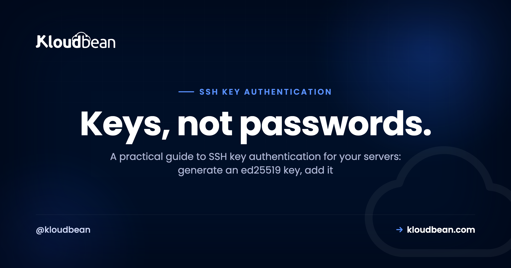
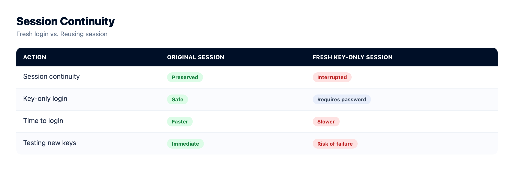
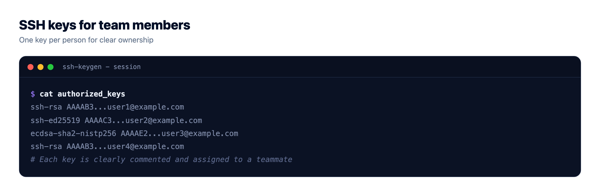
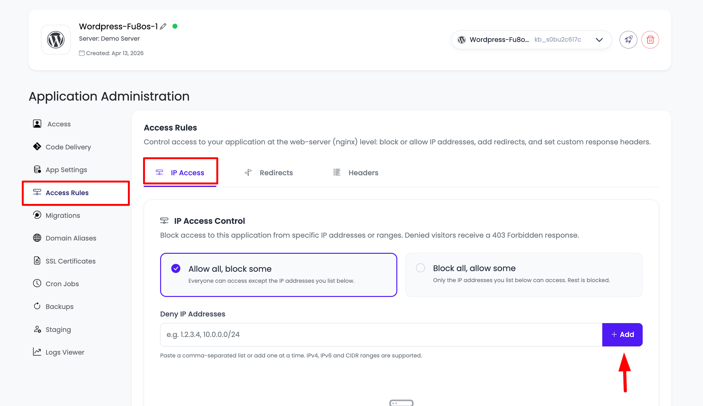
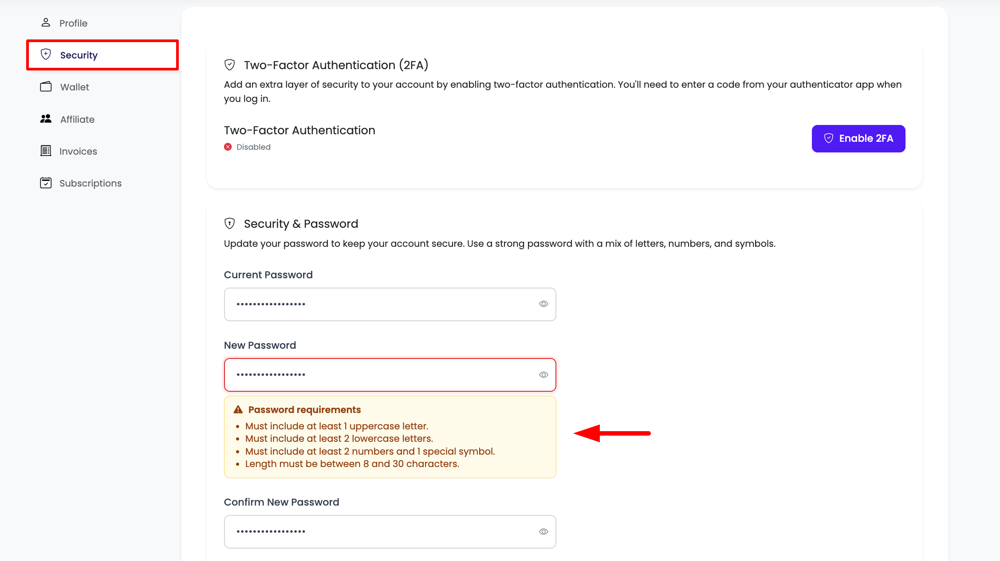
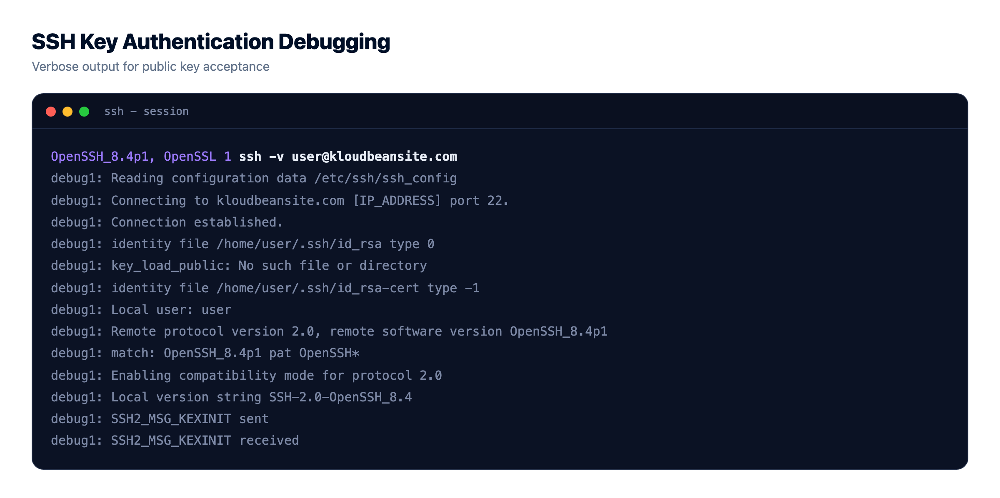

# SSH Key Authentication Done Right for Your Servers



SSH key authentication is the line between a server that shrugs off a thousand login attempts an hour and one that eventually gets guessed. If you still type a password to reach your box, you are defending it with the one thing bots are built to grind through. Keys flip that around, and nothing worth stealing ever crosses the wire.

This is the whole path: generate a modern key, put the public half on the server, log in without a password, then switch password login off for good. Plus the parts nobody mentions, an agent so you type your passphrase once, a config file for several servers, and clean team access. On a Kloudbean server the firewall and brute-force protection are already on, so your keys land on a door that is hard to kick in.

> **Short answer:** Generate an ed25519 key with `ssh-keygen -t ed25519`, copy the public key into the server's `~/.ssh/authorized_keys` with `ssh-copy-id`, confirm you can log in with no password, then set `PasswordAuthentication no` and reload sshd. Your private key never leaves your laptop and proves your identity through a challenge an attacker cannot replay. On a Kloudbean server, Shorewall and Fail2ban already guard port 22; keys are the part you bring.

## Why passwords lose the moment your server is public

Give a server a public IP and leave SSH on port 22, and it gets scanned within minutes. Not by a person. By bots running down lists of common usernames and leaked passwords, thousands of tries an hour. That is the baseline weather of the public internet.

A password is a shared secret. It travels on every login, gets reused between sites, shows up in breach dumps, and can be phished out of a tired human. Fail2ban helps, and on Kloudbean it is on by default: it bans an IP after a handful of failures, which kills most brute-force noise. Treat it as a speed bump, not a wall. Attacks spread across many IPs slide under the ban threshold.

Keys remove the secret entirely. The server keeps only your *public* key, which is safe to hand out; your private key stays on your machine and is never sent. Someone can read the public key all day and still not log in. When a key is rejected, SSH says so bluntly: `Permission denied (publickey)`. Annoying the first time, but it means the server turned away everything that was not a valid key. Honestly, once keys work, turn off password login and move on.

<!-- Bespoke inline SVG in the HTML mirror: "How SSH key authentication proves who you are": laptop holds private key id_ed25519, server holds the public key in authorized_keys, a Shorewall + Fail2ban gate guards port 22, and a four-step challenge/response handshake runs underneath. Brand navy #000f27, purple #4F1AF3, green #40b75f. -->

*Diagram: your laptop signs a one-time challenge with the private key. The server verifies it against your public key in authorized_keys, while Shorewall and Fail2ban guard the door.*

## SSH key authentication vs passwords, honestly

The ssh key vs password question has a clear winner for anything facing the internet, though keys are not weightless. You have a file to protect, and losing the only copy locks you out. With that noted, the honest scorecard:

| | Password auth | SSH key auth |
| --- | --- | --- |
| **Brute-force resistance** | Weak. Guessable, and bots try nonstop on port 22. | Strong. No secret to guess; the key space is astronomically large. |
| **Phishing resistance** | Poor. A password can be typed into the wrong box or handed over. | High. The private key is never sent, so there is nothing to phish. |
| **Revocation** | Change the password, then tell everyone the new one. | Delete one line from authorized_keys. That person is out, nobody else affected. |
| **Team scaling** | Shared password, or a growing list of accounts to sync. | One key per person, added and removed independently. |
| **Convenience** | Type it every time, or reuse a weak one. | Log in with no prompt once the agent holds your key. |
| **Main downside** | Everything above. | You manage a file. Lose it with no backup key and you are locked out. |

Keys win. The one downside, a lost file, is fixed by keeping a second key and using a platform with a way back in.

## Set up SSH key authentication: from a fresh server to key-only login

Seven steps, in order. Do not touch step six until step five works, because that is the one that can lock you out.

### 1. Get a server you can SSH into

You need a box and a user on it. On Kloudbean, click **Add Server**, pick a cloud (AWS, Lightsail, GCP, Linode, Vultr, DigitalOcean, or UpCloud), size it, and launch. It comes up in minutes with Shorewall, Fail2ban, and free SSL configured, and you get SSH access as the admin user.


No server yet, really here to ship an app? Same mechanics; the [deploy a Node app to a managed cloud](https://www.kloudbean.com/blog/deploy-node-app-to-managed-cloud/) walkthrough shows the full flow.

### 2. Generate an ed25519 key

On your own machine, not the server, generate an ssh key with the ed25519 algorithm:

```bash
ssh-keygen -t ed25519 -C "you@example.com"
```

ed25519 is the modern default: short keys, fast signing, excellent security. Accept the default path `~/.ssh/id_ed25519` and set a passphrase, which encrypts the private key on disk so a stolen laptop does not hand over your servers. You get two files: `id_ed25519` (private, guard it) and `id_ed25519.pub` (public, paste anywhere). No ed25519 on some ancient system? Fall back to `ssh-keygen -t rsa -b 4096`.



### 3. Put the public key on the server

The easy way copies your key up and fixes permissions:

```bash
ssh-copy-id user@server
```

That appends your `id_ed25519.pub` to the server's `~/.ssh/authorized_keys`. If `ssh-copy-id` is missing (some minimal images, stock macOS), do it by hand:

```bash
# on your laptop: show the public key
cat ~/.ssh/id_ed25519.pub

# on the server, logged in as your user:
mkdir -p ~/.ssh
chmod 700 ~/.ssh
echo "ssh-ed25519 AAAA...your-public-key... you@example.com" >> ~/.ssh/authorized_keys
chmod 600 ~/.ssh/authorized_keys
```

Permissions matter here and trip people constantly. sshd ignores `authorized_keys` if that file or `~/.ssh` is writable by anyone but you. So `chmod 700 ~/.ssh` and `chmod 600 ~/.ssh/authorized_keys`, and keep your home directory not group-writable. Test it: `ssh user@server` should let you in with no password.

### 4. Load the key into ssh-agent

You set a passphrase, but you do not want to type it on every connection. ssh-agent holds the decrypted key in memory for your session:

```bash
eval "$(ssh-agent -s)"
ssh-add ~/.ssh/id_ed25519
```

On macOS, add `--apple-use-keychain` so it survives reboots. Check what is loaded with `ssh-add -l`. One habit worth forming: be careful with agent forwarding (`ssh -A`), which lets a server use your local keys. Handy, and risky if that server is compromised, so keep it off unless you need it.

### 5. Manage multiple keys with ~/.ssh/config

More than one server, or a work key and a personal key? An ssh config file handles multiple keys and gives each host a short name:

```
# ~/.ssh/config
Host prod
    HostName 203.0.113.10
    User admin
    IdentityFile ~/.ssh/id_ed25519
    IdentitiesOnly yes

Host github.com
    HostName github.com
    User git
    IdentityFile ~/.ssh/id_ed25519_personal
    IdentitiesOnly yes
```

Now `ssh prod` just works. That `IdentitiesOnly yes` line matters more than it looks: without it the agent offers every key it holds, and a server that rejects a few in a row throws `Too many authentication failures` before it reaches the right one. Pin each host to its own `IdentityFile`, and keep the file at `chmod 600`.

### 6. Disable password authentication

Only now, with key login working, turn passwords off. This makes brute force pointless: there is no password to grind. Edit `/etc/ssh/sshd_config`:

```
# /etc/ssh/sshd_config
PubkeyAuthentication yes
PasswordAuthentication no
KbdInteractiveAuthentication no
PermitRootLogin prohibit-password
```

Reload sshd so it picks up the change:

```bash
sudo systemctl reload sshd
# some distros name the unit ssh, not sshd:
sudo systemctl reload ssh
```

The rule that saves careers: keep your current session open and test `ssh prod` in a new terminal before closing anything. If the new session logs in by key and refuses passwords, you are done. If it fails, you still have the original session to fix it. Logging off too early is the classic own-goal.



### 7. Lock the door at the network edge too

Keys decide who may authenticate. The firewall decides who can reach port 22 at all. On Kloudbean, Shorewall and Fail2ban run by default, and **IP Access Control** lets you allow or deny by IP or CIDR. Scope SSH to your office or VPN range and background scanning cannot even connect. Quieter logs, and Fail2ban mops up the rest.



Hardening the box anyway? Our explainer on [what a WAF does](https://www.kloudbean.com/blog/what-a-waf-does/) covers application-layer filtering, and the [security headers guide](https://www.kloudbean.com/blog/security-headers-guide/) handles the HTTP side.

## Team access and rotating keys

A key setup for one person is easy. The interesting part, where teams get sloppy, is more than one human needing in.

- **One key per person, never a shared key.** A shared key cannot be revoked for one person without rotating it for everyone, so nobody does. Each teammate makes and adds their own line.
- **Name the keys.** The comment at the end of each authorized_keys line (the `you@example.com` part) is free documentation, so you know whose key is whose next year.
- **Off-boarding is a one-line delete.** When someone leaves, remove their line from `authorized_keys`. That is the whole revocation, effective the second you save.
- **Rotate ssh keys on a rhythm, and instantly on a scare.** Add the new key, remove the old line. Do it on a schedule, and immediately if a laptop goes missing or a key file might have leaked.
- **Least privilege.** Give people the account they need, not root. Everyday work as a normal user, admin tasks through `sudo`.


There is a platform layer above the server. Kloudbean's subusers and [User Access Control](https://www.kloudbean.com/blog/user-access-control-explained/) give granular, per-resource, per-action permissions, so a contractor can manage one app without seeing billing or your other servers. Pair that with IP Access Control on the box. The dashboard login also supports MFA and social login (Google, GitHub, LinkedIn). One precise point: dashboard MFA protects your Kloudbean *account*, which is separate from the SSH keys that reach the server's shell. You want both.





### When SSH says Permission denied (publickey)

The error everyone hits, a catch-all for the server turning your key away. Run `ssh -v user@server` and read what it tries. Then the usual suspects, roughly by frequency, and if none of them match, the longer breakdown of [how to fix SSH key rejection](https://www.kloudbean.com/blog/fix-permission-denied-publickey/) works through the rarer causes, like a key type newer OpenSSH refuses or a Git host rejecting the same way:

- **Wrong key offered.** Confirm the right one with `ssh-add -l`, then pin it in `~/.ssh/config` with `IdentityFile` and `IdentitiesOnly yes`.
- **Agent not running.** If `ssh-add -l` says the agent has no identities, start it and re-add the key from step four.
- **Bad permissions.** The silent one. `~/.ssh` must be 700, `authorized_keys` 600, and your home directory not group-writable. The server's `/var/log/auth.log` will say why.
- **Key in the wrong place.** It never landed, or it went into a different user's `authorized_keys`. Check the exact line is present for the user you log in as.
- **Right key, wrong username.** It might be `admin`, `root`, or `ubuntu` depending on the image.


## How this fits a managed Kloudbean server

The honest boundary: Kloudbean gives you a server on your choice of seven clouds, hardened from first boot with Shorewall, Fail2ban, and free SSL, and wraps IP Access Control and User Access Control around it. What it does *not* do is hold your private keys or log in for you. There is no vault that authenticates on your behalf, which is correct: a private key only means something if you alone hold it.

What you get is a starting line already hard to attack, so your keys land on a door that resists constant probing. Automatic backups mean a missing key still leaves a route back, and [private networking and a VPC](https://www.kloudbean.com/blog/what-is-a-vpc/) are there on Enterprise when you need deeper isolation. Test that backup route first; the [server backups guide](https://www.kloudbean.com/blog/server-backups-guide/) covers how. You bring the keys. The platform brings a server hardened before you logged in.

<!-- cta:start -->
**Patched, firewalled, and backed up.**

The platform keeps the server, stack, SSL, and patching current, with automatic backups running. Application-level security stays yours, and that split is deliberate rather than hidden.

- Shorewall firewall
- Fail2ban
- OS patching handled
- Free SSL
- IP access control
- Automatic backups

[Start free](https://console.kloudbean.com/register) · [See plans](https://www.kloudbean.com/pricing/)
<!-- cta:end -->

## FAQ

**Is SSH key authentication safe?**
Yes, and safer than a password on the public internet. The server stores only your public key; the private key never leaves your machine, so there is no shared secret to guess or phish. A passphrase covers you even if the laptop is stolen.

**ed25519 vs RSA, which should I use?**
Use ed25519. Smaller keys, faster signing, excellent security, and it is the modern default. Only fall back to RSA (at 4096 bits) if you hit an old system that does not support ed25519, which is rare now.

**How do I fix Permission denied (publickey)?**
Run `ssh -v user@server` to see which key is offered. Usual causes: the wrong key is sent, the agent is not holding your key, permissions are too loose (~/.ssh must be 700, authorized_keys 600), the key is not in the right user's authorized_keys, or the username is wrong.

**Should I disable password login?**
Yes, once key login works. Set `PasswordAuthentication no` in sshd_config and reload, testing a fresh session before you close the current one. With passwords off, brute-force attempts have nothing to guess.

**How do I revoke someone's SSH key?**
Delete their line from the server's `~/.ssh/authorized_keys`. That is the whole revocation, immediate and specific to that person. It is exactly why you use one key per person, not a shared team key.

**How do I use different keys for different servers?**
Create a `~/.ssh/config` file with a Host block per server, each pointing at its own IdentityFile. Add `IdentitiesOnly yes` so the agent offers only that key, which avoids Too many authentication failures. Then connect with a short name like `ssh prod`.

**How often should I rotate SSH keys?**
On a schedule you will actually keep, and immediately if a key might be compromised, like a lost device or leaked file. Rotation is a quick add-new, remove-old edit to authorized_keys. Cheap to do, valuable when something goes wrong.

**Does Kloudbean manage my SSH keys for me?**
No, by design. Kloudbean gives you a hardened server with Shorewall, Fail2ban, and free SSL, plus IP Access Control and User Access Control, but you generate, place, and rotate your own keys. A private key only protects you if you alone hold it.

---

*By Kloudbean Security · Keys, not passwords.*
