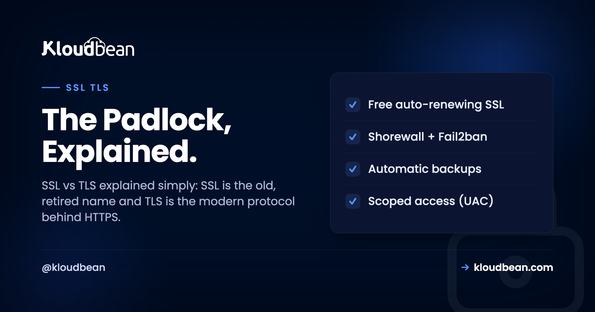
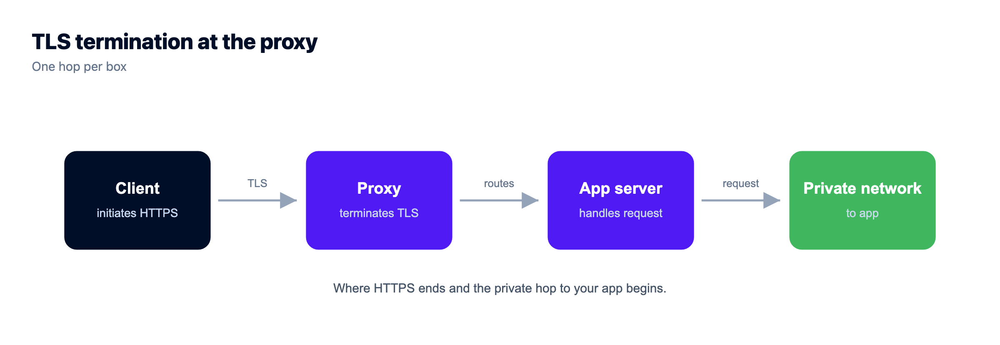
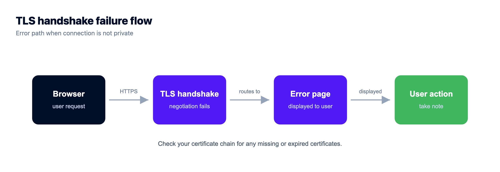
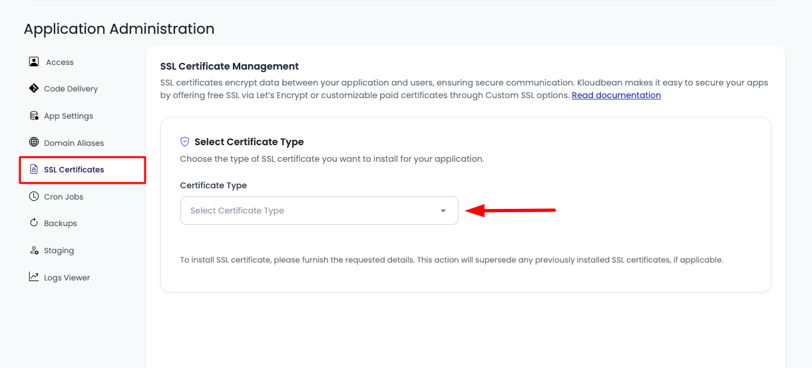
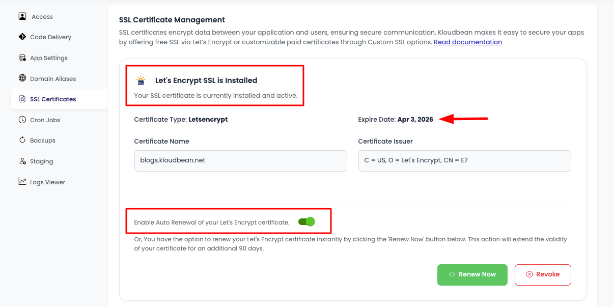
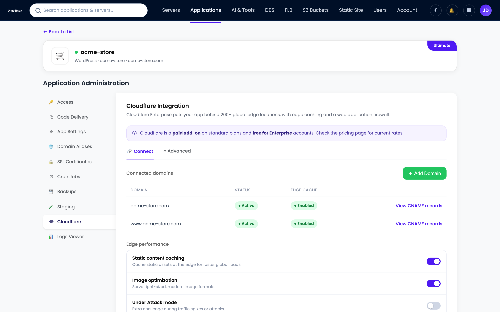

# SSL vs TLS: What's the Difference, and Which One Are You Actually Using?

Type a domain, hit enter, and a little padlock shows up next to the address. That padlock is the whole SSL vs TLS story squeezed into one icon, and most people never think about it until it flips to a red "Not Secure" warning. So which one is guarding your site, SSL or TLS? Short version: it's TLS. It's been TLS for years. We just kept saying SSL out of habit.

This is SSL/TLS explained without the hand-waving. What the two names mean, what TLS actually does to a connection, how the handshake works at a level you can picture, what a certificate is and who hands them out, and why your browser cares so much. By the end the padlock stops being magic.

> **The short answer:** SSL and TLS are two names for the same job, securing a connection, from two eras. SSL is the original 1990s protocol, now retired and unsafe. TLS is its successor, and it's what every HTTPS site actually runs today, usually TLS 1.2 or 1.3. People still say "SSL certificate" out of habit, but the protocol doing the work is TLS.

## SSL vs TLS: the honest one-line answer

SSL stands for Secure Sockets Layer, invented at Netscape in the mid-90s to encrypt traffic between a browser and a server. TLS stands for Transport Layer Security, the standardized successor. When the protocol moved from Netscape to the IETF in 1999, the version ticked over and the name changed with it. TLS 1.0 was basically SSL 3.1 with a new badge. The name changed, the habit didn't, and that's the whole source of the confusion.

Now the part that matters for security. SSL 2.0 and SSL 3.0 are both dead. SSL 3.0 got broken wide open by the POODLE attack in 2014, and browsers refuse to speak either version now. So if a "SSL certificate" is securing your site today, the actual conversation on the wire is TLS. The protocol underneath moved on. Nobody selling you an "SSL certificate" is lying, it's just an old label on a modern thing. The precise answer to "SSL or TLS?" is TLS.

| Version | Released | Status today |
| --- | --- | --- |
| SSL 1.0 | Never shipped | Scrapped for security flaws before release |
| SSL 2.0 | 1995 | Dead, formally prohibited |
| SSL 3.0 | 1996 | Dead, broken by POODLE in 2014 |
| TLS 1.0 | 1999 | Deprecated in 2021 |
| TLS 1.1 | 2006 | Deprecated in 2021 |
| TLS 1.2 | 2008 | Still widely used and safe |
| TLS 1.3 | 2018 | Modern, recommended |

Read that table top to bottom and the story tells itself. Everything with "SSL" in the name is retired. The live web runs on the bottom two rows.

## So what does TLS actually do?

Most people think HTTPS "just encrypts stuff." Encryption is only one of three jobs TLS does, and honestly the other two are where the interesting failures live.

- **Encryption.** It scrambles the data so anyone on the wire (the coffee-shop wifi, your ISP, every router in between) sees noise instead of your password or card number. Without TLS, a login form sends your password across the internet in plain text.
- **Integrity.** Every chunk of data carries a check value, so if someone flips even a single byte in transit, the other side notices and rejects it. That's what stops a network in the middle from injecting ads, trackers, or malware into a file you're downloading.
- **Authentication.** It proves you're talking to the real server and not an impostor. This is the certificate's job, and the one people forget, because encryption on its own would happily encrypt your traffic straight into an attacker's hands.

That third one is the quiet hero. Encryption without authentication is a trap: your data is scrambled beautifully, just not to the person you think. TLS ties encryption and identity together, so a man-in-the-middle can't slip between you and the real server without the certificate check failing loudly.



## How the TLS handshake works, without the math

Before any real data moves, the client and server run a quick negotiation called the handshake. It settles two things: which version and ciphers both sides can speak, and a shared secret key to encrypt the rest of the session. Picture it as four beats.

1. **ClientHello.** Your browser opens with "here are the TLS versions and cipher suites I support, plus a random number to start."
2. **ServerHello and certificate.** The server picks a version and cipher both sides support, then sends its certificate, which carries its public key and a signature from a Certificate Authority.
3. **Key exchange.** Using asymmetric crypto (a public and private key pair), the two sides agree on a shared secret without ever sending it across the wire. Modern TLS uses ephemeral keys, so every session gets a fresh one.
4. **Encrypted session.** Both sides now hold the same symmetric key and switch to fast symmetric encryption for the actual data. Handshake done.

Why two kinds of crypto? Each is good at what the other's bad at. Asymmetric crypto can agree on a secret over an open channel safely, but it's slow. Symmetric crypto is fast, but both sides need to already share a key. So TLS uses the slow one briefly to set up the fast one. That trick is why HTTPS isn't painfully sluggish on every request.

```
   Client (your browser)                         Server (holds the certificate)
        |  --- 1 · ClientHello: ciphers + a random ------------>  |
        |  <-- 2 · ServerHello + certificate --------------------  |
        |  --- 3 · Agree one shared secret (key exchange) ------>  |
        |  ==== 4 · Encrypted session: symmetric key, both ways == |
```
*The handshake settles a version, a cipher, and a shared key, then hands off to fast symmetric encryption. TLS 1.3 folds steps 1 to 3 into a single round trip.*

Worth knowing: TLS 1.3 trimmed this dance to a single round trip, and a resumed connection can even send data on its first message. TLS 1.2 usually needed two round trips first. Fewer trips means a faster first byte, which you feel most on mobile, where every round trip to a distant server costs real milliseconds.

## What is an SSL certificate, and who issues it?

A certificate (properly a TLS certificate, still universally called an SSL certificate) is a small signed file that binds a domain name to a public key. In plain terms it says "the site at example.com owns this public key," and that claim is vouched for by a signature you can check.

Who does the vouching? A **Certificate Authority**, or CA. A CA is an organization that browsers and operating systems have collectively decided to trust. Before signing, the CA checks that you actually control the domain (for the common, cheap kind of cert, that check is automated and takes seconds), then signs. Now any browser can verify your cert without ever having met you.

That works through a **chain of trust**. Your certificate is signed by an intermediate CA, the intermediate is signed by a root CA, and the root ships pre-installed in your browser or OS trust store. Your browser walks that chain upward. Reach a trusted root with every signature checking out, and you get the padlock. Break the chain, and you get a warning instead.

Certificates come in flavors by how hard the CA verified you: domain validation (DV, just proves you control the domain), organization validation (OV), and extended validation (EV, the most vetting). Honestly, for most sites plain DV is all you need. Browsers stopped showing the fancy green company name for EV years ago, so the practical gap narrowed a lot.

The thing that changed everything was **Let's Encrypt**, a nonprofit CA that made DV certificates free and fully automated starting in 2015. Before that you paid a vendor and clicked through forms once a year. After it, a script could request, install, and renew a certificate with zero humans involved. That single shift is most of the reason HTTPS went from "nice for checkout pages" to expected on everything.

> **The padlock is smaller than people think.** A padlock does not mean "this is a safe, honest website." A phishing site can hold a perfectly valid certificate too. All the padlock certifies is that the connection is encrypted and the certificate is valid for this exact domain. "Not Secure" means there's no valid TLS at all, so treat anything you type into that page as public.

## TLS 1.2 vs 1.3: what actually changed?

TLS 1.3, published in 2018, is the cleanup that 1.2 had been needing for a decade. It's faster and safer by default, and the "by default" part is the important bit.

- **Faster handshake.** One round trip instead of two, plus a resumption mode that can send data immediately on reconnect. Lower latency, especially over mobile.
- **A smaller, cleaner menu of ciphers.** TLS 1.3 threw out the old, weak, rarely-used algorithms behind a surprising share of historical TLS vulnerabilities. Fewer options, fewer ways to misconfigure yourself into a hole.
- **Forward secrecy, always on.** Every session uses a fresh ephemeral key. So even if an attacker records your traffic today and steals the server's private key next year, they still can't decrypt those old sessions. TLS 1.2 could do this if configured well. TLS 1.3 makes it mandatory.

| | TLS 1.2 | TLS 1.3 |
| --- | --- | --- |
| **Released** | 2008 | 2018 |
| **Handshake** | Usually 2 round trips | 1 round trip, 0 on resume |
| **Cipher suites** | Many, including old weak ones | Small, modern only |
| **Forward secrecy** | Optional | Always on |
| **Verdict** | Fine and still common | Prefer it where you can |

You don't usually pick this by hand. A well-run server offers both, prefers 1.3, and lets each client negotiate the highest version it supports. Modern browsers land on 1.3, older clients fall back to 1.2, and 1.0 and 1.1 stay switched off entirely.

## Where does TLS actually get decrypted? (TLS termination)

Encryption has to end somewhere, because your application code needs to read the request in plain form to do anything with it. The spot where the encrypted connection ends and plain HTTP begins is called **TLS termination**.

On most real setups it isn't your app doing that. It's the web server or reverse proxy out front (Nginx or Apache), or a load balancer, that holds the certificate, ends the encrypted connection, and passes plain HTTP to your app over a private network behind it. One place owns the cert and speaks HTTPS to the world. Your app speaks plain HTTP internally and never touches a `.pem` file. For the full picture of that front-door server, see [how a reverse proxy works](https://www.kloudbean.com/blog/reverse-proxy-explained/). The one rule: keep that plain-HTTP hop on a private network, not the open internet. Terminating TLS only helps if you don't then expose the plaintext on the next hop.



## Why SSL certificates expire, and why that's a good thing

Certificates carry an expiry date on purpose. A shorter lifetime limits the damage if a private key ever leaks, since a stolen key is only useful until the cert rotates. The industry keeps shrinking these windows. Let's Encrypt certificates last 90 days, and the ceiling for paid certs keeps dropping too.

The catch bites people all the time. A certificate that isn't renewed before it expires takes your whole site down with a full-page, browser-blocking error. An expired cert is the single most common way HTTPS breaks in production. It's not hackers. It's a renewal that quietly didn't run.

So automate it and stop thinking about it. A cron-driven renewal, or a platform that renews for you, is the entire answer. Nobody should be renewing certificates by hand in 2026. If you are, you've scheduled a future outage and just don't know the date yet. If one's already gone red on you, here's a focused walkthrough for [fixing common SSL certificate errors](https://www.kloudbean.com/blog/fix-ssl-certificate-errors/).





*Free auto-renewing SSL in the Kloudbean console. The certificate refreshes before it expires, so there's no renewal to forget and no .pem file to manage.*

## The SSL/TLS errors you'll actually run into

When TLS breaks, the browser throws a scary full-page warning and refuses to load the site. Intimidating, but the cause is almost always one of a short list. Learn these five and you'll diagnose most of them in seconds.

- **Name mismatch.** The certificate is for `www.example.com` but you visited `example.com`, or vice versa. Chrome shows `ERR_CERT_COMMON_NAME_INVALID`. Fix: get a cert that covers both names.
- **Expired.** The renewal didn't run. You'll see `NET::ERR_CERT_DATE_INVALID`. Fix: renew, then automate it.
- **Self-signed or untrusted issuer.** The cert wasn't signed by a CA in the trust store. Fine on your laptop for local dev, never okay in production.
- **Incomplete chain.** The server forgot to send the intermediate certificate, so some clients can't build the chain up to a root. Maddening one: it often passes in desktop Chrome and fails on certain phones.
- **Mixed content.** The page loads over HTTPS but pulls an image or script over plain `http://`. The browser blocks or warns, and the padlock breaks even though your certificate is valid.

Mixed content is the sneaky one. Your cert is fine, the handshake is fine, and the padlock still won't turn solid because one stray `http://` asset dragged the page down. Check it first when the cert itself looks healthy.

<!-- ADD IMAGE: a full-page browser TLS warning ("Your connection is not private") with the error code visible. -->

> **TLS secures the pipe, not the payload.** A valid certificate encrypts the connection and proves the server's identity. It does nothing about a SQL injection or a weak password. That's a different layer: sane [security headers](https://www.kloudbean.com/blog/security-headers-guide/) and, for filtering malicious traffic, a [web application firewall](https://www.kloudbean.com/blog/what-a-waf-does/). HTTPS is the floor, not the whole house.

## How SSL works on Kloudbean (you never touch a .pem file)

Everything above is worth understanding once. Now the part where you get to stop thinking about it. On Kloudbean, SSL is part of the managed stack. Add an app or a static site and the platform issues free, auto-renewing SSL and terminates TLS at the web-server layer in front of your app. No certificate to generate, no cron job to babysit, no renewal to diarize. The cert refreshes before it lapses, and your app keeps speaking plain HTTP privately behind the proxy. The split of responsibility stays honest: the platform handles the certificate, the renewal, and the termination, and you own your app and data on Linux stacks like PHP, Node, Python, Ruby, and Java. That's what [a managed server actually covers](https://www.kloudbean.com/blog/what-is-a-managed-server/).

Need TLS terminated at the edge with a CDN for global speed? Cloudflare is an optional paid add-on (free on Enterprise) that ends TLS close to your users and caches near them. Baseline free SSL is included either way. And because servers, apps, managed databases, static sites, and the load balancer all sit under one dashboard, your certificates aren't scattered across five vendors with five renewal quirks, which is roughly the point of [running your stack on managed cloud](https://www.kloudbean.com/blog/how-cloud-hosting-works/). For teams with tighter obligations, that single pane also feeds into [secure, compliance-friendly hosting](https://www.kloudbean.com/blog/secure-compliant-hosting/).


*Cloudflare edge TLS and CDN is an optional add-on (free on Enterprise). The built-in free SSL is there regardless.*


## SSL vs TLS: what to actually remember

Strip it right down. SSL is the old name, TLS is what actually runs, and every real HTTPS site today speaks TLS 1.2 or 1.3. TLS does three jobs, not one: it encrypts your data, it detects tampering, and it proves you reached the genuine server. The certificate proves that last part, signed by a CA your browser already trusts. And the number one reason HTTPS breaks in the wild isn't some clever attack. It's a certificate that expired because nobody renewed it. Automate that, or hand it to a platform that does, and the padlock takes care of itself.

<!-- cta:start -->
**The server layer, hardened for you.**

The platform keeps the server, stack, SSL, and patching current, with automatic backups running. Application-level security stays yours, and that split is deliberate rather than hidden.

- Shorewall firewall
- Fail2ban
- OS patching handled
- Free SSL
- IP access control
- Automatic backups

[Start free](https://console.kloudbean.com/register) · [See plans](https://www.kloudbean.com/pricing/)
<!-- cta:end -->

## FAQ

**What's the difference between SSL and TLS?**
They're the same idea from two eras. SSL (Secure Sockets Layer) is the original 1990s protocol, now retired and unsafe. TLS (Transport Layer Security) is its standardized successor and what every secure site runs today. People still say "SSL certificate" out of habit, but the work is done by TLS.

**Is SSL still used?**
Not as a live protocol. SSL 2.0 and 3.0 are both broken and disabled in every modern browser. What's still alive is the word SSL as a casual label for certificates and HTTPS, while the technology underneath is entirely TLS.

**What is a TLS handshake?**
It's the short negotiation before any real data moves. The client and server agree on a version and cipher, the server presents its certificate, and both sides work out a shared secret key. Then they switch to fast symmetric encryption for the session. TLS 1.3 does it in a single round trip.

**What is an SSL certificate?**
It's a small signed file that binds a domain name to a public key, proving a site owns that key. A Certificate Authority signs it after checking you control the domain, and your browser trusts it by following a chain up to a root it already knows. Technically it's a TLS certificate.

**Who issues SSL and TLS certificates?**
Certificate Authorities (CAs). A CA is an organization browsers and operating systems trust to verify domain ownership and sign certificates. Let's Encrypt is a nonprofit CA that made domain-validated certificates free and automated, a big reason HTTPS is now everywhere.

**Is TLS 1.3 better than TLS 1.2?**
Yes, in most ways that matter. TLS 1.3 has a faster one round trip handshake, a smaller set of modern ciphers, and forward secrecy on by default. TLS 1.2 is still safe and widely used, so a good server offers both and prefers 1.3.

**Do I need to renew my SSL certificate?**
Yes. Certificates expire on purpose, and an expired one takes your site down with a browser-blocking error. The fix is automation: a scheduled renewal, or a managed platform that renews for you before the cert lapses. Renewing by hand is asking for a surprise outage.

**Why does my browser say 'Not Secure'?**
It means the page isn't protected by valid TLS: no certificate, an expired one, a name that doesn't match the domain, or an incomplete chain. Anything you type on a "Not Secure" page can be read by others on the network, so fix the certificate before trusting the site with data.

**What is TLS termination?**
It's the point where the encrypted connection ends and plain HTTP begins so your app can read the request. It usually happens at a reverse proxy or load balancer that holds the certificate, not in your app code. The decrypted traffic should then travel to your app over a private network.

**Does Kloudbean include free SSL?**
Yes. Kloudbean issues free, auto-renewing SSL for your apps and sites and terminates TLS at the platform's web-server layer, so you never generate certificate files or manage renewals. Cloudflare edge TLS with a CDN is an optional paid add-on (free on Enterprise), but the baseline free SSL is included on every account.

---

*By Kloudbean Security · The Padlock, Explained.*
