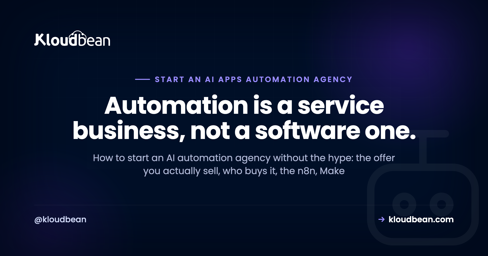
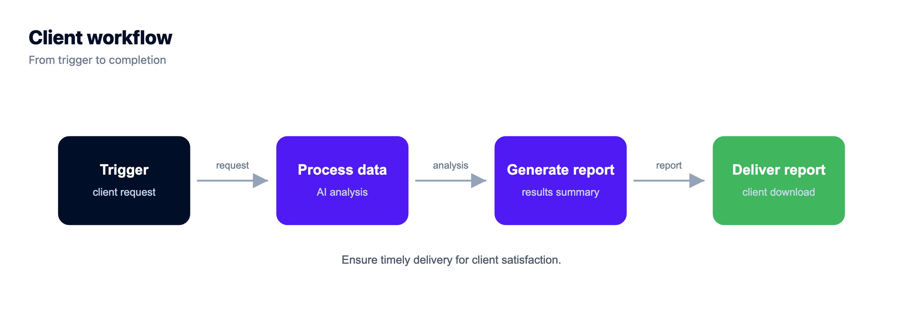

# How to Start an AI Automation Agency: An Honest Playbook

By Kloudbean Engineering · Automation is a service business, not a software one.

So you want to start an AI automation agency. Right now half of tech Twitter is selling the dream, usually with a screenshot of a payments dashboard and very little about the actual work. Strip the hype off and there's a real service business underneath: you build automations that remove manual work for other companies, using tools like n8n, Make, Zapier, and an LLM API where it genuinely earns its place. This is the honest playbook. What you sell, who buys it, the tooling stack, how you deliver, and how to host client automations without turning into a full-time sysadmin.

> **The short version.** An AI automation agency builds and maintains workflow automations for businesses, wiring their apps together with n8n, Make, or Zapier and adding LLM calls where they help. To start you need one narrow offer, one tool you know well, a reliable place to host client workflows, and a first paying client. The moat is delivery, not the tools.

## What you need to start an AI automation agency

The barrier here is lower than the hype suggests, which cuts both ways: easy to start, easy to start badly. Before you register a business name or buy a domain, get honest about the short list of things that actually matter.

- **One narrow offer.** A specific automation you can describe in a single sentence. Not "we automate anything."
- **One tool you actually know.** Pick n8n, Make, or Zapier and get good at it before you spread across all three. Add an LLM API when it earns its place.
- **A reliable place to run client automations.** Workflows that die silently at 3am, with nobody watching, are worse than no automation at all.
- **A way to keep clients separate.** Separate access, separate data, separate billing. This one gets skipped, and it's the one that bites hardest later.
- **A first paying client.** Almost always someone who already knows and trusts you. Referrals beat cold outreach at the start, every time.

Notice what's not on that list. A big team. A polished website. A custom AI model you trained yourself. Investor money. You can start this solo, part-time, on the strength of one workflow that saves one person a few hours a week. So don't let "I need to set everything up first" become the reason you never ship the first automation.

## What an AI automation agency actually sells

Let's define it plainly, because the label confuses people. An AI automation agency is a service business that designs, builds, and maintains automated workflows for other companies, connecting the apps and data they already use so that work which used to be manual now happens on its own.

Here's the part the hype skips: most of the value is boring. It's moving a lead from a form into a CRM, tagging it, and pinging a salesperson. It's turning a messy inbox into tickets. It's generating the same weekly report a human rebuilds by hand every Monday. The "AI" is often one node in a larger plumbing job: an LLM that summarizes a support thread, drafts a reply, classifies an email, or extracts fields from a document. Useful, real, and rarely the whole product.

So sell the outcome, not the technology. Clients don't want "an AI workflow." They want three hours of their week back, or an end to the copy-paste errors that keep biting them. Frame every offer as removed manual work, fewer mistakes, or faster turnaround. The tools are how you deliver that. They're not the pitch.

## Who actually pays for automation work

Demand for this work is real and growing, because every business now runs on a stack of SaaS tools that don't talk to each other, and somebody is paid to be the glue between them. That somebody is expensive and bored. You're selling to whoever feels that pain.

In practice the buyers cluster into a few groups. Small and mid-size businesses drowning in manual ops, where one person spends half their week on repetitive data entry. Operations, RevOps, and marketing teams that have a process nobody enjoys owning. E-commerce shops stitching orders, inventory, and support together. Professional services firms (agencies, law, accounting, real estate) with intake and reporting that repeats on every client. The common trigger to buy is always the same: a painful manual process, a hire they'd rather not make, or an error that already cost them money.

Where do you find them? Start with your own network and the niche communities you're already in. The best early clients are people who trust you enough to let you into their systems, because that access is exactly what a stranger won't hand over. Do good work for a few, ask for referrals, and let the niche do the marketing for you.

## The tooling stack: n8n, Make, and Zapier

You don't need all three. You need one you know cold, plus an LLM API for the AI layer. But it helps to understand the honest tradeoffs, because they shape your margins later.

|  | Zapier | Make | n8n |
| --- | --- | --- | --- |
| Pricing model | Per task, monthly plans | Per operation, cheaper per action | Free self-hosted, or metered Cloud |
| Hosting | Fully hosted | Fully hosted | Self-host or Cloud |
| Best for | Easiest start, biggest app library | Visual builder, complex branching | Data control and flat cost at volume, code nodes |
| Where it bites | Cost climbs with task volume | Still metered, steeper to learn | You run the server (or pay for Cloud) |
| Your client's data | Runs through Zapier | Runs through Make | Stays on your server when self-hosted |

One measured line on each. Zapier is the quickest way to get a client a result on day one, with the widest set of pre-built connectors. Make gives you a more visual canvas and better branching for the price. n8n is open source and self-hostable, which is what you want once volume, data sensitivity, or your own margins start to matter.

Here's my actual advice: start on whatever gets your first client's result quickest, usually a hosted tool. Then move heavier or data-sensitive work to self-hosted n8n when the numbers justify it. That's a genuine tradeoff, not an always-win. Hosted tools cost you nothing to run but bill per task and route client data through their cloud. Self-hosting flips both: flat cost and data on your box, but now there's a server in the picture. The full cost math is in [the case for self-hosting n8n](https://www.kloudbean.com/blog/self-host-n8n/), and there are other [self-hosted tools worth knowing](https://www.kloudbean.com/blog/best-self-hosted-tools/) once you're comfortable running your own.

## Pick one offer and one niche before anything else

This is where most new automation agencies quietly fail. Not because the tech is hard. Because they try to be everything to everyone, and "we automate any process for any business" is impossible to sell, impossible to price, and impossible to get referred for.

So niche down, hard, at least to start. Pick an industry or a single workflow. "Lead-to-CRM automation for real estate teams" beats "we do automation." A narrow offer is easier to explain in one sentence, easier to template so the second client is faster than the first, and far easier to get word-of-mouth for, because referrals travel inside industries. You can always broaden later once you've got proof and repeatable delivery. Starting broad just means starting slow.

## How a client project actually runs, start to finish

The delivery model matters more than the tool. A clean, repeatable process is what separates a real agency from someone fiddling with Zaps. Here's the shape of a good engagement.

- **Discovery.** Map the client's manual process and find the one step that hurts most. Don't try to automate everything. Automate the part that's bleeding time or causing errors.
- **Scope one workflow.** Define the trigger, the steps, and what "working" means, in writing. A one-page scope stops the endless "can it also do..." creep that eats your margin.
- **Build and test.** Build it in your tool. Test with realistic data, not just the happy path. Automations fail on the weird inputs, so go find the weird inputs.
- **Handoff.** Show the client it works, document what it does in plain language, and give the right people the right access. Not the master login.
- **Maintain.** APIs change, tokens expire, an app updates and a node breaks. Someone has to watch for that and fix it. That someone is you, on a retainer.

Honest opinion: the retainer is the actual business. One-off builds are a treadmill where you're only as good as next month's new client. Recurring maintenance and monitoring, plus a steady trickle of new workflows for the same client, is what turns a side hustle into something that compounds. Price for the relationship, not just the build.

<!-- ADD IMAGE: a one-page scope or discovery sketch for a client automation. src -> images/discovery-scope.png -->

## The mistake that sinks new automation agencies

Let me name the anti-pattern directly, because I see it constantly and it's a real security and operations mistake: running every client's workflows in one shared account, under one login, with no separation.

It feels efficient. One place to log in, everything in front of you. Then reality arrives. One client's API keys and customer records sit right next to another's. One careless edit or a bad deploy touches multiple clients at once. A freelancer you gave "quick access" six months ago still holds the keys to your entire book of business. And if a single account is compromised, every client you have is compromised together. That's not a hypothetical, it's the default failure mode of the shortcut.

The fix is isolation, and it's not complicated. Each client gets their own separated setup: their own workflows, their own credentials, their own data, and access scoped to just their resources. The same fleet-isolation logic that good [agency WordPress hosting](https://www.kloudbean.com/blog/agency-wordpress-hosting/) uses applies here exactly. Here's what "separated per client" looks like when you draw it out.

*Each client gets their own automations, data, and backups, with access scoped to them alone. One login for you, no shared blast radius.*

## How to host client automations without becoming a sysadmin

Hosted tools like Zapier and Make solve hosting by not giving you any: they run everything, and you never touch a server. The moment you standardize on self-hosted n8n for the reasons above (volume, data control, margins), that changes. Now there's a server, and servers need patching, SSL, backups, and someone awake when they fall over. That's real work, and it's not the work you got into this to do.

This is the one spot where a managed platform earns its keep, and where Kloudbean fits. You can self-host n8n in one click on a managed server, so the operating system, the stack, SSL, and server upkeep are handled while you focus on building workflows. The whole client fleet lives in one dashboard, and subusers with granular User Access Control let you scope each teammate or client to exactly their own resources, which is how you actually enforce the separation from the last section instead of just intending to. Automatic backups run for you, n8n gets a real managed database instead of the fragile default SQLite file, free SSL comes standard, and you can place a client on any of seven cloud providers when they need to sit in a particular region.

*Deploy n8n as an application in one click, rather than hand-installing and configuring a server.*

For giving each client and teammate access to only their own workflows, subusers and User Access Control are the mechanism that turns "we keep clients separate" from a promise into a setting.

*Scope a teammate or client to one project's resources, and revoke it cleanly when the work ends.*

A few honest pointers so you don't overbuild. n8n wants PostgreSQL, not its default SQLite file, once it's doing anything you depend on, and the tradeoff there is covered in [managed database versus self-managed](https://www.kloudbean.com/blog/managed-database-vs-self-managed/). If you're deciding where to run it in the first place, [where to deploy n8n](https://www.kloudbean.com/blog/where-to-deploy-n8n/) walks through the options. And if you're tempted to reach straight for raw hyperscaler infrastructure to look "serious," read [do I actually need AWS](https://www.kloudbean.com/blog/do-i-need-aws-to-launch-a-saas/) first, because for a small agency the answer is usually no.

<!-- ADD IMAGE: a client's automation running on its own subdomain over HTTPS. src -> images/client-live.png -->

## Pricing and packaging without guessing

I won't hand you a number, because anyone promising a specific figure per client is guessing at your market for you. But the models are worth knowing, because how you package matters as much as the rate.

- **Project fee.** A fixed price to build one scoped automation. Clean and easy to sell, but every month starts from zero.
- **Monthly retainer.** Ongoing monitoring, fixes, and a set amount of new automation work. This is the model that compounds, and the one to steer toward.
- **Value-based.** Anchored to what the automation is worth, usually the cost of the manual work it removes, rather than your hours.

Whatever the model, anchor the conversation on value, not effort. If a workflow saves a person most of a day each week, that's the number the client feels, and it's a far better anchor than an hourly rate that quietly punishes you for getting fast. Charge for the outcome. Attach a retainer. And resist the race to the bottom, because the cheapest automation shop is a miserable business to run and an easy one to undercut. Test your pricing with real clients rather than trusting anyone's screenshot, this article included.

<!-- cta:start -->
**One login. Every client app.**

Consolidate the dashboards: isolated apps on managed servers, per-client databases, per-app backups you can restore individually, and permissions scoped per resource and action.

- One dashboard
- Per-client isolation
- Subusers and access control
- Per-app backups
- Git deploys
- Free migration assistance

[Start free](https://console.kloudbean.com/register) · [See plans](https://www.kloudbean.com/pricing/)
<!-- cta:end -->

## FAQ

**What is an AI automation agency?**

It's a service business that designs, builds, and maintains automated workflows for other companies. You connect the apps and data a client already uses, so work that used to be manual now runs on its own, and you add LLM calls where they help, like summarizing tickets or classifying emails. Clients pay you for the time and errors you remove, not for the software itself.

**Do I need to know how to code to start an AI automation agency?**

No, not to start. Tools like Zapier and Make are visual, and n8n is usable without writing code for most workflows. What you really need is to understand the client's process and think logically about triggers, steps, and edge cases. Some coding helps once you hit custom API calls or n8n's code nodes, but it isn't the barrier to entry people assume it is.

**Should I use n8n, Make, or Zapier?**

Start with whichever gets your first client a result quickest, usually a hosted tool like Zapier or Make. Zapier has the widest app library, Make gives you a more visual builder for the price, and n8n is open source and self-hostable. Move heavier or data-sensitive work to self-hosted n8n when volume, data control, or your margins justify running your own server.

**How much can I charge for automation work?**

There's no honest one-size number, and anyone quoting a fixed figure per client is guessing at your market. Use the models instead: a project fee for a build, a monthly retainer for maintenance and new work, or value-based pricing anchored to the manual cost you remove. Charge for the outcome rather than your hours, and test your rates with real clients.

**Do I need to self-host n8n to run an agency?**

No. Plenty of agencies run entirely on hosted tools and never touch a server. Self-hosting n8n becomes worthwhile when execution volume makes metered pricing expensive, when a client's data shouldn't pass through a third party, or when running your own keeps your margins healthy. It's a tradeoff: flat cost and data control in exchange for owning a server, which a managed platform can handle for you.

**How do I keep each client's data separate?**

Give every client their own isolated setup: their own workflows, their own credentials, their own database, and access scoped to just their resources. Never run everyone in one shared account under one login. On a managed platform, subusers and User Access Control let you grant a teammate or client access to a single project only, and revoke it cleanly when the engagement ends.

**What is the biggest mistake new automation agencies make?**

Two big ones. Trying to be everything to everyone instead of picking a narrow offer and niche, which makes the work impossible to sell or template. And running all clients in one shared account with no separation, which is a real security and operations risk: one client's keys sit next to another's, one bad edit hits several, and a departed contractor keeps access to everything.

**How do I find my first automation client?**

Start with people who already trust you. Your network and the niche communities you're in are where first clients come from, because letting someone into your systems takes trust a stranger won't extend. Look for anyone visibly stuck on a repetitive manual process. Do great work for a few, ask for referrals, and let word of mouth inside a niche carry you from there.

---

*Kloudbean Engineering · Sell the outcome, automate the boring part, and keep every client's setup its own.*
