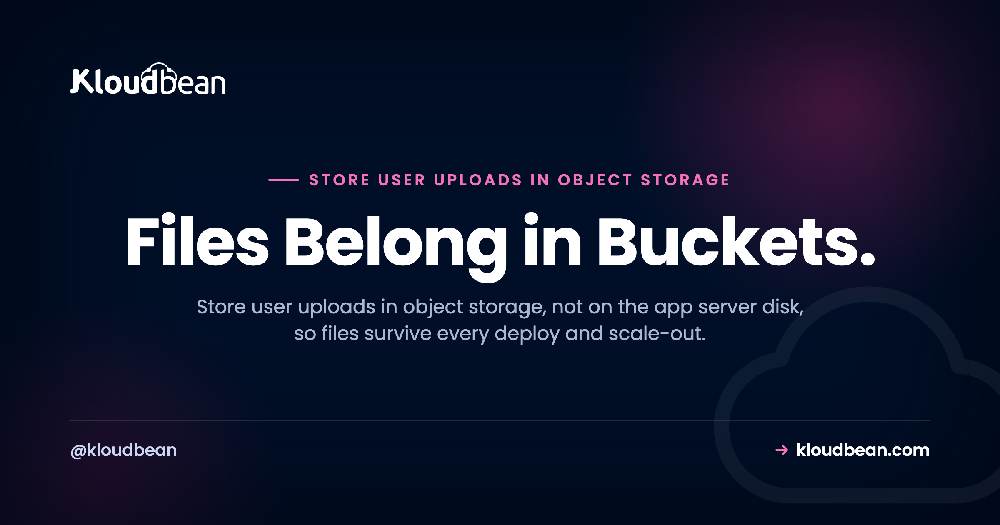
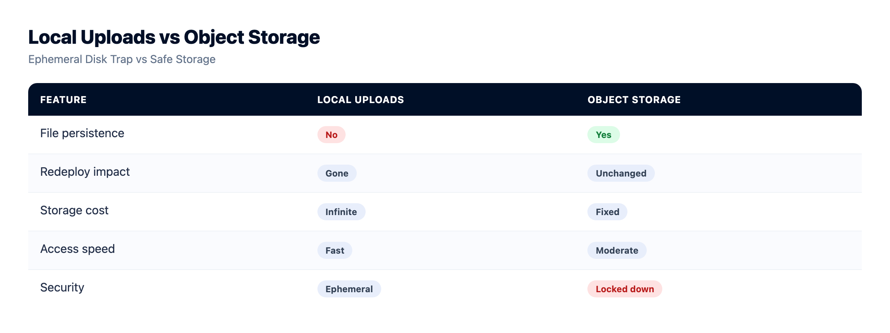
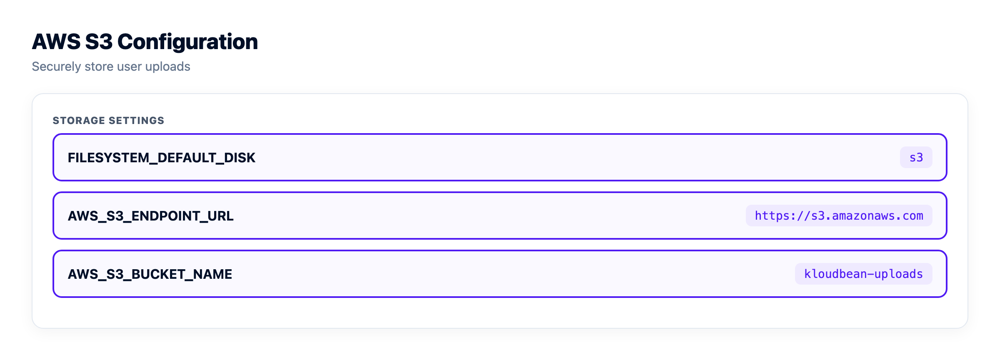
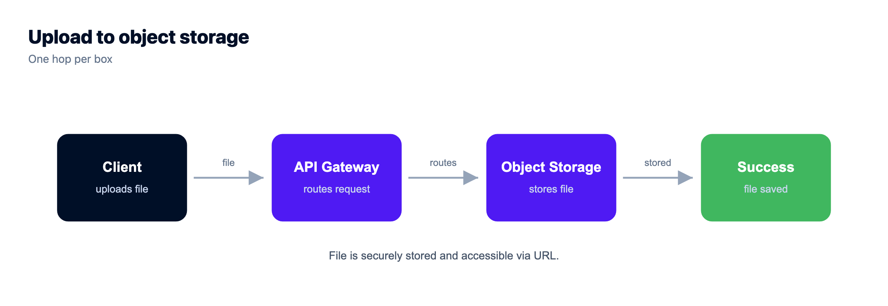

# Store User Uploads in Object Storage, Not on the App Server

*By Kloudbean Engineering · Files Belong in Buckets.*

A user uploads their profile photo. It works. You ship a new version that night, and by morning the avatar is a broken image, a plain 404 where a face used to be. If your uploaded files keep vanishing after a deploy, the answer is to store user uploads in object storage instead of on the app server's disk. This guide covers why the disk betrays you, the architecture that actually works, and the upload code for Node, Python, and the frameworks you already use.

> **Short answer:** Where should you store user uploads? In an S3-compatible object storage bucket, not on the app server's local disk. On most managed platforms the app filesystem is ephemeral and isn't shared across instances, so files written to `./uploads` disappear on the next deploy or 404 behind a load balancer. Keep the file bytes in a bucket, store only the object key and metadata in your database, and serve each file with a public URL or a short-lived presigned URL.

## Why your uploaded files disappear after a deploy

Let's start with the failure, because it's specific and checkable. Your app saves an upload to a folder like `./uploads` or `/var/www/app/public/uploads`. On your laptop that file sits there forever. In production it often doesn't. Two separate things break it.

First, ephemeral filesystems. A lot of managed platforms and container setups hand your app a fresh disk on every deploy or restart. Your code comes back. The files you wrote at runtime do not. This is the number one reason people paste *"my uploaded images 404 after deploy"* into Google. Nothing is wrong with the upload logic. The disk it wrote to just didn't survive the restart.

Second, more than one server. The moment you put two app instances behind a load balancer, a file saved on server A doesn't exist on server B. Half your requests find the image, half return a 404, and it looks maddeningly random. Even on a single box, a rebuild starts you from an empty disk. Same result, files gone.

The uploads folder feels permanent because on your machine it is. Production is where that assumption dies. Hit this with other post-deploy surprises? It's usually an environment gap, and we cover the rest in [why your app works locally but not in production](https://www.kloudbean.com/blog/why-my-ai-app-works-locally-but-not-in-production/).



## The pattern that works: bytes in a bucket, key in the database

The fix splits one "file" into two things that live in different places. That split is the whole idea.

The **file bytes** go in an object storage bucket. That's the raw image, PDF, or video. Buckets are built to hold files durably, across as many app servers as you like, and they don't reset when you deploy. For file uploads, object storage is simply the right home.

The **metadata** goes in your database. Not the bytes, just a row: the object key (the file's name inside the bucket, something like `uploads/2025/a1b2c3.jpg`), plus who owns it, its size, its content type, and when it landed. Your app already has a database for users and orders, so an upload becomes one more row that points at an object. If you don't have a real database beside your app yet, that's step zero, and it's covered in [how to add a managed database to your app](https://www.kloudbean.com/blog/add-managed-database-to-your-app/).

To show a user their file, you look up the key and hand back a URL to the object in the bucket. That's the model. The app server touches the bytes only long enough to pass them through, then forgets them. That's exactly why you can rebuild the server without losing a thing.

Which is also why storage belongs beside your servers rather than inside them. On Kloudbean a bucket is its own resource in the same dashboard as your apps and managed databases (built-in S3-compatible storage landed in November 2024), so a bucket's lifetime has nothing to do with any app's. Delete the app, resize the server, rebuild from scratch: the objects don't notice. If you're standardised on Google Cloud there are managed [Google Cloud Storage buckets](https://www.kloudbean.com/blog/gcs-object-storage-buckets/) too.

<figure>
  <svg viewBox="0 0 760 440" width="100%" role="img" aria-labelledby="uploadflow-title" xmlns="http://www.w3.org/2000/svg">
    <title id="uploadflow-title">A browser uploads to the app, the app writes the file bytes to a bucket and the object key plus metadata to the database, then serves the file back by URL</title>
    <rect x="0" y="0" width="760" height="440" fill="#ffffff"></rect>
    <text x="24" y="34" font-family="Poppins,Arial,sans-serif" font-size="17" font-weight="700" fill="#000f27">One upload, split into two places</text>
    <text x="24" y="55" font-family="Poppins,Arial,sans-serif" font-size="12.5" fill="#5b6a86">The bytes go to the bucket. The key and metadata go to the database. The app keeps nothing.</text>
    <rect x="28" y="76" width="152" height="72" rx="13" fill="#000f27"></rect>
    <text x="104" y="108" text-anchor="middle" fill="#ffffff" font-family="Poppins,sans-serif" font-size="15" font-weight="600">Browser</text>
    <text x="104" y="128" text-anchor="middle" fill="#9fb0d0" font-family="Poppins,sans-serif" font-size="12">user picks a file</text>
    <rect x="306" y="76" width="160" height="72" rx="13" fill="#000f27"></rect>
    <text x="386" y="108" text-anchor="middle" fill="#ffffff" font-family="Poppins,sans-serif" font-size="15" font-weight="600">App server</text>
    <text x="386" y="128" text-anchor="middle" fill="#9fb0d0" font-family="Poppins,sans-serif" font-size="12">validate, make a key</text>
    <rect x="590" y="60" width="150" height="96" rx="13" fill="#ffffff" stroke="#40b75f" stroke-width="2.5"></rect>
    <text x="665" y="96" text-anchor="middle" fill="#000f27" font-family="Poppins,sans-serif" font-size="14.5" font-weight="600">Object storage</text>
    <text x="665" y="116" text-anchor="middle" fill="#000f27" font-family="Poppins,sans-serif" font-size="14.5" font-weight="600">bucket</text>
    <text x="665" y="136" text-anchor="middle" fill="#2f9d4e" font-family="Poppins,sans-serif" font-size="12">the file bytes</text>
    <rect x="306" y="252" width="160" height="92" rx="13" fill="#ffffff" stroke="#4F1AF3" stroke-width="2.5"></rect>
    <text x="386" y="288" text-anchor="middle" fill="#000f27" font-family="Poppins,sans-serif" font-size="14.5" font-weight="600">Database</text>
    <text x="386" y="310" text-anchor="middle" fill="#4F1AF3" font-family="Poppins,sans-serif" font-size="12">row: key, owner,</text>
    <text x="386" y="326" text-anchor="middle" fill="#4F1AF3" font-family="Poppins,sans-serif" font-size="12">size, content type</text>
    <path d="M180 106 H300" stroke="#4F1AF3" stroke-width="3" fill="none" marker-end="url(#apu)"></path>
    <text x="240" y="96" text-anchor="middle" fill="#4F1AF3" font-family="Poppins,sans-serif" font-size="12.5" font-weight="600">1. upload</text>
    <path d="M466 100 H584" stroke="#40b75f" stroke-width="3" fill="none" marker-end="url(#agr)"></path>
    <text x="525" y="90" text-anchor="middle" fill="#2f9d4e" font-family="Poppins,sans-serif" font-size="12.5" font-weight="600">2. PUT bytes</text>
    <path d="M386 148 V246" stroke="#4F1AF3" stroke-width="3" fill="none" marker-end="url(#apu)"></path>
    <text x="398" y="200" text-anchor="start" fill="#4F1AF3" font-family="Poppins,sans-serif" font-size="12.5" font-weight="600">3. save key + metadata</text>
    <path d="M665 156 V400 H104 V150" stroke="#40b75f" stroke-width="2.6" fill="none" stroke-dasharray="7 5" marker-end="url(#agr)"></path>
    <text x="384" y="392" text-anchor="middle" fill="#2f9d4e" font-family="Poppins,sans-serif" font-size="12.5" font-weight="600">serve by public URL or short-lived presigned URL</text>
    <defs>
      <marker id="apu" markerWidth="10" markerHeight="10" refX="7" refY="3" orient="auto"><path d="M0 0 L7 3 L0 6 Z" fill="#4F1AF3"></path></marker>
      <marker id="agr" markerWidth="10" markerHeight="10" refX="7" refY="3" orient="auto"><path d="M0 0 L7 3 L0 6 Z" fill="#40b75f"></path></marker>
    </defs>
  </svg>
  <figcaption>The app validates the upload and mints a key, streams the bytes to the bucket, and writes the key plus metadata to the database. Serving is just a URL to the object.</figcaption>
</figure>

## How to store user uploads in object storage

There are two ways to get a file into the bucket, and most real apps use both. In every example, the endpoint, region, bucket, and credentials come from environment variables, never hard-coded. New to that habit? Read [environment variables done right](https://www.kloudbean.com/blog/environment-variables-done-right/) first, because leaking a storage key is as bad as leaking a database password.

### Flow 1: server-side upload (your app streams the file to the bucket)

The browser sends the file to your app, your app streams it to the bucket with the S3 SDK, and you save the key on a database row. This is the simplest flow and the right default for small files like avatars, receipts, and documents.

Here's the Node shape with the AWS SDK v3. The `req.file.buffer` comes from multer's memory storage:

```js
import { S3Client, PutObjectCommand } from "@aws-sdk/client-s3";
import { randomUUID } from "crypto";

const s3 = new S3Client({
  endpoint: process.env.S3_ENDPOINT,      // your bucket's S3 endpoint
  region: process.env.S3_REGION || "auto",
  credentials: {
    accessKeyId: process.env.S3_KEY,
    secretAccessKey: process.env.S3_SECRET,
  },
});

// generate your OWN key, never trust the uploaded filename
const key = "uploads/" + randomUUID() + ".jpg";

await s3.send(new PutObjectCommand({
  Bucket: process.env.S3_BUCKET,
  Key: key,
  Body: req.file.buffer,
  ContentType: req.file.mimetype,   // so browsers render it, not download it
}));

// save the KEY on the row, not the bytes
await db.photo.create({ data: { userId, key } });
```

The Python version with `boto3` is the same three moves, build a client, put the object, store the key:

```python
import os, uuid, boto3

s3 = boto3.client(
    "s3",
    endpoint_url=os.environ["S3_ENDPOINT"],
    aws_access_key_id=os.environ["S3_KEY"],
    aws_secret_access_key=os.environ["S3_SECRET"],
)

key = "uploads/" + str(uuid.uuid4()) + ".jpg"
s3.upload_fileobj(
    file_obj,                                  # the uploaded stream
    os.environ["S3_BUCKET"],
    key,
    ExtraArgs={"ContentType": "image/jpeg"},
)
# then persist `key` on the database row
```

### Flow 2: direct (presigned) upload from the browser

For big files like video or high-resolution images, or for high upload volume, routing every byte through your app is wasteful. Your server pays the bandwidth twice and ties up a worker for the whole transfer. The fix is a presigned URL.

A presigned URL is a temporary, signed link that grants permission to do one operation on one object, for a few minutes, then expires. Your backend generates it. The browser uploads straight to the bucket. Your app never touches the bytes. The handshake is four steps: the browser asks your API for a URL, the API returns a presigned `PUT` URL plus the key, the browser `PUT`s the file to that URL, then the browser tells your API the upload finished so you can save the key.

Generating a presigned `PUT` in Node:

```js
import { getSignedUrl } from "@aws-sdk/s3-request-presigner";
import { PutObjectCommand } from "@aws-sdk/client-s3";

const key = "uploads/" + randomUUID() + ".png";

const url = await getSignedUrl(
  s3,
  new PutObjectCommand({
    Bucket: process.env.S3_BUCKET,
    Key: key,
    ContentType: "image/png",
  }),
  { expiresIn: 300 },   // valid for 5 minutes
);

// send { url, key } to the browser
```

And the browser side is a plain `fetch` straight to the bucket, with no bytes passing through your server:

```js
await fetch(presignedUrl, {
  method: "PUT",
  headers: { "Content-Type": file.type },
  body: file,
});

// then POST `key` back to your API so it saves the row
```

Store the endpoint, bucket, and keys as environment variables on the server, not in the repo. On Kloudbean they're fields in the console, no SSH involved, and the Node or Python runtime config sits on the same screen. Practical consequence: when you rotate a storage key, you paste the new one and restart the app, without a commit or a rebuild.


## Point your existing uploader at a bucket

You rarely need to write raw SDK calls. Most frameworks ship a storage layer that already speaks the S3 API, so you point it at your bucket's endpoint with config and keep the upload code you already have. Set the endpoint, bucket, region, and keys from environment variables in each case, and the framework does the rest.

| Framework | What targets the bucket | The shape |
| --- | --- | --- |
| **Laravel** | The `s3` filesystem disk in `config/filesystems.php` | `Storage::disk('s3')->put($key, $contents)` |
| **Django** | `django-storages` via the `STORAGES` backend | Set the S3 backend and a `FileField` uploads to the bucket automatically |
| **Rails** | Active Storage | `config/storage.yml` service: S3, then `has_one_attached` |
| **Node / Express** | `multer-s3` | `storage: multerS3({ s3, bucket, key })` |
| **Next.js** | A route handler with `@aws-sdk/client-s3` | `PutObjectCommand` in a server route or action |

The endpoint is the only piece that changes to point at a Kloudbean bucket instead of AWS, because underneath it's the same S3 API. Kloudbean's buckets carry full AWS S3 SDK and CLI compatibility (since March 2025), so every snippet above runs unchanged with one `S3_ENDPOINT` swap, and `aws s3 cp` works against them for the migration. That cuts both ways, which is the point: the same portability that gets you in gets you out. There's more on it in [S3-compatible object storage explained](https://www.kloudbean.com/blog/s3-compatible-object-storage/).



## Public or private bucket? Decide per file, not per app

This trips people up, so choose it on purpose.

A **public** bucket serves any object to anyone with the URL. That's correct for genuinely public assets: marketing images, a site's CSS, public product photos. You store the object, build its URL once, and drop it in an `` tag.

A **private** bucket keeps objects unreachable by a raw URL. To show one to an authorized user, your app generates a presigned `GET` URL that works for a set number of minutes, then expires. That's what you want for anything user-private: ID documents, invoices, medical records, paid downloads, private message attachments.

The mistake I see most often: someone makes a whole bucket public just to get images rendering, when those images are actually private to each user. Now every user's uploads are one guessed URL away from a stranger, and search engines will happily index them. Don't flip a bucket public to fix a permissions problem. Keep it private and hand out presigned links. On Kloudbean that's a per-bucket access control in the dashboard, so the honest advice is to create two buckets, one public for assets and one private for user files, rather than one bucket with a compromise setting.

One cost input while you're deciding, because it changes how freely you serve files. Data transfer out of Kloudbean's built-in S3-compatible storage isn't metered, so a public bucket full of product images doesn't quietly generate an egress bill the way it can elsewhere. Scope that carefully though: it applies to the built-in storage only. Managed GCS buckets bill both egress and ingress, so if you choose GCS for residency or tooling reasons, model the transfer cost before you put your image-heavy pages behind it.

| | Public bucket | Private bucket |
| --- | --- | --- |
| **Reached by** | Direct URL | Presigned URL that expires |
| **Good for** | Site assets, public images | User docs, invoices, anything private |
| **Works in a plain ``** | Yes | Only through a signed URL |
| **Risk if misused** | Private files exposed to the web | None, this is the safe default |

## The upload gotchas that bite in production

The architecture is the easy part. These details turn a working upload into a safe one, most of them one line each.

- **Never trust the client's filename.** A browser will happily send `../../etc/passwd` or a giant file named `cat.jpg`. Generate your own key (a UUID is fine) and store the original name as plain metadata if you need to display it. That kills path traversal and filename collisions at once.
- **Validate content type and size on the server.** Client-side checks are a nicety, not a control. Check the real size and MIME type in your backend before you accept the object, and set a hard maximum. For presigned uploads you can constrain the content type and size in the policy, so the bucket itself rejects the wrong thing.
- **Set the right Content-Type.** Store an image with a missing or wrong content type and browsers will download it instead of showing it, or refuse to render it at all. Set `ContentType` on upload so `uploads/x.png` is served as `image/png`.
- **Configure CORS for direct browser uploads.** A presigned `PUT` from the browser is a cross-origin request. The bucket needs a CORS rule allowing `PUT` from your domain, or the browser blocks the upload before it even starts.
- **Add Cache-Control on public assets.** A long max-age on immutable, hashed files lets browsers and any CDN in front of the bucket cache them hard, which cuts repeat requests to the origin.
- **Keep credentials in env vars, never in Git.** Bucket keys are as sensitive as a database password. Load them from environment variables. If a key ever lands in a commit, rotate it immediately, because Git history remembers forever.
- **Prefer least-privilege keys.** The key your app uses to write uploads does not need permission to delete every bucket in your account. Scope it down wherever your provider lets you.

## Reading upload bugs backwards: symptom to layer

Upload bugs all look the same from the browser, a broken image or a failed request, so people rewrite the handler when the handler was fine. The symptom usually names the layer. Match yours here before you touch code.

| What you see | The layer at fault | The move |
| --- | --- | --- |
| 404 on files that worked yesterday, right after a deploy | Ephemeral app disk | Bytes belong in a bucket. Nothing else on this list matters until that's true. |
| Image loads on some refreshes, 404s on others | More than one app instance | Same fix. The file exists on one server only. |
| File downloads instead of displaying | Object metadata | Set `ContentType` at upload time. It's stored with the object, so re-upload or copy it to fix existing ones. |
| Browser cancels the upload before any bytes move | Bucket CORS | Allow `PUT` from your origin. Check the network tab for the failed preflight, not your server logs. |
| 403 on a presigned link that worked five minutes ago | Expiry | Working as designed. Generate the URL when the user asks for the file, not when you render the list. |
| A customer's document turns up in Google | Bucket access policy | The bucket is public. Make it private, hand out presigned GETs, and rotate the keys if they were ever in a repo. |
| Uploads work, then a bad migration deletes a batch of keys | Your code | Durability isn't a backup. See below. |

That last row is the one no host fixes, ours included. Object storage is durable and replicated, which protects you from hardware dying, not from your own `DELETE`. If your worker loops over the wrong prefix, replication faithfully replicates the deletion. Versioning and a separate copy of anything irreplaceable are your call, and they sit alongside the [server backups](https://www.kloudbean.com/blog/server-backups-guide/) that cover the database rows pointing at those objects. Two other things nobody can do for you: validating what a user uploaded, and deciding which files were meant to be private in the first place.




Uploads are one piece of keeping an app server stateless, so you can scale or rebuild it at will. Wiring this up for the first time? The full path is in [how to deploy an AI-built app to production](https://www.kloudbean.com/blog/deploy-ai-built-app-to-production/).

<!-- cta:start -->
**Take it off localhost for good.**

Run the app as an always-on process with managed databases, Redis, object storage, and automatic backups beside it. Deploy from Git with live build logs, and keep the infrastructure someone else's problem.

- Managed databases
- Always-on processes
- Object storage
- Automatic backups
- Free SSL
- Git deploy
- Free migration

[Start free](https://console.kloudbean.com/register) · [See plans](https://www.kloudbean.com/pricing/)
<!-- cta:end -->

## FAQ

**Why do my uploaded files disappear after a deploy?**
Because they were written to the app server's local disk, and on most managed platforms that disk is ephemeral. A deploy or restart gives the app a fresh filesystem, and the files you saved at runtime are wiped with the old one. Store the file bytes in an object storage bucket instead, and they survive every deploy.

**Where should I store user uploads?**
In an S3-compatible object storage bucket, with only the object key and metadata saved in your database. The bucket holds the bytes durably and independently of any single server, so files persist across deploys and are reachable by every app instance behind a load balancer. The app server stays stateless and disposable.

**Should I store uploads in the database?**
Store the metadata in the database, not the file bytes. Putting large binaries in database rows bloats the database, slows backups, and makes queries heavier, all to do a job object storage does better. Keep a row with the object key, owner, size, and content type, and keep the actual file in the bucket.

**What is the difference between a public and a private bucket?**
A public bucket serves any object to anyone with the URL, which suits site assets and public images. A private bucket keeps objects unreachable by a raw URL, and your app hands out temporary presigned links to authorized users. Default to private for anything user-specific, and only make content public when it is genuinely meant for the open web.

**What is a presigned URL?**
A presigned URL is a temporary, signed link that grants permission for one operation on one object, then expires after a set time. Your backend generates it using your credentials, so the browser can upload or download directly from the bucket without your keys ever leaving the server. It is the standard way to serve private files and to accept large direct uploads.

**How do I upload directly from the browser to a bucket?**
Have your backend generate a presigned PUT URL for a key you choose, send that URL to the browser, and let the browser PUT the file straight to the bucket. Then the browser tells your API the upload finished so you can save the key on a row. You also need a CORS rule on the bucket that allows PUT from your domain.

**Can I use the S3 SDK with Kloudbean buckets?**
Yes. Kloudbean object storage is S3-compatible with full AWS S3 SDK and CLI support, so the same boto3, JavaScript v3 client, and aws CLI commands work by pointing the endpoint at your Kloudbean bucket. You change one endpoint value and the rest of your code stays the same. That portability means you are never locked in.

**How do I serve images from a bucket?**
For public assets, use the object's public URL directly in an img tag, ideally with a long Cache-Control header so browsers and any CDN cache it. For private images, generate a short-lived presigned GET URL when an authorized user requests the file. Either way, set the correct content type on upload so the browser renders the image instead of downloading it.

**Do I have to rewrite my upload code to use object storage?**
Usually not. Most frameworks have a storage layer that already speaks the S3 API, so you repoint it at the bucket with config: Laravel's s3 disk, Django's django-storages, Rails Active Storage, or multer-s3 on Node. You set the endpoint and keys from environment variables and keep your existing upload handlers.

---

*By Kloudbean Engineering · Files Belong in Buckets.*
