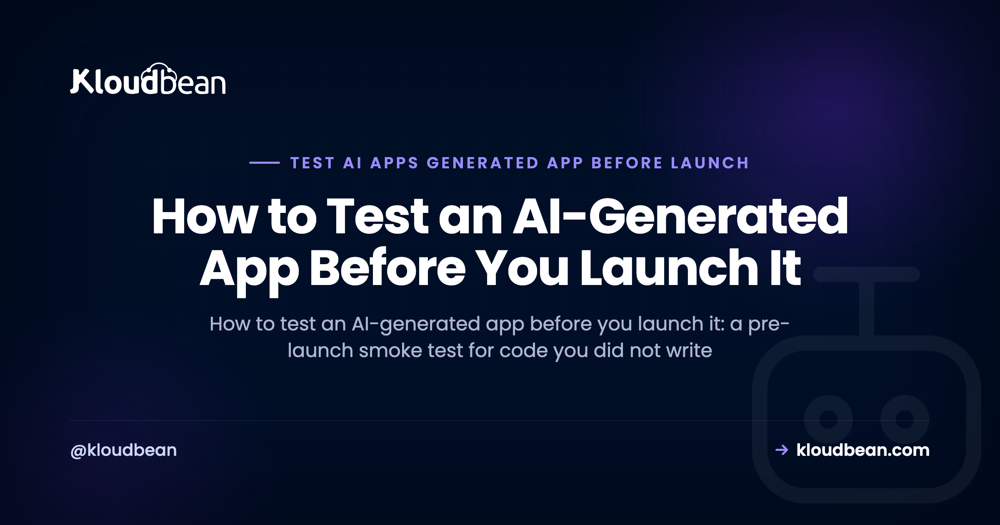

# How to Test an AI-Generated App Before You Launch It

You described what you wanted, an AI builder wrote the code, and the preview works. You clicked around, it did the thing, and it feels finished. So you can launch, right? Not yet. To test an AI-generated app properly you have to check the parts the demo never touched, because a builder like Lovable, Bolt, or Cursor optimises for "it looks done", not "it's correct and safe".

That gap is the whole problem. The code compiles, the screen renders, the button works when you click it the way you always click it. That feels like proof. It isn't. It's proof of one path, the one you walked. Everything you didn't click is still an open question, and launch is the moment thousands of strangers start clicking the paths you never did.

> **The short version:** A working demo only proves the happy path runs. To test an AI-generated app before launch, check the paths nobody clicked: log out and try to reach a protected route, feed a form bad input, cut the network mid-request, and redeploy to see if your data survives. Write five real tests that cover auth, money, and data instead of chasing full coverage, and never let the same AI grade the code it just wrote.

## Why a passing demo doesn't prove your app works

A demo is a guided tour. You know where the furniture is, so you walk the clean route: sign up with a real email, click the main button, see the happy result. The AI built exactly that route, because that's what you asked it to show you. The code runs, so your brain files it under "works".

But "does my AI app work" is the wrong question. The honest question is "does it still work when someone does the thing I didn't test?" Real users log out and bookmark a URL. They paste emoji into the name field. They submit the form twice. They lose signal halfway through a save. The demo exercised none of that, and AI-written code is especially prone to skipping it, because a language model writes the code that satisfies the prompt, not the defensive code that survives a hostile internet.

So the job before launch isn't to admire the happy path again. It's to go find the paths nobody clicked and see what happens when they get clicked. That's what testing an AI-generated app actually means.

<!-- DIAGRAM (rendered as inline SVG in the HTML): the green happy path the demo ran, next to the untested paths launch will hit: auth bypass, bad input, error handling, and post-redeploy state. -->

## What the demo proved, and what you still have to test

Before you write a single test, it helps to separate what you already know from what you're only assuming. The demo genuinely proved some things. It also quietly left a much longer list unproven, and that second list is your pre-launch testing checklist.

| The demo proved this | You still have to test this |
| --- | --- |
| The app boots and the main page loads | It boots with no dev environment, real env vars set, no local shortcuts |
| The happy-path click produces the right result | A logged-out user cannot reach a route or API that should require login |
| A valid form submission is accepted | A bad or empty submission is rejected with a sane error, not a crash |
| It reads and writes on your local database file | It works against a real managed database, not a local file that gets wiped |
| It looked fine while you were watching | It still works after a redeploy, with your data still there |
| One request at a time, from you | An API call that fails returns a real error instead of a white screen |

None of the right column is exotic. It's just the stuff a demo never has a reason to exercise. Walk down that column and you have your test plan.

## How to test an AI-generated app before launch (the smoke test)

Start with a manual smoke test. A smoke test is the quick, shallow pass that answers "is this thing fundamentally alive and safe", before you invest in anything deeper. You can do this by hand in twenty minutes, and it catches the scary stuff first. Here's the pre-launch pass I'd run on any AI-generated app, roughly in order of how much it'll hurt if it's broken.

- **Log out and try to reach a protected page directly.** Paste the URL of something that should require login into a fresh private window. If you can see it logged out, your auth is decorative.
- **Hit the protected API directly.** Open the endpoint (or `curl` it) with no session. It should refuse you, not hand back data. AI builders love to guard the button in the UI and leave the endpoint wide open.
- **Run it with your dev environment gone.** Set the real environment variables, unset anything local, and boot it clean. If it only runs on your laptop, it isn't ready. This is the number one reason an AI app works locally but not in production.
- **Point it at a real managed database.** The local SQLite file or in-memory store that the builder scaffolded will not survive production. Verify reads and writes work against the database you'll actually run on.
- **Feed a form garbage.** Empty fields, a 5,000-character name, an email with no `@`, a negative quantity. It should reject bad input cleanly, not save a broken row or throw a 500.
- **Break a downstream call on purpose.** Kill your network, or point an API key at nothing, then use the feature that depends on it. You want a clear error message, not a spinner forever or a white screen.
- **Redeploy, then look for your data.** Push a trivial change, let it redeploy, and check that the record you created five minutes ago is still there. If it vanished, your data was living somewhere that gets wiped.

If several of those fail, that's normal for an AI-generated app, and it's exactly why you tested before launch instead of after. For the broader "is this ready at all" pass, the [AI app production readiness checklist](https://www.kloudbean.com/blog/ai-app-production-readiness-checklist/) is the companion piece, and [from prototype to production checklist](https://www.kloudbean.com/blog/from-prototype-to-production-checklist/) covers the general prototype-to-prod list.

<!-- ADD IMAGE: a browser private window showing a protected page reachable while logged out, next to a terminal curl of the same endpoint returning data with no auth -->

## Test the security paths, because that's where AI builders cut corners

Two smoke-test items above are really the same lesson, and it's worth saying plainly: the security-critical paths are the ones AI builders get wrong most often. They'll protect a page in the frontend and forget the API behind it. They'll leave a model key or a database reachable from the open internet. They'll write an "admin only" check that never actually runs on the server.

So test those paths on purpose. A logged-out request (from a private window, or a raw `curl`) should be refused by every route that touches sensitive data or spends money. If a stranger with no account can read another user's records or hit the endpoint that calls a paid API, you don't have a bug, you have an incident waiting for a launch date.

I'm not going to rebuild the full list here, because the [AI-built app security checklist](https://www.kloudbean.com/blog/ai-built-app-security-checklist/) already owns it, item by item. Run that as your security pass. This section is just the reminder that security is the part of an AI-generated app you must verify by hand, not trust on faith.

## A five-test harness for people who don't write tests

Manual smoke testing is great once. The problem is you'll change one line next week and have to remember to do the whole dance again. That's what a few automated tests are for. And you don't need a test-engineering background to write the ones that matter.

Skip the big suite. A handful of high-value automated checks beats a hundred you'll never write. Boot the app and hit the critical routes, confirm auth blocks what it should, confirm one bad input gets rejected. Three tests like that, running on every push, catch the regressions that actually hurt. Here's the shape, using Node's built-in test runner and `fetch` against a running app:

```
import { test } from 'node:test';
import assert from 'node:assert';

const base = process.env.TEST_URL || 'http://localhost:3000';

// Smoke: the app boots and the home route answers
test('home route responds', async () => {
  const res = await fetch(base + '/');
  assert.equal(res.status, 200);
});

// Auth: a protected route refuses an anonymous request
test('protected route blocks logged-out access', async () => {
  const res = await fetch(base + '/api/account');
  assert.equal(res.status, 401);
});

// Bad input: the signup endpoint rejects garbage instead of crashing
test('signup rejects invalid email', async () => {
  const res = await fetch(base + '/api/signup', {
    method: 'POST',
    headers: { 'content-type': 'application/json' },
    body: JSON.stringify({ email: 'not-an-email' }),
  });
  assert.equal(res.status, 400);
});
```

That's the whole idea. The auth test is the one I'd never launch without. My firm opinion: you do not need 90% coverage before launch. You need five tests that cover auth, money, and data. Write those five, wire them to run on every deploy, and you've bought yourself more safety than a giant suite of tests on the parts that don't matter.

Same pattern works in any stack. Python has `pytest` and `httpx`, Laravel has feature tests, Rails has request specs. The tool doesn't matter. Hitting the real routes and asserting the boring, critical behaviour does.

<!-- ADD IMAGE: a terminal running the test file, showing the auth test failing (a protected route returning 200 instead of 401) so the reader sees a real caught bug -->

## Don't let the AI grade its own homework

Now the trap that catches almost everyone the moment they discover the AI can write tests too. You ask the same model that wrote the code to also write the tests. It happily generates a green suite, everything passes, and you feel safe. You are not safe.

An AI writing tests for its own code tends to write tests that assert what the code *does*, not what it *should do*. If the code has a bug, the generated test often locks that bug in as the expected answer, then passes. A green suite that was reverse-engineered from the implementation is not evidence the code is correct. It's evidence the code agrees with itself. Those are very different things, and "AI wrote a passing test" reassures a lot of people who then ship the bug.

So if you use AI to help write tests, and it's a reasonable way to save time, do two things. Write the test's intent yourself first ("a logged-out user must get 401 from /api/account"), then let the AI fill in the mechanics. And actually read the assertions. If a test asserts `status === 200` on a route that should reject anonymous users, the test is wrong, no matter how green it is. Test the requirement, not the code's current behaviour.

## Test where it will actually run

The last gap is environmental. "Works on my machine" and "works in production" are different claims, and the difference has ended more launches than any logic bug. Your laptop has your env vars, your local database, your installed tools, and a network that never fails. Production has none of those unless you set them up, which is exactly why an [AI app works locally but not in production](https://www.kloudbean.com/blog/why-my-ai-app-works-locally-but-not-in-production/).

The fix is to test somewhere production-like before you point real traffic at it. A staging environment with a real managed database turns "works locally" into "works where it's going to run". You catch the missing env var, the local-only shortcut, and the database that behaves differently under a real connection, all before a user ever sees them. For the wider list of what tends to break at this boundary, [why AI apps fail in production](https://www.kloudbean.com/blog/why-ai-apps-fail-in-production/) is a useful read, and the whole topic sits under the [last mile of vibe coding](https://www.kloudbean.com/blog/last-mile-of-vibe-coding/).

## Where Kloudbean fits

Testing on something production-like is a lot easier when your host gives you the pieces. On Kloudbean you can spin up a staging environment (available for WordPress and Laravel) backed by a real managed database, so you're testing against the same kind of Postgres or MySQL you'll run in production, not a throwaway local file. You deploy from Git, so the loop of "found a bug, fixed it, re-test" is a single push and a fresh deploy, not a manual redeploy dance. Everything (server, database, staging, SSL) lives in one dashboard, which means fewer moving parts to reason about while you're hunting a bug.

The honest boundary: Kloudbean hosts your app and gives you a realistic place to run these tests. The tests themselves are your code. A managed platform can hand you a staging environment and a real database, but it can't know that your auth check is decorative or that your form accepts garbage. That part is on you, and this whole page is about doing it before launch instead of learning it from your first angry user.

<!-- ADD IMAGE: the Kloudbean dashboard launching a managed database (DBS then Launch Database) to back a staging environment -->

**Test on a real staging environment, then launch with confidence.** Spin up staging backed by a real managed database, deploy from Git so every fix re-tests in one push, and keep the whole stack (server, database, SSL) in one dashboard.

Staging environment · Real managed database · Git deploy · Automatic backups · Free SSL · Free migration · Free trial

Start free at [kloudbean.com](https://www.kloudbean.com/); see plans on [pricing](https://www.kloudbean.com/pricing/).

<!-- ADD IMAGE: the Git deployment view showing a push building and deploying, so a fix and re-test is one commit -->

## FAQ

**How do I test an AI-generated app?**
Start with a manual smoke test that hits the paths the demo never did: log out and try to reach a protected route, submit a form with bad input, break a downstream API call on purpose, and redeploy to confirm your data survives. Then automate the few that matter most, one smoke test that boots the app, one auth test, one bad-input test, and run them on every deploy.

**Can I trust AI-written code?**
Trust it about as far as you'd trust code from a fast junior developer who never tested it. It's often structurally fine and gets the happy path right, but it tends to skip auth on the server, error handling, and input validation. So verify the AI-generated code rather than trusting it, especially anything touching login, payments, or data.

**Should I let AI write my tests?**
You can use it to save time, but don't let it grade its own work. If the same model writes both the code and the tests, it often writes tests that assert the buggy behaviour and pass. Write the intent of each test yourself, let the AI fill in the mechanics, and read the assertions before you trust a green result.

**What should I test before launching?**
Auth, money, and data, in that order. Confirm that protected routes refuse logged-out requests, that anything spending money can't be triggered anonymously, and that your data survives a redeploy on a real database. Add a bad-input test and a broken-dependency test. Those five areas catch the failures that actually hurt at launch.

**How many tests do I actually need before launch?**
Fewer than you think. You do not need high coverage to launch safely. Five well-chosen tests covering auth, money, and data give you more real protection than a hundred tests on trivial code. Start with a smoke test, an auth test, and a bad-input test, then add more only where a real bug taught you to.

**What is a smoke test?**
A smoke test is a quick, shallow check that the app is fundamentally alive and safe before you test anything deeply. It boots the app and hits the most critical routes to confirm nothing is obviously on fire. The name comes from hardware: power it on and see if smoke comes out. It's the first thing to run, not the last.

**My AI-generated tests all pass. Does that mean the code works?**
Not necessarily. If the tests were generated from the same code they're testing, a green result only proves the code agrees with itself. A bug can be baked into both the code and the test as the expected behaviour. Read the assertions and check they match the real requirement rather than the current behaviour.

**Do I need a staging environment to test my app before launch?**
It's the single best way to catch the "works locally, breaks in production" class of bug. A staging environment with a real managed database lets you test against production-like conditions, real env vars, a real database, no local shortcuts, before any user is affected. On Kloudbean, staging is available for WordPress and Laravel.

**Why does my app work in the demo but break for real users?**
Because the demo only ran the happy path, and real users run everything else. They log out, paste bad input, lose their connection mid-request, and hit the app after a redeploy. The demo also ran on your machine, with your env vars and local database. Testing the untested paths on a production-like environment closes that gap before launch.

---

*Kloudbean. Test the paths nobody clicked, then launch.*
