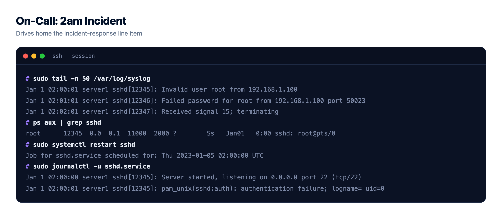
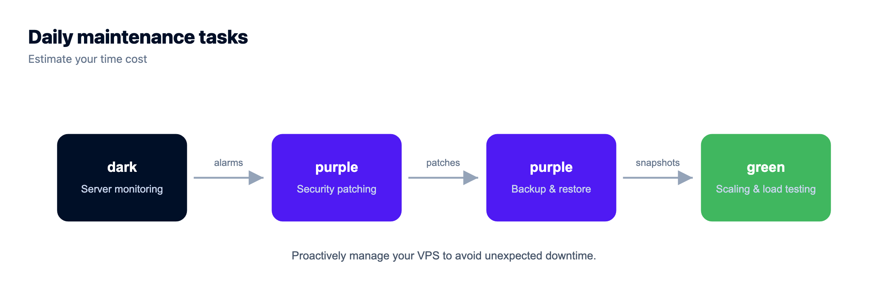
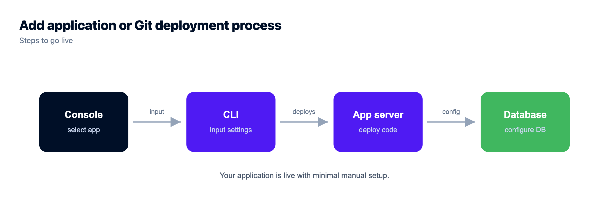

# The Real Cost of an Unmanaged VPS (It's Not the Sticker Price)

A cheap unmanaged VPS is one of the most seductive numbers in hosting. A few dollars a month for a real server with root access, so how could managed hosting justify charging several times more for what looks like the same box?

Because it isn't the same box. It's the same box plus a job, and the job never shows up on the pricing page. The real cost of an unmanaged VPS is the sticker plus every hour you spend keeping it alive. Let's do the math nobody prints, put honest, illustrative figures on the invisible parts, and see what that cheap server actually costs. Sometimes it's still the right call. But you should know the real number first.

> **The short version.** The sticker on an unmanaged VPS covers raw compute, nothing else. Setup, patching, SSL renewals, backups, monitoring, and incident response are all your job, and your time has a price even when no invoice shows it. Count a handful of hours a month at any sensible rate and a "cheap" VPS quietly costs far more than the sticker. Managed hosting costs more on paper because it deletes that list. Numbers here are illustrative.

## The sticker price is the down payment

Start with what you actually see. The entry-tier instances that made cheap hosting famous, the ones people mean when they say "just grab a cheap VPS," sit at a few dollars a month. Call it, illustratively, five dollars. That price is real, and it's a genuinely great deal for raw compute. Credit where it's due: the big infrastructure providers (DigitalOcean, Vultr, Linode and friends) turned a server into a commodity you can rent for pocket change, and for the right use that's fantastic. Hetzner pushes that pricing further than most, so if it's the specific box you're pricing, [cheap Hetzner servers next to managed hosting](https://www.kloudbean.com/blog/hetzner-vs-kloudbean/) runs this same arithmetic against one named provider.

But raw compute isn't a running application. It's an empty room. Everything that turns that room into a live, secure, backed-up site is missing from the number. The sticker is a down payment. The rest of the bill arrives in hours.

(See the iceberg diagram in the HTML version: a small sticker price above the waterline, and the large hidden mass of setup, patching, security, backups, monitoring and the 2am incident below it.)

## The hidden costs of an unmanaged VPS, below the waterline

Here's the work the sticker leaves out, the mass under the surface. None of it is hard, exactly. It's just time, and time has a price even when the invoice pretends it doesn't.

- **Initial setup.** Install and configure the web server, language runtime, database, and firewall, harden SSH, and get your app deployed. First time, realistically a few hours.
- **SSL certificates.** Install them and set auto-renewal. Cheap in dollars, but it's on you the day one silently fails and the browser starts screaming at your users. (If that ever happens, [fixing SSL certificate errors](https://www.kloudbean.com/blog/fix-ssl-certificate-errors/) is a rabbit hole of its own.)
- **Security patching.** The OS and stack need regular updates. Skip them and you're the soft target. Do them and it's recurring time, plus the occasional broken dependency at the worst moment.
- **Backups.** Set them up, store them off the box, and (the part everyone skips) actually test that they restore. A backup you've never restored is a rumor. There's a proper method in the [server backups guide](https://www.kloudbean.com/blog/server-backups-guide/).
- **Monitoring.** Something has to tell you the disk is full or the site is down before your users do. That's another thing to set up, and then to actually watch.
- **Incident response.** When it falls over, and eventually something will, you are the on-call engineer. At 2am. On a holiday. This is the line item that hurts most and appears on no invoice.

## Put a number on your time

This is where the sticker quietly becomes something else. Assign your time even a modest value and add the hours. Slot in your own rate, these are just round examples to show the shape.

| Task | Rough hrs/mo | At $30/hr* | At $60/hr* |
| --- | --- | --- | --- |
| Patching & updates | 1.5 | $45 | $90 |
| Backups & checks | 1 | $30 | $60 |
| Monitoring & tuning | 1 | $30 | $60 |
| Incident response (avg.) | 1.5 | $45 | $90 |
| **Time subtotal** | **~5 hrs** | **$150** | **$300** |

*\* Illustrative rates and hours. Your numbers will differ; the point is the model, not the exact figure.*

Add the few-dollar server and that "cheap" VPS is really running somewhere in the low hundreds a month once your time is counted, and that's a calm month with only average firefighting. The first month, with multi-hour setup on top, is worse. My honest opinion after watching this play out many times: a five-dollar VPS was never five dollars. It's five dollars plus every hour it takes to keep alive, and for anyone whose hours are worth more than a rounding error, that math usually loses.

## Where it really bites: the month you skip a step

That table only counts routine time. It ignores the tail, and the tail is where cheap turns expensive. Skip one security patch and catch a compromise. Miss one backup check and discover the restore doesn't work on the day you need it. Take one extended outage during your busiest hour. Any single one of those can cost more than a year of management fees in an afternoon, in lost revenue, cleanup, and trust you don't get back. Managed hosting is partly insurance against exactly that day, and insurance always looks overpriced right up until the moment it isn't.

## Unmanaged vs managed, honestly

Now line it up against managed hosting, which folds most of that work into the fee.

| | Unmanaged VPS | Managed hosting |
| --- | --- | --- |
| Server | a few $/mo* | Included in plan |
| Setup | Your hours | Done for you |
| Patching & security | Your hours | Handled (Shorewall + Fail2ban baseline) |
| SSL | You install and renew | Automatic and free |
| Backups | You build and test | Included, automatic |
| 2am incident | You | The platform |
| **Real monthly cost** | **Sticker + your time** | **Plan price, hours back** |

Managed costs more on the sticker precisely because it removes the rows below the first one. You're not paying a premium for the same thing. You're paying to delete the list. And a fair worry, that "managed" means giving up control, mostly doesn't hold: it's Linux either way, your app and data stay yours to export, and you still pick the underlying provider from several clouds. More on that trade in [managed vs unmanaged hosting](https://www.kloudbean.com/blog/managed-vs-unmanaged-hosting/) and [managed vs self-managed databases](https://www.kloudbean.com/blog/managed-database-vs-self-managed/).

## See the size and the rate up front

If you go managed, the useful move is to size the actual server you need and see the rate before you provision, rather than guessing and truing up later.

## When a cheap VPS still wins

Honesty cuts both ways, so here's when unmanaged genuinely is the better buy.

- **You're learning, or you enjoy it.** If server administration is the point, a homelab, a course, a box you tinker with, then the "cost" is the value. Don't pay someone to remove the fun.
- **It's throwaway.** A short experiment, a scratch server, something you'll delete next week. Not worth managing.
- **Your time genuinely is free here.** If you'd otherwise be idle and you like the work, the time math changes in the VPS's favor.

For a real product that needs to stay up, though, the calculation almost always favors buying those hours back. Your attention is the scarce resource, not five dollars. If you're still weighing it, [free tier vs cheap VPS](https://www.kloudbean.com/blog/free-tier-vs-cheap-vps/) and [what a side project really costs](https://www.kloudbean.com/blog/cost-of-running-a-side-project/) come at the same question from other angles, and [cutting your cloud bill](https://www.kloudbean.com/blog/how-to-cut-your-cloud-bill/) covers trimming whatever you land on.

<!-- cta:start -->
**Ship the app, not the infrastructure.**

Pick from seven clouds, run your app on a managed server you control, and keep databases, storage, and deploys in the same dashboard instead of four separate vendors.

- Seven cloud providers
- Managed databases
- Object storage
- Automatic backups
- Free SSL
- Git deploy
- Free migration assistance

[Start free](https://console.kloudbean.com/register) · [See plans](https://www.kloudbean.com/pricing/)
<!-- cta:end -->

## FAQ

**What's the real cost of an unmanaged VPS?**
The server itself is a few dollars a month, but that only buys raw compute. Once you value the handful of hours a month spent on patching, backups, monitoring, and incident response, the real cost climbs into the low hundreds at typical hourly rates. The sticker ignores your time entirely. These figures are illustrative, but the shape is consistent.

**Why is managed hosting more expensive than a cheap VPS?**
Because the cheap price only covers the box. Managed hosting includes the work an unmanaged VPS leaves to you: setup, patching, SSL, backups, monitoring, and incident response. You're paying to remove that job, not paying more for the same server. On the sticker it looks pricier; on the all-in number it often isn't.

**What are the hidden costs of a cheap VPS?**
Initial setup (a few hours the first time), SSL install and renewal, recurring security patching, building and testing backups, setting up monitoring, and being on-call for incidents. None are individually huge, but together they're several hours a month, plus the tail risk of a breach or an outage when you skip one.

**Is a cheap VPS ever the right choice?**
Yes. For learning, hobby projects, homelabs, or throwaway experiments, where the administration is either the point or not worth outsourcing, a cheap VPS is a great buy. For a production app that must stay up, buying those hours back with managed hosting usually costs less in real terms.

**Do cheap VPS providers include backups and security?**
Generally not by default. Basic instances are unmanaged, so backups, security patching, and monitoring are add-ons or your responsibility to set up and maintain. That's exactly what makes the sticker cheap, and exactly what makes the true cost higher than it looks.

**How many hours a month does a VPS actually take?**
For a calm month, figure a handful of hours across patching, backup checks, monitoring, and the occasional fix. Some months are near zero. Then one month something breaks and it's an evening. Averaged out, a few hours a month is a fair illustrative estimate for a small production box.

**How do I compare VPS cost to managed hosting fairly?**
Add your time to the VPS side. Estimate the monthly hours for setup, patching, backups, monitoring, and incidents, multiply by what an hour of yours is worth, and add the server price. Compare that all-in figure to the managed plan, which already includes that work. Compare totals, not stickers.

**What happens if I skip patching or backups on a VPS?**
You trade routine time for tail risk. Skip patching and you become the easy target for automated attacks. Skip backup testing and you find out the restore is broken on the worst possible day. Either can cost more in one incident than a year of management fees, which is why managed hosting is partly insurance.

**Does managed hosting mean I lose control of my server?**
Not really. It's Linux underneath either way, your app and data stay yours to export whenever you like, and you still choose the underlying cloud provider from several options. Managed means the platform handles the server, stack, SSL, backups, and patching. It doesn't take your code or lock your data away.

---

By Kloudbean · The sticker price is a down payment.
