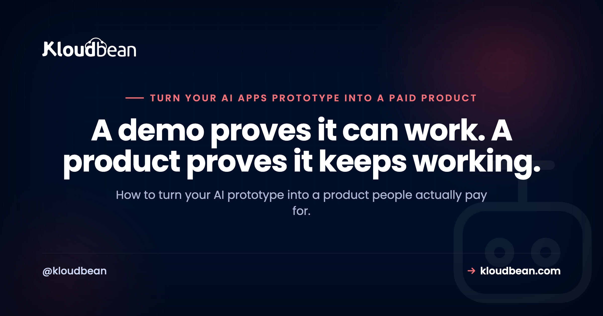
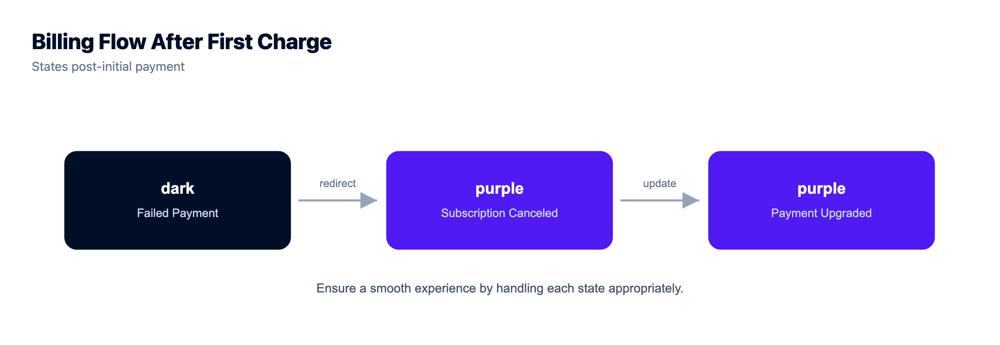
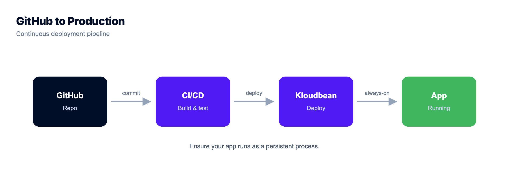

# Turn Your AI Prototype Into a Product People Will Pay For

By Kloudbean Engineering · A demo proves it can work. A product proves it keeps working.

You built something with Cursor, Lovable, Bolt, v0, or Replit, and it actually works. The demo runs on your laptop, the AI wrote most of it, and people who see it say they would use it. So now you want to turn your AI prototype into a product, the kind people pay for and come back to. Here is what the build-with-AI tutorials skip: the distance from a working demo to a product people trust is mostly invisible work. Not more features. The plumbing underneath. This is the honest gap analysis for taking an AI prototype to production.

> **The short version.** A working demo and a paid product are different things. The demo proves your idea. The product has to keep other people's data safe and available when you are asleep. To close that gap you need a persistent database, real auth, billing, rate limits, secrets kept off the client, error handling, backups, and an always-on host. None of it is glamorous. All of it is the difference.

## Why turning your AI prototype into a product is the hard part

Building the demo was the fun part, and AI made it fast. But a demo only has to work once, in your hands, on your machine. A product has to work for strangers, at the same time, with their data, when you are asleep. Those are different problems.

The first is a coding problem, and you have basically solved it. The second is an operations problem, and it is the one that quietly sinks most AI-built apps. That is my honest opinion after watching a lot of promising demos never survive contact with real users. If you want the deeper version of how these apps fall over, [why AI apps fail in production](https://www.kloudbean.com/blog/why-ai-apps-fail-in-production/) walks through the specific failure modes. Here we will take the gap piece by piece, so you can tick each one off before you ask anyone to pay.

## Demo versus product: what actually changes

Every gap comes down to the same shift: a demo is for you, a product is for people you will never meet. Line the two up and the work becomes obvious.

| | The demo | The product |
| --- | --- | --- |
| Who uses it | You and a few friends | Strangers, at the same time |
| Their data | Fine to lose | Must persist and be recoverable |
| Secrets | Hard-coded, who cares | Server-side, out of the code |
| Cost of a call | Your own test spend | Anyone can trigger the bill |
| Uptime | Your laptop is open | Runs while you sleep |
| When it breaks | You restart it | It handles it, or it pages you |

Every row is a corner a demo cuts that a product cannot. And none of it shows up in the interface, which is exactly why it is so easy to skip until a user finds it for you.

## Your data needs somewhere real to live

This is the big one, so start here. A common trap we see: the prototype stores everything in SQLite or a local JSON file, because the AI reached for the simplest thing that runs. On your laptop it is perfect. Then you deploy, push one update, and every signup, every row, every uploaded file is gone. Not corrupted. Gone. That file lived on the same disposable box as your code, and redeploying replaced the box.

A product keeps data in a managed database that lives separately from the app, so deploys never touch it. Usually that is PostgreSQL or MySQL, managed so backups and patching are not your job. My blunt take: SQLite is great in development and wrong in production for anything with users. Moving to a managed database early is the single highest-value thing you can do, and [adding a managed database to your app](https://www.kloudbean.com/blog/add-managed-database-to-your-app/) is not the scary part people expect. If your prototype leans on Supabase, [whether you actually need Supabase](https://www.kloudbean.com/blog/do-i-need-supabase/) is worth a read before you commit.

*The prototype keeps the key in the browser and the data on the same box it deploys over. The product moves both to where they belong.*

## Accounts and auth: who gets in and who sees what

A demo usually has one user: you. A product has accounts, and the moment you have accounts you inherit a whole category of questions. Who can log in. Whose data is whose. What happens when someone forgets their password. Can user A see user B's records, and the answer had better be no.

Do not hand-roll this if you can avoid it. Lean on a proven auth library or provider rather than inventing session logic yourself. And here is a classic AI-prototype bug worth checking for right now: the app decides who you are in the browser but never re-checks on the server. Anyone who opens dev tools can then ask the API for someone else's data, and it politely hands it over. Authorization has to happen on the server, on every request that touches private data. Every time.

## If you want people to pay, billing has to be real

If the plan is to make money from an AI app, at some point money has to change hands, and that is its own build. Most people reach for Stripe, and it is a sane default. But billing is more than a checkout button. You have got trials, failed cards, refunds, someone cancelling, someone upgrading mid-month, and your app has to react when the payment provider tells it a subscription changed. That is what webhooks are for, and skipping them is how people end up with paying customers who lost access, or cancelled customers who still have it. If you want the whole shape of that work laid out, from the checkout session to the handler that flips access on and off, we walk through [building a SaaS with Stripe payments](https://www.kloudbean.com/blog/build-a-saas-with-stripe-payments/) end to end.

One firm rule: never handle raw card numbers yourself. Let Stripe or a similar processor carry that weight and the compliance that comes with it. Treat charging money as a feature you build and test like any other, not a switch you flip on launch day.

## Rate limits, or one user drains your budget

This one bites AI apps specifically, so pay attention even if you skip the rest. Your prototype calls an LLM API on every request, and in the demo that is a few cents. Now put it on the open internet with nothing capping the calls. One curious user, one loose script, one person who leaves a tab looping, and they can burn through your entire OpenAI or Anthropic budget in an afternoon. We see this hit people who did everything else right.

The fix is layered. Rate limit per user and per IP so no single caller can flood you. Set a hard spending cap in the provider dashboard as a backstop. Cache identical requests. Put the expensive calls behind login so anonymous traffic cannot trigger them. Treat every AI API call as money leaving your account, because that is exactly what it is.

## Secrets stay on the server, and other config that breaks in production

The single most common security mistake in AI-built apps: the API key sits right there in the frontend code, shipped to every browser that loads the page. If a secret is in client-side JavaScript, it is public. Full stop. Anyone can open the network tab and copy it. AI assistants do this constantly, because inlining the key is the shortest path to a demo that runs.

Keys belong server-side, in environment variables, never committed to your repo and never sent to the client. The same goes for the other config trap: URLs hard-coded to `localhost:3000` or `127.0.0.1`. They work on your machine and break the instant the app runs anywhere else. Anything that differs between your laptop and production, the database URL, the API base, every key, belongs in environment variables rather than baked into the code. [Environment variables done right](https://www.kloudbean.com/blog/environment-variables-done-right/) covers the whole pattern.

## When it breaks: error handling and backups

Demos assume the happy path. The API always answers, the input is always valid, the network is always up. Products meet reality: timeouts, malformed input, a third-party service having a bad day. If one unhandled error takes your whole app down, that is a demo-grade response to a product-grade problem. Catch errors, log them somewhere you will actually look, and show the user something human instead of a stack trace.

Then backups. Automatic backups you have tested restoring at least once. A backup you have never restored is a hope, not a backup, and the day you need it is a bad day to discover the difference. While you are at it, [test your AI-generated app before launch](https://www.kloudbean.com/blog/test-ai-generated-app-before-launch/) against the ugly inputs a demo never sees.

## The last gap: running it always-on

Everything above assumes one last thing: your app is actually running, all the time, somewhere that is not your laptop. A prototype runs while your terminal is open. A product runs when you are asleep, on a weekend, during a demo to an investor. That means a real host with a persistent, always-on process, not a function that goes cold between requests and makes your first visitor wait for it to wake up.

This is the point where Kloudbean fits. You get a managed server that keeps your app process running with no serverless cold starts, managed PostgreSQL or MySQL with automatic backups so your data outlives every deploy, environment variables and runtime config set in the dashboard instead of hard-coded, and Git-based deploys straight from GitHub, all from one place with free SSL. The plumbing this whole article is about, handled for you, so your attention stays on the product. The end-to-end walkthrough lives in [deploying an AI-built app to production](https://www.kloudbean.com/blog/deploy-ai-built-app-to-production/).

<!-- ADD IMAGE: real console screenshot of Git-based deployment from GitHub, with the app running as a persistent process. The always-on step that a laptop cannot cover. -->

## Your readiness checklist before you charge anyone

Before you put a price on it, run down this list. Tick every box and you have closed the gap between a demo and something people can rely on.

- **Persistent data.** Lives in a managed database, not a local file a redeploy wipes.
- **Real accounts.** Auth with server-side checks on who can see what.
- **Working billing.** Wired up and tested, including failed payments and cancellations.
- **Cost controls.** Rate limits plus a provider spending cap, so one user cannot drain your budget.
- **Secrets server-side.** Every key in environment variables, nothing in the client or the repo.
- **Graceful failure.** Errors handled and logged, no single failure takes the app down.
- **Tested backups.** Automatic, and you have restored one at least once.
- **Always-on.** Running on a real host, not your laptop.

A deeper, more granular version is in the [AI app production readiness checklist](https://www.kloudbean.com/blog/ai-app-production-readiness-checklist/). You do not need all of this to keep building. You do need it before you ask someone to trust you with their data and their card.

<!-- cta:start -->
**You built the app. Give it a real home.**

Move the whole thing onto a managed server you own: always-on processes, a managed database for real data, object storage for uploads, and Git deploys with live build logs.

- Managed databases
- Always-on processes
- Object storage
- Automatic backups
- Free SSL
- Git deploy
- Free migration

[Start free](https://console.kloudbean.com/register) · [See plans](https://www.kloudbean.com/pricing/)
<!-- cta:end -->

## FAQ

**What is the difference between an AI prototype and a real product?**
A prototype proves the idea works once, usually on your machine, with you as the only user. A product has to work for many strangers at the same time, keep their data safe and recoverable, take payments, and stay up when you are not watching. The code is often the smaller half. The gap is the database, auth, billing, rate limits, secrets, error handling, backups, and always-on hosting.

**Why does my AI app lose its data every time I redeploy?**
Almost always because the app stores data in SQLite or a local file that sits on the same disposable server as your code. When you redeploy, that server is replaced and the file goes with it. The fix is to keep data in a managed database that lives separately from the app, so deploys never touch it. Managed PostgreSQL or MySQL is the usual choice.

**Do I need a database to turn my prototype into a product?**
For anything with users, accounts, or saved state, yes. A local file works in development but loses everything on redeploy and cannot handle more than one process safely. A managed PostgreSQL or MySQL database gives you persistence, backups, and room to grow. If your app is genuinely stateless you might skip it, but most products are not.

**How do I stop one user from running up my OpenAI bill?**
Add rate limiting per user and per IP so no single caller can flood your endpoints. Set a hard spending cap in your AI provider dashboard as a backstop. Cache repeated or identical requests, and put expensive calls behind login so anonymous traffic cannot trigger them. Treat every API call as real money, because each one is.

**Where should I store API keys in an AI-built app?**
Server-side only, in environment variables, never in client code and never committed to your repository. If a key is in frontend JavaScript, it ships to every browser and anyone can read it. Keep secrets in your host's environment settings, load them at runtime, and rotate any key that has ever been exposed.

**Do I need user accounts and auth before I can charge money?**
If different people will have their own data or their own paid access, then yes. You need real accounts with checks done on the server, not just in the browser. Auth and billing go together, because your payment system needs to know which account is paying. Lean on an established auth library or provider rather than building session logic from scratch.

**What is the easiest way to add payments to an AI app?**
Most builders use Stripe, and it is a reasonable default. It handles checkout, subscriptions, failed cards, and refunds, and it tells your app about changes through webhooks. The work is not the checkout button, it is reacting correctly when a payment fails or a customer cancels. Never handle raw card numbers yourself, let the payment processor do that.

**How do I keep my AI app running when my laptop is off?**
You need a host that runs your app as a persistent, always-on process, separate from your laptop. A prototype only runs while your terminal is open. A managed server keeps the process alive around the clock, without the cold starts you get from serverless functions. Point your domain at it, add SSL, and it stays reachable whether or not you are online.

**How long does it take to turn an AI prototype into a product?**
It depends on how many of the gaps your prototype already crosses, but plan for real work beyond the demo. Swapping SQLite for a managed database, adding auth and billing, setting rate limits, moving secrets to environment variables, and deploying always-on are each their own task. The upside is that none of them are exotic, and a managed platform takes the hosting and database operations off your plate.

---

*Kloudbean Engineering · Build the demo with AI. Close the gap before you take a payment.*
