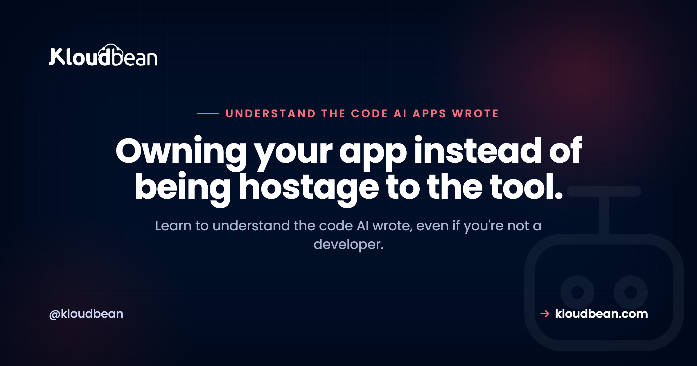

# Understand the Code AI Wrote: A Non-Coder's Guide to Reading Your Own App

By Kloudbean Engineering · Owning your app instead of being hostage to the tool.

You built something real with Lovable, Cursor, Bolt, or Replit, and it works. Then one day it breaks, or a bill spikes, or a security scare lands in your inbox, or you need to change one small thing the AI keeps getting wrong. And you're staring at a folder full of files you have never opened. So let's fix that. This guide teaches you to understand the code AI wrote, even if you have never written a line yourself. Not to become a developer. Just to stop being locked out of your own app.

> **The short version.** You don't need to learn to code. You need to learn to navigate. Find the entry point where the app starts, follow one request from the browser to the database and back, learn to tell frontend from backend (that one decides where secrets are safe), and locate where the API calls and the secrets live. Then let the AI explain its own code in plain English, and verify what it says against what you now understand. Reading code is far easier than writing it.

## How to understand the code AI wrote without becoming a developer

Here is the reassuring truth up front. Reading code is much easier than writing it. You already do the reading kind of thinking every day. You can read a menu without being a chef. You can follow a recipe without inventing one. Code is the same. You are learning to find your way around a building, not to lay the bricks.

Why bother, when the whole appeal of these tools is that you don't have to look? Because the moment something goes wrong, the tool's confidence runs out. It will happily rewrite a file and swear it fixed the bug, then break two other things. It will leave a secret sitting somewhere it should not. It will hit a wall on a change and loop. When that happens, the difference between owning your app and being stuck is small: it is knowing where to look and roughly what you are looking at. That is the skill. It is learnable in an afternoon, and it pays off every time the AI gets confused.

One expectation to set. You are not going to read the whole codebase, and you should not try. Even the developers who write these things don't read every line. They navigate to the part that matters and ignore the rest. That is exactly what you'll learn to do here.

## Step one: get your bearings in the folders

Open your project and resist the urge to click into a file and start reading. First, just look at the top-level folders and files, the way you'd glance at a map before walking into a new city. Most AI-built apps follow the same rough layout, so once you learn it, you can read a codebase as a non-developer without much trouble. Here's what the usual pieces mean and, more useful, why you'd care.

| File or folder | What it is | Why you care |
| --- | --- | --- |
| `README.md` | The note the tool or a developer left behind | Read it first. It usually says how to run the app and what the parts are. |
| `package.json` / `requirements.txt` / `Gemfile` | The app's identity card and its shopping list of dependencies | Tells you the name, how to start it, and every outside library it leans on. |
| `src/` or `app/` | The actual code that was generated for you | This is where you'll spend nearly all your time. |
| `routes/`, `pages/`, or `api/` | The URLs of your app | Each file here tends to map to a page you see or an endpoint the app calls. |
| `components/` | The UI building blocks | Buttons, forms, cards. The visible stuff on screen. |
| `.env` and config files | Settings and secrets | Where API keys and connection strings should live. This file should never be committed to Git. |
| `migrations/`, `schema`, or `db/` | The shape of your data | Your tables and columns. What the app actually stores and how it's organized. |
| `public/` or `static/` | Files served exactly as they are | Images, icons, the favicon. Nothing secret ever goes here. |
| `node_modules/` or `venv/` | Downloaded dependency code | Do not edit. It's generated from your dependency list and can be thrown away and rebuilt. |
| `dist/` or `build/` | The compiled output | Also generated. If you want to change something, change the source in `src/`, not this. |

Start with the identity card. Open `package.json` (or `requirements.txt` for a Python app) and read three things: the name, the scripts, and the dependencies.

```json
{
  "name": "my-ai-app",
  "scripts": {
    "dev": "vite",
    "build": "vite build",
    "start": "node server.js"
  },
  "dependencies": {
    "express": "^4.19.0",
    "react": "^18.3.0",
    "pg": "^8.11.0"
  }
}
```

That tiny file tells you a lot. The `scripts` are the buttons for running the app: `start` is how it runs for real, `dev` is how you run it while working, `build` packages it up. The `dependencies` are the libraries it's built on, and you can look each one up in ten seconds. Here `express` is the web server, `react` draws the screen, and `pg` is how the app talks to a PostgreSQL database. You just learned the app's whole shape without reading a single line of its logic.

<!-- ADD IMAGE: your editor's file tree (Cursor or VS Code) with the top-level folders visible, so a reader can match this map to their own project. -->

## Find the entry point, then follow one request

Every app has a starting point, the file that boots everything up. In a Node app it's often `server.js`, `index.js`, or `app.js`, and the `start` script in `package.json` points right at it. That's your front door.

From there, the trick is to read top-down, not line-by-line. Pick one thing the app does, say loading the orders page, and follow just that path. A request flows in a predictable shape: the browser asks for a URL, a route matches it, a handler function runs, that handler maybe reads or writes the database, and a response travels back to the browser. Follow that one thread and ignore everything it doesn't touch.

<!-- ADD IMAGE: a request-flow diagram. Browser (frontend, on the user's device) sends a request across a dashed server boundary to a Route, which calls a Handler, which reads or writes the Database, and the response travels back. Note that secrets are safe only on the server side. Brand colors navy #000f27, purple #4F1AF3, green #40b75f. -->

*The path every request takes. To understand a feature, find its route, open the handler, and follow only that thread.*

So when you want to understand a feature, don't hunt through every file. Search your project for the URL or the button text, find the route, open the handler it points to, and read down from there. One thread at a time. That single habit is most of what "reading a codebase" actually means.

## Frontend or backend? The one distinction that matters most

If you learn only one thing from this whole guide, make it this. Code lives in one of two worlds, and telling them apart decides where your secrets are safe.

**Frontend** code runs in the browser, on the user's own device. Anyone can open their browser's developer tools and read it. All of it. **Backend** code runs on the server, at your host, where the public can't see it. That's the whole reason the distinction matters: a secret is only safe on the backend. Put an API key in frontend code and you have effectively published it.

How do you tell which is which? A few reliable tells.

| | Frontend (browser) | Backend (server) |
| --- | --- | --- |
| Runs on | The user's device, in their browser | Your server, at your host |
| Usually lives in | `components/`, `pages/`, files ending `.jsx` `.tsx` `.vue` | `routes/`, `api/`, `server.js`, controllers |
| Gives itself away by | Mentioning the screen, buttons, clicks, or `window` | Handling a URL, reading `process.env`, talking to the database |
| Can a stranger read it? | Yes, right from their browser | No, it stays on the server |
| Safe to put a secret in? | No, not ever | Yes, in an environment variable |

One trap worth flagging, because AI tools fall into it constantly. In many setups, any variable whose name starts with `VITE_` or `NEXT_PUBLIC_` gets bundled into the frontend and shipped to the browser. So a variable named `NEXT_PUBLIC_API_KEY` is not a secret at all, no matter how it's labeled. If you see a real key behind one of those prefixes, that's a problem to fix, and the [environment variables guide](https://www.kloudbean.com/blog/environment-variables-done-right/) walks through doing it right.

## Where the money and the risk hide

Now that you can navigate, here's where to point that skill first. Three kinds of code are worth finding on purpose, because they're where surprise bills and security scares come from.

**External API calls.** These are the lines that call out to a paid service: an LLM like OpenAI, a payment provider like Stripe, an email or SMS service. Search your code for things like `fetch(`, `axios`, or the service's domain such as `api.openai.com`. Then check the important part: is any of these calls sitting inside a loop? A call that runs once per page is cheap. The same call inside a loop that runs once per row in your database is how a small feature quietly turns into a large bill. You don't have to fix it to spot it. Spotting it is the win.

**Secrets.** Find every place a key or password appears. The healthy pattern is that they're read from the environment, something like `process.env.STRIPE_SECRET_KEY`, and never written out as plain text. The unhealthy pattern is a real key typed directly into a file, or worse, into a frontend file. If you find a hardcoded key, you have found the single most common way AI-built apps get compromised.

**Database calls.** These are the reads and writes to your data. Same question as the API calls: is a query running inside a loop when one query could do the job? That's the usual cause of a page that gets slower as your data grows. Again, you're auditing, not fixing. You're building a mental list of "here's where this app spends money and takes risk," which is exactly the map you were missing.

This is a comprehension pass, not a hardening pass. Once you know where these things live, the companion [AI-built app security checklist](https://www.kloudbean.com/blog/ai-built-app-security-checklist/) covers the fix for each risky pattern, and [deploying an AI agent without exposing API keys](https://www.kloudbean.com/blog/deploy-ai-agent-without-exposing-api-keys/) goes deep on the secrets one.

<!-- ADD IMAGE: a project-wide search (VS Code Cmd/Ctrl+Shift+F) showing results for a term like api.openai.com or process.env, so a reader sees how to locate API calls and secrets without reading every file. Blur any real values. -->

## Read an error like a detective

When something breaks, the app usually hands you an error, often a scary-looking block called a stack trace. It looks like noise. It isn't. It's a set of directions to exactly where the problem is, and reading it is a two-step skill.

```
TypeError: Cannot read properties of undefined (reading 'email')
    at sendReceipt (/app/src/handlers/checkout.js:54:22)
    at processOrder (/app/src/routes/orders.js:31:9)
    at /app/node_modules/express/lib/router/route.js:149:13
```

Read it in two moves. First, the top line is the *what*. Here it's saying the code tried to read `email` from something that didn't exist (it was "undefined"). Second, the lines below are the *where*, listed from most recent backward. Scan down and find the first line that points into your own code, the part with `/app/src/`. That's `checkout.js`, line 54. You can ignore the `node_modules` line, because that's library code, not yours. So without knowing the language, you already know: something in `checkout.js` around line 54 expected an email address and got nothing. That's a real, specific lead, and it's often enough to fix it yourself or to hand the AI a much better instruction than "it broke." And if an error only shows up once the app is deployed, never on your own machine, that's its own puzzle, which [why your AI app works locally but not in production](https://www.kloudbean.com/blog/why-my-ai-app-works-locally-but-not-in-production/) untangles.

## Let the AI explain its own code, then verify it

Here's the part that makes all of this dramatically easier. The same AI that wrote the code can explain it back to you, and it's genuinely good at that. The key is asking specific questions instead of vague ones. Paste a file or point at it and ask something like this.

```
Explain this file to me in plain English. I'm not a developer.
- What is this file's job in the app?
- What calls it, and what does it call or depend on?
- Does anything in here run in the browser? If so, are any keys or secrets exposed?
- If I wanted to change [the thing I care about], which lines would I touch?
```

Good questions to keep in your back pocket: "explain this file in plain English," "what calls this function and what does it call," "where is the database connection configured," and the sharp one, "does this send my API key to the browser." Each gives you a real answer you can act on.

Now the caveat, and it matters. The AI can be confidently wrong. It will sometimes describe what the code looks like it should do rather than what it actually does, invent a file that isn't there, or miss a detail that changes everything. So treat its explanation as a knowledgeable friend's guess, not gospel. Verify it against what you now know how to check: does the file it named actually exist, does the frontend/backend split match, does the behavior hold up when you run it. You are no longer taking the AI's word blind, and that's the entire point of learning this. You can now audit AI code instead of trusting it.

<!-- ADD IMAGE: a chat with Cursor, Lovable, or ChatGPT asking "explain this file in plain English" with the plain-English answer visible, so readers see the workflow in action. -->

## Red flags you can actually search for

You don't need judgment to check most of these. You need a search box. Whether you use your editor's project-wide search (`Cmd` or `Ctrl` plus `Shift` plus `F` in VS Code and Cursor) or the terminal, here are the things worth looking for and what each one usually means.

| Search for this | What it usually means | What to do |
| --- | --- | --- |
| `sk-`, `sk_live_`, `AIza` | A hardcoded API key (OpenAI, Stripe, Google) | Move it into an environment variable, then rotate the key. |
| `password =` or `DATABASE_URL` in a frontend file | A database credential shipped to the browser | Get it out of the client. Credentials belong server-side only. |
| `NEXT_PUBLIC_` or `VITE_` on a real secret | A "secret" that's actually public | Rename and move it server-side. Those prefixes ship to the browser. |
| `http://` on an API or login call | Data sent in the clear, not encrypted | Switch it to `https://`. |
| SQL built with `+` and user input | Input glued straight into a query (injection risk) | Ask the AI to use parameterized queries instead. |
| `TODO` or `FIXME` near login or auth | Security the AI left half-built | Finish it before you launch. |

From the terminal, one command scans your whole project for the most dangerous of these, the hardcoded secrets, while skipping the dependency folder you don't care about:

```bash
# Run this from your project folder
grep -rniE "sk-[a-z0-9]|api[_-]?key|secret|password|DATABASE_URL" . \
  --include="*.js" --include="*.ts" --include="*.jsx" --include="*.tsx" \
  --exclude-dir=node_modules
```

Finding a match isn't a disaster, and it isn't a verdict on your app. It's a signpost that says "look here, or ask the AI to fix exactly this." That's the healthiest way to hold it. You're not grading yourself. You're reading your own app well enough to point at a specific spot, which is worlds better than a vague feeling that something might be wrong.

## What files to leave alone

A quick note so you don't break things while exploring, because reading is safe but a nervous edit isn't. Two folders are generated, not written: `node_modules/` (or `venv/` in Python) and `dist/` or `build/`. Editing them does nothing useful, because they get overwritten. There's also usually a lock file (`package-lock.json` or `yarn.lock`) that you should leave to the tools. Everything in `src/` or `app/` is fair game to read, and safe to change as long as you can undo it. Which brings up the one habit that makes all exploration risk-free: make sure your project is in version control (Git) so any change can be reverted. If your AI tool saves versions or checkpoints, that counts too. Explore freely when you can always get back.

## Where to read what your app is actually doing

Reading the code tells you what should happen. Logs tell you what did happen. Once your app is live and real people are using it, the errors that matter show up in the logs, the same kind of stack traces you just learned to read, but from actual traffic instead of your own testing. Knowing how to read a log is the live version of everything above, and it's often where a real bug finally reveals itself. It's part of the going-live literacy the [last mile of vibe coding](https://www.kloudbean.com/blog/last-mile-of-vibe-coding/) is all about.

Where those logs live depends on your host. Kloudbean, for what it's worth here, puts application and server logs in one dashboard and keeps your secrets in environment-variable settings in the UI, so keys stay out of the code where they belong. That's a convenience, not the point of this page. The point is that between reading the code and reading the logs, your app is no longer a black box. You can see what it's built from and what it's doing.

---

**You can read your own app now. That's the whole game.** When you're ready to run it somewhere you can actually see it, Kloudbean gives you application and server logs in one place, managed servers and databases, and environment-variable settings so keys never touch your code. Free migration if you're moving, and standard plans from $8/mo (check current details on [pricing](https://www.kloudbean.com/pricing/)). Start at [kloudbean.com](https://www.kloudbean.com/).

## FAQ

**Do I need to learn to code to understand my AI app?**
No. Reading code is a different, much easier skill than writing it. You're learning to navigate: find the entry point, follow one request, tell frontend from backend, and locate the API calls and secrets. That's enough to understand what your app is built from and where its risks are, without ever writing a line yourself.

**How do I read AI-generated code as a non-developer?**
Start with the map, not the details. Look at the top-level folders, read the README and the package.json to learn the app's shape, then pick one feature and follow its thread from the URL to the handler to the database. Read top-down, one thread at a time, and lean on the AI to explain any file in plain English while you sanity-check its answer.

**How do I find where my API keys are?**
Search your whole project for the key's shape. OpenAI keys start with sk-, Stripe live keys with sk_live_, Google keys often with AIza. Also search for words like secret, password, and api_key. Healthy code reads these from environment variables; a real key typed directly into a file, especially a frontend file, is the thing to fix.

**What is the difference between frontend and backend code?**
Frontend code runs in the user's browser, so anyone can read it with developer tools. Backend code runs on your server, where the public can't see it. This decides everything about secrets: a key is only safe in backend code. Anything shipped to the browser, including variables with NEXT_PUBLIC_ or VITE_ prefixes, is effectively public.

**How do I read a stack trace?**
Read it in two moves. The top line is what went wrong, often a short message. The lines below are where, listed most recent first. Scan down to the first line that points into your own code (usually a path with src in it) and ignore the node_modules lines, which are library code. That first line names the file and line number to look at.

**Can I trust the AI to explain its own code?**
Mostly, but verify. The AI is genuinely good at explaining a file in plain English, and asking it specific questions is the fastest way to understand your app. But it can be confidently wrong, describing what code looks like it does rather than what it does. Treat its answer as a smart guess and check it against what you can see and run.

**What files should I never edit?**
Leave the generated folders alone: node_modules or venv, and dist or build. They're rebuilt automatically and any edit gets overwritten. Lock files like package-lock.json are best left to the tools too. The code you can freely read and change lives in src or app, ideally with Git or your tool's checkpoints on so you can undo anything.

**How can I tell what my AI app actually does?**
Combine two views. The code shows what should happen: follow a request from route to handler to database to see the logic. The logs show what did happen once real people use it. Reading the folder map, following one feature's thread, and then watching the logs together give you a full picture of what the AI actually built.

**Where do I see the real errors once my app is live?**
In your application and server logs. Live errors appear there as stack traces from real traffic, the same format you'd read while testing. Where the logs live depends on your host; some put application and server logs in one dashboard. Knowing how to read a log turns a vague "it's broken" into a specific file and line to investigate.

---

*Kloudbean Engineering · You don't have to write code to read it.*
