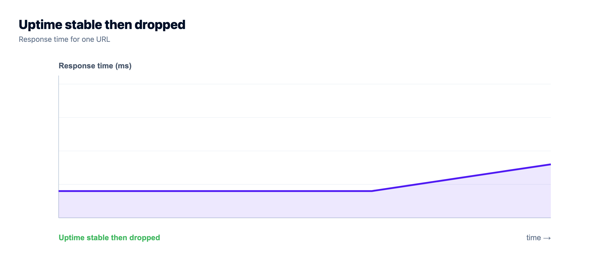
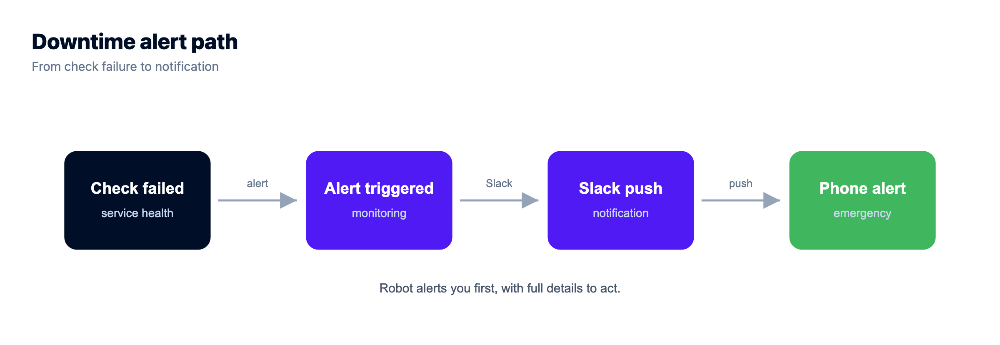
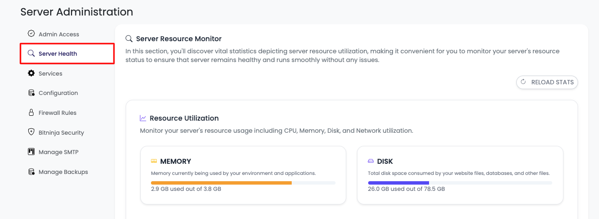
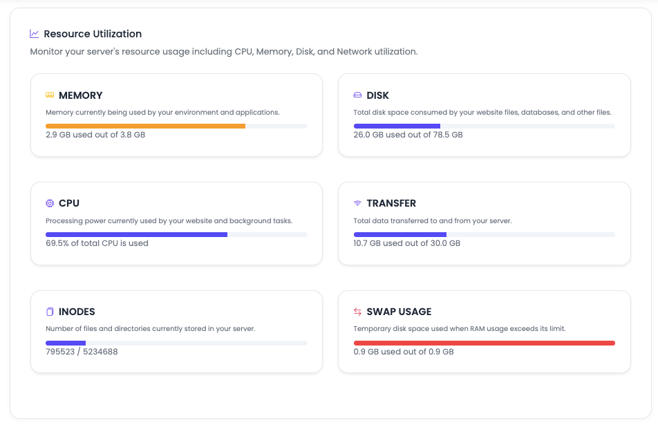
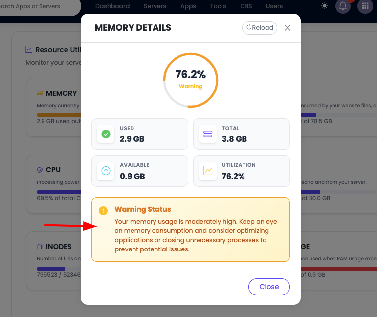
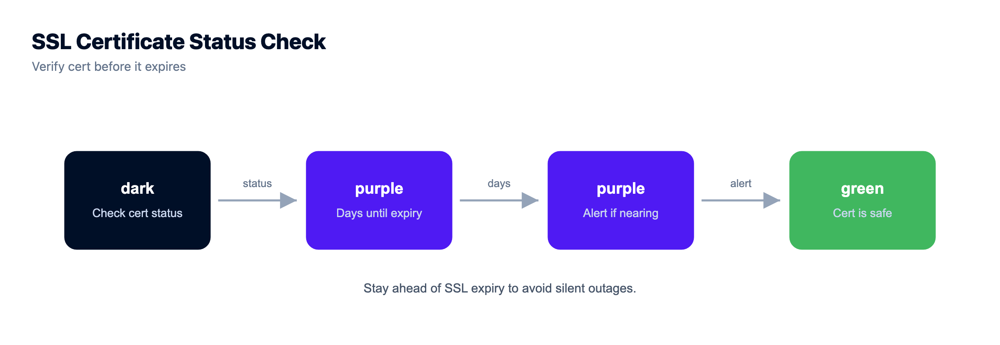

# Uptime Monitoring: How to Know Your Site Is Down Before a Customer Does

By Kloudbean Reliability · Know before your users do.

The worst way to find out your site is down is a customer tweet. Or a Slack from your boss. By then you're losing money and trust, and debugging in a panic. Uptime monitoring flips that around, so a robot tells you first and you fix it before most people notice.

This is a practical guide to uptime monitoring: how to monitor server uptime, what website monitoring actually catches, what to watch, and how to alert without crying wolf. We'll walk the four layers from the outside in, show a real health-check endpoint, and finish with the smallest setup that genuinely catches an outage.

> **The short answer**
> Uptime monitoring is a set of automated checks that watch whether your site and server are actually working, and alert you the moment they aren't. It runs in four layers: an external check on your URL, a health endpoint that proves your app and database respond, resource monitoring for CPU, memory, and disk, and response-time checks because slow is a kind of down. The skill isn't collecting metrics. It's alerting on the ones that matter.

## "It works on my screen" is not monitoring

Loading your own site once a day proves almost nothing. You're probably hitting a cached page, in the one region where things are fine. Meanwhile the checkout throws 500s across Europe, or the certificate expired at midnight, or the disk filled and new orders stopped writing. You feel great. Your users are gone.

Monitoring is the smoke detector for your infrastructure. Here's the mindset that matters: if you learn about downtime from a user, your monitoring already failed, however pretty its graphs. The whole job is to be first.



## The four layers of uptime monitoring

People throw around "monitoring" like it's one thing. It's four jobs, each catching a failure the others miss. Skip a layer and you leave a gap where an outage can hide. Take them outside in.

### Layer 1: external uptime checks (website monitoring)

An external uptime check lives somewhere else on the internet and hits your public URL every 30 or 60 seconds. If the request fails or times out, it alerts you. This is what most people mean by website monitoring, and tools like UptimeRobot, Pingdom, and Better Uptime all do a version of it.

Why external? Because it catches the failures your own server can't report. If the box is down it can't email you to say so, and if DNS breaks or the certificate expired, the server can think it's healthy while the outside world sees nothing. The good ones check from several locations, run **synthetic monitoring** that scripts a real journey (load, log in, add to cart) instead of just pinging the homepage, and post a public **status page**.

```
# roughly what an external monitor runs against you, on repeat
curl -fsS -m 10 https://example.com/health || notify "site down"
```

Start here. If you add one piece of monitoring today, make it an external check on your main URL.



### Layer 2: health-check endpoints (the /health route)

An external check that just loads your homepage has a blind spot. The web server can return a page while the app is broken underneath. The port is open and the process runs, but the database connection died an hour ago and every real request is failing. To the check that looks up. To your users it's an outage.

A **health-check endpoint** fixes this. It's a route your app exposes, by convention `/health` or `/healthz`, that does real work to confirm the app and its dependencies are alive, then returns 200 if healthy and a non-200 (usually 503) if not. A live database connection matters far more than "the process is running," so prove it with the cheapest possible query:

```
// /health: prove the app is up AND its database is reachable
const express = require('express');
const app = express();

app.get('/health', async (req, res) => {
  try {
    await db.query('SELECT 1');          // cheapest possible round-trip to the DB
    return res.status(200).json({ status: 'ok' });
  } catch (err) {
    // one dead dependency means this instance is NOT healthy
    return res.status(503).json({ status: 'db_unreachable' });
  }
});

app.listen(process.env.PORT || 3000);
```

That `SELECT 1` is the point. It turns "is the app up?" into "can the app do its job?" Extend it to a Redis ping if you rely on one. One trap: don't make the endpoint so heavy it becomes the problem. Check what's essential and return fast.

### Layer 3: resource monitoring (CPU, memory, disk)

The first two layers tell you the app is down now. Resource monitoring tells you it's about to be, which is more useful. Most outages build: a slow memory leak, a disk creeping toward full. Watch the resources and you fix things in business hours, not at 3am. Three metrics carry most of the weight:

- **Disk.** The quiet killer. Logs and uploads pile up, the disk hits 100%, and the database can't write. One of the most common self-inflicted outages I've seen, and an alert at around 80% used prevents it.
- **Memory.** A leak climbs until the kernel's OOM killer shoots your process. A rising line over days is a warning you can act on.
- **CPU.** A brief spike is fine. A flat line at the top for an hour is a resize conversation.

This is the view Kloudbean puts in the console: CPU, memory, and disk over time, per server, so watching resources doesn't mean building a separate metrics stack first.






*Resource monitoring in the Kloudbean console. Watching CPU, memory, and disk over time is how you catch a filling disk or a memory leak before it becomes downtime.*

### Layer 4: response time and error rate (slow is the new down)

A site that takes twelve seconds to load is down for practical purposes. The user already left. So the fourth layer watches performance while the app is technically up. **Response-time monitoring** tracks latency at percentiles, not an average, since averages hide slow requests behind fast ones; a p95 that jumps from 200ms to 2 seconds is a real signal before anything errors. **Error-rate monitoring** tracks the share of requests returning 5xx, often the first sign of a bad deploy.

## How much downtime does 99.9% uptime actually allow?

Once you're measuring, you can put a number on it. 99.9% uptime allows about 43 minutes of downtime a month, roughly nine hours a year, and still counts as kept. 99.99% cuts that to about 4 minutes. Don't chase five nines by reflex: a brochure site is fine at 99.9%, while a store bleeding sales wants 99.95% or better, which takes redundancy, not just monitoring. The full breakdown, and the fine print for what counts as down, is in [what a 99.9% uptime SLA actually buys you](https://www.kloudbean.com/blog/cloud-sla-explained/). Monitoring measures whether you're hitting the number. It doesn't raise it.

## Alerting without crying wolf

This is where most monitoring setups quietly fail, and it's got nothing to do with metrics. A monitor that pings you for every one-second blip trains you to ignore it, and then the alert that mattered scrolls past at 2am with forty that didn't. A noisy monitor everyone has muted is worse than none. I'll die on that hill.

So be deliberate about what wakes a human. Require a couple of consecutive failures before paging, so one dropped packet doesn't set off a siren. And split alerts into "page me now" and "log it, I'll look later."

| Page a human immediately | Log it or notify quietly |
|---|---|
| Site unreachable from 2+ locations, 2+ checks in a row | A single failed check that recovered on the next one |
| `/health` returning 503 (a dependency is down) | A brief CPU spike that settled on its own |
| Disk over 90% used | Disk crossing 80% (act soon, not tonight) |
| Error rate spiking after a deploy | A slow request that self-corrected |
| SSL certificate expiring in under 3 days | Routine deploy and restart events |

Send the page-now list to a phone push or SMS, the rest to a Slack or email channel. If you're ignoring alerts, the answer is never a bigger dashboard. It's fewer, sharper ones.



## How load balancers use health checks

Your `/health` endpoint pulls double duty. A load balancer in front of your servers doesn't just split traffic. It polls the health check on each backend, and the moment one starts failing, it stops sending requests there. One instance dies, the balancer routes around it, and visitors never notice.

That's also how zero-downtime deploys work: a new version only gets real traffic once it passes its health check, so a bad build never gets promoted. Full mechanics in [how a cloud load balancer works](https://www.kloudbean.com/blog/cloud-load-balancer-explained/).

This is also the layer where the health check stops being a monitoring nicety and starts changing outcomes, which is why it matters where your balancer lives. On Kloudbean the Flexible Load Balancer is built into every account, off until you enable it, and it works with application pools, so routing around a sick instance is a switch rather than a project. Its access logs sit in the same place, which saves you correlating an outage across two vendors' timestamps. One app's pool can also span more than one cloud and more than one region, so a bad region stops being a single point of failure. The database primary still lives in one region, though, so plan that part deliberately.


*A load balancer polls each server's health check and quietly drops any that fail. The health endpoint you built for monitoring becomes the switch that keeps traffic on the living instances.*

## What to watch for your specific stack

The four layers are the frame. The details depend on what you run. A few failure modes bite so often they're worth a checklist, because each one is a real outage I've watched land on someone:

| Watch this | Why it bites | The signal to alert on |
|---|---|---|
| SSL certificate expiry | An expired cert takes the whole site offline on a date you forgot. Silent until it happens. | Days until expiry, alert at 14 and 3 days |
| Disk space | Logs and uploads fill the disk, then writes and the database start failing. | Disk percent used, alert around 80% |
| Database connections | The pool exhausts, requests hang or error, and it looks like a total outage. | Active connections and query errors |
| Memory | A leak climbs until the OOM killer stops your process. | Memory percent trending up over days |
| The app process | A crashed process means every request fails, even though the server is fine. | Process up/down plus the `/health` status |

The certificate row deserves a callout, because it's the one row you can delete instead of monitoring. Expired SSL is one of the most common silent outages going, and an alert only tells you a date is coming. Auto-renewal removes the date. Kloudbean issues free SSL that renews itself, so the row stops needing a check at all. The database row matters too, because "the site is down" is often an exhausted pool rather than a dead database. How to size one is in [database connection pooling explained](https://www.kloudbean.com/blog/database-connection-pooling/).


## Detection is only half the job

Knowing you're down is worthless if you can't get back up, so pair monitoring with a tested recovery plan. The catch people miss: a backup you've never restored is a hope, not a plan, so run one real restore before you trust it. The routine is in [the server backups guide](https://www.kloudbean.com/blog/server-backups-guide/), and where monitoring sits in the whole system is in [how cloud hosting works](https://www.kloudbean.com/blog/how-cloud-hosting-works/).

## The cheapest monitoring setup that actually catches an outage

You don't need an observability platform to stop being surprised. Five things. Most of them free, none of them a weekend. If you do nothing else, do these, in this order.

1. **One external check on your main URL, every 60 seconds.** Free tiers cover this. It has to run somewhere else, and that's the part no hosting provider can do for you: a server can't report that the outside world stopped reaching it.
2. **A `/health` route that runs `SELECT 1`, and point the check at that.** Ten lines. It upgrades "the port is open" into "the app can do its job", and the same route is what a load balancer polls later.
3. **A disk alert at 80%.** Cheapest outage prevention going. Kloudbean's console already keeps CPU, memory, and disk history per server, so this is a graph you read rather than a metrics stack you stand up first.
4. **Certificate expiry deleted, not monitored.** Free auto-renewing SSL removes the date that would have taken you offline, which beats being warned about it three days out.
5. **One restore you have personally performed.** Automatic and on-demand backups run on the same dashboard as the health graphs, but the untested restore is the actual failure mode. Do it once, on purpose, while nothing is wrong.

Now the parts no host fixes, ours included. Layer 1 is not something a managed platform provides, so pair whatever you run with a dedicated external monitor. Alert fatigue is a discipline problem, and no dashboard cures a channel everyone muted. Your own application bugs stay yours: a 500 from bad code will pass every server-level check we have, cheerfully. And availability is architecture, not a figure on a page. Kloudbean runs on tier-1 provider infrastructure and gives you health-checked pools behind the built-in balancer, which is how you raise real availability. Anyone quoting you a percentage instead is selling you a number.

Weighing where to run it? [DigitalOcean vs Kloudbean](https://www.kloudbean.com/blog/digitalocean-vs-kloudbean/) covers the managed-versus-DIY tradeoff, and [what a managed server actually is](https://www.kloudbean.com/blog/what-is-a-managed-server/) covers the rest.

<!-- cta:start -->
**Own the server. Skip the server admin.**

Pick from seven clouds, run your app on a managed server you control, and keep databases, storage, and deploys in the same dashboard instead of four separate vendors.

- Seven cloud providers
- Managed databases
- Object storage
- Automatic backups
- Free SSL
- Git deploy
- Free migration assistance

[Start free](https://console.kloudbean.com/register) · [See plans](https://www.kloudbean.com/pricing/)
<!-- cta:end -->

## FAQ

### What is uptime monitoring?
Automated checks that verify your site and server are working and alert you the moment they aren't. They combine an external check, a health endpoint, and resource monitoring, so you hear about downtime before your customers do.

### How do I monitor if my website is down?
Point an external service like UptimeRobot, Pingdom, or Better Uptime at your public URL. It hits your site every 30 to 60 seconds from outside and alerts you on failure, catching outages your own server cannot report.

### What is a health check, and what is a /health endpoint?
A health check confirms the app is actually working, not just that its port is open. A /health endpoint runs real work, like a cheap SELECT 1 against the database, and returns 200 when healthy or 503 when a dependency is down.

### What should I monitor?
Reachability from outside, the app and its database via a health endpoint, resources over time (CPU, memory, disk), and performance (response time and error rate). Also watch SSL certificate expiry and disk space.

### What is a good uptime percentage?
99.9% allows about 43 minutes of downtime a month; 99.99% cuts that to roughly 4 minutes but needs real redundancy. Match the target to the cost of an hour offline instead of chasing nines by reflex.

### How do I avoid alert fatigue?
Require a couple of consecutive failures before paging, and split alerts into urgent pages and quiet notifications. Only real outages reach your phone; the rest go to a log. A monitor everyone ignores is worse than none.

### What is synthetic monitoring?
It scripts a real user journey, like load, log in, and add to cart, and runs it on a schedule. It catches broken flows a simple up/down check misses, since a site can be reachable while a key action fails.

### Does Kloudbean include uptime monitoring?
Kloudbean shows server health in the console (CPU, memory, and disk over time), and its built-in Flexible Load Balancer routes around instances that fail their health check. For external website monitoring, pair it with a dedicated uptime service.
