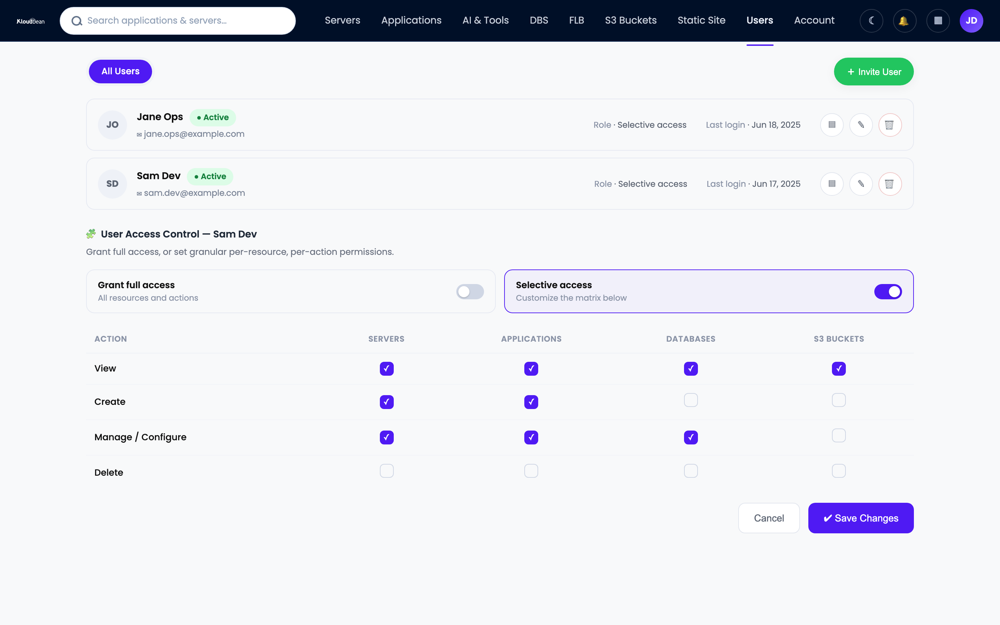
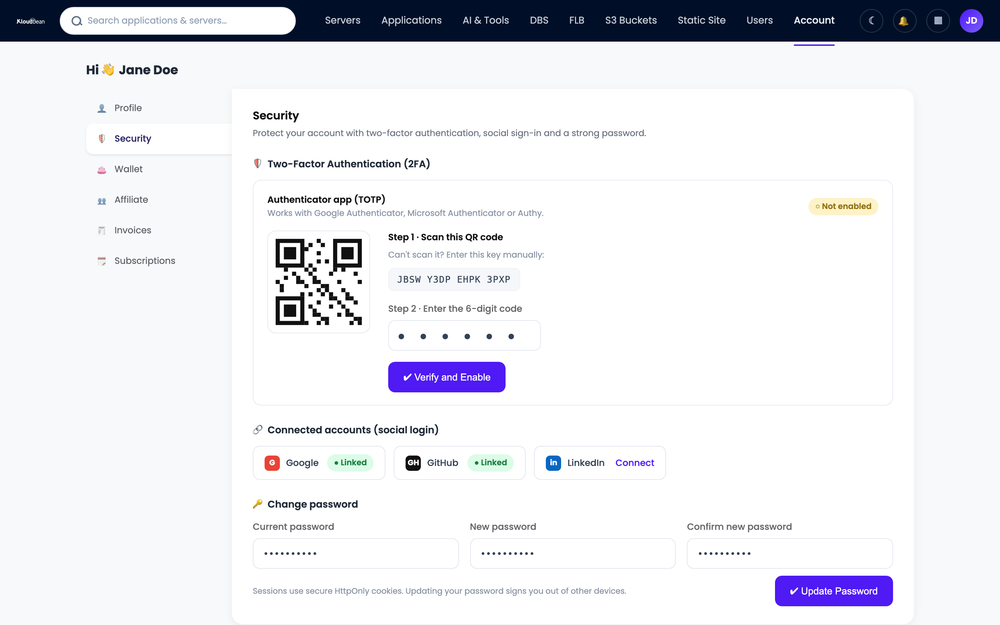

# User Access Control Explained: Roles, Least Privilege, and Team Permissions

Five people, one "admin" login, shared in a group chat. It works right up until it doesn't. Someone deletes the wrong database and nobody can say who. A contractor rolls off and that password still opens everything. This is what user access control fixes: give each person their own identity, grant only the permissions their job needs, and keep a record of who did what. This guide walks the principles (least privilege, role-based access control, separation of duties) and how to run real team permissions on your hosting.

> **The short version:** User access control decides who can do what in your systems. The fix for a shared admin login is unglamorous and it works: one identity per person, role-based access control so permissions attach to roles instead of people, least privilege so nobody holds more than their job needs, and an audit trail so every action is attributable. On Kloudbean that's subusers with granular per-resource, per-action permissions, plus an Enterprise audit trail.

## What user access control actually means

User access control is the set of rules that decide which people can reach which resources, and what they can do there. For every action it answers three questions: who are you, are you allowed to do this, and can we prove later that you did.

Authentication proves who you are; authorization is what you're allowed to do afterward. A shared admin login fails both: you can't tell people apart, and everyone can do everything.

## The real cost of one shared admin login

Sharing one login feels efficient early on. Then the team grows and that convenience turns into three specific problems. I've watched all three bite teams that swore they'd fix access later.

**No accountability.** Five people, one login, and the logs show a single actor. So when a production database gets dropped at 2am, the honest answer to "who ran that?" is a shrug. You can't investigate an incident when every action traces back to the same account.

**No least privilege.** A shared admin can do anything, so everyone holding it can too. The junior dev who only needed to restart one app can also wipe the server and export the billing history. One phished password, and it's game over for the whole account.

**Painful offboarding.** A freelancer finishes up. To remove their access you change the shared password and re-share it with everyone still around. Most teams skip that, so the password quietly keeps working long after the person is gone.

```
ONE SHARED ADMIN LOGIN            |   SCOPED SUBUSERS + UAC
                                  |
  user user user user user        |   Dev A     -> deploy App 1, view logs
      \   \   |   /   /           |   Designer  -> view only
       [ ADMIN login ]            |   Contractor-> App 2 logs only
       can do everything          |
                                  |
  - Who deleted the DB? Unknown.  |   + Every action is attributable.
  - One phished password = all.   |   + A leak is contained to one scope.
  - Leaver? Rotate for everyone.  |   + Leaver? Revoke one account.
```

*One shared key means no accountability and a painful cleanup. Scoped subusers make every action attributable and turn offboarding into a single revoke.*

## The principles behind good access control

Access control isn't one setting. It's a few principles that reinforce each other, and they map to how real teams break. Get the why behind each one and the product screens later feel obvious.

### Least privilege: grant only what the role needs

Least privilege means every person and every key gets the minimum access to do the job, nothing spare. Access you never use can't help you, but it can hurt you when a credential leaks or someone fat-fingers a command. A designer who only edits static assets shouldn't hold delete rights on the production database.

### One identity per human

Every person gets their own account. Always. Individual identities mean the logs name a real human for every action, offboarding is a clean single revoke, and you can change one person's permissions without touching anyone else. If you can't tell who did something, you don't really have security. You have a group chat with root.

### Separation of duties

Some combinations of power shouldn't sit in one pair of hands. In finance, whoever approves a payment shouldn't also issue it. Same in infrastructure: the account that can change production shouldn't also delete every backup and wipe the audit log, or one compromised login can do damage and erase the evidence.

### Per-resource, per-action granularity

Access isn't one switch. Real control is granular: can this person do this action on this resource. View App A's logs, yes. Delete the server it runs on, no. Touch App B, no. Coarse "admin or nothing" roles force you to over-grant: the only way to allow one small thing is to hand over everything.

### Regular access reviews

Access creeps. People change teams, grab a temporary permission, and quietly keep it forever, so six months later half your team holds access they never use. Each stale grant is extra blast radius for the day something goes wrong. The fix is a habit, not a tool: every quarter, pull the who-can-do-what list and prune anything that no longer matches the job.

<!-- ADD IMAGE: a quarterly access-review table an admin can use -->

## What is role-based access control (RBAC)?

Role-based access control, or RBAC, is what makes least privilege manageable past a couple of people. Instead of hand-assigning permissions to individuals, you attach permissions to roles, then assign people to roles. Users point at roles, roles point at permissions. That one layer of indirection is the whole trick.

Hire a third developer and you don't rebuild their permissions from memory. Drop them into the developer role and they inherit exactly the right access. When the job needs a new permission, change the role once and everyone in it updates.

```
# Permissions attach to ROLES. People attach to roles.
role: developer    can deploy(App1), view(logs), restart(App1)
role: billing      can view(invoices), manage(payment_method)
role: contractor   can view(App2 logs)        # and nothing else

alice   is developer
bob     is billing
carol   is contractor      # rolls off in March? remove carol. done.
```

Contrast the anti-pattern almost everyone starts with: everyone is admin. It's just the shared-login problem wearing individual accounts. Names show up in logs, so accountability improves a little, but any account can still do anything, so any single compromise is total. RBAC keeps the individual accounts and shrinks that blast radius.

### A worked example

Say you run a small product team on one hosting account. Here's how a sane set of roles maps to real actions.

| Action | Owner | Developer | Designer | Contractor | Billing |
| --- | --- | --- | --- | --- | --- |
| **Deploy App 1** | Yes | Yes | No | No | No |
| **Restart App 1** | Yes | Yes | No | No | No |
| **View App 2 logs** | Yes | Yes | No | Yes | No |
| **Delete a server** | Yes | No | No | No | No |
| **Manage the database** | Yes | Yes | No | No | No |
| **Manage billing** | Yes | No | No | No | Yes |
| **View dashboards** | Yes | Yes | Yes | No | Yes |

Read down the Contractor column. That's least privilege in one glance: they see the logs for the one app they're helping with, and nothing else. Nobody outside the owner can delete a server. When the contract ends, you remove one account and every grant disappears with it.

## How to offboard someone without a fire drill

Offboarding is where sloppy access control sends the bill. With individual accounts and RBAC, removing someone is one action: revoke their account, and all their permissions go with it. No shared password to change, no copy sitting in an old chat.

Build it into the moment someone leaves. Revoke on the way out, not next week. Access that outlives the working relationship is a common way old credentials turn into new breaches. Offboarding removes the people who left; reviews catch the permissions that outlived their purpose.

Client work compounds this fast. Agencies onboard and offboard people constantly across many client environments, so a clean per-person, per-resource model is the difference between a two-second revoke and a nervous afternoon. There's more on that model in the [guide to white-label hosting for agencies](https://www.kloudbean.com/blog/white-label-hosting-for-agencies/) and the practical side of running lots of client sites in [agency WordPress hosting](https://www.kloudbean.com/blog/agency-wordpress-hosting/).

## How Kloudbean handles user access control

Principles are cheap until a platform lets you enforce them. Here's how they map to real controls on Kloudbean, all inside the same dashboard as your servers, apps, and databases.

### Subusers and User Access Control (UAC)

Create a subuser for each person, then grant permissions per resource and per action. Granular by design, so your developer can deploy one app without touching billing, the database, or the other twenty projects. This is RBAC and least privilege made concrete.



*Subusers + UAC: one account per person, with granular per-resource, per-action permissions.*

<!-- ADD IMAGE: a close-up of a single subuser's permission set -->

### Stronger identity: social login and hardened sessions

Authorization only holds if authentication is solid. Kloudbean supports social login with Google, GitHub, and LinkedIn, so you lean on providers that already do serious identity work instead of minting another password. Sessions use HttpOnly cookies, so a cross-site scripting bug can't read the session token out of JavaScript. As a general best practice, turn on two-factor authentication for every account from your account security settings.



*Account security settings: enable two-factor authentication so a leaked password on its own can't get in.*

### Lock the doors you rarely open

Two more controls shrink your attack surface cheaply. IP Access Control allows or denies traffic by address or CIDR range, so a sensitive path only answers to your office or VPN. Point it at something like `203.0.113.0/24` and the rest of the internet can't reach that door. A Basic Auth gate puts a username and password wall in front of an app, ideal for a staging site you don't want probed.

### The audit trail: proof of who did what

When something changes, both compliance and incident response ask the same question: who did that, and when? On Kloudbean, the Audit Trail is an Enterprise feature: an immutable, searchable, account-wide log of activity with CSV export, built with compliance in mind. It turns a pile of good controls into evidence. For a SOC 2 review or a post-incident timeline, it's the difference between "we think" and "here's the record." The [SOC 2 hosting guide](https://www.kloudbean.com/blog/soc2-compliant-hosting/) shows where that evidence fits.

<!-- ADD IMAGE: the Enterprise audit trail view with a searchable activity log and CSV export -->

Access control is one layer of a bigger picture. For how it sits alongside firewalls, SSL, and backups, see the [shared-responsibility guide to secure, compliant hosting](https://www.kloudbean.com/blog/secure-compliant-hosting/), and the [explainer on what a managed server includes](https://www.kloudbean.com/blog/what-is-a-managed-server/) covers what "managed" handles underneath.

## A practical access-control checklist

Take the list if nothing else. Do these and you've closed the doors attackers use most.

- Give every person their own account. Kill the shared admin login.
- Grant least privilege: only the resources and actions each role needs.
- Use roles, not one-off per-person grants, so access stays reviewable.
- Split sensitive powers (separation of duties) so one account can't do damage and erase the trail.
- Turn on two-factor authentication for everyone from account security settings.
- Fence off admin and staging paths with IP Access Control or a Basic Auth gate.
- Revoke access the day someone leaves, and review who-has-what every quarter.
- Keep an audit trail so every action is attributable when it matters.

Access control and recoverability are two halves of surviving a bad day, so the [guide to server backups and restore testing](https://www.kloudbean.com/blog/server-backups-guide/) covers the other half. Weighing platforms on how seriously they take team access? A read like [Kloudbean vs Cloudways](https://www.kloudbean.com/blog/kloudbean-vs-cloudways/) beats any homepage checkbox.

---

**Real team access, without the shared password.** Give everyone their own scoped account, keep least privilege by default, and manage it all from one dashboard. Start free at [kloudbean.com](https://www.kloudbean.com/), see plans on [pricing](https://www.kloudbean.com/pricing/), and always confirm current details there.

Subusers + UAC · Per-resource, per-action permissions · Social login · IP Access Control · Basic Auth gate · Automatic backups · Audit trail (Enterprise)

## FAQ

### What is user access control?

User access control decides which people can reach which resources and what they can do there. It pairs authentication (who you are) with authorization (what you're allowed to do), so each person has a limited, recorded identity instead of a shared free-for-all.

### What is role-based access control (RBAC)?

RBAC attaches permissions to roles, then assigns people to roles instead of granting permissions one by one. Change a role once and everyone in it updates, which is what makes least privilege manageable at scale.

### Why is sharing one admin login risky?

It breaks accountability (the logs can't tell your people apart), least privilege (everyone holds full power, so one phished password owns the account), and offboarding (removing one person means rotating the password for all).

### What is the principle of least privilege?

Least privilege means granting every person and key the minimum access the job needs, nothing extra. Access you never use can't help you but can hurt you when a credential leaks, so limiting it shrinks the blast radius of any single compromise.

### What are subusers?

Subusers are individual accounts for each team member instead of a shared login. On Kloudbean each gets granular permissions per resource and per action through User Access Control, so a developer can deploy one app without touching billing or the database.

### How do I offboard someone safely?

Give everyone an individual account, then offboarding is a single revoke: remove the account and all their permissions go with it. Do it the day they leave, with no shared password to rotate and no credential left quietly working.

### What is an audit trail and do I need one?

An audit trail is an immutable, searchable log of who did what and when. On Kloudbean it's an Enterprise feature with CSV export, which you need to prove your controls operated over time for frameworks like SOC 2 and to reconstruct an incident.

### Does Kloudbean support team permissions and RBAC?

Yes. You create a subuser per person and grant permissions per resource and per action through User Access Control. Kloudbean also has social login (Google, GitHub, LinkedIn), HttpOnly sessions, IP Access Control, and a Basic Auth gate; the account-wide audit trail is on Enterprise.

### What is separation of duties?

Separation of duties splits sensitive powers so no single account completes a risky chain alone. The account that can change production shouldn't also delete every backup and clear the audit log, or one compromise can do damage and then hide it.

### How often should I review who has access?

A quarterly review is a sensible default, with an immediate revoke whenever someone leaves. Access creeps upward as people change roles and keep old permissions, so a regular prune keeps least privilege honest.

---

By Kloudbean Security · Least Privilege, By Default. One identity per person, only the access the job needs, and a record of who did what.
