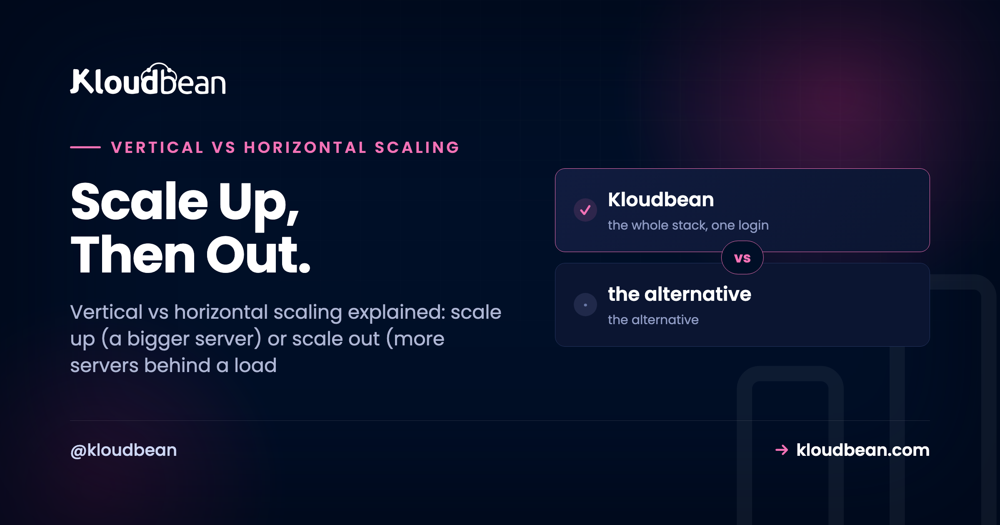

# Vertical vs Horizontal Scaling: Scale Up or Scale Out?

*By Kloudbean · Scale Up, Then Out.*

Your server is pinned near 95% CPU during the evening rush and the dashboard is throwing alerts. You've got two ways out. Give that one box more CPU and RAM, or run several boxes and split the traffic between them.

That fork is **vertical vs horizontal scaling**, also called scale up vs scale out. Most guides make it sound like a big architectural decision. For most apps it isn't. There's a sane default order, one prerequisite people skip, and a trap where you scale the wrong tier entirely. Let's walk all three.

> **Short version:** Vertical scaling (scale up) means a bigger server: more CPU and RAM on one box, no code change. Horizontal scaling (scale out) means more servers sharing the work behind a load balancer, which needs a stateless app. Scale up first, because it's simple and buys real runway. Scale out when you hit a single box's ceiling or you need redundancy, since one server is a single point of failure.

## Vertical vs horizontal scaling: what each one means

Two words, one idea each. **Vertical scaling** is making one server bigger: more CPU cores, more RAM, faster disk on the same machine. On a managed platform that's a resize, pick a larger plan and the box reboots. Nothing in your code changes, because it's the same server doing the same work with more room.

**Horizontal scaling** is running more servers and spreading the load across them. Instead of one box handling every request, you put a [load balancer](https://www.kloudbean.com/blog/cloud-load-balancer-explained/) in front and it hands each request to whichever server is free. Two boxes, five, twenty. The balancer is the traffic cop. It's also where redundancy comes from: if one server dies, the others keep serving while it recovers.

People blur the terms, so pin them down. Scale up is the same machine getting stronger. Scale out is more machines added. One's a dial you turn, the other's a fleet you grow, and they solve slightly different problems.

|  | Vertical (scale up) | Horizontal (scale out) |
| --- | --- | --- |
| What changes | More CPU and RAM on one server | More servers behind a load balancer |
| Simplicity | Highest. Just a resize | Medium. Needs a load balancer and a stateless app |
| App changes needed | None | Must be stateless (shared sessions and storage) |
| Ceiling | The biggest box the provider sells | Add nodes as far as you need |
| Redundancy | None. One box is a single point of failure | Built in. Survivors keep serving |
| Cost pattern | Steps up as you resize; can get pricey at the top end | Roughly linear per node; pay for what you run |
| Best for | Growing but steady load, early stage | High load, redundancy, uptime |

Here's the same contrast as a picture: one box grows, or one box becomes many behind a balancer.

<figure>
  <svg viewBox="0 0 720 430" role="img" aria-label="Two panels. Left, labelled scale up vertical: a single small server box with a larger dashed outline around it and an upward arrow marked plus CPU plus RAM, showing the same box getting bigger. Right, labelled scale out horizontal: a load balancer pill at the top with arrows fanning down to three identical app server boxes, showing traffic spread across several machines." xmlns="http://www.w3.org/2000/svg">
    <rect x="0" y="0" width="720" height="430" fill="#ffffff"></rect>
    <line x1="360" y1="88" x2="360" y2="392" stroke="#c9d0e3" stroke-width="1.4" stroke-dasharray="5 6"></line>
    <text x="60" y="52" font-family="Poppins,sans-serif" font-size="17" font-weight="700" fill="#000f27">Scale up (vertical)</text>
    <text x="60" y="74" font-family="Poppins,sans-serif" font-size="13" fill="#5b6a86">One box, made bigger</text>
    <rect x="96" y="150" width="150" height="200" rx="14" fill="#4F1AF3" opacity=".07"></rect>
    <rect x="96" y="150" width="150" height="200" rx="14" fill="none" stroke="#4F1AF3" stroke-width="2.4" stroke-dasharray="7 5"></rect>
    <text x="171" y="176" text-anchor="middle" font-family="Poppins,sans-serif" font-size="12" font-weight="600" fill="#4F1AF3">8 CPU / 16 GB</text>
    <rect x="120" y="278" width="102" height="72" rx="10" fill="#000f27"></rect>
    <text x="171" y="312" text-anchor="middle" font-family="Poppins,sans-serif" font-size="13" font-weight="600" fill="#ffffff">server</text>
    <text x="171" y="331" text-anchor="middle" font-family="Poppins,sans-serif" font-size="11" fill="#aeb9d4">2 CPU / 4 GB</text>
    <line x1="270" y1="300" x2="270" y2="182" stroke="#4F1AF3" stroke-width="2.8" marker-end="url(#up)"></line>
    <text x="286" y="238" font-family="Poppins,sans-serif" font-size="12.5" font-weight="600" fill="#4F1AF3">+ CPU</text>
    <text x="286" y="256" font-family="Poppins,sans-serif" font-size="12.5" font-weight="600" fill="#4F1AF3">+ RAM</text>
    <text x="60" y="388" font-family="Poppins,sans-serif" font-size="12" fill="#5b6a86">Resize the same machine. No code change.</text>
    <text x="404" y="52" font-family="Poppins,sans-serif" font-size="17" font-weight="700" fill="#000f27">Scale out (horizontal)</text>
    <text x="404" y="74" font-family="Poppins,sans-serif" font-size="13" fill="#5b6a86">More boxes, shared load</text>
    <text x="550" y="112" text-anchor="middle" font-family="Poppins,sans-serif" font-size="12" fill="#5b6a86">traffic</text>
    <line x1="550" y1="118" x2="550" y2="140" stroke="#5b6a86" stroke-width="2" marker-end="url(#down)"></line>
    <rect x="430" y="146" width="240" height="46" rx="23" fill="#4F1AF3"></rect>
    <text x="550" y="174" text-anchor="middle" font-family="Poppins,sans-serif" font-size="15" font-weight="600" fill="#ffffff">Load balancer</text>
    <line x1="500" y1="192" x2="446" y2="292" stroke="#40b75f" stroke-width="2.6" marker-end="url(#g)"></line>
    <line x1="550" y1="192" x2="550" y2="292" stroke="#40b75f" stroke-width="2.6" marker-end="url(#g)"></line>
    <line x1="600" y1="192" x2="654" y2="292" stroke="#40b75f" stroke-width="2.6" marker-end="url(#g)"></line>
    <rect x="404" y="298" width="88" height="60" rx="10" fill="#ffffff" stroke="#40b75f" stroke-width="2.4"></rect>
    <text x="448" y="333" text-anchor="middle" font-family="Poppins,sans-serif" font-size="13" font-weight="600" fill="#000f27">app</text>
    <rect x="506" y="298" width="88" height="60" rx="10" fill="#ffffff" stroke="#40b75f" stroke-width="2.4"></rect>
    <text x="550" y="333" text-anchor="middle" font-family="Poppins,sans-serif" font-size="13" font-weight="600" fill="#000f27">app</text>
    <rect x="608" y="298" width="88" height="60" rx="10" fill="#ffffff" stroke="#40b75f" stroke-width="2.4"></rect>
    <text x="652" y="333" text-anchor="middle" font-family="Poppins,sans-serif" font-size="13" font-weight="600" fill="#000f27">app</text>
    <text x="404" y="388" font-family="Poppins,sans-serif" font-size="12" fill="#5b6a86">Any node serves any request. One dies, the rest carry on.</text>
    <defs>
      <marker id="up" markerWidth="11" markerHeight="11" refX="4" refY="8" orient="auto"><path d="M4 0 L8 8 L0 8 Z" fill="#4F1AF3"></path></marker>
      <marker id="down" markerWidth="10" markerHeight="10" refX="3" refY="7" orient="auto"><path d="M3 8 L6 0 L0 0 Z" fill="#5b6a86" transform="rotate(180 3 4)"></path></marker>
      <marker id="g" markerWidth="10" markerHeight="10" refX="7" refY="3" orient="auto"><path d="M0 0 L7 3 L0 6 Z" fill="#40b75f"></path></marker>
    </defs>
  </svg>
  <figcaption>Scale up grows one server. Scale out puts a load balancer over several identical servers, which also buys redundancy: any node can serve any request.</figcaption>
</figure>

## Which should you scale first?

Scale up first. I'll say that flatly, because the industry's fascination with distributed everything pushes small teams toward fleets they don't need yet. A bigger server is the simplest lever you have: no load balancer to configure, no code to change, no new failure modes. Click resize, wait a couple of minutes, and the same app runs on more CPU and RAM. For most apps that alone carries you from launch to real traffic.

Vertical scaling wins on effort. It loses on two things, exactly when you switch. First, the **ceiling**: every provider has a biggest box, and once you're on it there's nowhere up to go. Second, **redundancy**: one server is one power supply, one kernel, one bad deploy from a full outage. No amount of resizing changes the fact that a single box is a single point of failure.

So the rule is short. Resize the box while it's cheap and easy. Reach for more boxes when you bump the ceiling of one machine, or when downtime from a single failure stops being acceptable. Plenty of busy apps [run happily on one well-sized server](https://www.kloudbean.com/blog/host-app-api-and-database-on-one-server/) for a long time. Don't build for a fleet on day one.


## The prerequisite everyone skips: your app has to be stateless

This is the part that bites people, and it's the actual gate for horizontal scaling. The moment you run a second server, a rule kicks in that a single box never forced on you: **any server has to handle any request**. If that isn't true, a second instance doesn't share the load. It breaks things.

Picture the classic failure. A user logs in, their session saves in the first server's memory, then the next click lands on the second server, which has never heard of them. They're logged out. Or they upload a photo, it saves to server A's local disk, and later requests that hit server B show a broken image. The file's on the wrong machine. Same story with an in-memory cache: warm on one box, cold on the other.

None of that is a load balancer bug. It's **state living in the wrong place**. A stateless app keeps nothing important on any single server's local disk or memory. It pushes that state to shared services every node can reach:

- **Sessions and cache** move to a shared store like [managed Redis](https://www.kloudbean.com/blog/redis-caching-patterns/). Now every server reads the same session, so the balancer can send a user anywhere.
- **Uploads and user files** move to [object storage](https://www.kloudbean.com/blog/s3-compatible-object-storage/) instead of local disk. Any node can serve any file, and you stop losing uploads on the next deploy too.
- **Your data** already lives in a managed database that all nodes connect to, which is exactly why the database tier is a separate problem (more on that next).

Here's the smallest concrete version, an Express app moving sessions out of memory:

```js
// Before: sessions in memory. Breaks the moment a second server exists.
app.use(session({ secret: process.env.SESSION_SECRET }))

// After: sessions in shared Redis. Any node can serve any request.
import RedisStore from "connect-redis"
app.use(session({
  store: new RedisStore({ client: redisClient }),
  secret: process.env.SESSION_SECRET,
}))
```

Getting the app stateless is the real work of scaling out. The load balancer on top is almost trivial by comparison. Do this once and running across several servers stops being scary, whether you scale by hand or later [automate it](https://www.kloudbean.com/blog/autoscaling-explained/).

<!-- ADD IMAGE: Before and after: sessions and uploads moving off a single server's memory and disk into shared Redis and object storage. -->

## Where the database fits (it scales on its own axis)

Here's a distinction that saves wasted effort: the app tier and the database scale differently. You scale the app tier out easily by adding stateless nodes. The database is stateful, one authoritative copy of your data, so you can't just clone it five times and call it scaled.

The database has its own ladder, and it's cheap-first. Resize it up as the simplest move. Take load off it with [connection pooling](https://www.kloudbean.com/blog/database-connection-pooling/), so a hundred app processes don't each hold an idle connection, and with caching, so the same hot queries don't hammer it over and over. Cache the homepage, the popular product, the dashboard, and those reads never touch the database again. [Read replicas](https://www.kloudbean.com/blog/database-read-replicas-scaling/) come next: read-only copies that serve SELECTs while the primary handles writes. They're a genuine pattern with a real catch (replication lag, where a replica can sit a few milliseconds behind), so you plan for them rather than flip them on in a panic. Index, pool, cache, resize, then replicate, and never reach for app servers to fix a database problem.

## The trap: scaling the wrong tier

The most expensive scaling mistake isn't picking up vs out. It's scaling the tier that isn't the bottleneck, and it happens constantly. The app feels slow, the instinct is "add more servers," so you spin up three app nodes behind a balancer and nothing gets faster. The bottleneck was the database all along, and now three app servers are piling even more connections and queries onto the one database that was already struggling. You didn't relieve the pressure. You multiplied it.

So measure before you scale anything. If app CPU is pinned and the database is bored, scale the app (up first, then out). If the database is pinned and the app nodes are idle, no number of app servers will help; that's a database problem, and it wants indexing, caching, pooling, a resize, or eventually a replica. "It's slow" is not a diagnosis. Find the tier that's actually saturated, then apply the right lever.

Same logic for memory. An app swapping because it's out of RAM needs a bigger box (scale up), not more boxes. Adding nodes to fix a per-node memory shortage just gives you more starved nodes.


## How you scale up and out on Kloudbean

Both axes are here. It's worth being precise about what's a switch you flip versus an enterprise arrangement, so nobody expects magic.

**Scaling up** is a resize. Every account can move a server to a plan with more CPU and RAM, across any of the seven supported clouds. Same app, bigger machine. It's the first lever, and for most apps the only one you'll use.

**Scaling out** uses the built-in **Flexible Load Balancer (FLB)**. It ships on every account, off by default, and you enable it when you need it (it isn't a separate product). The FLB spreads traffic across an application pool, handles SSL, and keeps access logs: you run a fixed set of nodes and it shares the load across them. There's a smaller, free win first, too. On Node apps, **PM2 multi-process** runs several worker processes on one server so you use all its CPU cores, more headroom out of the box you already own.

One honest boundary, stated plainly: **Kloudbean does not autoscale a standard account automatically.** Adding and removing nodes on their own based on live traffic, along with Kubernetes and fully custom architectures, is an **enterprise and custom-setup capability**, not a toggle a regular plan flips. For everyday growth you resize (up) and run a pool behind the FLB (out) yourself, which covers what most apps ever need. If your traffic is genuinely spiky and you want the automation, that's the enterprise conversation. It all runs on infrastructure from the world's largest clouds, managed from one dashboard, which is the point of [managed cloud hosting](https://www.kloudbean.com/blog/best-managed-cloud-hosting/).

<!-- ADD IMAGE: The dashboard showing a server resize alongside the load balancer pool, so scale up and scale out sit side by side. -->

## The order most apps should actually follow

Put it together and scaling stops being a scary word. It's a ladder, and most projects never climb past the middle rungs:

1. **Size one server sensibly** and run on it. One box handles more than people expect.
2. **Scale up.** Resize to more CPU and RAM as you grow. Simplest lever, no code change, big runway.
3. **Make the app stateless.** Sessions and cache to Redis, uploads to object storage. This is the prerequisite for everything below it, so do it before you need it, not during an incident.
4. **Scale out.** Add a second node behind the load balancer, first for redundancy (kill the single point of failure), then for capacity.
5. **Scale the database separately.** Index, pool, cache, resize, and consider read replicas only when reads still overwhelm one instance.
6. **Automate scaling last,** and only if your traffic is genuinely spiky. On Kloudbean that's the enterprise and custom path, not a standard-plan default.

Notice how much of that ladder is "scale up and keep the app clean." The exotic stuff sits at the top, where most apps never go. Let real traffic, not fashion, tell you when to climb the next rung.

<!-- ADD IMAGE: A ladder graphic of the six steps: one server, scale up, go stateless, scale out, scale the database, automate last. -->

---

**Scale up when it's easy, out when it's needed.** Resize a server in a couple of clicks, then spread traffic across a pool with the built-in Flexible Load Balancer the day one box isn't enough. One dashboard for servers, managed databases, object storage, and the load balancer. Start free at [kloudbean.com](https://www.kloudbean.com/) or compare plans on [pricing](https://www.kloudbean.com/pricing/).

Resizable servers · Built-in Flexible Load Balancer · Managed databases · Object storage · Private networking · Free migration · Free trial

## FAQ

**What's the difference between vertical and horizontal scaling?**
Vertical scaling (scale up) means making one server bigger: more CPU and RAM on the same machine, with no code change. Horizontal scaling (scale out) means running more servers and spreading the load across them behind a load balancer. Scaling up is simpler; scaling out adds capacity and redundancy but needs a stateless app.

**Which should I do first, scale up or scale out?**
Scale up first for almost every app. Resizing a server to more CPU and RAM takes minutes and changes nothing in your code, so it's the cheapest way to buy headroom. Scale out later, when you hit the ceiling of the biggest single box you can get, or when you need redundancy because a single server is a single point of failure.

**What is scaling out?**
Scaling out (horizontal scaling) is adding more servers and putting a load balancer in front to distribute requests across them. Several machines share the work, so you get more total capacity and can survive one server failing. It requires a stateless app, so any server can handle any request.

**Do I need a load balancer to scale horizontally?**
Yes. Several servers serve the same app, and something has to decide which server each request goes to. That's the load balancer's job, and it health-checks the nodes so it stops sending traffic to one that's down. Without it, there's no single address for your app and no way to spread the load.

**Why does my app break when I add a second server?**
Almost always because it's storing state on one server. Sessions in local memory, uploads on local disk, or an in-memory cache all live on a single machine, so when the balancer sends a user to a different server, their session or files aren't there. The fix is a stateless app: move sessions and cache to Redis, uploads to object storage.

**How do I scale the database?**
The database scales on its own axis, not by cloning app servers. Start with the cheap levers: index slow queries, add connection pooling, and cache hot reads so they don't hit the database. Resize the instance next, and reach for read replicas (read-only copies that serve SELECTs) only once the remaining reads still overwhelm a single database.

**What's a scaling bottleneck, and how do I find it?**
A bottleneck is the one tier that's saturated and holding everything back, usually app CPU, app memory, or the database. Measure before scaling: check which resource is pinned. If the database is the bottleneck, adding app servers makes it worse, so match the fix to the tier that's actually maxed out.

**Does Kloudbean autoscale my app?**
Not on a standard account, and that's deliberate. Every account can resize a server (scale up) and run a pool of nodes behind the built-in Flexible Load Balancer (scale out) by hand, which covers what most apps need. Fully automatic autoscaling, plus Kubernetes and custom architectures, is an enterprise and custom-setup capability, not a toggle on a regular plan.

---

*By Kloudbean · Scale up, then out, and only as far as the traffic asks.*
