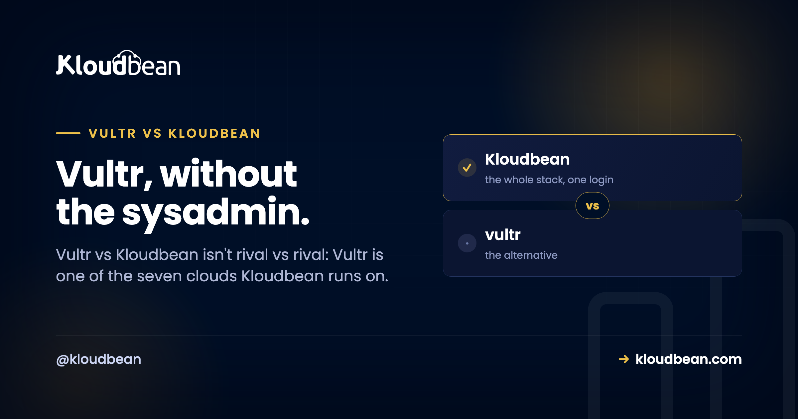

# Vultr vs Kloudbean: Raw Cloud or Managed Vultr Hosting?



Search "Vultr vs Kloudbean" and you're really weighing two different jobs, not two rival companies. Vultr is a raw cloud you rent by the hour: a clean Linux instance in a data center near your users, priced to move. Kloudbean is a managed layer that runs on top of clouds, and Vultr is one of the seven it can deploy to. So the honest question isn't whose cloud wins. It's whether you want to patch, secure, and babysit that Vultr box yourself, or hand the server work off and just ship your app.

> **Short answer**
>
> Vultr vs Kloudbean isn't strictly either/or, because Kloudbean can provision and manage a server on Vultr's own infrastructure. Raw Vultr gives you a fast, cheap Linux box and leaves the OS patching, web stack, SSL, firewall, backups, and deploys to you. Managed Vultr hosting through Kloudbean handles that layer, on Vultr or six other clouds, from one dashboard. Pick raw Vultr if you enjoy running Linux and want the lowest sticker price. Pick the managed layer when uptime and your time matter more than saving a few dollars a month.

## Why "Vultr vs Kloudbean" is the wrong fight

Most "X vs Y" hosting posts line up two providers and score their networks against each other. This one can't do that cleanly, because one option runs on the other. Vultr sells infrastructure: a Linux instance in a region near your users, plus building blocks like block storage, snapshots, and load balancers you wire together yourself. Kloudbean sells a managed layer, and it will happily put that layer on a Vultr instance.

So the thing that trips people up in a "Vultr alternative" search is this. Kloudbean isn't an alternative to Vultr's hardware. It's an alternative to being the sysadmin. Same infrastructure underneath, a different amount of work landing on you. That reframes the whole decision from "whose cloud" into "who runs the box."

<!-- SVG: a hub diagram. Seven clouds along the bottom (AWS, Lightsail, Google Cloud, Linode, Vultr, DigitalOcean, UpCloud), Vultr highlighted as "you pick", lines fanning up into one Kloudbean managed layer (OS patching, web server and runtime, free SSL, automatic backups, 7 managed databases, Git deploys and monitoring), with your application and data on top. Caption: Vultr sits alongside six other clouds Kloudbean can provision on. You pick Vultr, and the managed layer above it handles the server work while your app stays yours. -->

## What Vultr actually is (and what it leaves to you)

Credit where it's due. Vultr is an independent, self-funded cloud that launched in 2014 and built a following on price and performance. It runs data centers around the world, offers a clean API and control panel, and its High Frequency and NVMe instances give you fast CPUs and quick disks for latency-sensitive work. If you want a fast Linux box from a company that isn't a hyperscaler, Vultr is a genuinely good pick.

But a Vultr instance is an empty Linux box. That's its strength and its chore list in one sentence. Everything above the kernel is yours: the web server, the runtime, the database, the firewall, the TLS certificate and its renewal, the backups, the deploys, the monitoring. Not just on setup day. Every day after, until you automate it well or it bites you. Vultr hands you excellent raw material. It doesn't hand you a managed stack, and it never claimed to.

<!-- ADD IMAGE: A Vultr control panel instance list beside a terminal running apt and certbot. Shows the hands-on raw side fairly. -->

## Vultr vs managed hosting: who owns which job

A VPS is an empty Linux box, so the comparison is really a list of chores and who signs up for each. Here's the same Vultr instance run two ways, job by job.

| The job | Raw Vultr | Kloudbean on Vultr |
| --- | --- | --- |
| OS + security patching | You, indefinitely | Handled |
| Web server / runtime | You install and maintain it | Set up for you |
| SSL + renewal | You run certbot and remember to renew | Free SSL, auto-renewed |
| Backups | You script them, or wire up the snapshot schedule you meant to | Automatic backups |
| Managed databases | Install and secure each engine yourself | Seven one-click engines, backed up |
| Object storage | Wire up S3-compatible storage yourself | Built-in S3-compatible + GCS buckets |
| Load balancing | Configure and maintain your own | Built-in Flexible Load Balancer |
| Dashboard scope | Vultr portal for instances; you assemble the rest | Servers, apps, DBs, storage, LB in one view |
| Multi-cloud choice | Vultr only | Vultr plus six other clouds |
| Support model | Docs, community, and tickets for the infra | Managed platform support for the stack |
| Who it's for | Hands-on teams who enjoy running Linux | Teams who'd rather ship than administer |

Neither column is wrong. The left is what you take on with a raw VPS, and plenty of engineers do it well and enjoy every minute. The right is what a managed layer folds into the price. The choice is which of those lists you want to own. The screen where "not either/or" stops being abstract is where you pick your cloud, with Vultr sitting right there among the options.


*Adding a server in Kloudbean: pick Vultr (or AWS, Lightsail, Google Cloud, Linode, DigitalOcean, UpCloud) and a region. Same Vultr infrastructure, provisioned and managed for you.*

## The bill nobody prices in: running the box yourself

Setup is what everyone benchmarks in a Vultr review, and it matters least six months in. Spinning up an instance is quick. But a server isn't a one-time build. It's a standing responsibility, and someone has to write the maintenance and then keep watching it.

```bash
# fresh Vultr instance: you SSH in and build the stack yourself
apt update && apt -y upgrade
apt -y install nginx php-fpm mysql-server certbot python3-certbot-nginx
ufw allow OpenSSH && ufw allow 'Nginx Full' && ufw --force enable

# TLS, then the job that quietly breaks months later
certbot --nginx -d example.com
# if this cron silently fails, the site starts throwing
# NET::ERR_CERT_DATE_INVALID and you hear it from a customer first:
0 3 * * *  certbot renew --quiet

# and the day-2 list that never really ends:
#   apt upgrades + kernel reboots, fail2ban tuning, log rotation,
#   off-box backups, disk-space alerts, MySQL tuning, monitoring...
```

The instances that get teams into trouble are almost never hacked in some clever way. It's an expired certificate that took the site down on a Sunday. A disk full of logs nobody rotated. A CVE left unpatched for a year because everything looked fine. Boring failures, all of them, invisible until the exact second they aren't.

I'll take a side here. A raw Vultr box is the right tool when running the server is part of the project and you'll keep up with it. The common mistake isn't picking Vultr. It's picking a VPS and treating it like it's managed: set up once, patched never, backed up "eventually" because the snapshot schedule was the thing you meant to configure and didn't. If the box is just where your product lives, paying so you never think about the patch cadence is the better trade. We put real numbers on that in [the real cost of an unmanaged VPS](https://www.kloudbean.com/blog/the-real-cost-of-unmanaged-vps/), and break down the whole choice in [managed vs unmanaged hosting](https://www.kloudbean.com/blog/managed-vs-unmanaged-hosting/).

<!-- ADD IMAGE: A terminal showing a failed certbot renew and a low disk-space warning. The boring failures that take a raw box down. -->

## Is Vultr good for production?

Yes, with an asterisk. Vultr's infrastructure is production-grade: solid instances, fast networking, snapshots and backups available as building blocks. Plenty of serious workloads run on it. But production isn't a fast box. It's the day-2 operations around the box: patching on a schedule, renewing certificates before they expire, watching disk and memory, restoring a backup you've actually tested. Vultr gives you the raw material for a production system. Whether you get a production system depends on who does that ongoing work, and how consistently.


*Managed monitoring in Kloudbean: CPU, memory, and disk on the Vultr server, watched for you. On a raw box you wire this up and remember to check it.*

## When a raw Vultr instance is the right call

This is a real fork in the road, not a setup for a pitch, so here's the honest case for going direct. Use a raw Vultr instance when you're comfortable with Linux administration and want the lowest sticker price on fast compute. Use it when you want control down to the kernel and treat that as the fun part. Use it when you want to assemble Vultr's own pieces, its block storage, snapshots, and load balancers, wired exactly your way. If your time is cheaper than your budget, or you simply enjoy the work, Vultr direct is a fine answer that needs no managed layer bolted on.

## When managed Vultr hosting wins (and why seven clouds matters)

Kloudbean is the better fit when you'd rather ship than administer. The app, the API, and the database on one server, SSL and backups already handled, at a predictable price. When you're pushing something out of Lovable, Cursor, or a Git repo and don't want to become a sysadmin just to get it online. That's what managed Vultr hosting looks like in practice: Vultr's box underneath, Kloudbean's control panel on top, and that day-2 list already handled.

And there's a bonus a raw instance can't hand you. You're not married to Vultr. Because Kloudbean runs on seven clouds, you can start on Vultr today and move the same setup to AWS, Google Cloud, Linode, DigitalOcean, UpCloud, or Lightsail later, all behind one dashboard. You keep Vultr if you love it. You keep the exit if you don't.

The managed layer is more than a nicer control panel. It's one dashboard for the whole stack: servers, applications, seven managed database engines (MySQL, MariaDB, PostgreSQL, Redis, Memcached, Elasticsearch, MongoDB), built-in S3-compatible and Google Cloud Storage buckets, a built-in Flexible Load Balancer you switch on when you need it, managed CI/CD from Git with live build logs, staging for WordPress and Laravel, and per-user access control. On a raw VPS you install and secure the database yourself. On Kloudbean you launch a managed engine on the same box, reached over the private network and backed up automatically. There's a walk-through in [adding a managed database to your app](https://www.kloudbean.com/blog/add-managed-database-to-your-app/), and the whole-market view in the pillar, [best managed cloud hosting](https://www.kloudbean.com/blog/best-managed-cloud-hosting/).

<!-- ADD IMAGE: The Launch Database screen creating a managed engine on a Vultr server. Shows the database landing on the same box, backed up. -->

## A fair word on cost

A raw Vultr instance is cheaper than a managed server, and it should be. You're supplying labor a managed plan bakes in. The honest frame is total cost, not the sticker. Vultr's monthly price is low (check their current plans, they move), but the hours you spend configuring, securing, and maintaining the box are real, and so is the risk of getting SSL or backups wrong at the worst possible time. A managed server costs a little more and buys that back. Kloudbean's standard plans start from $8/mo, with Enterprise priced custom through sales, so confirm current figures on the [pricing page](https://www.kloudbean.com/pricing/). For what actually drives a hosting bill, [cloud hosting pricing explained](https://www.kloudbean.com/blog/cloud-hosting-pricing-explained/) takes it apart.

The rule of thumb: if your schedule is tighter than your budget, managed wins; if your budget is tighter, or the ops are genuinely fun for you, the raw Vultr box wins. The Linode and DigitalOcean versions of this same trade live in [Linode vs Kloudbean](https://www.kloudbean.com/blog/linode-vs-kloudbean/) and [DigitalOcean vs Kloudbean](https://www.kloudbean.com/blog/digitalocean-vs-kloudbean/).

<!-- ADD IMAGE: One dashboard listing servers, apps, and managed databases across clouds. The piece a raw Vultr instance was never meant to give you. -->

## The honest limits

Kloudbean runs Linux web stacks: Node, PHP, Python, Ruby, Java, and frameworks like React, Vue, Angular, Laravel, Django, and WordPress. It isn't for Windows, .NET, or IIS. For general users it isn't a swap for standalone managed Kubernetes or autoscaling, which are enterprise or custom options rather than defaults. Baseline security is a configured firewall (Shorewall) plus brute-force protection (Fail2ban) and free auto-renewing SSL, with an optional extra layer available if you want it. "Managed" means Kloudbean runs the server, stack, SSL, patching, and backups; you still own your application and your data. That division of labor is the whole point. And because it's standard Linux and standard code underneath, you can leave for a raw Vultr box, or anywhere else, whenever you want.

---

**Vultr's speed. Without the pager.**

Run a managed server on Vultr (or six other clouds) at [kloudbean.com](https://www.kloudbean.com/). Seven managed databases, free SSL, automatic backups, a built-in load balancer, free migration, and a free trial. Compare plans on [pricing](https://www.kloudbean.com/pricing/).

## FAQ

### Is Vultr managed?

Not by default. Vultr is unmanaged infrastructure: it gives you a raw Linux instance and a control panel to run it, but you handle the OS patching, web stack, SSL, firewall, backups, and deploys yourself. You can add a managed layer on top, which is exactly what Kloudbean does when it provisions a server on Vultr for you.

### Can Kloudbean run on Vultr?

Yes. When you add a server in Kloudbean, pick Vultr as the cloud provider and choose a region. You get a Vultr instance underneath with Kloudbean's managed experience on top: one-click deploys, managed databases, free SSL, automatic backups, and monitoring.

### Is Kloudbean just a Vultr reseller?

No. It's a managed hosting platform that can provision on seven clouds: Vultr, AWS, AWS Lightsail, Google Cloud, Linode, DigitalOcean, and UpCloud. Vultr is one option. The value is the managed layer on top of whichever cloud you pick, not reselling the raw compute.

### Vultr vs managed hosting for WordPress: which is better?

On raw Vultr you install the web server, PHP, the database, WordPress, SSL, caching, and backups yourself, then maintain all of it. Managed Vultr hosting through Kloudbean gives you WordPress on a Vultr server with SSL, automatic backups, and staging already handled. If WordPress is your product and not your hobby, the managed route saves the ongoing work.

### Is Vultr good for production?

The infrastructure is production-grade, and plenty of real workloads run on it. But production is more than a fast instance; it's the ongoing operations around it, like patching, certificate renewal, monitoring, and tested backups. Vultr gives you the raw material. Whether it becomes a dependable production system depends on who does that day-2 work.

### Do I need to manage the server on Vultr?

On raw Vultr, yes. You own everything above the kernel: updates, the web stack, SSL renewal, the firewall, backups, and deploys. If you run Vultr through Kloudbean, that server work is handled for you and you focus on your application and data.

### Is a Vultr instance cheaper than Kloudbean?

On sticker price, usually yes, because you supply the setup and maintenance labor. Kloudbean costs a little more and does that work for you. The right answer depends on whether your time or your budget is the tighter constraint. Check current prices on both sides, since they change.

### What's a good Vultr alternative if I don't want to be a sysadmin?

You don't have to leave Vultr to stop being the sysadmin. Kloudbean can run its managed layer on Vultr, so you keep the infrastructure and hand off patching, SSL, backups, and deploys. If you'd rather switch clouds entirely, Kloudbean runs on six others too, so a Vultr alternative search can end with the same box managed, or a different cloud.

### What does managed Vultr hosting include?

With Kloudbean managing a Vultr server you get the OS and stack set up and patched, a configured firewall with brute-force protection, free auto-renewing SSL, automatic backups, Git-based deploys with live build logs, monitoring, and a managed database on the same box. You own the application and the data; the server layer is handled.

### Can I move off Kloudbean or off Vultr later?

Yes. It runs standard Linux and standard code, so you're never trapped. Move to a raw Vultr box you manage yourself, shift to another of the seven clouds behind the same dashboard, or leave for a different host entirely. The exit door is part of the design.

---

*By Kloudbean Platform Team · Vultr, without the sysadmin.*
