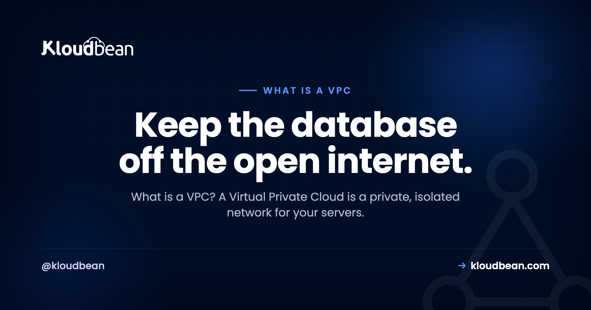

# What Is a VPC? A Private Room for Your Servers, Explained

Point a tool like Shodan at the open internet and you'll turn up thousands of databases answering to anyone who knocks. No private network in front of them. No VPN. Just a database port hanging out in public.

Most of those weren't left open on purpose. Someone spun up a server, gave the database a public address so they could reach it from their laptop, shipped the feature, and forgot. A VPC is how you stay off that list. So what is a VPC? Short for Virtual Private Cloud, it's a private, isolated network for your own resources inside the cloud, where the sensitive parts of your stack never get a public door at all.

> **Short answer:** A VPC (Virtual Private Cloud) is your own private, isolated network inside the cloud. Public-facing things like your web app go in a *public subnet*. Sensitive things like your database and cache go in a *private subnet* with no public address. Your app reaches the database over an internal private IP, and the open internet has no route to it.

## So what is a VPC, exactly?

A VPC is a walled-off slice of a cloud provider's network that belongs to you. Inside that boundary, your resources get private addresses and can talk to each other over an internal network. Nothing inside is reachable from the outside world unless you deliberately hand it a public address and open a path to it.

That last part is the whole game. By default you keep everything private, then you poke exactly one hole for the traffic that genuinely needs to come in from the internet. Your web server. Maybe a load balancer. That's usually it. Everything else stays in the back.

## Public subnet, private subnet: the split that does the work

A VPC gets carved into **subnets**, which is just a fancy word for "sections of the network." You'll deal with two kinds:

- A **public subnet** for things that must face the world. Your web or app server lives here, and so does a load balancer if you run one. These get public addresses on purpose.
- A **private subnet** for things that must not face the world. Your database, your Redis cache, internal APIs, background workers. These get private addresses only.

Private addresses come from reserved ranges: `10.0.0.0/8`, `172.16.0.0/12`, and `192.168.0.0/16`. Those blocks aren't routable across the public internet. So a machine that only has a private IP can't be dialed up from outside, full stop. It isn't hidden behind a clever lock. It has no phone number the internet can call.

```
EXPOSED                              INSIDE A VPC
[ Public internet ]                  [ Public internet ]
   |         \                            |
   v          v (open port)               v
[ App ]   [ Database ]              [ App ]  (public subnet)
                                        |  private hop
          anyone can reach the DB       v
                                    [ Database ]  (private subnet, private IP only)
```
*Same two servers, two very different risk profiles. Exposed, the database has its own door to the street. Inside a VPC, it only answers the app, over a private IP.*

## Follow one request through a VPC

Watch a single page load and the design clicks. A visitor's browser hits your app at its public address. That's allowed. It's the front door, and it's the only door. The app then needs data, so it opens a connection to the database at a private address like `10.0.4.12:5432`. That hop happens entirely inside the VPC, over the internal network, and never touches the public internet.

The visitor has no route to the database. Not a locked one. None. They talk to the app, the app talks to the database in the back, and the two conversations never mix. You've shrunk the attack surface by removing a door, which beats guarding one.

## Security groups: deciding what's allowed to talk to what

A private subnet keeps the internet out. Security groups (some clouds call them network ACLs or firewall rules) control traffic *inside* the fence. Think of a security group as a short allow-list attached to a resource. The database's rule might read: accept connections on port 5432 from the app servers only, and refuse everything else.

The habit worth building is default-deny. Start with nothing allowed, then open the specific paths your app actually needs. On Kloudbean every server also ships with a **Shorewall firewall and Fail2ban** turned on from the start, so brute-force login attempts get throttled and blocked without you configuring anything. That's the network-layer equivalent of least privilege: a resource can reach exactly what its job requires and nothing else.

<!-- ADD IMAGE: A firewall or security-group rule list, database port open only to the app tier, everything else denied. -->

## Why a public database is a breach waiting to happen

This is the part I'll be blunt about. A database reachable from the open internet is a breach waiting to happen, so keep data services off the open internet from day one. Automated scanners sweep the entire IPv4 space constantly, and an open database with a weak or default password gets found fast, sometimes within hours of going live.

Remember the "Meow" attacks in 2020? A bot roamed the internet finding exposed databases and simply wiped them, overwriting thousands of unsecured Elasticsearch and MongoDB instances with the word "meow" and no ransom, no warning. The common thread wasn't a clever exploit. It was databases left facing the public internet. A private subnet removes that entire category of mistake before you can make it.

| | Database on the public internet | Database in a private subnet |
| --- | --- | --- |
| **Address** | Public IP, reachable anywhere | Private IP only |
| **Who can connect** | Anyone who finds the port | Only your app, from inside |
| **Attack surface** | The whole internet | Your own network |
| **If credentials leak** | Direct hit, they can log straight in | They still can't route to it |
| **App-to-DB latency** | A detour through public routing | A short internal hop |

## How this looks on a managed platform

You rarely hand-build this anymore, and honestly you shouldn't have to. On Kloudbean the everyday way to lock a managed database down is **IP Access Control**: you whitelist your app server's IP address on the database, so only that server can connect and everything else is refused. Pair that with strong credentials and free SSL, and your data service stops answering strangers. If you need full network isolation, with the database in its own private subnet and no public address at all, that is the **VPC (private networking)** available on Enterprise plans.


Your app server faces visitors, and the database answers only the IP you whitelisted. If you want the deeper how-to, see [adding a managed database to your app](https://www.kloudbean.com/blog/add-managed-database-to-your-app/), or the engine-specific guides for [managed MySQL](https://www.kloudbean.com/blog/managed-mysql-hosting/) and [managed Redis](https://www.kloudbean.com/blog/managed-redis-hosting/). Enterprise and custom setups can run in their own dedicated VPC when isolation requirements go further.

<!-- ADD IMAGE: Your own topology diagram, app in the public subnet, database and cache in the private subnet, traffic staying internal. -->

## The one mistake that quietly undoes it

If there's a single trap here, it's giving the database a public address "just so I can connect from my laptop." That puts the door back on the street and cancels the whole point of the VPC. Do the tidy thing instead: tunnel in through your app server over SSH, or use a bastion host, and leave the database on its private IP. It's one extra step at setup and it keeps you off the scanner lists for good.

## What a VPC won't do for you

A VPC is one strong wall, not the whole castle. It gives you **network isolation**. On Enterprise, a managed Linux platform can wire that private networking up for you as a private subnet. On a standard plan you get the same practical safety by whitelisting your app server's IP, so the database only answers that one machine. But it only guards the network layer. You still have to secure the public-facing app that *does* have a door, write code that doesn't leak, protect your credentials, and keep the stack patched.

Think of it as layered defence. A VPC handles one important layer very well. The rest still needs attention, which is why it pairs naturally with [DDoS protection](https://www.kloudbean.com/blog/ddos-protection-explained/), [hardened application hosting](https://www.kloudbean.com/blog/secure-wordpress-hosting/), and, for regulated teams, [data residency controls](https://www.kloudbean.com/blog/data-residency-explained/) and [single-tenant isolation](https://www.kloudbean.com/blog/single-tenant-vs-multi-tenant/). Take the database off the sidewalk first. Then keep locking the doors that remain.

---

**Your database belongs in the back room.** Keep it off the open internet by whitelisting your app server's IP, so only your app can connect, on infrastructure you actually own. Managed databases with IP Access Control, a Shorewall firewall and Fail2ban on every server, automatic backups, and free migration help to get there. Need a fully isolated private subnet? That is the VPC on Enterprise. Start free at [kloudbean.com](https://www.kloudbean.com/) · see plans on [pricing](https://www.kloudbean.com/pricing/).

IP allow-listing · Managed databases · Shorewall + Fail2ban · Automatic backups · Free migration · Free trial

## FAQ

**What is a VPC in simple terms?**
A VPC (Virtual Private Cloud) is your own private, isolated network inside the cloud. Resources you put in it talk to each other over private addresses, and you choose exactly what, if anything, gets exposed to the public internet. The simple picture: a shop with a public front counter and a private back room only staff can reach.

**What is a VPC used for?**
Keeping the sensitive parts of your stack off the open internet. Your database, cache, and internal services live in a private subnet with no public address, while your web app sits in a public subnet and talks to them privately. It also keeps internal traffic internal, which is tidier and usually a little faster.

**What's the difference between a public and private subnet?**
They're the two sections of a VPC. A public subnet holds resources that need to face the world, like your web server. A private subnet holds resources that shouldn't, like your database and cache. Machines in a private subnet only have private IPs, so the public internet has no route to them.

**Why should my database be inside a VPC?**
Because it holds your most sensitive data and should never answer the open internet. Inside a private subnet it has no public address, so only your own app can reach it. Scanners constantly hunt for exposed databases, and a private network means yours simply isn't there to find.

**Is a VPC the same as a VPN?**
No, and people mix them up. A VPC is a private network that your cloud resources live inside. A VPN is a secure tunnel that lets a person or office connect into a private network from somewhere else. You might use a VPN to reach resources that live in a VPC, but they're solving different problems.

**What is a security group in a VPC?**
A security group is a small allow-list attached to a resource that decides which traffic it accepts. A database's security group might allow port 5432 from the app servers only and deny everything else. Start default-deny, then open the specific paths your app needs.

**Do I have to set up a VPC myself?**
On a good managed platform, mostly no. Building a full VPC by hand can be fiddly. On Kloudbean the everyday protection is simpler: you whitelist your app server's IP on the database, so only that server can connect. A fully isolated private subnet (a dedicated VPC) is available on Enterprise, without you configuring routing tables.

**Can I still connect to a private database from my laptop?**
Yes, without giving it a public address. Tunnel in through your app server over SSH, or use a bastion host, and connect through that. It's one extra step and it keeps the database on its private IP where it belongs, instead of exposing it to the whole internet for convenience.

**Does a VPC make my app fully secure?**
No. It secures the network layer by taking sensitive resources off the public internet, which is a big win, but it's one wall in a layered defence. You still have to secure the public-facing app, write safe code, protect credentials, and keep everything patched.

**Does a VPC cost extra or slow things down?**
On Kloudbean, a dedicated VPC (private networking) is an Enterprise capability, while standard plans lock the database down with IP allow-listing at no extra cost. As for speed, keeping the database close to your app helps: they talk over a short internal hop instead of taking a detour through public routing.

---

*Kloudbean · Keep the database off the open internet.*
