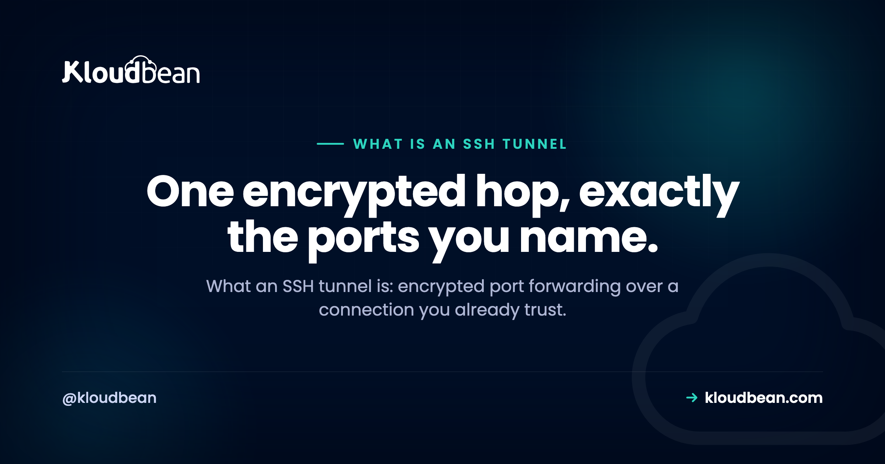

# What Is an SSH Tunnel? Encrypted Port Forwarding, Explained

By Kloudbean Engineering · One encrypted hop, exactly the ports you name.

If you have ever needed to reach a database that only a private server can see, or open a service from a remote box on your laptop as though it were local, you have met the problem SSH tunnels solve. So what is an SSH tunnel? It is encrypted port forwarding. SSH quietly carries the traffic for one port inside the same secure connection you already use to log in, so nothing new has to face the internet. This guide walks the three kinds of forwarding with real commands, the exact job each one does, and how a tunnel differs from a VPN or a VPC.

> **The short version.** An SSH tunnel is encrypted port forwarding: SSH carries another port's traffic inside the secure connection you logged in with. Local forwarding (-L) pulls a remote service to your machine, remote forwarding (-R) pushes a local one outward, and dynamic forwarding (-D) is a SOCKS proxy. It is not a full VPN, so close it when you are done.

## What is an SSH tunnel, really?

Start with what SSH already does. When you run `ssh` to log in to a server, it opens an encrypted channel between your machine and that box. A tunnel reuses that same channel for more than a shell. You tell SSH to forward a port, and from then on traffic sent to that port travels through the encrypted connection and comes out the other side, handed to whatever destination you named.

That is the whole idea. Port forwarding turns your SSH session into a secure pipe. The encryption is free, because SSH is already encrypting everything on that connection. And there is no second login: the tunnel rides the SSH credentials you already have, which is exactly why it is so convenient and also something to think about carefully later on.

Three flags decide which way the pipe runs: `-L`, `-R`, and `-D`. Get those three straight and you understand tunneling.

<!-- ADD IMAGE: teaching diagram - your machine to SSH server to target database, with the encrypted SSH hop on the left and the plain hop on the private side on the right -->

*A local forward makes a remote service look local. The internet-facing part is the SSH server; the database stays on the private side.*

## The three kinds of port forwarding

The three flags map to three directions. Local forwarding pulls something from the far side to you. Remote forwarding pushes something from your side outward. Dynamic forwarding turns the connection into a general-purpose proxy. Here they are side by side.

| Type | Flag | Direction | Typical job |
| --- | --- | --- | --- |
| Local | `-L` | your machine to a remote target | reach a database or admin page behind a bastion |
| Remote | `-R` | a remote host back to your machine | expose a local dev server or webhook endpoint |
| Dynamic | `-D` | your machine to many destinations (SOCKS) | route a browser or tool through the server |

Two more flags show up on all three. `-N` says do not run a remote command, just hold the tunnel open, which is what you want when you need forwarding and not a shell. `-f` pushes SSH into the background once the connection is up. So a background, shell-less local tunnel is `ssh -fN -L ...` and you get your terminal back.

## Local port forwarding (-L): reach a service you cannot hit directly

This is the everyday reason people tunnel. A managed database sits on a private network and refuses connections from the open internet. Your app server or a bastion can reach it, and you have SSH access to that box, so you forward the port.

```bash
# Local 5432 reaches db-internal:5432 through the server
ssh -L 5432:db-internal:5432 user@bastion.example.com

# Now connect as if the database were on your own machine:
psql -h 127.0.0.1 -p 5432 -U appuser mydb
```

Read `-L` left to right as local side, then target. The shape is `-L [bind:]localport:targethost:targetport`. Your machine listens on `localport` (5432 above), and the SSH server opens the final hop to `targethost:targetport`. The subtlety worth internalizing: `targethost` is resolved and reached from the server's point of view, not yours. So `db-internal` only has to exist on the server's side of the network. [DNS resolves that name](https://www.kloudbean.com/blog/dns-explained/) on the server, and your laptop never needs to see it.

The same trick reaches an admin panel, a metrics dashboard, or [a service running in a container](https://www.kloudbean.com/blog/docker-container-hosting/) that is only bound to localhost on the server. When the target is two hops away, behind a jump host, ProxyJump chains them in one command:

```bash
# Hop through the bastion, then reach the private host
ssh -J user@bastion.example.com user@db-host.internal
```

By default the local side binds to `127.0.0.1`, so only your machine can use the tunnel. That default is a good one. Leave it unless you have a clear reason to open it wider.

## Remote port forwarding (-R): expose a local service outward

Remote forwarding runs the other way. You open a port on the remote server that reaches back into your machine. Traffic arriving on the server's port travels down your existing SSH connection and out to a destination on your side.

```bash
# The remote host's port 8080 reaches your laptop's port 3000
ssh -R 8080:localhost:3000 user@remote.example.com
```

Now someone on `remote.example.com` who hits `localhost:8080` is really talking to whatever runs on your laptop at port 3000. This is how you show a local dev site to a server, receive a webhook on a machine that cannot see your laptop directly, or give a teammate on the remote host a look at your work in progress.

One catch trips everyone once. By default the server binds a remote forward to its own loopback, so only processes on the server itself can use it. To make the forwarded port reachable from other machines, the server's `sshd` needs `GatewayPorts` turned on, and you should treat that as the security decision it is. Opening a port on a shared server to the wider network is not something to do casually.

## Dynamic port forwarding (-D): a one-command SOCKS proxy

Local and remote forwarding each handle one destination. Dynamic forwarding handles many. It starts a SOCKS proxy on a local port, and any app that speaks SOCKS can send traffic through the server to wherever it needs to go, deciding the destination per request.

```bash
# Start a SOCKS5 proxy on local port 1080, routed through the server
ssh -D 1080 user@server.example.com
```

Point a browser or tool at `socks5://127.0.0.1:1080` and its traffic now exits from the server. That is handy for reaching a set of internal hosts without a separate `-L` for each, or for checking how a site behaves from the server's network and region. Not every tool honors a SOCKS proxy. For those, a helper like `proxychains` pushes their traffic through it. Think of `-D` as the general option and `-L` as the precise one.

## SSH tunnel vs VPN vs VPC: what is actually different?

These three get mixed up constantly, and the confusion leads people to reach for a heavy tool when a one-line tunnel would do, or to assume a tunnel protects more than it does.

| | SSH tunnel | VPN | VPC |
| --- | --- | --- | --- |
| What it is | port forwarding over an SSH login | a network-level encrypted link | an isolated private network in a cloud |
| Scope | only the ports you name | your whole machine joins a network | where your resources live |
| Set up by | anyone with SSH access | a network admin or client app | your cloud or infra team |
| Encrypts traffic | yes, through SSH | yes | no, it is isolation, not encryption |
| Reach for it when | quick, targeted access to a service | ongoing access to many resources | deciding where servers and data sit |

The short version: a tunnel forwards specific ports over the SSH connection you already have. A VPN puts your entire machine onto a remote network at the IP layer. And [a VPC](https://www.kloudbean.com/blog/what-is-a-vpc/) is not an access method at all. It is the private network your servers and databases sit inside. You might use an SSH tunnel to reach a database that lives in a VPC, which is a good sign you have understood all three.

## The security reality: a tunnel rides your SSH login

A tunnel is only as safe as the SSH login it rides on. That is the sentence to remember. Opening a tunnel grants no new authentication. It borrows the access you already have, so the first control is protecting that access. Use [key-based SSH authentication](https://www.kloudbean.com/blog/ssh-key-authentication/) and turn off password logins, because a forwarded port now sits behind whatever protects your SSH.

A few more habits keep tunnels from turning into quiet liabilities:

- It is not a VPN. A tunnel forwards only the ports you name, not your whole network. That narrowness is a feature, least privilege by default, but do not mistake it for network-wide protection.
- Close them when you are done. A forgotten local forward is mostly harmless, but a forgotten remote forward can leave a path into your machine open longer than you think.
- Restrict forwarding on the server side. `sshd` can limit or disable forwarding with `AllowTcpForwarding`, and `GatewayPorts` stays off unless you deliberately turn it on. Disable the kinds of forwarding a given account does not need.
- Keep local forwards on loopback. The `127.0.0.1` default means other machines on your network cannot ride your tunnel. Change it only with a reason.
- Use a locked-down user for tunnel-only access. If an account exists just to forward a port, it does not need a shell or broad permissions.

## Where SSH tunnels fit your stack

Any server you can SSH into can host these tunnels, with nothing extra to install, which is what makes the technique so durable. For access you repeat, save it in your SSH config so it becomes a single short command:

```bash
# ~/.ssh/config
Host db-tunnel
  HostName bastion.example.com
  User deploy
  LocalForward 5432 db-internal:5432
  IdentityFile ~/.ssh/id_ed25519
# then just: ssh -N db-tunnel
```

If a tunnel needs to survive a dropped link, `autossh` restarts it for you. For reaching a managed database, the normal pattern is a local forward through your app server or a jump host, paired with IP allow-listing on the database so only that server is allowed to connect. On a Kloudbean [managed server](https://www.kloudbean.com/blog/what-is-a-managed-server/) you get full SSH access, so every command in this guide works as written. And if you want resources to sit on a standing private network rather than a per-session tunnel, that is a job for a VPC, not SSH forwarding.

<!-- cta:start -->
**One dashboard for the whole stack.**

Pick from seven clouds, run your app on a managed server you control, and keep databases, storage, and deploys in the same dashboard instead of four separate vendors.

- Seven cloud providers
- Managed databases
- Object storage
- Automatic backups
- Free SSL
- Git deploy
- Free migration assistance

[Start free](https://console.kloudbean.com/register) · [See plans](https://www.kloudbean.com/pricing/)
<!-- cta:end -->

## FAQ

**What is an SSH tunnel in simple terms?**
An SSH tunnel is port forwarding over an SSH connection. SSH already encrypts the link you use to log in to a server, and a tunnel reuses that link to carry traffic for another port. You name a port, SSH forwards its traffic through the encrypted channel, and hands it to a destination on the other side. Nothing new has to face the internet.

**What is the difference between local, remote, and dynamic port forwarding?**
Local forwarding (-L) pulls a remote service to your machine, so you connect to a local port and reach something on the server's side. Remote forwarding (-R) does the reverse, opening a port on the server that reaches back to your machine. Dynamic forwarding (-D) starts a SOCKS proxy that can route to many destinations through the server. Local is precise, dynamic is general.

**How do I tunnel to a database through a bastion host?**
Run a local forward such as ssh -L 5432:db-internal:5432 user@bastion, then point your database client at 127.0.0.1:5432. Your machine listens locally and the SSH server opens the final hop to the database on its private side. If the database is another hop away, add ProxyJump with -J to chain through the bastion first.

**Is an SSH tunnel the same as a VPN?**
No. A tunnel forwards only the specific ports you name over your SSH login, while a VPN puts your whole machine onto a remote network at the IP layer. A tunnel is quicker to set up and narrower in scope, which is often safer, but it does not give you network-wide access. Reach for a tunnel for one or two services and a VPN for ongoing access to many.

**What does the -L flag do in ssh?**
The -L flag sets up local port forwarding. The shape is -L localport:targethost:targetport, so your machine listens on localport and the SSH server connects onward to targethost:targetport. The target is resolved from the server's point of view, which is how you reach hosts that only the server can see. It is the flag you use to reach a private database or admin page.

**What is dynamic port forwarding and how is it a SOCKS proxy?**
Dynamic forwarding with -D opens a local SOCKS proxy instead of forwarding one fixed destination. Any app that speaks SOCKS sends its traffic to that local port, and SSH routes each request through the server to wherever it needs to go. Point a browser at socks5://127.0.0.1:1080 after running ssh -D 1080 user@server. It is the option for reaching many internal hosts without one forward each.

**Do SSH tunnels slow down my connection?**
A little, since traffic makes an extra hop through the server and is encrypted along the way, but for reaching a database or an admin page the overhead is rarely noticeable. Throughput depends on the server's link and location more than on SSH itself. For very heavy transfers a tunnel is not the right tool, though for everyday access it is fine.

**How do I keep an SSH tunnel open or run it in the background?**
Add -N so SSH holds the tunnel without running a shell, and -f to send it to the background once connected, as in ssh -fN -L 5432:db-internal:5432 user@server. Save the forward in your ~/.ssh/config to make it a single short command. If the link drops and you need it back automatically, autossh will restart the tunnel for you.

**Are SSH tunnels secure?**
A tunnel is as safe as the SSH login it rides on, because it borrows your existing access rather than adding new authentication. Use key-based authentication, disable password logins, and close tunnels when you are done, especially remote forwards. On the server, keep GatewayPorts off unless you need it and disable forwarding for accounts that do not require it.

---

*Kloudbean Engineering · Name the port, ride the login, close the tunnel when you are done.*
