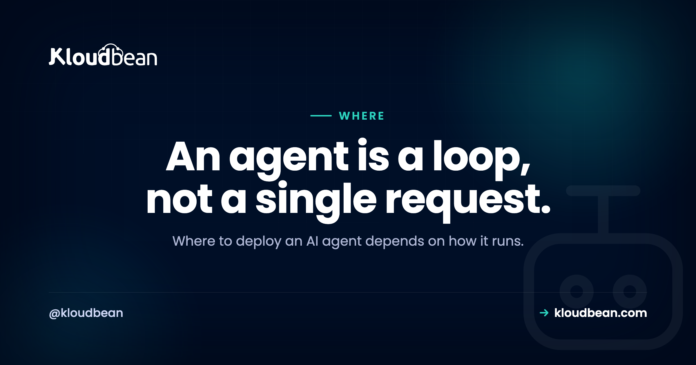

# Where to Deploy an AI Agent: A Decision Guide

By Kloudbean Engineering · An agent is a loop, not a single request.

Where to deploy an AI agent is a different question from where to deploy a normal web app, even though people tend to answer it the same way. An agent is not a page that loads and returns. It is a loop: it calls a model, reads the answer, calls a tool, feeds the result back, and goes around again until the job is done. That loop changes what the host has to provide. So before you copy the default answer your AI assistant hands you, it helps to know which traits of an agent actually decide where it should run.

> **The short answer.** Where you deploy an AI agent depends on how it runs, not on a default. A simple stateless agent that takes one request and returns one answer can sit happily on a serverless function. But most useful agents loop through multi-step tool calls, do background or scheduled work, hold API keys, and keep memory. Those traits fit a persistent, always-on server better than scale-to-zero serverless. Decide by the shape of the agent.

## What makes an AI agent different to host

A request/response app does one small thing per request and returns quickly. It takes input, runs some logic, sends a response, and forgets everything. An agent works differently. It plans, calls a tool, looks at what came back, decides what to do next, and repeats. It can run for a while. It can kick off work nobody is waiting on. And it often remembers what it did last time.

Five traits fall out of that, and each one nudges the hosting decision. How long the agent runs. Where its secrets live. Whether it needs background or scheduled work. How you cap and watch a loop that can misbehave. And where it keeps state. Walk through those five and the answer to where to host an AI agent mostly writes itself. None of them is exotic. They are just different from what a static page needs.

## Long tool loops outlast a serverless timeout

This is the trait that trips people up first. Serverless functions are built around a single request that finishes quickly, and the platform caps how long one invocation may run. That cap is fine for an API endpoint. It is a problem for an agent that plans, calls a tool, waits, reads the result, and calls the model again, several times over, before it has an answer.

A multi-step loop like that can run right past the request cap and get killed halfway through, leaving a task half done and state in a weird place. A stateless single-shot agent, one prompt in and one answer out, finishes fast and never hits the wall, so serverless suits it fine. A long-running loop wants a process that simply stays alive as long as the work takes. That is the single most common reason an agent outgrows serverless, and it shows up the moment the agent starts doing more than one thing per call.

## The agent holds your API keys

An agent calls a model API, and usually several tool APIs on top of that, and every one of them needs a secret key. Those keys have to live server-side. Never in a browser bundle, never in client-side code, never anywhere a user can open dev tools and read them. So the agent needs a real backend, a server or a server-side function, that reads the keys from environment variables at runtime.

This quietly rules out any client-only deploy for the agent's brain. If the loop that holds your keys runs in the client, the keys leak, full stop. It is also a point in favour of a plain backend you control, where secrets sit in the runtime config and nowhere near the shipped code. The mechanics of doing this safely are their own topic, covered in [deploying an agent without exposing your API keys](https://www.kloudbean.com/blog/deploy-ai-agent-without-exposing-api-keys/).

## Agents need background jobs and schedules, not just requests

Plenty of agent work has no user waiting on it. Poll a mailbox every hour. Work through a queue of tasks. Run a nightly summary. Retry a tool call that failed earlier. That is background and scheduled work, and it lives outside the request/response cycle entirely.

On a persistent server this is easy: you run a worker process and a scheduler on the box and you are done. On serverless you can get there too, but through more separate pieces, scheduled triggers, a queue service, a function per job, each wired up and watched on its own. Neither is wrong. But if your agent is event-driven or runs on a schedule, an always-on process is the simpler home, with fewer moving parts to reason about when something stalls. This is also where cost discipline starts to matter, which is the next trait.

## A runaway loop is the failure mode to design for

Here is the part that makes agents genuinely different from a normal app: the loop can run away. A weak stopping condition, a tool that keeps failing, or a model that keeps deciding to try one more time, and suddenly your agent is calling a paid API in a tight loop while you sleep. The bill and the rate-limit errors both arrive together.

So two things are not optional. Observability, meaning you can see each step, its inputs, and roughly what it cost. And a hard cap, meaning a maximum number of iterations, a clear stopping condition, rate limiting on the calls, and a budget limit set with your model provider. Build these into the agent itself rather than hoping to notice the spend. This is code-and-account discipline more than a hosting feature, but your host should at least give you real logs to look at. The wider pattern of agents failing in exactly these ways is worth reading in [why AI apps fail in production](https://www.kloudbean.com/blog/why-ai-apps-fail-in-production/), and the money side is in [rate limiting and cost control for AI APIs](https://www.kloudbean.com/blog/rate-limit-and-cost-control-for-ai-apis/).

## A stateful agent needs somewhere to remember

Some agents are stateless. Each run stands alone, needs nothing from the last one, and forgets everything after. Many agents are not like that. They remember a conversation, track where they are in a multi-step task, or store vector memory so they can recall past context. That state has to live somewhere durable.

Somewhere durable means a managed database, Redis, or similar, not the memory of a function that scales to zero between calls and loses whatever it was holding. If your agent is stateful, you will attach a datastore no matter where the code runs. The real question is whether your host makes that store easy to stand up and connect to. A stateless single-shot agent skips this whole section, which is one more reason simple agents fit serverless and complex ones do not. How to do memory properly is its own subject in [giving an AI agent memory in production](https://www.kloudbean.com/blog/ai-agent-memory-production/).

## Serverless, a persistent server, or a managed platform

Put the traits together and three hosting shapes fall out. It helps to see them side by side rather than as a ranking, because the right one depends entirely on the agent you are running.

| | Serverless function | Persistent server | Managed platform |
| --- | --- | --- | --- |
| What it is | Scale-to-zero, runs per request | An always-on box you run | An always-on box run for you |
| Fits which agent | Stateless, single-shot, thin endpoint | Long-running, stateful, background work | Same as a server, with less ops |
| Long tool loops | May hit the request cap | Runs as long as the task needs | Runs as long as the task needs |
| Background and cron | Extra services to wire up | A worker and a scheduler on the box | Built-in scheduler and workers |
| Memory and state | Attach an external store | A database alongside the process | A managed database alongside |
| You operate | Less, but more moving parts | The box: patching, backups, uptime | The platform handles the box |

Notice that the persistent server and the managed platform columns look almost the same. That is the point. A managed platform is a persistent, always-on server that someone else patches and keeps up, so it fits the same agents a server does with less operational weight on you. Serverless is the odd one out, and it is genuinely the better pick for the narrow case it suits.

<!-- ADD IMAGE: two-shapes diagram. Left "Single-shot agent": request in, one model call, answer out, then scales to zero, labelled serverless is fine. Right "Looping, stateful agent": a model-to-tool loop, a memory/state store, a cron/worker box, labelled a server fits. Brand colors navy #000f27, purple #4F1AF3, green #40b75f. -->

*The behaviour of the agent, not a brand, decides the host. Single-shot fits serverless; a looping, stateful agent fits an always-on server.*

## So where should you deploy an AI agent?

You can decide this in a minute by matching the agent to one of two cases. Be honest about which one you are actually building, not the one you hope to grow into.

**Choose serverless if** your agent is stateless and single-shot: one request in, one answer out, and it finishes quickly. No background jobs, no schedules, traffic is low or spiky, and you are happy wiring state and cron up as separate managed services when you need them. A thin "answer one question" agent endpoint is a good, cheap serverless job, and paying nothing while it sits idle is a real perk.

**Choose a persistent server** (or a managed platform, which is the same shape operated for you) if the agent runs multi-step tool loops that can exceed a request timeout, needs background workers, queues, or cron, holds long-lived memory or state, or you just want one place for the process, the database, the secrets, and the logs to live together.

Here is the fair conclusion, and it is not a clean win for either side. For an agent that is genuinely autonomous, one that loops and acts over time, a persistent always-on server usually fits better than scale-to-zero serverless, because the agent's traits line up with what a long-lived process gives you. For a simple single-shot agent, serverless is often the better and cheaper choice. The agent's behaviour decides, not a slogan. If you want the broader buyer's view across app types, [hosting for an AI SaaS](https://www.kloudbean.com/blog/best-hosting-for-ai-saas/) zooms out from the agent case.

## The GPU question is a separate decision

One thing worth pulling apart, because it causes a lot of over-provisioning. Everything above is about running the agent's orchestration: the loop, the tool calls, and the requests it sends to a hosted model API. That is ordinary CPU work. A normal server or function handles it without breaking a sweat, and it needs no GPU at all.

GPUs only enter the picture if you self-host the model itself, running an open model on your own hardware instead of calling a hosted API like OpenAI or Anthropic. That is a genuinely separate decision with its own economics, and most agents never need it because they call a hosted model. Keep the two questions apart so you do not rent a GPU to run what is really a CPU workload. If you are weighing the self-hosted route, [do I need a GPU for an AI SaaS](https://www.kloudbean.com/blog/do-i-need-a-gpu-for-an-ai-saas/) works through it.

## Where this leaves Kloudbean

If your agent is the long-running, stateful, background-working kind, the shape that fits is a persistent, always-on server with a datastore and a scheduler right beside it. That is what Kloudbean provides: managed always-on servers that run Node or Python agents as long-lived processes, managed databases (including Redis) for memory and a job queue, cron jobs set from the dashboard without touching SSH, environment variables for your model and tool keys, automatic backups, and one dashboard for the whole thing. If your agent is instead a simple single-shot endpoint, serverless may suit it better, and that is a perfectly good call. The only real rule is to match the host to how the agent runs.

---

**Run the agent, not the plumbing.** If your agent needs an always-on server, a managed database for its memory, scheduled runs from a dashboard, and a safe place for its keys, that is the shape Kloudbean provides. See [kloudbean.com](https://www.kloudbean.com/) and [pricing](https://www.kloudbean.com/pricing/).

## FAQ

**Where should I deploy an AI agent?**
It depends on how the agent runs. A stateless, single-shot agent that returns one answer and finishes quickly can run on a serverless function. An agent that loops through multi-step tool calls, does background or scheduled work, or keeps memory fits a persistent, always-on server better. Match the host to how the agent behaves rather than to a default.

**Can I run an AI agent on serverless functions?**
Yes, if the agent is simple: one request in, one answer out, no background work, and no long-lived state. Serverless is a good and cheap home for that shape. The trouble starts when the agent loops for a long time, needs schedulers or workers, or must remember things between calls, because scale-to-zero functions aren't built for long-running or stateful work.

**Why do agents time out on serverless?**
Serverless platforms cap how long a single request may run, because they're designed for short, quick invocations. An agent that plans, calls a tool, reads the result, and calls the model again can run past that cap and get killed mid-task. A stateless agent that finishes fast never hits the limit, but a long multi-step loop does. That's the most common reason agents outgrow serverless.

**Where should an AI agent store its API keys?**
Server-side, always. Model and tool API keys belong in environment variables read by your backend at runtime, never in a browser bundle or client-side code. If the agent runs only in the client, those keys leak to anyone who looks. This is why an agent needs a real backend, a server or a server-side function, rather than a client-only deploy.

**Do AI agents need a database?**
Stateful ones do. If the agent remembers a conversation, tracks a multi-step task, or stores vector memory, that state needs a durable store such as a managed database or Redis, not the memory of a function that scales to zero. A stateless single-shot agent can skip it. So the answer depends on whether your agent needs to remember anything between steps or runs.

**How do I stop an AI agent loop from running up a huge bill?**
Build limits into the agent and the account rather than relying on spotting the bill later. Set a maximum number of iterations and a clear stopping condition in the loop, add rate limiting on the model and tool calls, and set a budget or spend limit with your model provider. Pair that with logging of each step so you can see what the loop is doing. A loop with no cap is the classic way an agent burns money overnight.

**Do I need a GPU to host an AI agent?**
Usually no. Running the agent loop and calling a hosted model API such as OpenAI or Anthropic is ordinary CPU work that any normal server handles. You only need a GPU if you self-host the model itself instead of calling a hosted API, which is a separate decision. Keep the two apart so you don't provision a GPU you don't need.

**What is the difference between hosting an AI agent and hosting a normal web app?**
A normal web app answers a request and returns quickly. An agent loops: it calls a model, uses tools, and may run background or scheduled work while holding state and secrets. That means it often needs a process that stays alive, a scheduler, a datastore for memory, and a hard cap on the loop. Those needs push agents toward a persistent server more often than a simple web page would.

**Is a managed platform or a raw server better for an AI agent?**
Both give you the always-on process an agent usually wants, so the difference is who operates the box. On a raw server you handle patching, backups, and uptime yourself. On a managed platform the provider handles the server while you run the agent. Pick based on how much operations work you want to own, since both can meet the needs of the agent.

---

*Kloudbean Engineering · Pick the host that fits how your agent runs, not the default everyone names.*
