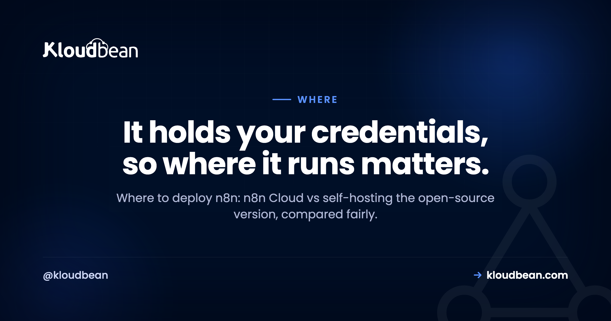

# Where to Deploy n8n: n8n Cloud vs Self-Hosting

By Kloudbean Engineering · It holds your credentials, so where it runs matters.

So you've built a few workflows in n8n, they work, and now there's a real question to answer: where to deploy n8n so it runs reliably without babysitting. Two answers dominate. There's n8n Cloud, the managed service the n8n team runs for you, and there's self-hosting the open-source version on a server you control. People treat this like a tribal argument. It isn't one. n8n has a handful of specific traits that quietly settle the decision, and once you can see them, picking a home for it gets a lot easier.

> **The short answer.** n8n is an open-source workflow-automation tool, and you can run it two ways. n8n Cloud is the managed service: quickest to start, zero operations, newest features first. Self-hosting runs the same open-source software on a server you control, which keeps your stored credentials on your own infrastructure and makes cost track your server instead of a per-execution plan. Wherever you self-host, n8n needs to stay running, needs a database and persistent storage, and needs a stable public URL with SSL for its webhooks. Pick Cloud for hands-off speed. Self-host when data control or cost predictability matters more.

## Where to deploy n8n: the two real options

Start with what n8n actually is, because it changes the framing. n8n is open-source workflow automation, a self-hostable cousin of tools like Zapier and Make. A trigger fires, a chain of nodes does the work, and the whole thing runs as software you can either rent or run yourself.

That gives you two real places to deploy it.

n8n Cloud is the hosted service the n8n company operates. You sign in, build workflows, and never touch a server. Self-hosting means taking the open-source edition and running it on infrastructure you control, whether that's a raw VPS you configure by hand or a managed platform that stands it up for you.

Here's the part worth sitting with: it's the same core software either way. The nodes, the editor, and the workflows all behave the same. So the decision isn't really about features. It's about who operates the thing and where your data and credentials physically live. Frame it that way and most of the noise falls away.

One thing this page is not: a setup tutorial. The mechanics of installing it, wiring the database, and setting the environment variables live in the [self-host n8n](https://www.kloudbean.com/blog/self-host-n8n/) walkthrough. This page is only the where-and-who decision.

## Why n8n isn't a normal web app

Most deployment advice assumes a normal web app: it wakes when a request arrives, serves it, and can happily scale to zero when idle. n8n breaks that assumption in a few ways, and those breaks are exactly what decide where it should run.

**It has to stay awake.** n8n runs scheduled workflows and catches incoming webhooks. A cron trigger that should fire at 9am only fires if n8n is actually running at 9am. A webhook only gets caught if n8n is listening when the sender calls. That rules out scale-to-zero serverless hosting, the kind that spins down when idle and cold-starts on the next request. A sleeping n8n misses the schedule and drops the webhook. It needs to stay running, full stop.

**It needs a database.** Your workflows, execution history, and saved credentials have to persist somewhere durable. n8n can use its bundled SQLite for a quick test, but for anything real you want it pointed at a proper database, usually PostgreSQL. That isn't optional polish. Lose the database and you lose your automations and their stored connections.

**It needs persistent storage.** Beyond the database, n8n keeps state on disk. On ephemeral hosting where the filesystem resets on every redeploy, that state evaporates. It needs a disk that survives restarts and deploys.

**Its webhooks need a stable public URL with SSL.** External services call your workflows over HTTPS. For that to work, n8n needs a fixed public address with a valid certificate that the sender can reach every time. A URL that keeps changing, or one without SSL, quietly breaks integrations and you often don't notice until a workflow silently stops firing.

And the quiet one that matters most: **n8n stores sensitive third-party credentials.** Every service you connect leaves an API key, a token, or a login behind. n8n encrypts those and saves them wherever it runs. So the question isn't purely technical. Where n8n runs is where the keys to your other tools sit. That makes it a data-control decision as much as a hosting one.

## n8n Cloud vs self-hosted: the honest tradeoff

The tradeoff is the familiar one, convenience against control. n8n Cloud does the operations for you and hands you a running product. Self-hosting hands you the keys and the responsibilities that come with them. Neither is smarter in the abstract. They fit different situations.

| | n8n Cloud | Self-hosted n8n |
| --- | --- | --- |
| Time to first workflow | Sign in and build | Install or one-click, then set config |
| Who runs the server, upgrades, backups | The n8n team | You, or your managed platform |
| Newest features | Land here first | Arrive when you update |
| Where credentials and data live | Their available regions | Any region you can run a server in |
| Cost shape | Scales with executions and plan | Flat server cost, bounded by your server |
| Staying always-on for webhooks and schedules | Handled for you | Yours to keep running |
| Best for | Quickest hands-off start | Data control, cost predictability at volume |

Read the last two rows twice, they carry the decision. If a hands-off start is what you value most, Cloud is a strong, honest answer. If keeping credentials on your own infrastructure and a predictable bill matter more, self-hosting earns its weight. Most people know which line is theirs the moment they read it.

<!-- ADD IMAGE: swap the SVG below for a polished version if desired. src -> images/n8n-always-on.png -->

<!-- The teaching SVG (why n8n must stay awake) lives in the HTML version. -->

*Scale-to-zero lets n8n sleep, and a sleeping n8n misses the webhook and skips the schedule. That single trait decides more than any feature list.*

## What n8n Cloud does better

Let me be fair here, because n8n Cloud is genuinely good and pretending otherwise wastes your time.

It gets you running quickest. You sign in and build, with nothing to install and no server to think about. For a first automation or a small team, that head start is real.

It removes operations entirely. The n8n team runs the servers, patches the software, keeps it always-on, and handles the platform's backups. You never think about a full disk, a certificate that expired, or a version upgrade at an awkward hour. When it's just you and a to-do list, that's a lot of weight you don't carry.

And it gets new features first. n8n ships to its hosted platform before those changes reach the self-hosted release, so if you want the newest capabilities the day they land, Cloud is where they land. If speed and zero ops are what you value most, that's a perfectly grown-up choice.

## What self-hosting actually gives you

The flip side is just as real. Self-hosting isn't about the software being better. It's the same software. What you gain is control over the things a hosted plan decides for you.

You choose where the data and credentials live. Self-hosting lets you put n8n on a server in a region you pick and keep those encrypted third-party keys on infrastructure you control. For a lot of teams, that alone is the reason.

Your cost shape changes. A flat server doesn't care whether you run ten workflows or ten thousand, so as execution volume grows, the bill is bounded by your server rather than a per-execution plan. It behaves more like a fixed line than a meter that keeps nudging up.

You control the stack. Your versions, your config, your tuning, on a box you can see and reason about. And there's no lock-in worth the name, because it's the open-source edition you can move whenever you want. The same cloud-versus-self-host call shows up for other open tools too, and the reasoning carries over cleanly to [self-hosted Supabase vs Supabase Cloud](https://www.kloudbean.com/blog/self-hosted-supabase-vs-supabase-cloud/) if you're weighing more than one.

## What a host must provide to run n8n

If you land on the self-host path, the traits above turn into a short shopping list. Whatever you run n8n on, raw VPS or managed platform, it needs to provide these.

- **An always-on server.** Not scale-to-zero, not serverless that idles down. n8n has to be running to catch schedules and webhooks.
- **A real database.** Ideally a [managed PostgreSQL](https://www.kloudbean.com/blog/managed-postgresql-hosting/) so your workflows and encrypted credentials persist and get backed up, rather than sitting in a throwaway SQLite file.
- **Persistent storage.** A disk that survives restarts and redeploys, so n8n's state doesn't reset underneath you.
- **A stable public URL with SSL.** A fixed HTTPS address for the webhook endpoints, with a certificate that renews itself so integrations keep working.
- **Backups you've actually restored.** Because your automations and their credentials live in that database, a tested backup is the difference between a bad hour and a bad month. The [server backups guide](https://www.kloudbean.com/blog/server-backups-guide/) covers doing this properly.
- **Room to grow.** Enough CPU and memory for your busiest workflows, and a straightforward way to resize when volume climbs.

If a platform can't offer all of these, it's the wrong home for n8n, no matter how cheap it looks. This is also why a [managed server](https://www.kloudbean.com/blog/what-is-a-managed-server/) tends to fit n8n well: the always-on box, the database, SSL, and the backups come as one thing rather than six you assemble.

## Choose n8n Cloud if...

Be honest with yourself against this list. If most of it sounds like you, stay on Cloud and don't feel like you're missing out.

- You want the shortest path to running automations and would rather spend your energy building workflows.
- You don't want to operate a server, keep it patched, or own the backups.
- You want the newest n8n features the day they ship.
- You're comfortable with pricing that scales with executions, and with where their regions place your data.
- Your volume sits comfortably inside a plan and the bill isn't stinging.

There's no prize for self-hosting when hosted fits. For plenty of teams, this is the right and sensible answer.

## Consider self-hosting if...

And if most of this list is you, the operational weight is probably worth carrying.

- Your workflows hold credentials for systems you'd rather keep on infrastructure you control.
- A rule, a client, or a regulator says your data must stay in a specific country.
- Your execution volume is climbing and you want a flat, predictable server cost instead of a per-execution bill.
- You want full control over versions, config, and the box it runs on.
- You already run your own infrastructure, so n8n is one more service on a setup you operate anyway.

Notice none of these is "because self-hosting is more hardcore." They're concrete needs. Have one, and self-hosting pays off. Have none, and it's cost without a matching benefit.

## If you self-host, where does it run?

If you've decided to self-host, you still need somewhere to run it, and you don't have to hand-assemble the pieces. On Kloudbean, n8n is a one-click app that deploys onto a managed server that stays running, with a managed PostgreSQL for its workflows and credentials, free SSL for the webhook URL, and automatic backups. Your workflows and the credentials they hold stay yours, in the cloud and region you choose. That's the honest boundary of managed: the platform runs the server, the stack, SSL, and backups, while you own your automations and your data.

None of this makes it a replacement for n8n Cloud. If a hands-off hosted service is what you want, n8n Cloud is the cleaner fit. This is simply one place to self-host if you've decided that's your path, and the general playbook for standing up a self-run app is in [deploy an AI-built app to production](https://www.kloudbean.com/blog/deploy-ai-built-app-to-production/).

---

**Decided to self-host? Give it a soft landing.** Launch n8n in one click on a managed, always-on server, with a managed database, free SSL for the webhook URL, and automatic backups, your workflows and credentials staying yours. Start at [kloudbean.com](https://www.kloudbean.com/), or see plans on [pricing](https://www.kloudbean.com/pricing/).

One-click n8n · Managed PostgreSQL · Automatic backups · Free SSL · Free migration · Free trial

## FAQ

**Where should I deploy n8n?**
Deploy n8n on n8n Cloud if you want the quickest, hands-off start and are happy with usage-based pricing and their regions. Self-host it on a server you control if you want your stored credentials on your own infrastructure, a flat cost as execution volume grows, or data in a specific region. The software is identical either way, so the real question is who operates it and where your data lives.

**Should I use n8n Cloud or self-host n8n?**
Use n8n Cloud when zero operations and being on the newest version matter most, and self-host when data control, region choice, or cost predictability at higher volume matter more. Cloud removes all the ops work. Self-hosting gives you the box, the credentials, and a bill bounded by your server rather than a per-execution plan. Match the choice to what you actually value.

**Why is serverless or scale-to-zero a poor fit for n8n?**
Because n8n runs scheduled workflows and receives webhooks, so it has to be running to catch them. Scale-to-zero hosting spins the app down when idle and cold-starts it on the next request. A scheduled workflow whose trigger arrives while the app is asleep simply doesn't fire, and a webhook sent to a sleeping instance is missed. n8n needs a home that stays running.

**Does self-hosted n8n need a separate database?**
For anything real, yes. n8n can use a bundled SQLite file for a quick test, but a proper database, usually PostgreSQL, is what you want for durable workflow data, execution history, and stored credentials. A managed PostgreSQL is the clean option because it's backed up and maintained for you, so the data your automations depend on isn't sitting in a fragile local file.

**Do n8n webhooks need a public URL with SSL?**
Yes. Webhook triggers work by external services sending HTTPS requests to your n8n instance, so it needs a fixed public address with a valid SSL certificate the sender can reach every time. If the URL changes or lacks SSL, those calls fail and the affected workflows quietly stop firing. A stable domain with automatic SSL is part of what any host for n8n has to provide.

**Is self-hosting n8n cheaper than n8n Cloud?**
Past a certain execution volume it often is, because a self-hosted server is a flat cost while hosted pricing scales with usage and plan. For light use the hosted option is usually the better deal once you count your own time running a server. Model your realistic busy month rather than your quiet one, and compare current pricing yourself instead of trusting a rule of thumb.

**Where are my credentials stored when I self-host n8n?**
On the server where n8n runs. Every connected service leaves an encrypted API key, token, or login in n8n's database, so self-hosting keeps those on infrastructure you control rather than a third party's. That's the main reason data-sensitive teams self-host. It also means protecting that server and its database, with strong credentials and tested backups, is squarely your responsibility.

**Can I move from n8n Cloud to self-hosted later?**
Yes, and it's a normal path. You export your workflows and credentials from the Cloud instance and import them into your self-hosted one, then re-point any webhook URLs to the new address. Do it while the Cloud instance is still live and verify before you cut over, so starting on Cloud never locks you in. It's the same software on both ends.

**What does a host need to provide to run n8n?**
An always-on server that doesn't scale to zero, a durable database (ideally managed PostgreSQL) for workflows and credentials, persistent storage that survives redeploys, a stable public URL with SSL for webhooks, and reliable, tested backups. Enough room to grow for busy workflows rounds it out. A managed server bundles these into one thing instead of six you wire together yourself.

---

*Kloudbean Engineering · Decide who runs it, then decide where.*
