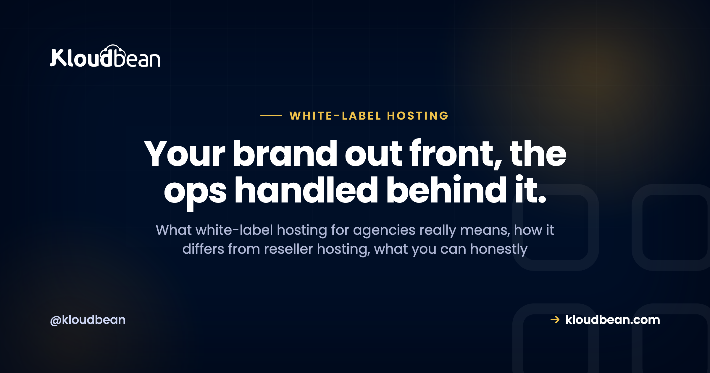
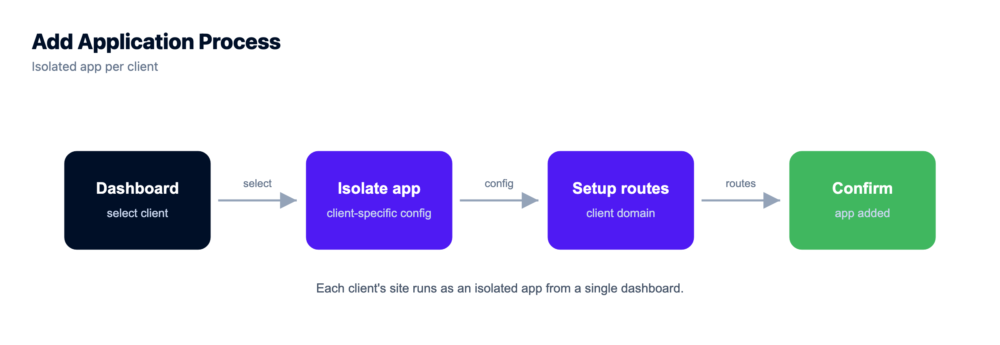
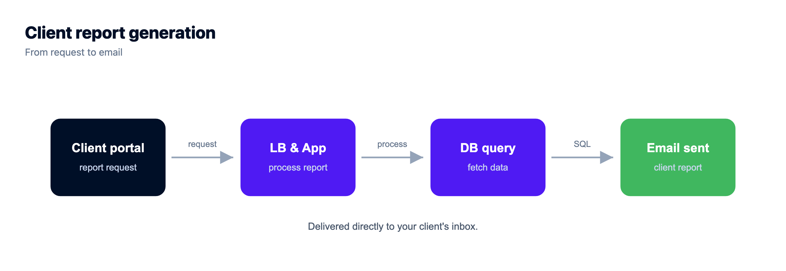
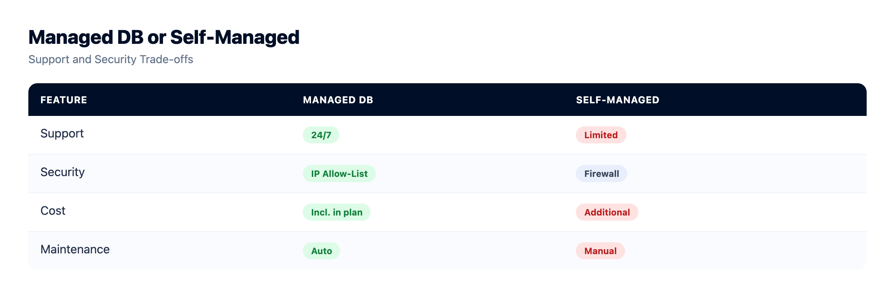

# White-Label Hosting for Agencies, Explained Without the Jargon

Your client hired *you*. Your name, your judgment, your work. So when they open an email about their website and it's stamped with some hosting company's logo, that's a small crack in the relationship. A reminder that someone else is back there.

White-label hosting for agencies is how you keep that curtain closed. The term gets thrown around loosely though, and some of what gets promised isn't real, so let's sort it out plainly. What it actually means, what you can honestly brand, what you can't, and whether your agency even needs it.

> **The straight answer:** White-label hosting means your clients experience *your* brand and deal with *you*, while a platform runs the servers behind the scenes. The part you truly own is the client-facing layer: your reports, your invoice, your domain, your support. On the infrastructure side, what makes this work is per-client isolation and scoped access, so you run everything from one dashboard and each client only ever sees their own site. It doesn't require you to become a hosting company.

## White-label hosting, in one picture

Picture two layers. The front one is your brand, and it's the only layer your client interacts with. The back one is the managed infrastructure, which you operate but they never really see. White-label is about keeping the front layer entirely yours.

*Diagram: the client sees your brand and deals with you. The managed infrastructure runs behind that facade, operated by you, invisible to them.*

## What is white-label hosting for agencies?

White-label hosting means you deliver hosting to your clients under your own brand, while a platform runs the actual servers behind the scenes. Think of a cafe pouring beans roasted by someone else. The customer experiences *your* cafe, not the roaster. Your clients see your name and your service. The platform does the heavy lifting of keeping servers running, patched, secured, and backed up. You get to be the host in your client's eyes without building a data center or hiring a night-shift sysadmin.

## How is it different from reseller hosting?

People use the two terms almost interchangeably, but there's a distinction worth keeping. Reseller hosting describes how you *buy and divide* resources: you take a bulk chunk of a server with a set quota and hand slices to clients, usually through an older control panel. White-label describes what the client *sees*: your brand on the experience, whatever the underlying model. So one is about procurement, the other about presentation.

Most modern agencies want the white-label experience sitting on top of managed cloud, not the constrained quota box of the reseller era. The difference in practice is real.

| | Old-school reseller | White-label on managed cloud |
| --- | --- | --- |
| **What it describes** | How you buy and split resources | What the client sees (your brand) |
| **Isolation** | Shared quota, often weak | Per-client app, database, SSL |
| **Infrastructure** | One reseller box, fixed | Clouds and regions you choose |
| **Who runs the ops** | You, on a legacy panel | Managed for you |
| **Client sees** | Sometimes the host's panel | Your brand, scoped to their site |

If you want that comparison in full, there's a dedicated piece on [reseller hosting versus managed cloud](https://www.kloudbean.com/blog/reseller-hosting-vs-managed-cloud/).

## What can you actually put your brand on?

This is where I'd steer you away from the marketing fog, because it's the question that trips agencies up. The branding that matters, and that you fully control, is your client-facing layer. The website itself. The reports you send. The invoice with your logo. The care-plan email. The person who picks up when something breaks (you). That's where clients form their impression of who hosts them, and all of it is yours.

> **Honest about the tech:** a managed platform is not the same as a "put your logo on our control panel" product, and you should be wary of anyone who blurs that line. The dependable way to keep the host invisible is simple: you run the infrastructure from your own account, and clients get scoped, view-only access to just their site (or no direct access at all). The white-label part, your brand and your relationship, is the layer you present. The plumbing stays behind it.

## Do my clients ever see the underlying host?

With this done well, not in any way that matters to them. Your client's touchpoints are all yours. You're the one logging in to deploy their site, manage the server, and handle updates.

What keeps this clean underneath is **scoped access**. With subusers and User Access Control, you decide exactly what any given login can see and do. Give a client view-only on their own site, and they never encounter another client's name or the guts of the platform. The infrastructure is invisible by design, which is what keeps the relationship centered on you. If you're running many clients this way, pair this with real per-client isolation (its own app, its own database), covered in [how agencies host 20+ client apps](https://www.kloudbean.com/blog/how-agencies-host-20-client-apps/).

## How do I price and bill it?

This is where white-label turns from branding into a business. You're the face of the service, so you set the price. Three approaches cover most agencies:

- **Bundle it into a retainer.** Hosting becomes part of a monthly care plan next to maintenance and support. Clients like the simplicity, and you never itemize infrastructure.
- **Bill it through with a margin.** You pay the platform cost and charge a clear hosting fee above it. Transparent and easy to explain.
- **Tier it.** Offer good, better, and best hosting levels mapped to what each client's site actually needs.

All three lean on the same thing: predictable platform cost. Flat, understandable pricing is what keeps your margin stable and stops a surprise overage from eating a month of profit you already promised away. Predictability is the difference between hosting as reliable agency revenue and hosting as a risk you're quietly carrying. For the three pricing models and the margin math in depth, see [client billing and markup for hosting](https://www.kloudbean.com/blog/client-billing-and-markup-for-hosting/).

<!-- ADD IMAGE: a simple good/better/best hosting tier table you present to clients under your brand (author-supplied) -->

## Do I have to become a hosting company?

No, and that's the relief for most agencies. White-label on top of a managed platform gives you the brand and the client relationship without the operations. You're not patching kernels at midnight, configuring web servers, or being the on-call engineer when a disk fills up. The platform handles that. You do the client-facing work you're already good at (building sites, advising, supporting) and present it as yours. If you genuinely wanted to run all the infrastructure yourself, you could, on an [unmanaged setup](https://www.kloudbean.com/blog/managed-vs-unmanaged-hosting/). But the whole appeal of white-label over managed is that you don't have to.

## Is it worth it for a small agency?

Depends on your size and where you're headed, so here's a straight read rather than a hedge.

- **A handful of clients, hosting as an occasional favor?** Full white-label might be more machinery than you need right now. Even then, not putting a competitor's brand in front of your clients is worth something.
- **Hosting is (or could be) real recurring revenue?** White-label pays for itself fast. It turns a cost you absorb into a margin you earn, and it cements you as the one place your client goes.
- **Growing quickly?** Set up the branded, managed approach early. Re-platforming later, when you've got thirty client sites to move, is the version of this you don't want.

There's no universal yes here. But my honest bias: if you intend to keep and grow client relationships, owning the hosting experience is a small effort that protects a big asset. The client's sense that you handle everything. The [agency hosting playbook](https://www.kloudbean.com/blog/hosting-for-agencies-playbook/) walks through the operational side (onboarding, staging, backups, offboarding) once you decide to run it as a service.

The boundary, stated plainly: this is managed Linux hosting underneath. The platform owns the upkeep of the servers, the stack, SSL, and backups. Your clients' sites and data stay theirs and yours. White-label changes whose name is on the experience, not who owns the work. Your clients' content is always their own, and the relationship stays entirely yours. Store their media and off-server backups in [durable backups](https://www.kloudbean.com/blog/server-backups-guide/) and object storage, and the handover on the day a client leaves is clean.

<!-- cta:start -->
**One login. Every client app.**

Consolidate the dashboards: isolated apps on managed servers, per-client databases, per-app backups you can restore individually, and permissions scoped per resource and action.

- One dashboard
- Per-client isolation
- Subusers and access control
- Per-app backups
- Git deploys
- Free migration assistance

[Start free](https://console.kloudbean.com/register) · [See plans](https://www.kloudbean.com/pricing/)
<!-- cta:end -->

## FAQ

**What is white-label hosting for agencies?**
It's delivering hosting to your clients under your own brand while a platform runs the infrastructure behind the scenes. Your clients experience your service and see your name, while the platform keeps servers patched, secured, and backed up. You're the host in your client's eyes without operating a data center.

**What's the difference between white-label and reseller hosting?**
Reseller hosting describes how you buy and divide resources, typically a bulk quota you split among clients on an older control panel. White-label describes what the client sees, which is your brand on the experience. Most modern agencies want the white-label experience on top of managed cloud rather than the constrained quota model of the reseller era.

**Can I put my own brand on the hosting?**
You fully control the client-facing layer: the site, your reports, your invoice, your support, your domain. That's where clients form their impression of who hosts them. A managed platform is not a "your logo replaces ours on the control panel" product, so the reliable approach is to run the infrastructure from your own account and give clients scoped, view-only access to just their site, or no direct access at all.

**Do my clients ever see the underlying host?**
Not in a way that matters, when it's set up well. You handle deploys and management from your account, and scoped access with subusers and UAC means a client sees only their own site, never another client or the platform internals. Their touchpoints, the site and the people they contact, are all yours.

**Do I need to be technical to offer white-label hosting?**
Not deeply. On a managed platform the infrastructure work (patching, security, backups) is handled for you. You manage the client-facing side and deploy their sites, but you're not the on-call engineer for the servers. That's the advantage of white-label over managed hosting versus running your own.

**How do agencies price white-label hosting?**
Common models are bundling hosting into a monthly retainer or care plan, billing the platform cost through with a margin, or offering tiered hosting levels. All of them depend on predictable platform costs so your margin stays stable and you're never surprised by an overage you can't pass on.

**Is white-label hosting worth it for a small agency?**
It depends. If hosting is an occasional favor for a few clients, it may be more than you need right now, though avoiding a competitor's brand in front of clients still helps. If hosting is or could become recurring revenue across a growing roster, white-label turns a cost into a margin and makes you the one-stop provider, which usually pays off.

**What happens to my client's site if they leave?**
Their site and data belong to them, so a clean handover is the right move: provide the files and a database export, or migrate the site to their new host, then revoke access. White-label changes whose brand is on the experience, never who owns the content. Keeping that boundary honest is part of running hosting well.

By Kloudbean · Your brand out front, the ops handled behind it.
