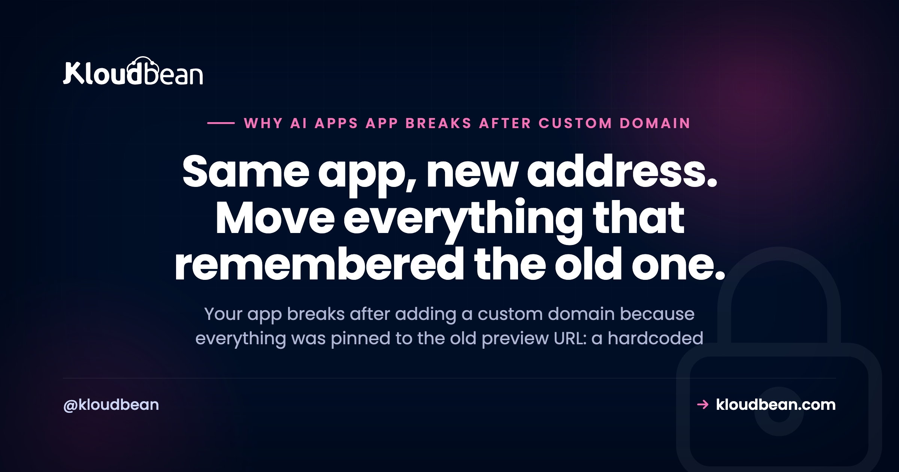

# Why Your AI App Breaks After You Add a Custom Domain

Your app ran fine on its preview URL. The one your AI builder handed you, something like `your-app.builder.app`. Then you added your own custom domain, pointed the DNS, and something broke. A login that won't stick. An API call that fails. A blank panel where data used to sit. When an app breaks after adding a custom domain, it feels like the whole deploy fell apart. It didn't. Not one line of your code changed. Only its address did.

And that's the entire trick to debugging this. Everything that breaks is something that was quietly pinned to the old address: an API URL baked into the build, a CORS rule that only trusts the preview origin, a cookie scoped to the old host, an OAuth callback registered on a provider's dashboard. Find what's still pointing at the old URL and you've found the bug. This is a field guide to the usual suspects, worst offenders first.

> **The short version:** When your app breaks after adding a custom domain, the code is fine. Something got pinned to the old preview address and didn't move with you. Check five things: the frontend's API URL (change it and rebuild), the API's CORS allow-list, your cookie domain and SameSite, your OAuth and webhook URLs at each provider, and whether HTTPS is fully forced. Fix the one that matches your symptom.

## Why your app breaks after adding a custom domain

Think about what actually happened. You didn't rewrite anything. You gave the same running app a new name and pointed traffic at it. So any part of the system that memorized the old name is now wrong, and only those parts. That's why the failures feel so random. A bit works, a bit doesn't, depending entirely on what got hard-coded where.

It helps to see it. The app answers on the new domain, but four things in and around it still hold the old preview URL, and each one is its own separate break.

<!-- ADD IMAGE: bespoke SVG. The same app now at app.yourdomain.com (loads fine), with four parts still pointing at old-preview.app, each flagged as a break point: the frontend API base (calls 404), the CORS allow-list (browser blocks it), the cookie domain (login drops), and the OAuth redirect URI (sign-in fails). -->

Vibe-coded apps hit this harder than most, because the builder wires everything to the preview URL to get you a working demo fast. It's one more item on the [last mile of vibe coding](https://www.kloudbean.com/blog/last-mile-of-vibe-coding/), the gap those tools leave for you to finish. If your app never worked in production at all, that's a different problem, covered in [why your AI app works locally but not in production](https://www.kloudbean.com/blog/why-my-ai-app-works-locally-but-not-in-production/).

## Match the symptom to what is still pinned to the old address

Start here. Find the thing on your screen in the left column, and the middle column tells you what got left behind. Then jump to the section that fixes it.

| Symptom after the switch | What was pinned to the old address | The fix |
| --- | --- | --- |
| API calls fail; the network tab shows requests to the old URL | Frontend API base baked into the build | Point it at the new domain or a relative path, then rebuild |
| CORS error in the console | API allow-list only trusts the old origin | Allow the new origin, or serve the API same-origin |
| Login works, then drops on the next click | Session cookie scoped to the old host | Set the cookie domain, Secure, and SameSite for the new host |
| Sign-in fails with redirect_uri_mismatch | OAuth redirect URI registered as the preview URL | Add the new callback URL at the provider |
| Broken images, blocked scripts, a padlock warning | Assets loaded over http on an https page | Load everything over https |
| ERR_TOO_MANY_REDIRECTS | Conflicting http/https or www/apex redirect rules | Force one canonical https host |
| An https error right after pointing DNS | The certificate is still provisioning | Wait a few minutes, then check the config |

<!-- ADD IMAGE: the browser Network tab after the domain switch, showing requests still going to the old preview URL instead of the new domain. -->

## CORS: your API still only trusts the old origin

This is the most common one, and it looks alarming. Your frontend now loads from `https://app.yourdomain.com`, so every request to your API carries that new origin. But your API's CORS allow-list still names only the old preview origin. The browser asks the API "is app.yourdomain.com allowed?", the API doesn't say yes, and the browser blocks the response before your code ever sees it.

The console message is the giveaway. Something like `Access to fetch at 'https://api.old-preview.app' from origin 'https://app.yourdomain.com' has been blocked by CORS policy`. Note that the request often reaches the server fine. It's the reply that gets thrown away, which is why it's confusing.

The fix is to allow the new origin. If you use credentials (cookies), you have to name the exact origin, because a wildcard is not allowed with credentials.

```js
// Before: only the old preview origin was allowed
app.use(cors({ origin: 'https://your-app.builder.app' }))

// After: allow your real domain (a list is fine)
app.use(cors({ origin: ['https://app.yourdomain.com'], credentials: true }))
```

Cleaner still: put the API on the same domain as the frontend (say under `/api`) so the call is same-origin and CORS never enters the picture. For the full set of causes, including preflight requests and the credentials rule, the [production CORS error fix](https://www.kloudbean.com/blog/fix-cors-error-node-production/) walks through every branch.

<!-- ADD IMAGE: the browser console showing a blocked CORS error that names the old origin and the new domain side by side. -->

## Hardcoded preview URLs: the app is still calling its old address

Open your browser's network tab. If the app loads but the calls go to the old preview URL, the address was baked into the frontend. AI builders love doing this. They drop the preview URL straight into the code or a build variable so the demo works instantly, and now that string is fossilized in your bundle.

Here's the part that trips people up: a frontend build variable is compiled in when the app is built, not read fresh at runtime. So changing the env var and restarting does nothing. You have to change it and rebuild. A baked-in URL needs a rebuild, not a restart.

```bash
# A frontend build var is read at build time, so you must rebuild after changing it
VITE_API_URL=https://app.yourdomain.com

# Better: call a relative path, and there is nothing to change on a domain switch
fetch('/api/users')
```

And now the honest anti-pattern, because it's the reason this drags on. The builder rarely hardcodes the URL once. It hardcodes it in a dozen places: the API base, the redirect after login, share links, the sitemap, Open Graph tags, the reset-password email. So the app half-works on the new domain, and every spot you miss is a silent failure that only shows up when a specific user hits that specific path. Don't fix them one bug report at a time. Grep the whole codebase for the old hostname and replace every hit in one pass. If you're unsure how build-time versus runtime variables behave, [environment variables done right](https://www.kloudbean.com/blog/environment-variables-done-right/) sorts it out.

<!-- ADD IMAGE: the dashboard environment variables screen with the app URL variable set to the new custom domain, ready for a rebuild. -->

## HTTPS: mixed content and redirect loops

Two different HTTPS problems show up right after a domain change, and people mix them up.

The first is mixed content. Your page now loads over `https://`, but somewhere it still asks for an asset or an API over plain `http://`. Browsers block that on sight, so an image vanishes, a script won't run, or the padlock turns into a warning. The console spells it out: the page was loaded over HTTPS but requested an insecure resource. Fix it by loading everything over https, which usually means finding the hard-coded `http://` reference and dropping the protocol or switching it to https.

The second is the redirect loop, `ERR_TOO_MANY_REDIRECTS`. It happens when two rules fight: something forces http to https while something else sends https back to http, or one rule wants `www` and another wants the bare apex. A classic trigger is a CDN or proxy set to talk to your origin over http while your server force-redirects to https, so the request bounces forever. Pick one canonical host (either `www` or the apex, and either way commit to https), redirect everything else to it exactly once, and make sure any proxy in front validates your real certificate rather than downgrading the hop.

## Cookies and sessions: logins that quietly stop working

This one is sneaky because it looks like it works. You log in, the request succeeds, and then the very next page acts like you were never authenticated. No error, just a silent logout. The cause is almost always a cookie pinned to the old address.

A session cookie carries a `Domain` attribute. If it was set for `old-preview.app`, the browser simply won't send it to `yourdomain.com`, so every request after login arrives anonymous. The other trap is the `Secure` and `SameSite` flags. On the new https site a cookie needs `Secure`, and if your frontend and API sit on different sites you'll need `SameSite=None; Secure` for the browser to attach it at all.

```js
// Before: this cookie will never reach yourdomain.com
Set-Cookie: session=...; Domain=old-preview.app; SameSite=Lax

// After: scope it to the new host (or omit Domain to bind to the current host)
Set-Cookie: session=...; Domain=yourdomain.com; Secure; SameSite=Lax
```

If your app and API live on subdomains of the same site (like `app.yourdomain.com` and `api.yourdomain.com`), set the cookie `Domain` to the parent, `.yourdomain.com`, so both share it. And when the frontend and API are truly cross-site, remember the CORS fix above needs `credentials: true` or the cookie won't ride along even when it's scoped correctly.

## OAuth and webhooks: callbacks still pointed at the preview URL

Sign in with Google or GitHub, and you get bounced back with an ugly `redirect_uri_mismatch`. Or a Stripe webhook just stops arriving and payments go into limbo. Same root cause: the URL lives at the provider, not in your code, and it still says the old preview address.

OAuth providers only redirect to redirect URIs you registered ahead of time, exactly. Webhook senders only POST to the endpoint you gave them. Neither one knows you moved. So you have to go update each provider by hand: add `https://app.yourdomain.com/auth/callback` to the allowed redirect URIs in the Google Cloud console, in your GitHub OAuth app, in every provider you use, and point webhook endpoints (Stripe and friends) at the new domain. Keep the old URL in the list until you're fully cut over, then remove it. And don't forget the callback URL your own app config passes to the provider, that's easy to leave stale.

<!-- ADD IMAGE: a provider OAuth settings screen with both the old preview URL and the new domain listed in the allowed redirect URIs. -->

## First, rule out a certificate that is still provisioning

Before you go hunting for a config bug, check the clock. The moment you point DNS at your app and ask for HTTPS, the certificate has to be issued, and that takes a little time. So an https error in the first few minutes can mean nothing more than "not ready yet". The trick is telling a transient state apart from a real misconfiguration.

A "not ready yet" error clears on its own within minutes as DNS resolves and the certificate issues. A misconfiguration doesn't clear no matter how long you wait: the name still resolves nowhere, or a stray record blocks issuance. Give it a reasonable wait first. If a certificate warning is still there well after that, it's config, and [fixing SSL certificate errors](https://www.kloudbean.com/blog/fix-ssl-certificate-errors/) walks the causes. For the ordering of the whole DNS-then-certificate setup in the first place, see [adding a custom domain and free SSL to your app](https://www.kloudbean.com/blog/custom-domain-and-ssl-for-your-app/).

## Set things up so the next domain change is boring

Here's my one firm opinion, and it's cheap insurance. Use relative API paths and env-var-driven URLs from the very first commit, and decide on one canonical host early. If the frontend calls `/api` and every absolute URL reads from a single config value, then changing domains is a DNS record plus a rebuild. Nothing more. No scavenger hunt through a dozen hardcoded strings, no bug reports trickling in for a week as users find the spots you missed.

That's the difference between a five-minute change and a lost afternoon, and it costs you five minutes of discipline up front. Most of these breaks aren't clever, they're just addresses that got written down in the wrong place. That's the same lesson behind most deploy failures, which lean on config far more than code, as [why AI apps fail in production](https://www.kloudbean.com/blog/why-ai-apps-fail-in-production/) lays out.

## Where Kloudbean fits

A lot of this pain comes from the address and the certificate being fiddly to change. On Kloudbean you add a custom domain and get free SSL provisioned automatically, so the HTTPS half is handled for you. You set environment variables in the dashboard, which is exactly where the app learns its own domain, and you deploy from Git, so the rebuild you need after changing a URL is a single push rather than a manual redeploy. That turns "change the domain" back into the small task it should be.

The honest boundary, because it's what makes this trustworthy: managed means the platform handles the server, the stack, SSL, backups, and patching. Your app's code, its CORS rules, its cookie settings, and the URLs registered at Google or Stripe stay yours. Kloudbean makes the new address and its certificate easy. It can't reach into a third-party dashboard and know which of them still holds your old preview URL. That part is the checklist above.

**Give your app a real address without the day of whack-a-mole.** Add a custom domain with free SSL provisioned automatically, set the app's URLs as environment variables in the dashboard, and rebuild in one Git push when something needs to change. One dashboard, one account. Start free at [kloudbean.com](https://www.kloudbean.com/); see plans on [pricing](https://www.kloudbean.com/pricing/).

Custom domain + free SSL · Environment variables in the dashboard · Git deploy (rebuild in one push) · Free migration · Free trial

## FAQ

**Why did my app break after adding a custom domain?**
Because nothing about your app changed except its address, and some parts were pinned to the old preview URL. A hardcoded API base, a CORS allow-list, a cookie domain, or an OAuth callback still points at the old address, so those specific pieces fail while the rest works. Find what still names the old URL and fix that.

**Why do I get a CORS error after changing domains?**
Your frontend now loads from the new domain, so requests carry that new origin, but your API's allow-list still trusts only the old preview origin. The browser blocks the response. Add the new origin to the API's CORS config, or serve the API on the same domain so the call is same-origin. With cookies you must name the exact origin, not a wildcard.

**Why did login stop working after adding a domain?**
Almost always a cookie scoped to the old host. A session cookie set for the old preview address is never sent to your new domain, so every request after login arrives logged out. Set the cookie domain to the new host (or omit it to bind to the current host), and make sure Secure and SameSite match your new https setup.

**Why does OAuth fail after adding a custom domain?**
The redirect URI lives at the provider, and it still lists the old preview URL. Providers only redirect to URIs you registered exactly, so a mismatch throws redirect_uri_mismatch. Add your new callback URL, like https://app.yourdomain.com/auth/callback, to the allowed list in each provider such as Google or GitHub, and update any webhook endpoint URLs too.

**Why does my app still call the old preview URL after switching domains?**
The old URL was baked into the frontend build. A build-time variable is compiled into the bundle, so changing it and only restarting does nothing. Point the API base at the new domain or a relative path, then rebuild. Search the whole codebase for the old hostname, because AI builders tend to hardcode it in several places.

**Why do I get a redirect loop on my custom domain?**
Two rules are fighting. One forces http to https while another sends it back, or one wants www and another wants the bare apex. A proxy talking to your origin over http while the server forces https is a common trigger. Pick one canonical https host, redirect everything else to it once, and make the proxy validate your real certificate.

**Why is my custom domain showing a not-secure or certificate warning?**
Right after pointing DNS, the certificate may still be provisioning, so an early warning can just mean wait a few minutes. If it clears on its own, it was transient. If it persists well past that, it is a misconfiguration: the name resolves nowhere, an asset loads over http (mixed content), or a record is blocking issuance. Then it is time to check the config.

**Do I need to rebuild my app after changing its domain?**
If any URL is baked into the frontend at build time, yes. Frontend build variables are frozen into the bundle when it compiles, so a new value only takes effect after a rebuild, not a restart. Backend-only changes like a CORS origin or a cookie domain usually just need a restart. When in doubt, rebuild and redeploy.

**Should my API be on the same domain as my frontend?**
It is the simplest option. Serving the API under the same domain, for example at /api, makes requests same-origin, so CORS never applies and cookies attach without cross-site flags. If you keep them on separate domains or subdomains, you take on the CORS allow-list and the cookie domain settings by hand, which is exactly what tends to break on a move.

---

*Kloudbean · Same app, new address. Move everything that remembered the old one.*
