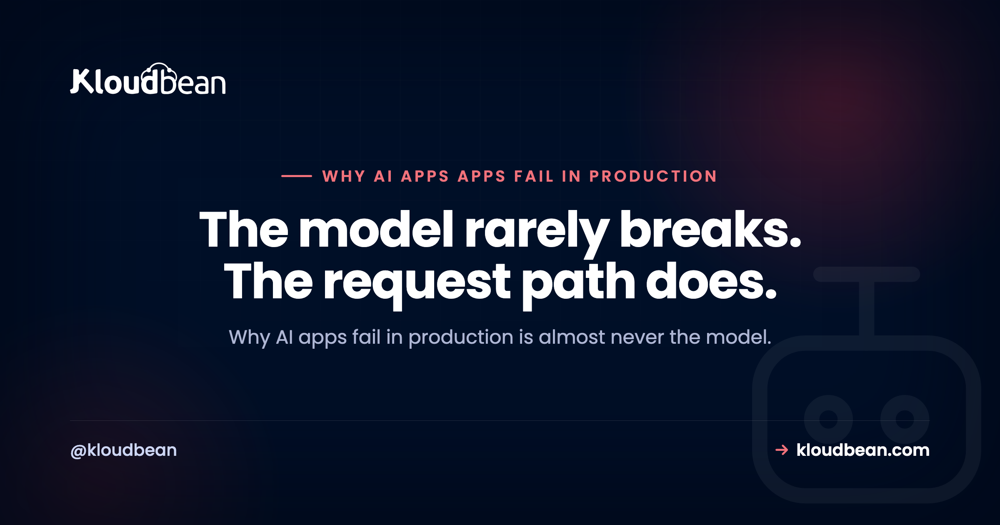

# Why AI Apps Fail in Production: Timeouts, Streaming, Retries, Queues, and Provider Outages

Your AI app runs beautifully on localhost. Then you ship it, real people show up, and it starts throwing 504s, freezing mid-answer, or falling over the moment a second user arrives. Here's the thing worth saying up front: why AI apps fail in production is almost never the model. It's the plumbing around the model. Timeouts, streaming, retries, queues, and the provider having a bad day. This is a field guide to each failure mode, organised so you can match your symptom to a cause and a concrete fix.

If you built the app with Lovable, Cursor, Bolt, or the OpenAI and Anthropic SDKs by hand, the code is probably fine. What's missing is the operational layer no prompt writes for you, the same gap the [last mile of vibe coding](https://www.kloudbean.com/blog/last-mile-of-vibe-coding/) maps in full. We'll walk the eight ways these apps break once they leave your laptop, and exactly what to change.

> **The short version:** AI apps fail in production because a long model call outlives a proxy timeout, a buffering proxy swallows your stream, provider 429s and timeouts aren't retried, heavy work runs inside the web request, an outage has no fallback, cold starts stall the first request, and the database runs out of connections under load. Almost all of it is config and architecture, not the model. Fix the request path and the failures mostly disappear.

## Most AI-app outages are config and architecture, not the model

This is the one opinion I'll plant a flag on. When an AI app goes down, the instinct is to blame the model: it's slow, it's flaky, it rate-limited me. Sometimes true. But in practice the model is the one part someone else keeps running for you. What actually breaks is the stuff you own: a gateway that cuts long requests, a proxy that buffers, a missing retry, a job that should've been a queue, an environment variable that exists on your laptop and nowhere else.

That's good news, honestly. It means these failures are predictable and fixable without touching model quality at all. You don't need a better model. You need a request path that survives slow calls, transient errors, and a crowd. So let's map where requests actually die.

## Why AI apps fail in production, at a glance

Find your symptom on the left, then jump to the section that explains the cause and the fix. This is the triage table. Keep it handy the next time something breaks at 2am.

| What you see | Likely cause | The fix |
| --- | --- | --- |
| 504 after ~30 to 60 seconds on long answers | Model call outlives the proxy or gateway timeout | Move long work to a queue; stream partial output; raise the route timeout only as a stopgap |
| Reply arrives all at once, or not at all | A reverse proxy or CDN is buffering the stream | Disable buffering on the streaming route (nginx `X-Accel-Buffering: no`) |
| Random 429 and 5xx errors shown to users | No retry on provider rate limits or timeouts | Retry with exponential backoff and jitter, respect `Retry-After` |
| Requests hang, then time out on big tasks | Heavy work running inside the web request | Push it to a background queue with a worker |
| Everything errors when the provider is down | A single provider with no fallback | Fail over to a second model or degrade gracefully |
| The first request after idle is slow or fails | Serverless cold start | Run an always-on process; keep it warm |
| Fine at 1 user, dies at 50 | Database connection exhaustion | Add a connection pool; cap concurrency |
| Works locally, 502 or 503 in production | Config gaps: bind address, env vars, ports | Bind `0.0.0.0`, set env in the host, read `PORT` |

## Where a request actually dies

Before the individual fixes, picture the path. A request leaves the browser, passes through a reverse proxy or gateway, hits your app, and your app calls the model provider. Three of the most common failures live on this one line: the gateway cuts the connection when a call runs long, the proxy buffers the streamed reply so the user sees a frozen screen, and a provider 429 or timeout bubbles straight back as an error because nothing retried it.

<!-- ADD IMAGE: request-path diagram (browser, reverse proxy/gateway, your app, model API) marking three death points: proxy timeout to 504, buffered stream, and an un-retried 429/timeout. -->

## The request times out on long model calls

**What you see.** A big generation (a long completion, a document summary, an agent doing several steps) hangs for a while, then dies with a 504 Gateway Timeout. Short prompts are fine. Long ones fail, and they fail at roughly the same duration every time.

Why it happens: there's a reverse proxy or load balancer in front of your app with an idle or read timeout, and it's often 30 or 60 seconds by default. Your model call takes longer than that, so the proxy gives up on the connection before your app ever gets its answer. Locally you had no proxy, so nothing enforced a ceiling and it "worked."

The fix, in order of how much I'd trust it: don't do multi-minute work in a web request at all, hand it to a queue and let the client poll or subscribe for the result (that's the next section). If the call is genuinely interactive, stream partial output so bytes flow before the timeout window closes, which keeps the connection alive and the user informed. Raising the proxy timeout is the weakest option, a stopgap that hides the design problem and still falls over on the one request that runs even longer.

## Streaming works locally but breaks in production

**What you see.** On your machine, tokens appear one by one. In production the whole reply lands at once after a long pause, or the connection just hangs and never delivers anything. The code didn't change. The environment did.

Why it happens: something between your app and the browser is buffering the response. A reverse proxy (nginx is the usual suspect) or a CDN collects the streamed chunks and waits, either for the response to finish or for its buffer to fill, before passing anything along. Server-Sent Events and chunked responses need to flow through untouched, and a buffering hop quietly defeats them.

The fix: turn buffering off on the streaming route specifically. On nginx that's `proxy_buffering off;` plus sending the `X-Accel-Buffering: no` response header from your app for that endpoint. Make sure you're not gzipping the stream in a way that forces buffering, and confirm the whole chain (any CDN in front included) is set to pass event streams through. Test it in production, not just locally, because this is the exact bug that only shows up once a proxy is in the path. If it's a chatbot you're shipping, [how to host an AI chatbot in production](https://www.kloudbean.com/blog/host-ai-chatbot-in-production/) walks the streaming path end to end.

## Provider 429s and timeouts reach your users because nothing retries

**What you see.** Intermittent errors with no obvious pattern. A user hits send, gets a red error, hits send again, and it works. Your logs show 429 Too Many Requests or the odd 500 and 503 from the model provider, sprinkled through otherwise normal traffic.

Why it happens: model APIs rate-limit and occasionally blip. That's normal and expected. The mistake is treating every provider response as final. With no retry layer, a single transient 429 or timeout goes straight to the user as a failure, even though the very next attempt would've succeeded.

The fix: wrap provider calls in a retry with exponential backoff and jitter. Retry on 429, 500, 502, 503, 504, and network timeouts. When the provider sends a `Retry-After` header, honour it instead of guessing. Cap the number of attempts and set a sane per-request budget so a retry doesn't itself outlive the timeout from two sections ago.

Worth being blunt about this one: no hosting choice fixes it. A retry is a decision inside your own code, and there is no platform setting, ours included, that turns an un-retried provider call into a resilient one. If you only do one thing from this article, do this one, because it is entirely within your control.

**The anti-pattern: retry storms.** The wrong version of a retry is retrying instantly, with no backoff and no cap. When a provider slows down, every one of your requests retries at once, then again, then again. You've turned one provider hiccup into a self-inflicted flood that hammers the API and burns your rate limit faster. Backoff plus jitter plus a hard attempt cap is the whole point. A retry loop with no ceiling is worse than no retry at all.

## Heavy work runs inside the web request

**What you see.** Anything substantial (embedding a big document, a multi-step agent run, generating a batch of images, sending a mailout) either times out or leaves the user staring at a spinner for a minute. Under any concurrency, the app gets sluggish for everyone, not just the person who kicked off the big job.

Why it happens: a web request is meant to be short. When you do minutes of work inside it, you're holding a worker process (and often a database connection) hostage for the whole duration. A handful of those at once and your app has no capacity left to serve anyone. It's the same root cause as the timeout, seen from the resource side.

The fix: move long or bursty work to a background queue with a worker running beside the app. The request enqueues a job and returns immediately with an id; the worker does the slow part; the client polls or gets notified when it's done. In Node, BullMQ on Redis is the standard shape, and [background jobs with BullMQ](https://www.kloudbean.com/blog/nodejs-background-jobs-bullmq/) walks through it. This one change fixes timeouts, keeps the app responsive under load, and lets you retry a failed job without the user resubmitting.

The part that trips people up is where the worker lives. A queue needs two things your platform has to actually allow: a Redis instance to hold the jobs, and a second process that stays awake between them. On a platform that only runs request-scoped functions, that second process is the awkward bit, which is why this fix often forces a hosting change rather than just a code change. [Running an API, a worker, and a database together](https://www.kloudbean.com/blog/run-ai-app-api-worker-database/) is the shape you are aiming for.

## The provider has an outage and you have no fallback

**What you see.** Your app is down, but your servers are healthy. Every request errors at the same moment because the model provider is having an incident, and your app has exactly one place to get an answer.

Why it happens: single points of failure are easy to build by accident. One provider, one model, one region, hard-wired. When it's up you never notice. When it's down, so are you, and there's nothing you can do but wait and watch the status page.

The fix depends on how critical the feature is. At minimum, fail gracefully: catch the outage, show a calm message, and queue the work to run when the provider returns rather than dropping it. For anything important, wire a fallback to a second provider or a smaller model so a failed primary call retries against a backup. Add a short-lived cache so identical recent prompts don't all depend on a live call. You don't need every layer on day one, but pick the one that matches how much an outage would actually hurt you.

## Cold starts make the first request slow or failing

**What you see.** The first request after a quiet period is painfully slow or times out, then everything's fine for a while, then it's slow again after the app's been idle. It correlates with traffic gaps, not with load.

Why it happens: serverless platforms scale to zero when idle. The first request afterward has to cold-start the runtime, which for an AI app can mean loading a chunky SDK and re-establishing database connections before it even calls the model. That startup tax lands on a real user, and it's often the first impression a new visitor gets.

The fix: for a steady, connection-heavy AI backend, run an always-on process instead of scaling to zero. A warm process keeps its connection pool ready and pays no startup cost per request. Serverless genuinely shines for spiky, occasional work, but a chat or agent backend is usually the opposite of that, and the cold-start penalty hits exactly where it hurts most.

This is the one failure on the list that is decided almost entirely by where you host, not by what you write. There is no code change that removes a cold start; either the process is running when the request arrives or it is not. So if you are hitting this, the honest answer is that you have outgrown scale-to-zero for this workload, and [moving an AI app off serverless](https://www.kloudbean.com/blog/move-ai-app-off-serverless/) covers the migration rather than a workaround.

## Connection exhaustion under load

**What you see.** Fine with one user, fine in your demo, then it falls apart the moment real traffic arrives. The database throws errors like `FATAL: sorry, too many clients already`, or your app logs timeouts waiting for a connection.

Why it happens: databases cap how many connections they'll accept (Postgres often ships with a ceiling around 100). If every request opens its own connection and holds it, especially while waiting on a slow model call, you exhaust that pool fast. Serverless makes it worse by spinning up many isolated instances that each open connections. The math catches up with you the first busy day.

The fix: put a connection pool in front of the database so connections are reused instead of created per request, and set the pool size to respect the database limit. Cap concurrency so a burst queues instead of opening a thousand connections at once. Don't hold a database connection open across a long model call. Our [database connection pooling](https://www.kloudbean.com/blog/database-connection-pooling/) guide covers why the limit bites sooner than people expect and how to size the pool.

## It works locally but fails in production

**What you see.** The classic. Perfect on your machine, then a 502 or 503 the moment it's deployed, sometimes before a single line of your logic runs. If you built with an AI tool, this is probably the first wall you hit.

Why it happens: it's almost always configuration, not code. The app binds to `127.0.0.1` instead of `0.0.0.0`, so nothing outside the container can reach it. Or it hard-codes a port instead of reading `PORT` from the environment. Or an environment variable that exists in your local `.env` simply isn't set on the host, so an API key or database URL is undefined and the app crashes on boot.

The fix: bind to `0.0.0.0`, read the port from the environment, and set every secret and config value in the host rather than assuming a local file came along for the ride. That last part is worth checking before you debug anything else, because a platform that lets you set and see the app's environment variables and runtime settings without SSH turns this from a guessing game into a screen you can read. If you're staring at a 503 right now, [fix a 503 after deploying your app](https://www.kloudbean.com/blog/fix-503-after-deploying-your-app/) is the focused walkthrough, and [why your AI app works locally but not in production](https://www.kloudbean.com/blog/why-my-ai-app-works-locally-but-not-in-production/) covers the wider pattern of environment gaps.

## Sort the eight by who actually fixes them

Read back through the list and a split appears that is more useful than the list itself. Some of these failures are decided by code you write. Others are decided by the shape of the thing you deployed onto, and no amount of careful coding removes them. Knowing which is which tells you whether your next move is a pull request or a migration.

| Failure | Fixed by | What that means in practice |
| --- | --- | --- |
| No retry on 429s and timeouts | Your code | Backoff, jitter, and an attempt cap. No platform does this for you. |
| Provider outage, no fallback | Your code | A second model, graceful degradation, a short cache. |
| Heavy work inside the request | Both | You move it to a queue; the host has to allow a worker that stays awake and a Redis to hold the jobs. |
| Timeout on long model calls | Both | You choose queue or streaming; the proxy in front sets the ceiling you are working against. |
| Connection exhaustion | Both | You size the pool; the database's connection limit is the number you size it to. |
| Buffered streaming | Your host's proxy | A per-route buffering setting, worth verifying in production rather than assuming. |
| Works locally, fails deployed | Your host's config | Bind address and port are code; the environment variables live on the host. |
| Cold starts | Your host | Either the process is running when the request lands or it is not. No code fixes this. |

The top half is yours no matter where you deploy, and it is worth saying plainly that we cannot help with it. A missing retry stays a missing retry on any infrastructure on earth. The bottom half is the half a hosting decision genuinely settles, and it is why so many of these articles end up recommending the same three things: an always-on process, a queue with somewhere to run its worker, and a database close enough to pool against.

That bottom half happens to describe how Kloudbean is put together, which is the reason it keeps coming up in the fixes above rather than being saved for a pitch at the end. Apps run as persistent processes, so the cold-start row disappears by default. Managed Redis backs the queue and a second always-on process runs the worker, which is what the heavy-work row needs. A managed Postgres or MySQL sits beside the app with a known connection ceiling, so pool sizing becomes arithmetic instead of guesswork, and you lock it down by whitelisting your app server's IP. Node and Python runtime settings and environment variables are editable in the dashboard rather than over SSH, which is the config row. We run our own content engine on exactly this shape, written up in [how we host our own AI content engine](https://www.kloudbean.com/blog/how-we-host-our-own-ai-content-engine/).

Where that stops, precisely: it removes infrastructure-shaped failures and leaves code-shaped ones exactly where they were. Private networking and a VPC are part of the Enterprise package, so on a standard plan the IP allow-list is the access model, not a private network. And if your app genuinely idles most of the day, scale-to-zero will cost you less than an always-on server, cold starts and all. The right answer depends on which half of that table your outage is coming from.

<!-- cta:start -->
**Fewer mysteries on the next deploy.**

Deploy from Git, watch the build output as it runs, and open the app error log when a process refuses to start. Managed processes restart on crash, and backups are automatic.

- Live build logs
- Deployment history
- Logs viewer
- Managed process restarts
- Automatic backups
- Git deploy

[Start free](https://console.kloudbean.com/register) · [See plans](https://www.kloudbean.com/pricing/)
<!-- cta:end -->

## FAQ

**Why do AI apps fail in production when they work locally?**
Because production adds things localhost never had: a reverse proxy with a timeout, real concurrency, a database connection limit, and secrets that must be set on the host instead of in a local file. The model is usually fine. The failures live in the request path and the config around it, which is why the same code behaves differently once it's deployed.

**Why does my AI app time out on long model calls?**
A reverse proxy or load balancer in front of your app has an idle or read timeout, often 30 or 60 seconds, and a long generation outruns it, so you get a 504. The durable fix is to move long work to a background queue and stream partial output for interactive calls. Raising the proxy timeout only delays the same failure.

**Why did my streaming responses stop working in production?**
Almost always a buffering reverse proxy or CDN. It collects your streamed tokens and releases them in one lump, so the reply lands all at once or hangs. Disable buffering on the streaming route (on nginx, `proxy_buffering off;` and the `X-Accel-Buffering: no` header) and confirm nothing else in the chain re-buffers the event stream.

**How should I handle 429 rate limit errors from an AI provider?**
Retry them, but carefully. Use exponential backoff with jitter, honour the `Retry-After` header when the provider sends it, and cap the number of attempts. Retrying instantly with no backoff creates a retry storm that makes rate limiting worse. A bounded, backed-off retry turns most transient 429s and timeouts into a small delay the user never notices.

**Should I run long AI tasks inside the web request?**
No. A web request should be short. Long tasks like embedding documents, multi-step agents, or batch generation hold a worker and often a database connection for the whole duration, which starves the app under any concurrency. Push them to a background queue with a worker, return a job id immediately, and let the client poll or subscribe for the result.

**What happens when my AI provider has an outage?**
If you have a single hard-wired provider, your app goes down with it even though your servers are healthy. At minimum, catch the outage and fail gracefully, queuing work to run when the provider returns. For critical features, add a fallback to a second provider or a smaller model, and cache recent identical prompts so not every request depends on a live call.

**Why is the first request to my AI app slow or failing?**
Cold starts. Serverless platforms scale to zero when idle, so the first request afterward pays to boot the runtime, load the SDK, and reopen database connections before it even reaches the model. For a steady, connection-heavy AI backend, run an always-on process so it stays warm and the first request is as fast as the rest.

**What causes too many connections errors under load?**
Connection exhaustion. Databases cap connections (Postgres often around 100), and if every request opens its own and holds it across a slow model call, you run out fast. Serverless makes it worse with many isolated instances. Add a connection pool so connections are reused, size it to the database limit, and cap concurrency so bursts queue instead of piling on.

**Is it the model or my infrastructure when my AI app fails?**
Far more often the infrastructure and configuration than the model. Timeouts, buffered streams, missing retries, work stuck in the request, and connection limits account for the bulk of production outages. The model is the piece a provider keeps running for you. Fix the request path first, and most of the failures you were blaming on the model disappear.

---

*Kloudbean · The model rarely breaks. The request path does.*
