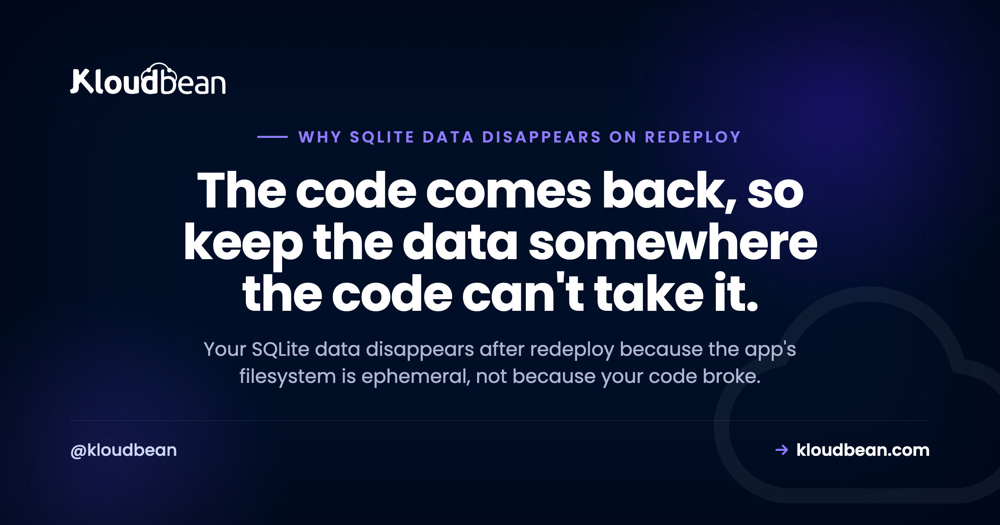

# Why Your SQLite Data Disappears After a Redeploy (and How to Stop It)

You shipped a small fix. The deploy went green. And now every account from yesterday is gone, the tables are empty, and the logs show a blunt `SQLITE_ERROR: no such table` where a table clearly existed. The good news: your code is fine. Your SQLite data disappears after redeploy because of where the data lived, not because your app broke.

So before you rewrite a single query, rule the code out. The redeploy didn't corrupt your logic. It threw away the disk your database file was sitting on. That one fact explains the whole thing, and once you see it, the fix is obvious and it's permanent.

> **The short version:** On most modern hosts your app's filesystem is ephemeral. A redeploy throws away the running instance and builds a fresh one from your code, so anything written to local disk since the last build, including your SQLite .db file, is wiped. The code comes back. The data doesn't, because the data was never in the code. Move whatever you write to a managed database that lives outside the app, and redeploys stop touching your data.

## First, rule out your code

The instinct is to blame a migration, an ORM setting, a query that ran in the wrong order. Almost always, none of that is it. Run one test in your head: does the data survive normal use, and only vanish right after a deploy (or a restart, or a crash that restarts the process)? If the loss lines up with a deploy, your code is not the suspect.

This is the tell that separates a database resets on deploy problem from an actual bug. A logic bug loses data when a specific action runs. This loses everything, all at once, at the moment new code ships. Different signature, different cause. You're not looking for a bad line. You're looking at where the file lived.

## Why your SQLite data disappears after redeploy: the filesystem is ephemeral

Here is the mechanism, made concrete. Your app runs as a process on a server somewhere. When you deploy, the platform doesn't patch the running copy in place. It builds a fresh instance straight from your code and swaps it in, then discards the old one. That fresh instance comes with a fresh disk. Anything written to local disk since the last build is not copied over. It's simply gone.

Your SQLite database is a file on that local disk, usually something like `app.db` or `data.sqlite`. Every row your users created since the last deploy lives in that file and nowhere else. So when the SQLite file wiped on redeploy scenario hits, the new instance boots with the version of `app.db` that was baked into your code at build time, which is either empty or whatever test rows you committed. The rows real users made never existed in the code, so they don't come back with it.

That's what an ephemeral filesystem means: scratch space that's fine to write to while the instance lives, and certain to vanish when the instance is replaced. Redeploys replace it. So do scale events and, on many platforms, ordinary restarts. Below, the same redeploy on two setups: one where the data sits on that scratch disk, one where it lives outside the app.

<!-- ADD IMAGE: your host's deploy log at the moment a new build swaps in, next to the timestamp your data went empty -->

## It worked locally, so the timing throws you off

This bug is sneaky because it hides during the exact phase where you'd catch most problems. On your laptop, SQLite is flawless. Your disk persists between runs, restarts, and rebuilds, so data written on Monday is still there on Friday. Every local test passes. You ship with real confidence.

Then it works in production too, right up until the first redeploy. That might be days later, when you push an unrelated tweak. So the data loss looks disconnected from the deploy that caused it. People go hunting for a phantom bug in a feature they touched, when the real trigger was the deploy itself resetting the disk. If you've ever asked why my data resets after deployment and found nothing wrong in the diff, this is why. The broader pattern of local-perfect, production-broken is worth a read in [why your AI app works locally but not in production](https://www.kloudbean.com/blog/why-my-ai-app-works-locally-but-not-in-production/).

## Why your AI builder reached for SQLite in the first place

None of this is a knock on the tool that scaffolded your app. SQLite is the zero-config default that just works. There's no server to run, no connection string to configure, no credentials to manage. You call it and it writes a file. For a builder like Lovable, Cursor, Bolt, or Replit trying to get you a working app in one shot, that's exactly the right first move. It's the quickest thing that works.

The trap is that "works" and "survives a deploy" are two different claims, and the second one never comes up while you're building. So the default quietly ships to production with you. This is one item on a longer list of things AI builders leave for you to finish, mapped out in [the last mile of vibe coding](https://www.kloudbean.com/blog/last-mile-of-vibe-coding/), and it sits alongside the other usual suspects in [why AI apps fail in production](https://www.kloudbean.com/blog/why-ai-apps-fail-in-production/). The SQLite-on-redeploy one just happens to be the most heartbreaking, because the app looks perfect until the day it eats your users.

## Local disk vs a managed database

The difference isn't SQLite versus Postgres as engines. It's where the data physically lives: on the app's throwaway disk, or in a service that outlives the app. That single distinction decides almost everything that matters in production.

| | SQLite on local disk | Managed database (Postgres / MySQL) |
| --- | --- | --- |
| Survives a redeploy | No, the disk is replaced | Yes, it lives outside the app |
| Survives scale-out | No, each instance has its own file | Yes, every instance shares one database |
| Automatic backups | You build and test them yourself | Built in, run on a schedule |
| Concurrent writers | Locks up under real write load | Built for many connections at once |
| Access control | Whatever the file permissions are | Credentials plus IP allow-listing |

The scale-out row is the quiet killer people forget. Even if a host somehow kept your disk between deploys, the moment you run a second copy of the app to handle traffic, each copy gets its own SQLite file. Half your users write to one, half to the other, and neither has the whole picture. Local files just don't have a story for more than one instance.

## The fix: move state out of the app process

The permanent fix is one idea: state that has to survive a deploy must not live inside the thing you redeploy. Move your data to a managed Postgres or MySQL database that runs as its own service, and now deploying only ever ships code. The database sits still while versions come and go, exactly like the bottom timeline in the diagram.

In practice this is smaller than it sounds. You provision a managed database, you get a connection string, and you point your app at it through a `DATABASE_URL` environment variable instead of a file path. Most ORMs (Prisma, Drizzle, Sequelize, Django's ORM, ActiveRecord) change one line of config and a dialect setting. Your queries barely move. The full walkthrough is in [how to add a managed database to your app](https://www.kloudbean.com/blog/add-managed-database-to-your-app/), and if you're weighing the engine, [managed PostgreSQL hosting](https://www.kloudbean.com/blog/managed-postgresql-hosting/) covers why Postgres is the safe default for most apps. Once you're on it, spend ten minutes on [production database design for AI apps](https://www.kloudbean.com/blog/production-database-design-for-ai-apps/) so the schema you carry over is one you'll want to keep.

Here's my one firm opinion on this: SQLite is great in dev and wrong for anything you write to in production. It's a brilliant embedded database, genuinely, but the moment real users depend on data persisting, it belongs behind you. Switch to a managed database the day you have your first real user, not the day after you lose them.

<!-- ADD IMAGE: the create-a-managed-database screen where you pick Postgres or MySQL and copy the connection string -->

## When SQLite is actually the right tool

Let me be fair to SQLite, because the internet loves to dunk on it and that's not the point. The problem is never SQLite itself. It's writable SQLite on an ephemeral disk. There are real production uses where SQLite is a fine, even excellent, choice:

- **Local development and tests.** Fast, disposable, zero setup. Perfect for it.
- **A read-only database you bundle with the build.** Ship a `.db` of reference data (say a list of postcodes or product specs), read from it at runtime, never write to it. A redeploy just brings the same file back. Nothing to lose.
- **Single-user desktop and mobile apps.** The file lives on the user's own device, which isn't ephemeral. That's SQLite's home turf.

Notice the common thread: nothing important is being written to that file at runtime on a server. The instant your app writes user data to SQLite on a host that can replace the disk, you've re-created the whole problem. So the rule isn't "never SQLite." It's "never write runtime data to a file on an ephemeral disk."

## The same bug wears other disguises

Once you see the ephemeral-disk pattern, you start spotting it everywhere, and that's the real value here. User uploads are the classic sibling. Someone uploads a profile photo, your app saves it to `/uploads` on local disk, and it works great until the next deploy makes every image 404 with an `ENOENT`. Exact same mechanism, different file. The fix is the same shape too: put uploads in object storage that lives outside the app, which is covered in [how to store user uploads in object storage](https://www.kloudbean.com/blog/store-user-uploads-in-object-storage/).

So generalise the rule and you'll never get bitten by this class of bug again: nothing that must survive a deploy lives on the app's local disk. Databases go to a managed database. Files go to object storage. Sessions and caches go to Redis. Which kind of data belongs in which store is laid out in [persistent storage for AI apps](https://www.kloudbean.com/blog/persistent-storage-for-ai-apps/). The app process itself stays disposable, which is the whole point of being able to redeploy it fearlessly.

<!-- ADD IMAGE: a broken profile image or a 404 in the network tab after a deploy, showing local-disk uploads vanishing the same way -->

## Two 'fixes' that quietly make it worse

When the panic sets in, two workarounds show up a lot. Both feel like fixes. Both dig the hole deeper.

**Committing the .db file into git.** The logic goes: if the file is in the repo, every deploy will have it. True, and that's the trap. Every deploy restores the version of the database from your last commit, silently rolling every user back to that snapshot and wiping everything since. Now you're not losing data at random, you're losing it on a schedule, and overwriting it with stale rows on purpose. It also turns a binary file into a merge-conflict nightmare. Don't put a live database in version control.

**Writing the SQLite file to a different path.** People move `app.db` to `/data` or `/var/db` hoping some folder is magically persistent. Usually it isn't. Unless the platform gives you an explicitly mounted persistent volume (and most app platforms don't, by design), every path is on the same ephemeral disk. You've moved the deck chair. The disk still resets. Chasing the "right" folder wastes an afternoon and ends where it started.

## Where Kloudbean fits

This is squarely the problem Kloudbean is built to make boring. You run your app on an always-on server, and you add a managed database (Postgres, MySQL, and more) that runs as its own service, outside the app. So a redeploy only ever changes code, and your data sits right where it was. You deploy from Git on every push, automatic backups run on a schedule, and SSL is free. The database is locked down by IP allow-listing: you whitelist your app server's address so only your app can connect, and everything else is refused. Plans start at $8/mo, and it's all in one dashboard rather than three separate consoles.

The honest boundary, because it builds trust: managed means Kloudbean handles the server, the stack, SSL, backups, and patching. Your app code and your data stay yours. Moving off SQLite is a change you make in your app; the platform's job is to give the managed database a stable home so the move actually sticks. Full network isolation in a private VPC is an Enterprise capability; on a standard plan, the IP allow-list is how you keep the database off the open internet.

## Stop losing data on every deploy

**Stop losing data on every deploy. Give it a home outside the app.** Run your app on an always-on server and add a managed Postgres or MySQL that survives every redeploy, with automatic backups, free SSL, IP allow-listing, and Git deploys, all in one dashboard. Start free at [kloudbean.com](https://www.kloudbean.com/) from $8/mo; see plans on [pricing](https://www.kloudbean.com/pricing/).

Managed Postgres + MySQL · Survives redeploys · Automatic backups · Free SSL · IP allow-listing · Git deploy · Free migration · Free trial

## FAQ

**Why does my database reset every deploy?**
Because your database is a file on the app's local disk, and that disk is ephemeral. Each deploy builds a fresh instance from your code and throws the old disk away, so any data written since the last build goes with it. The fix is to move your data into a managed database that runs outside the app, so deploying only changes code.

**Why does my SQLite data disappear after a redeploy?**
Your SQLite database is a single file (like app.db) on scratch disk. A redeploy replaces the running instance with a new build that comes with a clean disk, and the file with your users in it is not carried over. Your code returns, your data does not, because the data was never part of the code.

**What is an ephemeral filesystem?**
It is disk space that exists only for the life of a running instance. You can read and write it while the app runs, but when the instance is replaced by a redeploy, restart, or scale event, that disk is discarded and a fresh one takes its place. Anything you saved there is gone. It is the default on most modern app platforms.

**Is SQLite ok for production?**
For anything you write to at runtime on a server, no, not on an ephemeral disk. SQLite is excellent for local development, tests, single-user desktop or mobile apps, and read-only reference data you bundle with the build. The problem is never SQLite itself, it is writing live user data to a file that a deploy can wipe.

**How do I stop losing data on redeploy?**
Move every piece of state that must survive a deploy off the app's local disk. Put your database in a managed Postgres or MySQL, put uploaded files in object storage, and put sessions or caches in Redis. Point your app at the database through a DATABASE_URL environment variable instead of a file path, and redeploys stop touching your data.

**Does this happen to user uploads too?**
Yes, and it is the exact same mechanism. Files saved to a local folder like /uploads live on the same ephemeral disk as your SQLite file, so a redeploy makes them vanish and requests for them return a 404 or ENOENT. The fix is the same shape: store uploads in object storage that lives outside the app.

**Can I just commit my SQLite .db file to git?**
Please do not. Committing the database means every deploy restores the snapshot from your last commit, silently rolling all users back and overwriting everything created since with stale rows. It also turns a binary file into a source of merge conflicts. A live database does not belong in version control.

**Will switching to Postgres or MySQL fix it for good?**
Yes, as long as it is a managed database running as its own service outside the app, which is the normal setup. Because the database no longer lives on the app's disk, redeploys, restarts, and scaling never touch it. You also gain real concurrent writes, scheduled backups, and the ability to run more than one app instance against one database.

**Does a restart or a crash wipe SQLite too, or only a redeploy?**
On many platforms a plain restart or a crash-and-restart also lands you on a fresh disk, so yes, it can happen without a deploy. That is part of why the loss feels random. The safe assumption is that the local disk can reset at any time, so nothing you need to keep should live there.

---

*Kloudbean · The code comes back, so keep the data somewhere the code can't take it.*
