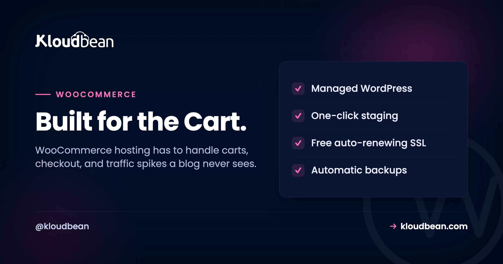

# WooCommerce Hosting: What Your Store Actually Needs

By the Kloudbean Commerce Team · Built for the Cart.

A WooCommerce store is not a blog with a buy button. It's a live application: carts that change per shopper, a checkout that runs code on every click, and a database that grows with every order. WooCommerce hosting has to carry all of that, and cheap shared hosting usually can't. This is what a store actually needs from its server, why the $3 plan falls over the moment you run a sale, and how to pick hosting that stays fast when it matters.

> **Short answer:** Good WooCommerce hosting gives a store enough PHP workers and CPU for concurrent shoppers, a fast managed MySQL or MariaDB database that's backed up, a persistent object cache (Redis or Memcached), and full-page caching that skips the cart, checkout, and account pages. The best WooCommerce hosting for a store that makes money is managed cloud hosting sized for dynamic traffic, not a shared plan built for static pages.

## Why WooCommerce is heavier than a blog

Start with the thing most hosting advice skips. A blog post is the same for every reader. Your server can build it once, keep a copy, and hand that copy to the next thousand visitors without running a line of PHP or touching the database. That's why a static blog flies on almost anything.

A store breaks that assumption. The cart is different for every shopper. So is the checkout. So is the My Account page. None of those can be served from a shared cache, because caching one shopper's cart and showing it to another would be a disaster. Every hit on those pages boots PHP, runs WooCommerce, and queries MySQL. Live, every time.

WooCommerce also adds weight under the hood. It creates its own tables for orders, order items, product metadata, and customer sessions. It leans on WordPress options, and the autoloaded options row can bloat as plugins pile up, so every page load drags a fat query along with it. Product search, coupon checks, stock counts, tax and shipping calculations: all dynamic, all hitting the database.

Then the spike. You send one marketing email, or a post takes off, and a crowd arrives at the same moment. On a blog they'd all land on cached pages. On a store they head for the product page, the cart, the checkout. The exact pages you can't cache are the ones getting hammered. That's the WooCommerce load profile in one sentence: bursty, dynamic, and database-bound.

## The part you can't cache

It helps to see the two paths side by side, because the whole art of WooCommerce speed lives in the split. Some pages are cacheable and should fly. Some are per-user and always cost real work.

<!-- Inline SVG in the HTML version: a shopper's request splits into two paths. The green top path (catalog pages: home, shop, product, blog) flows to a full-page cache and is served instantly with no PHP and no database. The purple bottom path (per-user pages: cart, checkout, my account) runs PHP workers on every hit and queries MySQL, with a Redis object cache that cuts repeat database queries. -->

Read the diagram and the strategy writes itself. Push everything you safely can onto the green path. Give the purple path enough PHP workers, a database that isn't starved, and an object cache so it doesn't ask MySQL the same question a thousand times a minute. Get that balance wrong in either direction and the store either serves stale carts or grinds to a halt. More on that mistake shortly.

## Why cheap shared hosting chokes a store

Shared hosting is built for the blog case. One physical box is oversold across hundreds of accounts, and the whole business model assumes most of those sites are mostly cached, mostly idle, mostly cheap to serve. Your neighbor's traffic and your traffic compete for the same CPU, the same RAM, the same database.

Drop a store into that and the cracks show fast. You get a tiny slice of PHP workers, maybe one or two, so only one or two dynamic requests run at once. The database is shared and tuned small, with an InnoDB buffer pool too little to hold your product catalog in memory. There's no persistent object cache, so WooCommerce re-runs the same option and product queries on every page. It looks fine while you're testing with one browser tab.

Then real shoppers arrive together. Ten people hit checkout at the same time on a box with two workers, and eight of them wait in line. Pages hang. Some time out. If the shared database is under pressure you'll see the classic WordPress failure, `Error establishing a database connection`, or a checkout that spins and then throws a 502 or 504. The store was fine at 3 visitors and fell over at 30. Nothing was broken. The hosting just ran out of room on the one day you needed it.

So the honest read: shared hosting is fine for a store that's barely a store, a handful of orders a month and no real traffic. The moment a WooCommerce site has customers and a revenue number, the shared plan stops being a bargain and starts being a liability.

<!-- ADD IMAGE: server metrics during a flash sale, CPU and RAM climbing while PHP workers max out. -->

## What good WooCommerce hosting actually gives you

Here's the checklist that separates hosting a store can trust from hosting that will embarrass you on launch day. Each item earns its place, so I've put the reason next to it.

**Enough PHP workers, CPU, and RAM.** Workers are how many dynamic requests run at once. A store with two workers can serve two shoppers through checkout simultaneously, and everyone else queues. More workers plus more CPU is how you handle a crowd on the pages that can't be cached. This is the single most common thing underpowered plans get wrong.

**A fast, well-resourced managed database.** WooCommerce is query-heavy, so MySQL or MariaDB needs enough RAM to keep hot data in the InnoDB buffer pool and not thrash the disk. Managed means it's patched, tuned, kept off the public internet, and backed up, because those rows are your orders and customers. Losing that database is not a bad day, it's a business event.

**A persistent object cache.** Redis or Memcached stores the results of the queries WooCommerce repeats endlessly, including that heavy autoloaded options blob, so MySQL isn't re-answering the same thing on every request. Persistent is the key word: WordPress has a default cache that lasts one request and then throws itself away, which does nothing for load. A real object cache lives across requests and is often the biggest single win for a busy store.

**Full-page caching that bypasses the cart.** Catalog and content pages should serve from cache with no PHP at all. But the cache has to know to step aside for the cart, checkout, and My Account, and for any shopper who has items in their cart. Get this wrong and people see someone else's cart or an empty checkout. Right, and most of your traffic never touches PHP while the dynamic bits still work.

**Free, auto-renewing SSL.** Checkout must be HTTPS. Browsers now flag plain HTTP as not secure, payment gateways expect TLS, and shoppers bail on a page that looks unsafe. SSL that installs and renews itself means you never wake up to an expired certificate scaring away buyers.

**Automatic, restorable backups.** A store that loses orders can't just reinstall and move on. Backups need to run on their own, live off the box they protect, and restore cleanly when you test them. The day a bad plugin update corrupts something, a good backup is the difference between an hour of downtime and a lost weekend.

**A staging site.** WooCommerce plus its plugins update constantly, and an update that breaks checkout is lost revenue in real time. Staging is a copy of the live store where you test the update, click through a full test purchase, and only then push it live. On a store, testing on production is gambling with the cart.

**Room to scale.** Traffic grows, and sales are spiky by nature. You want to resize the server up when you need more headroom, and for big stores, put a load balancer in front and run more than one app server. Hosting that traps you on one fixed box is hosting you'll outgrow mid-sale.


## WooCommerce server requirements, as sensible baselines

You don't need to memorize a spec sheet, but a few baselines are worth knowing because they're where cheap hosting quietly under-delivers. These track WooCommerce's own published recommendations. Treat them as a floor, not a target.

| Requirement | Sensible baseline | Why it matters |
|---|---|---|
| **PHP version** | 7.4 minimum, 8.1+ recommended | Newer PHP is faster and still getting security fixes |
| **PHP memory limit** | 256M or more | WooCommerce and its plugins are memory-hungry per request |
| **Database** | MySQL 5.7+ or MariaDB 10.4+ | Newer engines handle WooCommerce's queries and indexes better |
| **HTTPS / TLS** | Required, auto-renewing | Checkout has to be secure, and browsers punish plain HTTP |
| **Object cache** | Redis or Memcached, persistent | Cuts repeat database queries on every dynamic page |
| **PHP workers** | Scaled to concurrency, not one or two | Decides how many shoppers you serve at once |

A couple of these live in your `wp-config.php` and in how the object cache is wired up. On a managed host the plumbing is done for you, but it helps to know what "correct" looks like:

```php
// wp-config.php essentials for a WooCommerce store
define( 'WP_MEMORY_LIMIT', '256M' );
define( 'WP_MAX_MEMORY_LIMIT', '512M' );

// Point WordPress at the object cache (managed Redis)
define( 'WP_REDIS_HOST', '127.0.0.1' );
define( 'WP_REDIS_PORT', 6379 );
define( 'WP_CACHE', true );
```

## The caching mistake that breaks most stores

If I had to name the one thing that goes wrong most often on WooCommerce, it isn't the code. It's caching, done at one of two extremes.

The first extreme: someone flips on aggressive full-page caching for the whole site because it made the blog fast, and now the cart shows the wrong items, the checkout total is stale, or a logged-in customer sees a cached page meant for a guest. Panicked, they do the second extreme: turn caching off entirely. Now every request, including all the cacheable catalog pages, boots PHP and pounds MySQL, and the site melts under any real traffic.

Both are wrong because they treat the store as one thing. It's two. The fix is to run both cache layers and let each do its job. A persistent object cache underneath everything, so repeated queries are cheap. Full-page caching on top for catalog and content pages, with the dynamic paths explicitly excluded. In practice that means telling the cache to never store these, and to bail out when a cart cookie is present:

```
# Never full-page cache these WooCommerce paths
/cart/
/checkout/
/my-account/

# Bypass the page cache when these cookies exist
woocommerce_items_in_cart
woocommerce_cart_hash
wp_woocommerce_session_
```

> **The position I'll defend:** nearly every "WooCommerce is slow" ticket is a caching balance problem, not a hardware problem or a code problem. Object cache plus full-page cache with the cart excluded fixes more stores than any plugin you can install. If you want the deeper mechanics, our [Redis caching patterns](https://www.kloudbean.com/blog/redis-caching-patterns/) guide and the general [speed up WordPress](https://www.kloudbean.com/blog/speed-up-wordpress/) playbook cover the how.

## The PCI question, answered honestly

Anyone taking card payments eventually asks whether their hosting is "PCI compliant," and the honest answer has more nuance than a checkbox. Compliance is shared, and most of it depends on how you take payment, not just where you host.

The good news for most stores: you probably aren't touching raw card numbers at all. Gateways like Stripe and PayPal handle the card data on their side, either by redirecting to their page or by tokenizing the card in the browser so the number never lands on your server. That design is deliberate, and it dramatically shrinks how much of the PCI standard applies to you. Your store records that a payment succeeded, not the card that paid.

What stays on your plate is the hosting hygiene: keep the whole checkout on HTTPS, keep WordPress, WooCommerce, and plugins patched, use a reputable gateway, and never store card data yourself. A good host gives you the infrastructure controls for that, the firewall, TLS, isolation, and patched stack. But no host can hand you compliance as a finished product, and you should be wary of any that claims to. It's a shared responsibility: the platform secures the infrastructure layer, you secure your application and your payment flow.

## How do you scale a WooCommerce store?

Scaling a store is mostly about the dynamic path, since that's the part that costs real work. The order you reach for the levers matters.

**First, cache correctly.** Object cache plus full-page cache, as above. This is free performance and it usually buys more headroom than any upgrade. A lot of "we need a bigger server" turns out to be "we never turned on the object cache."

**Then resize up (vertical).** Give the server more CPU and RAM, add PHP workers, and give the database a bigger buffer pool. For most stores this single step covers every sale they'll ever run. Vertical scaling is simpler, and simple is underrated when money is on the line.

**Then scale out (horizontal), for the big ones.** A large store puts a load balancer in front and runs several app servers behind it, all sharing one managed database and one object cache. That's how you survive traffic a single box can't, and how you do zero-downtime maintenance. Fully automatic autoscaling is an enterprise and custom setup, not a switch a standard store flips, so plan capacity for your known peaks rather than assuming the platform grows the store for you.

**And offload the heavy static stuff.** Product images and downloads can move to object storage and sit behind an edge CDN, so your app servers spend their cycles on carts and checkouts, not on serving photos. For the full mental model of resize versus add-servers, we wrote it up in [scalable WordPress hosting](https://www.kloudbean.com/blog/scalable-wordpress-hosting/).

<!-- ADD IMAGE: a load balancer with two or three app servers behind it, all pointing at one managed database. -->

## How Kloudbean does managed WooCommerce hosting

WooCommerce has been a first-class stack on Kloudbean since launch, right alongside WordPress, so none of this is bolted on after the fact. Here's the path, with the actual screens.

You pick a cloud (seven of them: AWS, Amazon Lightsail, Google Cloud, DigitalOcean, Vultr, Akamai Linode, and UpCloud), launch a server in a region near your customers, and add WooCommerce as an application. The PHP stack comes tuned and hardened, with free SSL ready to go, not a blank box waiting for you to configure it.

<!-- ADD IMAGE: the WooCommerce application overview with the live URL, PHP version, and cache controls. -->

The store keeps its data in managed MySQL or MariaDB: provisioned, secured, kept off the public internet, and backed up automatically with controlled access. Alongside it you add a managed Redis or Memcached for the object cache, the layer that keeps the dynamic pages quick. That's the caching a plugin can't provide, running as real infrastructure you can size.


From there you get the pieces a store leans on. One-click staging for WordPress (WooCommerce runs on it) so plugin and theme updates get tested before they hit live sales. Automatic backups with self-serve restore, because orders are money. Free auto-renewing SSL for the checkout. Cron jobs from the dashboard without SSH for scheduled tasks. And when a sale is coming, you resize the server or put the built-in Flexible Load Balancer in front, all from the same place.


It's all one dashboard: the store, its database, the object cache, backups, SSL, and scaling, with one login and one bill. If you're moving an existing store, Kloudbean offers free migration assistance, and there's a free trial so you can load your catalog and test a real checkout before committing. If you're wiring the database up by hand, [adding a managed database to your app](https://www.kloudbean.com/blog/add-managed-database-to-your-app/) walks the connection details, and [managed MySQL hosting](https://www.kloudbean.com/blog/managed-mysql-hosting/) covers the database side in depth. For the backup discipline itself, see the [server backups guide](https://www.kloudbean.com/blog/server-backups-guide/).

## If you are weighing Magento instead

Worth knowing before you commit either way. Magento is built for larger catalogues and brings heavier server requirements with it, including Elasticsearch as a hard requirement for catalogue search rather than an optional extra. The performance reasoning on this page transfers, but the components differ, and [Magento SEO](https://www.kloudbean.com/blog/magento-seo/) covers the infrastructure half of that platform along with the search and caching layers it depends on. And if you have not committed to WooCommerce at all yet, [WooCommerce vs Shopify](https://www.kloudbean.com/blog/woocommerce-vs-shopify/) is the decision that comes before this one.

## The honest limits

Two things, said plainly. WooCommerce runs on a **Linux and PHP** stack, which is exactly what it was built for, so this is a strong fit rather than a workaround. And "managed" is a split, not a takeover. The platform runs the server, the stack, the object cache wiring, SSL, and backups. You still own your products, your orders, your plugin and theme choices, and your checkout flow. On compliance, treat it as shared: the platform provides and keeps maturing the infrastructure controls, while the application-level compliance of your specific store, especially around payments, stays with you. That clarity is the point. You always know who owns what.

If you're still deciding between plain managed WordPress and a store-ready setup, [managed WordPress hosting](https://www.kloudbean.com/blog/managed-wordpress-hosting/) lays out the general version, and this page is the WooCommerce-specific answer sitting on top of it.

---

**Your store stays fast. We run the stack under it.** Managed WooCommerce hosting on infrastructure you own, with the database, object cache, backups, and SSL handled for you. Start at [kloudbean.com](https://www.kloudbean.com/); check current plans on [pricing](https://www.kloudbean.com/pricing/).

One-click WooCommerce · Managed MySQL & Redis · Full-page + object cache · Automatic backups · Free auto-renewing SSL · One-click staging · Free migration · Free trial

## FAQ

**What are the requirements for WooCommerce hosting?**
WooCommerce runs on WordPress, so it needs PHP (7.4 at minimum, 8.1 or newer recommended), a memory limit around 256M, and a MySQL 5.7+ or MariaDB 10.4+ database. It also wants HTTPS for checkout and, in practice, a persistent object cache like Redis or Memcached to stay fast. Those are the published floors. A real store also needs enough PHP workers and CPU to handle several shoppers at once, which is where cheap plans fall short.

**Why is my WooCommerce store slow?**
Usually one of three things. Not enough PHP workers or CPU, so dynamic pages queue under load. No persistent object cache, so MySQL answers the same queries over and over. Or a caching setup that's either too aggressive (breaking the cart) or turned off entirely. Slow WooCommerce is far more often a hosting and caching problem than a plugin problem, though a bloated plugin can make it worse.

**Can I cache a WooCommerce store?**
Yes, but carefully. Catalog and content pages (home, shop, product, blog) can be full-page cached and served without PHP. The cart, checkout, and My Account pages must be excluded, and the cache should bypass whenever a shopper has items in their cart. The winning setup is full-page caching for the cacheable pages plus a persistent object cache underneath for the dynamic ones.

**Do I need Redis for WooCommerce?**
You don't strictly need it, but a busy store benefits enormously. Redis (or Memcached) acts as a persistent object cache, storing the results of queries WooCommerce repeats on every request, including the heavy autoloaded options. Without it, WordPress falls back to a cache that lasts a single request, which does little for load. For a store with real traffic, an object cache is often the biggest single speed win.

**Is shared hosting okay for WooCommerce?**
Only for a store that's barely a store. Shared hosting oversells one box across many accounts and gives each a tiny slice of workers and database power, which is fine for a static blog but chokes on a store's dynamic, database-heavy load. Once you have real customers and revenue, shared hosting becomes the thing that fails during your busiest hour. Managed cloud hosting sized for dynamic traffic is the better fit.

**What is managed WooCommerce hosting?**
It's hosting tuned for a WooCommerce store where the provider runs the server layer for you: the PHP stack, a managed database, the object cache, full-page caching, SSL, staging, and automatic backups. You keep control of your products, orders, plugins, and theme. The point is that the operational work that keeps a store fast and safe stops being your job, so you can spend your time selling.

**How do I scale a WooCommerce store for high traffic?**
In order: get caching right (object cache plus full-page cache with the cart excluded), then resize the server up for more CPU, RAM, and PHP workers, then for very large stores scale out with a load balancer in front of several app servers sharing one managed database. Offload images to object storage behind a CDN too. Most stores never need more than a correct cache and one resize.

**Is WooCommerce hosting PCI compliant?**
Compliance is shared, and it depends mostly on how you take payment. Most stores use a hosted gateway like Stripe or PayPal, so card numbers never touch the server, which shrinks the scope that applies to you. Your job is to keep checkout on HTTPS, keep the stack patched, and never store card data. A good host secures the infrastructure layer, but no host can hand you finished compliance, so be skeptical of any that claims to.

**Does Kloudbean support WooCommerce?**
Yes. WooCommerce has been a first-class one-click application on Kloudbean since launch, with managed MySQL or MariaDB, managed Redis or Memcached for the object cache, free auto-renewing SSL, automatic backups, and one-click staging. It runs on any of seven clouds, and you can resize or put the built-in load balancer in front as you grow. There's free migration assistance and a free trial to move an existing store across.

**How much does WooCommerce hosting cost?**
It varies with server size and how much traffic your store handles. On Kloudbean, standard plans start from $8/mo, with Enterprise priced custom. The number worth planning around isn't the base price, it's what a busy sales month costs with the database and cache your store actually needs. Confirm current pricing on the pricing page before you commit.

---

*Kloudbean · Built for the Cart.*
