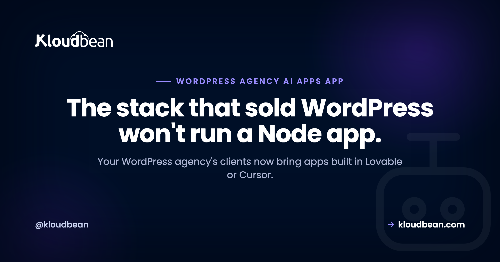
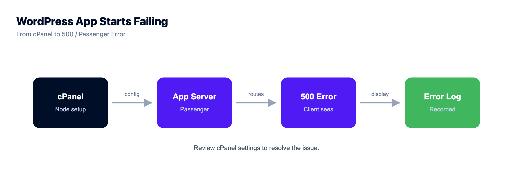

# Hosting AI-Built Apps for Clients: A WordPress Agency's New Job

By Kloudbean Engineering · The stack that sold WordPress won't run a Node app.

For a decade, a WordPress agency's whole book ran on cheap shared cPanel hosting, the kind of Hostinger or GoDaddy plan you set up in an afternoon, and that was fine. Then a client shows up with an app they built in Lovable, or Cursor, or Bolt, and it just will not start on your server. Hosting AI-built apps for clients is a genuinely different job from hosting WordPress, and pretending it isn't is how agencies burn a weekend and a client's trust. This is about why the old stack can't run the new work, and what actually can.

> **The short version.** Shared cPanel hosting is built to serve PHP one request at a time and then let the process die. AI-built apps are usually Node or Python, and they need a process that stays running: an event loop or an application server that's always on, plus a real database, environment variables, and a deploy step. That's the whole mismatch. So an agency taking on AI work doesn't have to abandon WordPress. It needs a host that runs long-running Node and Python apps and WordPress side by side. Keep the brochure sites cheap. Give the apps a real server.

## The ground shifted under the agency model

The old playbook was simple, and it paid the bills for years. Build a WordPress site, drop it on a shared cPanel plan, bill a monthly care plan. cPanel was the whole toolbox. Clients wanted brochure sites, blogs, and small WooCommerce stores, and shared hosting handled every bit of that.

Then the tools changed. Someone who can't write code can now describe an app to Lovable, Bolt, Replit, or Cursor and get working Node or Python back. Your clients are among those people. So the message landing in your inbox isn't "build me a website" anymore. It's "I built this thing, can you host it," or "can you add an AI assistant to my site." And the app won't run on the plan you've been selling them.

This isn't a fad you can wait out. The cost of building software fell through the floor, so more clients will build software. An agency that can only host PHP is going to keep saying no to work that clients are ready to pay for. The gap between "it works in Lovable" and "it's live for real users" is exactly where agencies can earn, and it's covered well in [the last mile of vibe coding](https://www.kloudbean.com/blog/last-mile-of-vibe-coding/).

## Why shared cPanel hosting physically can't run an AI-built app

This is the part worth understanding properly, because once you get it, every "why won't it start" mystery dissolves. It comes down to how the two kinds of software run.

**cPanel shared hosting is built around one model: PHP, per request.** A request arrives, the web server (Apache or LiteSpeed) hands it to a PHP interpreter, PHP builds the page, sends it back, and the process ends. Nothing stays running between requests. WordPress fits this like a glove, because WordPress is PHP and it's designed to render a page per request and then let go.

**AI-built apps don't work that way.** A Node app is a long-running process with an event loop that has to stay up and keep listening on a port. A Python app runs behind an application server like gunicorn or uvicorn that also stays up. If nothing keeps that process alive, the app simply isn't listening, and every request gets an error or a hang. This is the core of why shared hosting can't run Node: there's no place for a process to live between requests.

On top of that, the shared account is deliberately locked down, and each limit blocks something an app needs:

- **No root, no real shell.** You can't install the Node or Python version the app wants, the system libraries a dependency links against, or a process manager (PM2, systemd) to keep the app alive and restart it when it crashes.
- **No background workers or queues.** AI apps routinely push slow work (calling a model, processing an upload, sending mail) to a queue and a worker. Shared cron is thin, and there's nowhere for a persistent worker to run.
- **No streaming.** A chat-style response streams over a websocket or server-sent events held open for the duration. The per-request model closes the connection as soon as the page is sent.
- **No database you control.** You get a MySQL database wired for WordPress. The app may need PostgreSQL, or Redis for a queue or cache, or a MySQL you can actually reach on a port and tune. Not on the menu.
- **No build step, env vars, or Git deploys.** Modern apps build (a bundler, a compile step), read config from environment variables and secrets, and ship from Git. cPanel is built to receive files over FTP, not to run a build and read a secret store.
- **No GPU.** If the client wants to run their own model, that needs a GPU, and shared hosting has none. Different class of machine entirely.

None of this is a knock on cPanel. These are the classic cPanel limitations, and they exist because the platform does one job (serve PHP cheaply and safely to a lot of tenants) well. It just wasn't built for a program that has to stay alive.

*Shared cPanel hosting starts a PHP worker per request and ends it when the page is sent. An AI-built app is one process the server has to keep alive, which is the thing shared hosting can't give it.*

## The capability gap, side by side

Same idea as a checklist. Line up what each kind of project needs against what a shared plan actually provides, and the mismatch is obvious.

| Requirement | A WordPress site | An AI-built app | Shared cPanel hosting |
| --- | --- | --- | --- |
| **Runtime** | PHP | Node.js or Python | PHP only |
| **How it runs** | Per request, then exits | Long-running process, always on | Per request, then exits |
| **Keeps a process alive** | Not needed | Required (event loop / app server) | No |
| **Shell / root to install runtimes** | Not needed | Often required | No |
| **Background workers & queues** | Rarely | Common | No |
| **Websockets / streaming** | Rarely | Common (AI responses) | No |
| **Database** | Bundled MySQL | Postgres / MySQL / Redis you control | Bundled MySQL only |
| **Env vars & secrets** | Minimal | Required | Not really |
| **Build step & Git deploy** | No | Yes | No |
| **GPU for model inference** | No | Sometimes | No |

Read down the last column. Shared hosting answers "no" to almost everything the middle column needs. That's not a tuning problem you can fix with a support ticket. It's the design.

## So the client's Lovable app won't start. Here's the actual reason

Here's how it usually plays out. The client sends you a Git repo or a zip. You upload it into the cPanel account the way you'd drop in a WordPress site, point the domain at it, and open the page. You get a 500, or a Passenger error, or the tab just spins. Nothing you didn't already know is wrong with the files.

The reason is that no process is running the app. WordPress renders because PHP fires per request. The Node app needs something equivalent to `node server.js` running and staying up, listening on a port, with the web server passing traffic to it. Shared hosting has nowhere to run that command as a durable service.

Some cPanel hosts bolt on a "set up Node app" feature through Passenger. It can start a small app, and that fools people into thinking the platform supports this. Then you hit the ceilings from the last section: little memory, no real process control, no worker, no database you can shape, and it topples the moment the app is more than a demo or the server restarts. It works just well enough to become your emergency later.

<!-- ADD IMAGE: a cPanel Node setup screen or a browser showing the 500 / Passenger error when a client's app fails to start. Author-supplied screenshot, shows the failure rather than describing it. -->

## What hosting AI-built apps for clients actually needs

Flip the capability gap into a shopping list. To host client apps properly, without the hacks, you want a server or managed cloud that gives you:

- **Node and Python as first-class runtimes,** run as long-running processes, with a process manager that keeps them up and restarts them if they crash.
- **Room to install what the app depends on:** the runtime version it needs, system libraries, a queue and a worker.
- **A real database you provision and control,** PostgreSQL, MySQL, or Redis, matched to what the app was built against.
- **Environment variables and a place for secrets,** so API keys and connection strings stay out of the code and out of Git.
- **A deploy path from Git with a build step,** so shipping an update is repeatable instead of an FTP drag.
- **Staging and restorable backups,** because apps break in ways a brochure site never did.
- **Per-client isolation and scoped access,** so one client's app and their team's logins are walled off from the rest of your roster.
- **WordPress, still.** You're not throwing away the WordPress work. You want one place that runs both, so the fleet and the new apps share a home.

Notice what's not on the list: nothing exotic. This is just what any real application server has always needed. The shift is only that agencies used to be able to ignore all of it, because WordPress on shared hosting never asked for it.

## Which client project belongs where

You don't move everything. Match the project to the machine it actually needs, and a lot of your book stays exactly where it is.

| Client project | What it needs | Where it fits |
| --- | --- | --- |
| Simple brochure WordPress site | PHP, low traffic | Shared cPanel is still fine |
| Busy WooCommerce store | PHP, isolation, backups | A managed server or managed cloud |
| Node or Python app (Lovable, Cursor, Bolt) | Long-running process, database, env vars | A real server that runs Node / Python |
| Existing site plus an AI feature | Above, plus secret handling, maybe a queue | The same real server |
| Self-hosted model / inference | A GPU | A GPU server (a separate machine) |

And keep WordPress where it fits. Shared hosting isn't wrong, it's just no longer the whole toolbox. A five-page brochure site on a cheap cPanel plan is a perfectly good answer, and moving it to a bigger machine buys the client nothing. The mistake is assuming that same plan can hold everything a client now asks for. Running a fleet of WordPress sites well is its own discipline, and the [agency WordPress hosting](https://www.kloudbean.com/blog/agency-wordpress-hosting/) playbook covers that side. The [reseller hosting versus managed cloud](https://www.kloudbean.com/blog/reseller-hosting-vs-managed-cloud/) comparison covers the model choice underneath it.

## How the agency's business changes when you say yes

Taking on app work isn't only a technical move. It changes what you sell and what you owe.

The upside is real. App hosting and maintenance is a bigger, stickier line item than a WordPress care plan. You can charge for running the infrastructure, watching it, updating it, and being the person who keeps the thing alive. A client who built an app in an afternoon usually has no idea how to deploy it, secure it, or keep it running. That gap is your business, and it recurs every month.

The responsibility is real too. You're now on the hook for uptime, for runtime and dependency updates, for secrets, and for the simple fact that an app has moving parts a static site doesn't. Price for that. A Node app that talks to a database and an AI API is not a brochure site, and quoting it like one is how you lose money on your best clients. The actual deploy mechanics live in [deploying an AI-built app to production](https://www.kloudbean.com/blog/deploy-ai-built-app-to-production/), and the specific ways these apps fall over are in [why AI apps fail in production](https://www.kloudbean.com/blog/why-ai-apps-fail-in-production/).

My honest opinion: the agencies that do well over the next few years aren't the ones with the prettiest themes. They're the ones who said yes when a client walked in with an AI-built app, because that's where the budgets are drifting. An agency moving beyond WordPress on purpose is protecting its own future, not chasing a trend.

## The mistakes that cost agencies here

The same few errors show up again and again once agencies start taking app work. Worth naming so you can dodge them.

- **Forcing a Node app onto shared hosting with hacks.** Passenger tricks, a cron loop that restarts the process, running it on some odd port. It starts, it demos, then it falls over under real traffic or after a reboot, and now it's a 2am fire. If the app needs a process that stays alive, give it one instead of faking it.
- **Quoting an app at care-plan prices.** An app has a runtime, a database, secrets, and updates you own. Bill it as infrastructure, not as a website. This is the single most common way agencies underwater themselves on app work.
- **Assuming "it ran on my laptop" means it runs anywhere.** Local dev keeps the process alive for you and hands you a database and env vars automatically. Production has to be told to do all of that on purpose.
- **Skipping staging because you never needed it for a brochure site.** Apps break on a dependency bump or a config change in ways static pages don't. Test the update somewhere safe first.

## Where this runs

Everything above is host-agnostic on purpose, because the requirements are what matter. When you go shopping, you're looking for one platform that runs both your WordPress work and long-running Node and Python apps, so you're not adding a second vendor to add a capability.

Kloudbean is one option shaped like that. It runs WordPress plus Node, Python, Ruby, Java, static sites, and AI apps on managed servers across several clouds, from one dashboard, so the WordPress fleet and the new app work share a home. Per-client isolation comes from subusers and scoped User Access Control, and you get staging (for WordPress and Laravel), automatic backups, free SSL, managed databases, and Git-based deploys with build and live logs. Migration help is free if you're moving existing sites in, which the [WordPress migration guide](https://www.kloudbean.com/blog/migrate-wordpress-to-kloudbean/) walks through, and standard plans start at $8/mo (check the pricing page for current numbers). If a client specifically wants to run their own model, that's the GPU case, and [self-hosting an LLM](https://www.kloudbean.com/blog/self-host-an-llm/) covers the memory math behind it.

One honest boundary, because it decides who owns what when you're the one being paid to keep it running: the managed part covers the server, the stack, TLS, backups, and patching. The client's app code and their data stay yours and the client's to own. That line is worth putting in the contract.

<!-- cta:start -->
**Let someone else patch the server.**

The stack, the patching, SSL, and backups are handled, so your work stays on the site rather than the box. Staging is one click, and the managed database sits right next to the app.

- Managed WordPress stack
- One-click staging
- Managed MySQL and MariaDB
- Automatic backups
- Free SSL
- Built-in load balancer

[Start free](https://console.kloudbean.com/register) · [See plans](https://www.kloudbean.com/pricing/)
<!-- cta:end -->

## FAQ

**Can I run a Node app on cPanel shared hosting?**
Mostly no, not for real use. Shared cPanel is built to run PHP per request and let the process exit, while a Node app needs a process that stays running and listening on a port. Some hosts add a Node setup feature through Passenger that can start a small app, but you quickly hit limits: little memory, no real process control, no worker, and no database you control. It's fine for a demo and wrong for a client's production app.

**Why won't my client's Lovable app run on my hosting?**
Because your hosting almost certainly runs PHP for WordPress, and the Lovable app is Node or Python that needs a long-running process. On shared hosting there's nothing keeping that process alive and listening, so the app never actually starts. It isn't a broken file or a bad upload. The stack just doesn't run that kind of program.

**Do I have to leave WordPress to host AI-built apps?**
No. WordPress isn't the problem, and shared hosting is still fine for simple WordPress sites. The point is that shared hosting can't be your only tool once clients bring Node or Python apps. What you want is one host that runs WordPress and those apps together, so you add capability without dropping what already works.

**What do I need to host an AI-built app?**
A server or managed cloud that runs Node or Python as a long-running process, a process manager to keep it up, a real database you control (often PostgreSQL or Redis), environment variables for secrets, and a deploy path from Git with a build step. Staging and backups matter too, because apps break in ways brochure sites don't. If the client wants to run their own model, add a GPU server for that piece.

**Can one host run both WordPress and Node apps?**
Yes, and that's the setup most agencies want. A managed server or managed cloud can run your PHP and WordPress work and your Node or Python apps side by side, each isolated, from one dashboard. That keeps the WordPress care plans you already have and gives the new app work a real home, without juggling two vendors and two bills.

**What changes between how WordPress and a Node app run on a server?**
WordPress runs per request: the web server starts PHP, builds the page, returns it, and the process ends. A Node or Python app runs as one process that starts once and stays alive, holding an event loop or an application server, so it can answer instantly, keep websockets open, and run background jobs. Shared hosting is built for the first pattern only, which is why the second one needs a different kind of host.

**How should I price hosting for a client's AI-built app?**
Price it as infrastructure, not as a website. An app has a runtime, a database, secrets, and updates you're responsible for, so it costs more to run and maintain than a static brochure site. Many agencies charge an app hosting and maintenance fee that's separate from a WordPress care plan. Quoting an app at care-plan rates is a common way to lose money on it.

**Is shared cPanel hosting ever still the right choice?**
Yes, for what it's good at. A small brochure WordPress site or a low-traffic blog runs fine and cheap on shared cPanel. The trouble only starts when you try to make that same plan run a Node or Python app, a busy store, or an AI feature. Keep the simple sites there and give the demanding work a real server.

**What counts as an AI-built app, exactly?**
Usually it's an app a client generated with a tool like Lovable, Bolt, Cursor, Replit, or v0, which tends to output Node or Python with a database behind it. It might be a whole product or a small feature bolted onto an existing site, like a chatbot or a recommendation widget. Whatever the surface, it's real application code that needs a runtime kept alive, not a set of static pages.

**Does hosting a client's AI feature always need a GPU?**
No, and most don't. If the AI feature calls a hosted model API like OpenAI or Anthropic, it runs on an ordinary Node or Python server with no GPU involved, you just keep the API key server-side. A GPU only comes in when the client wants to self-host their own model, which is a separate, heavier piece of infrastructure.

---

*Kloudbean Engineering · Keep the brochure sites cheap, give the app a real home.*
