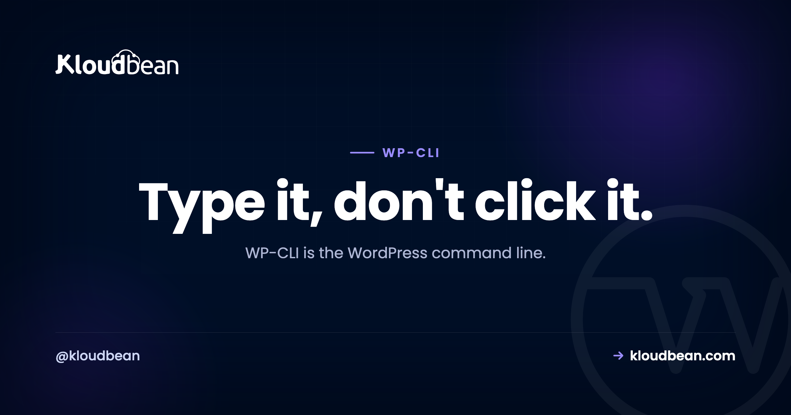

# WP-CLI Guide: Manage WordPress From the Command Line

Updating forty plugins through the WordPress admin means forty trips to a page, a lot of clicking, and a lot of waiting. The same job in WP-CLI is one line, done before your coffee's poured. That gap, clicking versus typing, is the whole reason the WordPress CLI exists.

WP-CLI is the official command-line tool for WordPress. Anything you can do in the dashboard you can do from the terminal, and the repetitive, bulk, and migration work you can do far faster. This is a working reference. What it is, where you run it, and the commands grouped by the job they do, with the one command that makes site migrations safe getting a section to itself.

> **Short answer:** WP-CLI runs WordPress tasks from the terminal instead of the dashboard: updates, users, database export, cache flush, and the migration hero `wp search-replace`. You run it over SSH on the server where the site lives, which any real (managed) server gives you. Rule one: `wp db export` before anything that changes data.

## What WP-CLI is, and why it beats the dashboard for bulk work

WP-CLI (the WordPress CLI) talks to your WordPress install directly from the command line, skipping the browser entirely. No logging in, no paginated plugin lists, no waiting for admin screens to paint. That's the speed part. The bigger part is that commands are just text, so you can chain them, loop them, drop them in a shell script, and wire them into a deploy. You go from "faster clicking" to actual automation.

Here's the difference in practice, for the jobs where it matters most:

| The job | In the dashboard | With WP-CLI |
|---|---|---|
| Update 40 plugins | Click, wait, repeat, 40 times | `wp plugin update --all` |
| Change the site URL after a move | A risky raw-SQL find and replace | `wp search-replace ... --dry-run` |
| Create 20 users | 20 separate forms | a loop over `wp user create` |
| Back up the database | Install and configure a plugin | `wp db export backup.sql` |

For a one-off post edit, none of this matters and the admin is fine. For anything bulk or repeated, the terminal wins so decisively it isn't really a contest.

```
                 Updates
              wp plugin update --all
                     |
  Migration          |          Database
 wp search-replace   |         wp db export
        \            |            /
         \           |           /
          \      +--------+     /
           ------|   wp   |-----
          /      | WP-CLI |     \
         /       +--------+      \
        /            |            \
   Cron              |             Cache
 wp cron event run   |          wp cache flush
                   Users
                wp user create
```

## Where you run WP-CLI

WP-CLI runs on the server, over SSH, so you need shell access to where WordPress actually lives. On a managed server you connect over SSH into the same environment your site is deployed in and run `wp` commands right there. It's an ordinary Linux box with WordPress on it, and you log in like any other.


Commands act on the WordPress install in whatever directory you're standing in, so run them from your site's folder, or add `--path=/var/www/html` to point WP-CLI at it. And if all you want is scheduled tasks, you don't even need SSH for that: cron jobs can be set from the Kloudbean dashboard directly, no terminal required. WP-CLI is for the hands-on work.

## The commands that earn their keep

You don't memorize WP-CLI. You keep a handful close and reach for the rest with `--help`. Grouped by the job you're doing:

### Updates: core, plugins, themes

The daily bread. Update everything without touching the admin:

```
wp core update
wp core update-db
wp plugin update --all
wp theme update --all
```

### Database: export and import

Under the hood these are a real mysqldump and restore. The export is your safety net before anything risky, and the fastest backup you can take in one line:

```
wp db export backup.sql
wp db import backup.sql
```

<!-- ADD IMAGE: terminal showing wp db export writing a .sql file, then ls confirming the file size -->

### The migration lifesaver: wp search-replace

If WP-CLI had one killer feature, this is it. When you move a site, from `staging.example.com` to `example.com`, or `http` to `https`, the old URL is scattered all through the database: posts, settings, widgets. You cannot just find-and-replace the raw SQL, because WordPress stores some data serialized, a format that records the length of each string. A naive replace changes the text but not the recorded length, and that mismatch corrupts the setting. Widgets vanish, options break.

`wp search-replace` understands serialization and fixes the lengths as it goes, so it replaces safely everywhere. Always preview with `--dry-run` first:

```
# preview: how many replacements, without changing anything
wp search-replace 'https://staging.example.com' 'https://example.com' --dry-run

# looks right? run it for real
wp search-replace 'https://staging.example.com' 'https://example.com'
```

This one command is why WP-CLI is central to a clean move. It's a big part of the [zero-downtime migration](https://www.kloudbean.com/blog/how-to-migrate-hosting-zero-downtime/) flow, and it's the safe answer to the raw-SQL replace that breaks so many sites.

<!-- ADD IMAGE: output of wp search-replace with --dry-run showing the replacement count per table -->

### Cache

One line clears WordPress's object cache, Redis included when it's wired up:

```
wp cache flush
```

It's the most reliable single "clear the cache" action there is. If a change won't show up, the [clear WordPress cache guide](https://www.kloudbean.com/blog/how-to-clear-wordpress-cache/) walks the layers, but this is the command that empties the object cache.

### Users

Create, list, and reset without the admin, which is a lifesaver when you're locked out:

```
wp user list
wp user create alice alice@example.com --role=editor
wp user update alice --user_pass='a-new-password'
```

### Cron and scheduled tasks

See what WordPress has scheduled and run due events by hand when you're debugging a stuck job:

```
wp cron event list
wp cron event run --due-now
```

### Health checks (the doctor)

Verify core and plugin files against the official checksums to catch tampering, and check the database is sound:

```
wp core verify-checksums
wp plugin verify-checksums --all
wp db check
```

That `wp db check` is handy when you're chasing a database problem, like the classic [database connection error](https://www.kloudbean.com/blog/fix-error-establishing-database-connection-wordpress/).

### The pocket reference

The commands worth keeping in a sticky note, in one place:

| Task | Command |
|---|---|
| Update core | `wp core update` |
| Update all plugins | `wp plugin update --all` |
| Install and activate a plugin | `wp plugin install <name> --activate` |
| Update all themes | `wp theme update --all` |
| Export the database | `wp db export backup.sql` |
| Import a database | `wp db import backup.sql` |
| Search and replace (preview) | `wp search-replace 'old' 'new' --dry-run` |
| Create a user | `wp user create <login> <email> --role=<role>` |
| Reset a password | `wp user update <login> --user_pass=<new>` |
| Flush the cache | `wp cache flush` |
| Verify core files | `wp core verify-checksums` |
| Read the manual for any command | `wp <command> --help` |

## A real maintenance routine, scripted

This is where the payoff lands. A weekly maintenance pass that would be a click-fest in the admin becomes a short script you run, or schedule. Back up first, then update core, plugins, and themes, then flush the cache so the fresh code is actually served:

```
#!/bin/bash
set -e
wp db export "backup-$(date +%F).sql"   # safety net first
wp core update
wp core update-db
wp plugin update --all
wp theme update --all
wp cache flush
```

Save that, and your entire update ritual is one command. Wire the same idea into your [deploy step](https://www.kloudbean.com/blog/ci-cd-auto-deploy-from-github/) and updates happen on every release without anyone remembering to click a thing. That's the real jump: not faster clicking, but no clicking.

<!-- ADD IMAGE: a terminal running the maintenance script end to end, ending with "Success: The cache was flushed." -->

## Where WP-CLI bites you, and when to just use the dashboard

The power cuts both ways. A few honest warnings from watching people get burned:

- **Commands that change data don't ask "are you sure?"** There's no confirmation dialog and no undo. `wp db export` before anything destructive isn't optional, it's the whole safety net. WP-CLI is fast, which means mistakes are fast too.
- **Never do a raw SQL find-and-replace on URLs.** It breaks serialized data and corrupts settings. That's the exact problem `wp search-replace` exists to solve, so use it.
- **Don't force everything through the terminal.** Writing a post, tweaking one setting, previewing a page? The dashboard is genuinely better for that. WP-CLI earns its place on bulk, repetitive, and migration work.

My honest take after enough of these: for anything you're doing more than twice, and for every single migration, WP-CLI beats the dashboard hands down. For the creative, one-at-a-time work, the admin is still where you want to be. Use each where it's strong.

One boundary worth stating plainly. WP-CLI needs shell access, which a managed server provides because it's a real Linux box, not a locked black box. Managed means the server, the WordPress stack, SSL, and backups are handled for you; the install and whatever you do with WP-CLI on it stay yours. If you want the deeper caching and query wins alongside this, the [speed up WordPress guide](https://www.kloudbean.com/blog/speed-up-wordpress/) and [multisite hosting guide](https://www.kloudbean.com/blog/wordpress-multisite-hosting/) pick up where the CLI leaves off.

---

**Type it, don't click it.** Run WordPress on a managed server with real SSH and WP-CLI ready, so maintenance and migrations take seconds. Start free at [kloudbean.com](https://www.kloudbean.com/), see [pricing](https://www.kloudbean.com/pricing/).

SSH + WP-CLI ready · Managed WordPress · Staging sites · Cron from the dashboard · Automatic backups · Free migration

## FAQ

**What is WP-CLI?**
WP-CLI is the official command-line interface for WordPress, sometimes called the WordPress CLI. It runs WordPress tasks from the terminal instead of the admin dashboard: updating core and plugins, managing users, exporting the database, search-and-replace, flushing caches. It's far faster for repetitive work and lets you script and automate things the dashboard can't.

**How do I run WP-CLI commands?**
You run them over SSH on the server where WordPress lives, from the site's folder, using the `wp` command (for example `wp plugin update --all`). On a managed server you connect via SSH into the same environment as your site and run commands there. Add `--path` if you're not standing inside the WordPress directory.

**What is wp search-replace used for?**
It safely changes a string throughout the WordPress database, most often the site URL during a migration or an http-to-https switch. Unlike a raw SQL replace, it handles serialized data correctly, so settings and widgets don't break. Run it with `--dry-run` first to preview the number of replacements, then run it for real.

**Is WP-CLI safe to use?**
Yes, but it's powerful and immediate. Commands that modify the database don't prompt for confirmation and there's no undo. The essential habit is to run `wp db export` before anything that changes data, so a mistake is a quick restore instead of a disaster. With that habit it's both safe and fast.

**Do I need special hosting for WP-CLI?**
You need shell (SSH) access to the server, which managed servers provide. WP-CLI is already available in most managed WordPress environments, so you connect over SSH and start running `wp` commands. Hosting with no shell access at all can't run WP-CLI directly.

**Can I run scheduled WordPress tasks without SSH?**
Yes. On Kloudbean you can set cron jobs from the dashboard, no terminal needed, which covers scheduled tasks like publishing or cleanup. WP-CLI is for interactive, hands-on work over SSH. The two complement each other: the UI for schedules, the CLI for bulk and migration jobs.

**How do I back up the database with WP-CLI?**
Run `wp db export backup.sql`, which writes a full SQL dump of your database to a file. It's the fastest one-line backup there is and the right thing to do before any risky command. To restore, use `wp db import backup.sql`. On managed hosting you also get automatic backups on top of this.

**Is WP-CLI actually faster than the dashboard?**
For bulk and repetitive work, dramatically. Updating fifty plugins is one command instead of fifty clicks, and because commands are text you can script whole routines and run them in one go. For one-off tasks like writing a single post, the dashboard is fine. The CLI wins the moment you're repeating yourself.

---

*By Kloudbean · Type it, don't click it.*
