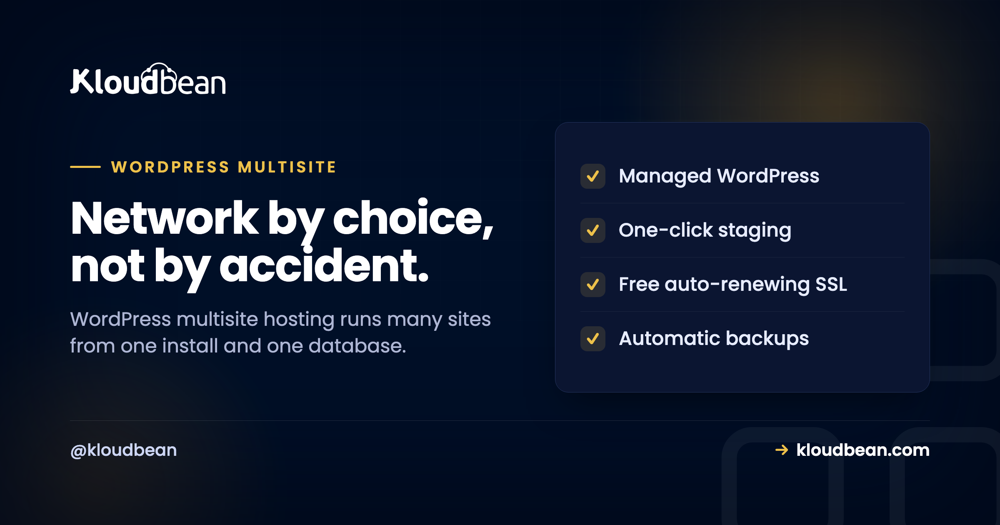

# WordPress Multisite Hosting: What It Is and Whether You Actually Want It

Someone in the room says "let's just put them all on one WordPress multisite." It sounds tidy. One login, one place to update, one set of plugins for twenty sites. And sometimes that's exactly right.

But WordPress multisite hosting quietly welds those sites together, and people flip it on because it sounds efficient, then spend a weekend trying to pull one site back out. So I'm not going to sell you on multisite. I'm going to help you decide. What it is, the subdomain-or-subdirectory fork you pick before you enable it, the theme question everyone types into Google, and when the whole idea is a trap.

> **The short version:** WordPress Multisite turns one install into a network of many sites that share one codebase and one database, run from a single Network Admin. Use it when the sites genuinely belong together and one team owns them (a university's departments, a chain's locations, a brand's regions). Avoid it for unrelated sites, especially an agency's separate clients, where separate installs are far saner. The rule: if the sites should share a fate, network them. If they should live and die on their own, keep them apart.

## What WordPress Multisite actually is

A normal WordPress install runs one site. **Multisite** flips a switch in `wp-config.php` and turns that single install into a *network* of many sites, all running on the same WordPress core files, the same pool of themes and plugins, and (this is the part that decides everything) **the same database**. You run the whole thing from one extra dashboard called the **Network Admin**, and each site inside the network is a "subsite."

So a subsite isn't a separate WordPress. It's a set of extra tables (`wp_2_posts`, `wp_3_posts`, and so on) inside one shared database, served by one shared codebase. That single fact is where all the upside and all the risk come from. Update once, and it's updated everywhere. Break once, and you've broken everywhere. Hold that thought.

<!-- ADD IMAGE: diagram comparing multisite (one install and one database fanning out to subsites that share a fate) against separate isolated installs -->

```
MULTISITE                          |  SEPARATE INSTALLS
One WordPress install              |  Client A: WP + own DB
 + one shared MySQL database       |  Client B: WP + own DB
     |     |     |                 |  Client C: WP + own DB
   Dept A  Dept B  Dept C          |
   [ ---- shared fate ---- ]       |  independent backups,
   a bad update or breach          |  updates, scaling, exit
   can hit every subsite           |  (isolated by design)
```

## Subdomain or subdirectory? Choose before you enable it

The first real fork in multisite comes before you've added a single site, and you can't casually change it later. Your subsites get URLs in one of two shapes:

- **Subdomains:** `dept-a.example.com`, `dept-b.example.com`. Cleaner separation, but the server needs a **wildcard DNS record** (`*.example.com`) and a **wildcard SSL certificate** so every subsite is covered.
- **Subdirectories:** `example.com/dept-a`, `example.com/dept-b`. Simpler DNS and SSL (it's all one domain), but every site lives under one hostname.

You set this up by adding a line to `wp-config.php`, then finishing setup in the Network Admin:

```php
/* Turn a normal install into a network */
define( 'WP_ALLOW_MULTISITE', true );

/* Then, after Tools > Network Setup writes it:
   true  = subdomains   (needs wildcard DNS + wildcard SSL)
   false = subdirectories */
define( 'SUBDOMAIN_INSTALL', true );
```

My honest steer: pick **subdirectories** unless you have a reason not to. It sidesteps wildcard DNS and wildcard SSL entirely, and free SSL from your host just covers the one domain. Go subdomains when each site really needs to feel like its own hostname, or you're mapping custom domains per site anyway. Either way, decide now, because flipping it after you've got live subsites means URL surgery you don't want.

<!-- ADD IMAGE: the Tools then Network Setup screen where you choose subdomains or subdirectories before creating the network -->

## The question everyone asks: one theme or multiple?

This one comes up constantly, so here's the plain answer. A multisite network can absolutely use **multiple themes, and each subsite can run its own**. You install a theme once and "network-enable" it, which just makes it *available*; then each subsite picks which of the available themes it actually wears. Dept A can look nothing like Dept B.

What's shared is the *library* of installed themes and plugins. What's per-site is the *choice*, the settings, and the content. Plugins work the same way: network-activate one so it runs everywhere, or leave it available for individual sites to switch on themselves. The "you're stuck with one identical theme across the whole network" idea is just a myth. Different look per subsite is the normal case.

## Multisite vs separate installs, side by side

The tradeoff lives in this table. Read it as "shared is a feature" on the left and "shared is a liability" on the right, and notice which column your situation keeps landing in.

| | WordPress Multisite | Separate installs |
| --- | --- | --- |
| **Central updates** | Update core, themes, plugins once for all | Update each site (automatable, but N times) |
| **Per-site isolation** | None: shared code and database | Full: nothing bleeds between sites |
| **Plugin flexibility** | Shared pool; wildly different needs clash | Each site runs whatever it wants |
| **Backups & restore** | Whole network at once; one subsite is fiddly | Per site, restore one without touching others |
| **Move or sell one site** | Painful extraction project | Hand over one install, done |
| **Scale one busy site** | Can't isolate it from the rest | Give that one site more resources |
| **Best for** | Related sites, one owner, shared design | Unrelated sites, separate clients or futures |

## Use multisite when the sites share a fate

Multisite shines when the sites genuinely belong together and one team owns them. In these cases the shared foundation is the point, not a compromise:

- **They're variations of one thing.** A university with a site per department, a franchise with a site per location, a company with a site per region. Same broad design, same plugin needs, same owner.
- **One team runs all of them.** You want to patch a plugin once and have every site get it, manage users centrally, and keep the whole network consistent without repeating yourself.
- **Users span the network.** The same people work across several subsites, so a shared user table is a convenience rather than a leak.

When that describes you, multisite saves real, repetitive work, and the fact that the sites move together is a feature you're choosing on purpose. A big network like this isn't small, though, so size the hosting for the whole thing. The [scalable WordPress hosting](https://www.kloudbean.com/blog/scalable-wordpress-hosting/) ladder applies to a busy network just as it does to one busy site.

## Skip multisite when the sites are really separate

Same shared foundation, flipped into a liability. If the sites shouldn't be joined at the hip, joining them is a mistake you'll pay for later:

- **They're independent clients.** Different owners, different billing, one might churn next quarter. Pulling a client's site out of a network is a genuine project, not a click.
- **They need clashing plugins.** A plugin one site depends on and another can't tolerate fights the shared model. Someone always loses.
- **One site dwarfs the rest.** A single high-traffic subsite drags on shared resources, and you can't give just that one more room.
- **A single site might be sold or moved.** If independence is even on the table, start independent. It's far cheaper than retrofitting it.

> **Running client sites?** This is the big one. A pattern we see is an agency stuffing 20 unrelated clients into one network because it looked efficient, then a single bad plugin update takes all 20 down at once, or one client asks to leave and extraction eats a weekend. For that job, look at the [agency WordPress hosting](https://www.kloudbean.com/blog/agency-wordpress-hosting/) playbook and how [reseller hosting compares to managed cloud](https://www.kloudbean.com/blog/reseller-hosting-vs-managed-cloud/). Separate installs, or a server per client, usually wins.

## Managing subsites from the command line

Once a network gets past a handful of sites, the browser stops being the fast way to run it. WP-CLI treats the network as scriptable, which is where multisite management actually gets pleasant. A few of the ones you'll reach for:

```bash
# List every subsite in the network
wp site list

# Create a new subsite
wp site create --slug=dept-d --title="Department D"

# Run a command against ONE subsite
wp plugin update --all --url=dept-a.example.com

# Update plugins across the WHOLE network
wp plugin update --all --network

# Export one subsite's tables (start of an extraction)
wp db export --tables=$(wp db tables --url=dept-a.example.com --format=csv)
```

That last one hints at the truth about "just pull one site out": it's an export, a URL search-and-replace, and a rebuild of that site's uploads, not a button. The full command set is in the [WordPress CLI guide](https://www.kloudbean.com/blog/wordpress-cli-guide/), and you drive all of it over SSH on a managed server.

<!-- ADD IMAGE: the Network Admin Sites list showing several subsites, or a terminal running wp site list -->

## What a WordPress multisite network needs from hosting

Here's where WordPress multisite hosting stops being a WordPress topic and becomes an infrastructure one. Because every subsite lives in the *same* database and runs on the *same* codebase, your entire network is, from the server's point of view, a single WordPress application. That has three consequences worth planning around.

First, **backups cover the whole network at once**. Great for consistency, less great when you want to roll back just one subsite, so know that going in. Second, **the database grows with every site you add**, so a large network wants a [managed MySQL database](https://www.kloudbean.com/blog/managed-mysql-hosting/) sized for the network, not for one blog. Third, **every subsite shares the server's CPU, RAM, and PHP workers**, so a spike on one is felt by all.

<!-- ADD IMAGE: the console launching a managed MySQL database sized for a whole WordPress multisite network -->

On Kloudbean the network runs as one managed WordPress application on the cloud you pick, with [automatic backups](https://www.kloudbean.com/blog/server-backups-guide/), free SSL, staging, and Shorewall plus Fail2ban hardening handled for you. You add the managed MySQL database beside it and give the server room to breathe. It's a Linux and PHP stack, and "managed" here means the server, WordPress, SSL, backups, and patching are handled while your sites and their content stay yours. If a client ever does need to move out, the content is yours to export, and [migrating a site](https://www.kloudbean.com/blog/how-to-migrate-hosting-zero-downtime/) is a known, supported path rather than a hostage situation.

<!-- ADD IMAGE: the managed WordPress multisite application in the hosting dashboard, running as one app on one server -->

## Where multisite quietly bites

Be clear-eyed about the flip side of "update once." Because the sites share core, plugins, and a database, they share risk too. A security hole in a network-active plugin exposes every site at the same time. A bad update breaks the network, not one page. If the install goes down, all the sites go down together. You update once, but you also *fail* once, across everything.

And extraction is the one that catches people. Getting a single subsite out of a network is a real migration: export its tables, rewrite URLs, move its uploads, and stand it up as a fresh install. For a network of related sites you control, that risk is a fine trade for the convenience. For a pile of unrelated client sites, it's a bad one, and separate installs would have kept you free. That's the whole decision, really. Not "is multisite good" but "should these particular sites share a fate?"

---

**Network them, or keep them separate. On purpose, either way.** Run a WordPress multisite network or a set of independent installs on hosting sized for the whole picture at [kloudbean.com](https://www.kloudbean.com/). Plans on [pricing](https://www.kloudbean.com/pricing/).

Managed WordPress · Managed MySQL · Staging · Automatic backups · Free SSL · Free migration · Free trial

## FAQ

**What is WordPress Multisite?**
It's a mode that turns one WordPress installation into a network of many sites, all sharing the same core files, the same theme and plugin library, and the same database. You run it from an extra dashboard called the Network Admin, and each site is a "subsite." That shared foundation is what makes it efficient and what ties the sites together.

**Is WordPress Multisite one theme or multiple themes?**
Multiple. Each subsite can run its own theme. You network-enable themes to make them available across the network, then each site chooses which one it uses. The library of installed themes is shared, but the choice and settings are per site, so subsites can look completely different from one another.

**Should I use subdomains or subdirectories for multisite?**
Subdirectories (example.com/site) are simpler because DNS and SSL cover one domain. Subdomains (site.example.com) need a wildcard DNS record and a wildcard SSL certificate. Pick subdirectories unless each site truly needs its own hostname or you're mapping custom domains per site. You choose this at setup and it's hard to change once you have live subsites.

**When should I use WordPress Multisite?**
When you have many related sites, run by one team, that should be managed and updated together: a franchise with a site per location, an organization with a site per department, or regional variants of one brand. It saves repetitive work when the sites genuinely share design, plugins, and ownership.

**When should I avoid Multisite?**
When the sites are really independent: different clients, clashing plugin needs, one much bigger than the rest, or any chance you'll sell or move one. Because subsites share a database and core, separating one later is a real project, and a network-wide plugin flaw or bad update hits every site at once.

**Can I move a single site out of a multisite network?**
Yes, but it's a migration, not a click. You export that subsite's tables, rewrite its URLs, move its uploads, and stand it up as its own WordPress install. It's very doable, which is why it's a supported path, but the effort is exactly why unrelated sites are better kept separate from the start.

**Should an agency use multisite for client sites?**
Usually not. Unrelated clients don't share a fate, so a shared codebase and database work against you: one bad update can affect everyone, and a client who leaves triggers an extraction. Separate installs or a server per client keep clients isolated and easy to hand over. See the agency hosting playbook for the pattern that scales.

**What hosting does a WordPress multisite network need?**
The whole network runs as one WordPress application on one database, so backups and resources cover the entire network at once and the database grows with every subsite. Size the server and a managed MySQL database for the network rather than a single site, since all subsites share the same CPU, memory, and PHP workers.

---

*By Kloudbean · Network by choice, not by accident.*
