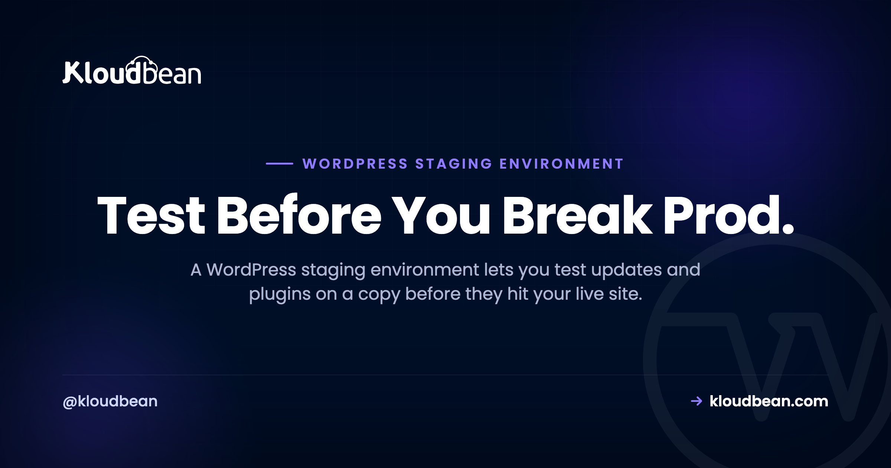

# WordPress Staging Environment: Test Changes Before They Break Your Live Site

*By the Kloudbean Team · Test Before You Break Prod.*

You updated a plugin on the live site because it was "just a quick one." Thirty seconds later the homepage is a blank white screen and the checkout won't load, in front of every visitor you have.

A WordPress staging environment exists to stop exactly that. It's a private, near-identical copy of your live site where you test updates, plugins, themes, and redesigns safely, then push the changes across once you know they actually work. This guide covers what a WordPress staging site is, how it differs from your laptop, the clone-test-push workflow direction by direction, and the one database gotcha that quietly wrecks live stores. Then how to create a WordPress staging site on Kloudbean in a couple of clicks.

> **The short answer**
>
> A WordPress staging environment is a private copy of your live site for testing changes before they go public. The workflow is: clone the live site to staging, make and test your changes there, then push to production. One caveat bites stores hard. Pushing the staging database overwrites the live one, so on an active store you push code and files, not the database.

## What a WordPress staging environment is

A WordPress staging environment is a separate, private copy of your live website, running the same WordPress install, theme, plugins, and content, where you can make and test changes without any of them reaching real visitors. Think of it as a rehearsal stage. Same script, same set, no audience.

The key word is copy. Staging mirrors production closely enough that if a change works on staging, you can trust it will work live. You break things there on purpose, watch what happens, fix them, and only then move the change to the site people actually see. It's the difference between a dress rehearsal and opening night with no rehearsal at all.

People sometimes confuse staging with local development, the copy of WordPress you run on your own laptop. They're related, not the same. Local dev runs on your machine, with your PHP version, your operating system, your setup. Staging runs on the same server and stack as production, so it catches the environment-specific problems local can't: the exact PHP version, the real database, the server's caching layer, file permissions, all of it. A plugin can pass on your Mac and still fall over on the live Linux box. Staging is where you find that out before your customers do.

## Why editing a live WordPress site is playing with fire

Let me be blunt. Editing a live WordPress site directly is one of the most common ways people take their own site down. Not hackers. Not a hosting outage. A well-meaning admin clicking Update on a Tuesday afternoon.

Here's what actually goes wrong. A plugin update ships a bug and the site returns the white screen of death, a blank page with no message, because a fatal PHP error killed the request. A theme update overwrites a customization and the layout collapses. Two plugins that were fine yesterday now fight over the same hook, and the checkout button stops responding. A core update bumps a PHP requirement your server hasn't met. Any one of these can land the instant you click Update, and if you clicked it on production, it lands in front of every visitor on the site right then.

For a store, the timing is worse than the outage itself. Updates don't wait for quiet hours. "I'll just quickly update this" at 2pm is how a Tuesday turns into a lost afternoon of sales and a panicked scramble to roll back. The fix is almost embarrassingly simple. Don't test on the thing customers are using. Test on a copy first.

> **The tell:** if your plan for a risky update is "update it, then refresh the homepage to check," you're testing on production. That refresh is your customers' experience too.

## Staging vs production: what's actually different

Same site, opposite jobs. Production is the real thing: indexed by Google, taking orders, the source of truth for your data. Staging is the safe sandbox. The distinction that trips people up is the data one, so hold that thought for the gotcha section below.

|  | Staging | Production (live) |
| --- | --- | --- |
| **Who sees it** | Only you and your team | Real visitors and customers |
| **Purpose** | Test changes safely | Serve the actual site |
| **Search engines** | Blocked, kept out of the index | Indexed and ranking |
| **When it breaks** | Nobody notices | Lost traffic, lost sales |
| **The data** | A snapshot from clone time | Live and always changing |
| **Good for** | Updates, redesigns, experiments | Being live and trusted |

## The staging workflow: clone, test, push

Every staging workflow is three moves: clone, test, push. Get these straight and staging stops being scary.

**1. Clone (live to staging).** You copy the live site, both files and database, into the staging environment. Now staging is an exact snapshot of production as it was at that moment. This direction is safe. You're only reading from live, never changing it.

**2. Test (on staging).** This is the whole reason staging exists. Update plugins, themes, and WordPress core. Bump the PHP version. Try a redesign, a new checkout flow, a performance tweak. Click around like a suspicious customer. Break it, fix it, break it again. Nothing you do here touches the live site or its visitors.

**3. Push (staging to live).** Once you've confirmed the changes work, you move them to production. This is the direction that needs care, because "push" can mean push files, push the database, or both, and those are very different in their consequences. That's the next section, because it's the part that causes real damage.

<!-- DIAGRAM: The clone, test, push loop. A navy LIVE SITE box (real visitors, real orders) on the left and a purple STAGING COPY box (private, safe to break) on the right. Step 1, a green CLONE arrow carries files and database from live to staging (read-only from live). Step 2, a purple TEST loop sits above staging for updates, PHP, and redesign. Step 3, a PUSH arrow returns from staging to live: code, themes, and plugins are safe to push, but a red warning marks that pushing the database OVERWRITES live orders and customers. -->

*Clone and test are safe. On the push back to live, code is safe to move, but pushing the staging database overwrites the live one. That is the edge to watch.*

<!-- ADD IMAGE: A WordPress admin showing the environment badge switch from Live to Staging. -->

## The gotcha nobody warns you about: pushing the database

Here's the part most tutorials skip, and it's the part that actually costs people data. When you push staging to live, you're moving two very different things: files and the database. They behave nothing alike.

**Files are your code:** themes, plugins, WordPress core, uploaded media. Pushing files to production is generally safe, because your code is meant to be identical in both places. You tested the new plugin version on staging, so pushing that plugin's files to live is exactly what you want.

**The database is a different animal.** It holds your content and your live, changing data: posts, pages, settings, and on a store, every order and every customer. When you push the staging database to production, it doesn't merge. It overwrites. The live database gets replaced with the staging one, wholesale.

Now walk the timeline. You cloned to staging on Monday. You spent three days testing a redesign. On Thursday you push. If you push the staging database, you've just replaced Thursday's live database, with three days of fresh orders, new customers, and comments, with Monday's snapshot. Those three days of real data are gone. On an active store, that isn't a bug. It's a genuine disaster, and people do it by accident all the time.

So the rule for a live site, especially a store, is simple: push code and files, not the staging database. You tested the plugin and theme changes, so push those. Leave the live database alone, because it's the one holding the real orders. The only time you push the database is when staging is the source of truth for content too (a full redesign with new pages on a site that isn't taking orders in the meantime), and even then you take a backup first and you accept that you're overwriting live content on purpose.

What if you did make content or settings changes on staging that you need live, and the live database also moved on? Now you're in merge territory, and there's no clean automatic answer. Usually you reapply those specific changes on live by hand, or you schedule the push for a genuinely quiet window and re-clone right before it. Annoying, yes. A lot less annoying than deleting Thursday's orders. If your themes and plugins live in Git, you can sidestep the whole mess by treating code like code and shipping it through a pipeline, which is exactly what [auto-deploy from GitHub](https://www.kloudbean.com/blog/ci-cd-auto-deploy-from-github/) is for. The database stays out of it entirely.

> **Running a store?** Treat the live database as sacred. Push plugin and theme files from staging, never the staging database, unless you've confirmed no orders or signups landed since you cloned. When in doubt, back up live first. Stores lean on this even harder, which is why we go deeper in [WooCommerce hosting](https://www.kloudbean.com/blog/woocommerce-hosting/).

## What to test on staging (and the one rule)

Anything risky goes to staging first. The usual suspects:

- **Plugin, theme, and core updates.** The single most common cause of a broken WordPress site. Update on staging, click through the pages that matter, then push the files.
- **PHP version bumps.** Moving from PHP 7.4 to 8.x can break older plugins that use removed functions. Staging tells you which ones before it takes the live site down.
- **New checkout or payment flows.** On WooCommerce, run the full path to a completed order in test mode on staging. A broken checkout you catch on staging costs nothing. One you catch on production costs sales you'll never see.
- **Redesigns and theme changes.** Rebuild the layout, preview it properly, get sign-off, then ship it in one clean move instead of editing the live site in front of visitors for a week.
- **Performance work.** Caching config, database tweaks, a new optimization plugin. Measure it on staging, then apply. The full playbook is in [speed up WordPress](https://www.kloudbean.com/blog/speed-up-wordpress/).
- **Anything you'd describe as "I think this will work."** If you're not sure, that uncertainty is the definition of a staging job.

One rule covers all of it: never test on production what you can test on staging. If a change can be rehearsed safely, rehearse it. Production is for serving, not experimenting.

## Staging is not a backup

A quick warning, because people lean on staging like it's a safety net and it isn't one. Staging is a copy you make on purpose to test on. It is not a backup, and it won't save you if you overwrite your live database or the server has a bad day.

Two different tools, two different jobs. Staging is proactive: rehearse a change before it goes live. Backups are reactive: restore a known-good version after something has already gone wrong. You want both. And the habit that ties them together is boring and absolute. Take a fresh backup of the live site right before you push anything to it. If the push goes sideways, you restore in minutes instead of rebuilding by hand at midnight. We wrote the full [server backups guide](https://www.kloudbean.com/blog/server-backups-guide/) on doing this properly: automatic, stored off the server, and with a restore you've actually tested.

## How to create a WordPress staging site on Kloudbean

Now the practical part: how to create a WordPress staging site without wiring any of this together yourself. On Kloudbean, staging for WordPress (and Laravel) is built in, and has been since 2024. You don't install a staging plugin or hand-clone databases over SSH at 11pm. You do it from the dashboard.

The shape of it: launch WordPress as an application on a managed server, then create a staging copy from the app's staging screen. Kloudbean spins up a separate copy on the same stack as production, so it catches the environment-specific issues local dev on your laptop would miss. You make your changes on staging, verify them, then push back.

*Create a staging copy of a live WordPress site, test on it, then push changes back, all from one screen.*

Because WordPress is a first-class stack here (alongside WooCommerce), the app comes tuned and hardened, with free auto-renewing SSL and a managed MySQL or MariaDB database that's secured, kept off the public internet, and backed up. Adding the application is a few clicks, not an afternoon.

*Add WordPress (or WooCommerce) as an application. From there, its staging copy is one click away.*

When you push, you choose what moves. And I'll repeat the honest caveat here, because a slick button doesn't change the underlying reality: pushing files (your plugin, theme, and code changes) is the safe, everyday move. Pushing the database overwrites the live one. That's not a Kloudbean quirk. It's how WordPress data works everywhere, on every host and every staging plugin. On an active store, push your tested code and leave the live database alone unless you're certain nothing new landed since you cloned.

<!-- ADD IMAGE: The push-to-live step showing the files-only versus files-plus-database choice. -->

Take a backup first, regardless. Automatic backups are on by default, and a restore is self-serve from the same dashboard, so a bad push is a quick rollback rather than a support ticket and a cold sweat.

*Take a fresh backup before any push to live. Restores are self-serve if a change misbehaves.*

Everything sits in one dashboard next to your other apps, databases, and storage, with one login and one bill. If you're moving an existing site over first, the safe pattern is in our [zero-downtime migration](https://www.kloudbean.com/blog/how-to-migrate-hosting-zero-downtime/) guide, and the wider setup is covered in [managed WordPress hosting](https://www.kloudbean.com/blog/managed-wordpress-hosting/). If you're still weighing where to run all this, the [best managed cloud hosting](https://www.kloudbean.com/blog/best-managed-cloud-hosting/) rundown lays out the options plainly.

<!-- ADD IMAGE: A pre-push checklist: test on staging, back up live, push files not database, verify live. -->

---

**Rehearse the risky stuff. Then ship it.**

Built-in WordPress staging, plus the backups and managed database that make pushing to live a non-event. Start at [kloudbean.com](https://www.kloudbean.com/), and check current plans on [pricing](https://www.kloudbean.com/pricing/).

One-click WordPress staging · Automatic backups · Free auto-renewing SSL · Managed MySQL & MariaDB · Free migration · Free trial

## FAQ

### What is a WordPress staging environment?

A WordPress staging environment is a private, near-identical copy of your live site where you can test changes before they reach real visitors. It runs the same WordPress, theme, plugins, and content as production, so if something works on staging you can trust it live. You use it to rehearse updates, redesigns, and experiments safely. Nothing you do on staging affects the live site until you deliberately push it.

### How do I create a WordPress staging site?

You create a staging site by cloning your live site, files and database, into a separate environment. On managed hosts like Kloudbean, staging for WordPress is built in, so you click to create a copy from the dashboard rather than hand-cloning over SSH. Once the copy exists you make and test your changes there, then push the ones that work back to production. The clone step only reads from live, so creating staging never puts your live site at risk.

### What is the difference between staging and production?

Production is your real, live website: indexed by search engines, seen by visitors, and the source of truth for your data and orders. Staging is a private copy that only you and your team can see, meant purely for testing. Changes on staging have zero impact on visitors until you push them. The trickiest difference is the data: staging holds a snapshot from the moment you cloned, while production keeps changing as customers use it.

### How do I push a staging site to live?

Pushing means moving your tested changes from staging to production, and you usually get to choose whether you push files, the database, or both. For most updates you push files (your themes, plugins, and code) because those are what you changed and tested. You generally leave the live database alone, since it holds newer real data. Always take a fresh backup of the live site right before you push, so you can roll back fast if anything misbehaves.

### Will pushing staging overwrite my orders?

It can, and this is the mistake that causes real damage. Pushing the staging database to production overwrites the live database rather than merging it, so any orders, customers, or comments created since you cloned would be replaced by the older staging snapshot. On an active store, push your tested code and files and leave the live database alone. Only push the database when you are certain no new data landed on live since the clone, and back up first.

### Is a staging site a backup?

No. Staging is a copy you create to test on, not a saved restore point, and it will not save you if you overwrite your live database. Backups are the safety net: automatic, stored off the server, and restorable to a known-good state. Use both. Take a fresh backup right before every push to live so a bad change becomes a quick restore instead of a rebuild.

### How do I test plugin updates safely?

Update the plugin on staging first, then click through the pages and flows that matter, especially checkout on a store. If the update breaks something, you fix or skip it with zero impact on visitors. Once it checks out, push the plugin files to production. This one habit prevents most of the surprise white-screen outages that come from updating live.

### Is staging the same as a local development site?

They are related but not identical. Local development runs on your own machine, with your operating system and PHP setup, which can differ from the server. Staging runs on the same server and stack as production, so it catches environment-specific issues local dev can miss, like the exact PHP version, the real database, or server caching. Many teams use both: local for building, staging for a final production-like check.

### Does Kloudbean have WordPress staging?

Yes. Staging for WordPress (and Laravel) is built into Kloudbean and has been since 2024, so you create a staging copy, test on it, and push changes from the dashboard. It sits alongside automatic backups, free auto-renewing SSL, and managed MySQL or MariaDB, all in one place. The database-overwrite caveat still applies, because that is how WordPress data works everywhere, so push code and files to a live store and leave its database alone unless you are sure.

---

*Kloudbean · Test Before You Break Prod.*
