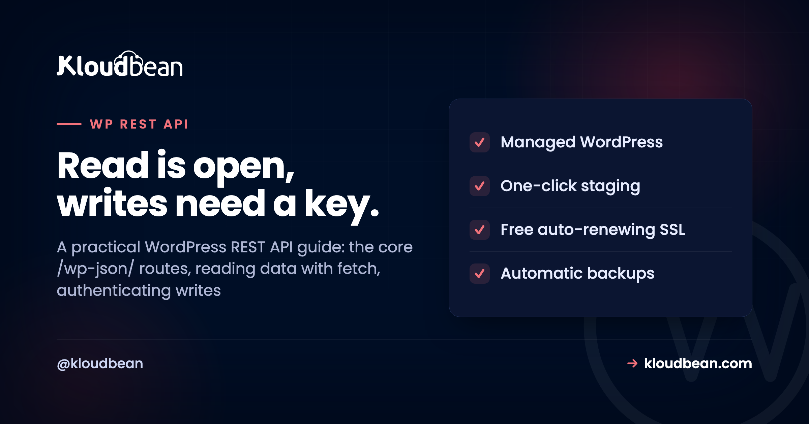
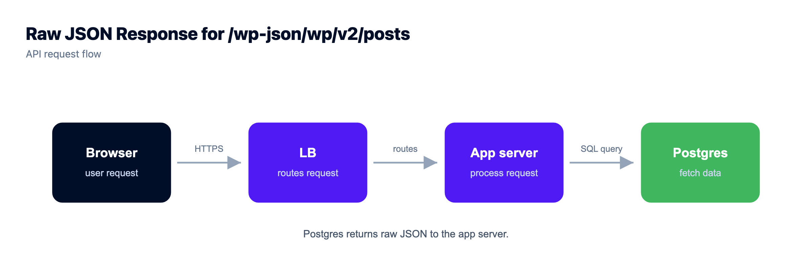
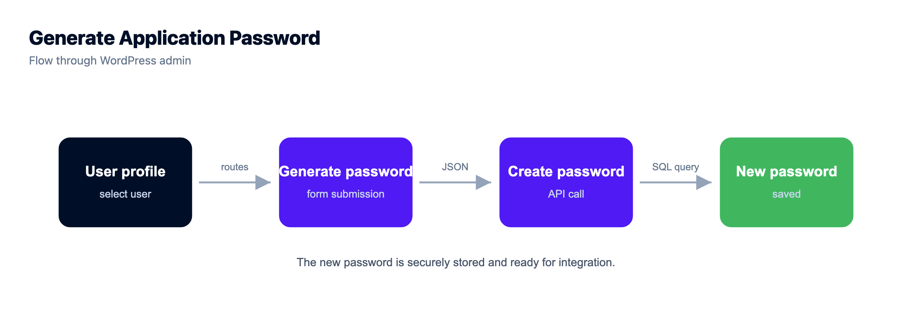
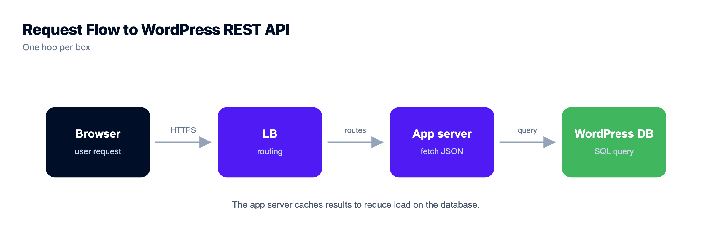

# The WordPress REST API: How to Read, Write, and Extend /wp-json/

The WordPress REST API has been sitting on your site since WordPress 4.7, quietly ready to hand your content to anything that speaks HTTP. A Next.js front end, a mobile app, a nightly cron script, a Zapier zap. Open `/wp-json/wp/v2/posts` in a browser right now and you'll probably see your posts as JSON.

This is the hands-on reference, not the architecture lecture. Deciding whether to go headless at all? The [headless WordPress hosting](https://www.kloudbean.com/blog/headless-wordpress-hosting/) guide is for that call. This one is the API itself: the routes, real read and write code, how authentication works, how to add your own endpoints, and how to keep it from leaking.

> **The short version:** The WordPress REST API exposes your content as JSON under `/wp-json/`, with core routes at `/wp-json/wp/v2/`. Reading public content needs no auth: a plain `GET /wp/v2/posts` works in the browser. Writing (create, update, delete) needs authentication, and the modern built-in method is **Application Passwords** sent as an HTTP Basic header. For same-origin admin JavaScript, use the cookie plus nonce. Add your own routes with `register_rest_route`, and always give them a real `permission_callback`.

## What the WordPress REST API is

It's a way for *other software* to read and write your WordPress content over HTTP, as clean **JSON** instead of rendered HTML. It hands a *program* the raw content (posts, pages, users, categories, media) as structured data it can do anything with. It's built into core, so every modern WordPress site already serves it at `/wp-json/`. No plugin, no setup.

Two request styles cover almost everything you'll do. You **GET** data to read it, openly if it's public. You **POST** (or `PUT`/`DELETE`) to change it, with credentials. The diagram below is the whole mental model.



```
CLIENT                         WORDPRESS
browser / Next.js              /wp-json/wp/v2
curl / cron / script           posts, pages, media, users

  --- GET /wp/v2/posts ------------>  public read, no auth -> 200 + JSON
  --- POST /wp/v2/posts ----------->  Authorization: Basic base64(user:app-pw)
                                      auth required -> 201, or 401 if missing
                                            |
                                          MySQL
```

## The core routes you'll actually use

The built-in content lives under `/wp-json/wp/v2/`. You'll spend most of your time on a handful of these. Public content reads without auth; drafts, private data, and any write need it.

| Route | What it returns | Auth to read? |
| --- | --- | --- |
| `/wp-json/` | The API index: every route the site exposes | No |
| `/wp/v2/posts` | Posts (add `/123` for one) | No for published, yes for drafts |
| `/wp/v2/pages` | Pages | No for published |
| `/wp/v2/media` | Media library items and their URLs | No for attached, mostly |
| `/wp/v2/categories`, `/tags` | Taxonomy terms | No |
| `/wp/v2/comments` | Comments | No for approved |
| `/wp/v2/users` | Authors (a public subset of fields) | Listing can be restricted |
| `/wp/v2/settings` | Site settings | Yes, always |

## Reading data: real fetch examples

Reading is the easy half, and genuinely as simple as hitting a URL. The plainest possible request:

```
GET https://example.com/wp-json/wp/v2/posts
```

That returns the 10 most recent posts as a JSON array. A few query parameters do most of the real work. `per_page` defaults to 10 and maxes out at 100. `_fields` trims the payload to just what you need. `_embed` pulls in related data like the featured image and author in one round trip. And `search=term` or `categories=7` filter the list:

```js
// Latest 5 posts, only the fields we care about
const res = await fetch(
  'https://example.com/wp-json/wp/v2/posts?per_page=5&_fields=id,title,link'
);
const posts = await res.json();

// One post by ID, with its featured image embedded
const one = await fetch(
  'https://example.com/wp-json/wp/v2/posts/123?_embed'
).then(r => r.json());
```

One thing that trips people up: there are more posts than the array shows. Total counts come back in response *headers*, not the body. Read `X-WP-Total` and `X-WP-TotalPages`, then page through with `?page=2`. If you request `per_page=500` hoping to grab everything at once, WordPress caps you at 100 and you'll quietly miss the rest.



## Authenticating writes with Application Passwords

Reading public content is open. **Changing** anything is not, and that's exactly right. The modern, built-in way to authenticate a script or a server is **Application Passwords**, added in WordPress 5.6. A user generates a dedicated password for one app under *Users, Profile, Application Passwords*, separate from their login and revocable on its own. Requests made with it act as that user, with their role and capabilities, so an editor's application password can create posts but can't manage users.

You send it as an HTTP **Basic** auth header. From the command line that's just the `-u` flag:

```bash
curl -X POST https://example.com/wp-json/wp/v2/posts \
  -u "editor:xxxx xxxx xxxx xxxx xxxx xxxx" \
  -H "Content-Type: application/json" \
  -d '{"title":"Posted from the API","status":"draft"}'
```

From JavaScript you build the same header yourself. But read the next sentence before you paste this into a React component: this belongs on a **server**, never in browser code, because anyone can open dev tools and read the password.

```js
// SERVER-SIDE ONLY. Never ship an app password to the browser.
const auth = Buffer.from('editor:xxxx xxxx xxxx xxxx xxxx xxxx').toString('base64');

await fetch('https://example.com/wp-json/wp/v2/posts', {
  method: 'POST',
  headers: {
    'Authorization': 'Basic ' + auth,
    'Content-Type': 'application/json'
  },
  body: JSON.stringify({ title: 'Posted from Node', status: 'draft' })
});
```

Two other methods exist, for two other jobs. For JavaScript running *inside* wp-admin (same origin), WordPress uses your login cookie plus a **nonce** sent as an `X-WP-Nonce` header (WordPress hands it to your script via `wpApiSettings.nonce`). For third-party apps acting for other users, **OAuth** or **JWT** via a plugin is the usual route. For server-to-server work, Application Passwords are the simplest thing that's actually secure, and my default.



## Creating, updating, and deleting content

Once you're authenticated, writing is a matter of the HTTP verb. Create with a `POST` to the collection, update with a `POST` to a single item (WordPress accepts partial updates, so send only what changed), and remove with a `DELETE`:

```bash
# Create a published post
curl -X POST https://example.com/wp-json/wp/v2/posts \
  -u "editor:APP_PASSWORD" -H "Content-Type: application/json" \
  -d '{"title":"Launch day","content":"<p>We are live.</p>","status":"publish"}'

# Update just the title of post 123
curl -X POST https://example.com/wp-json/wp/v2/posts/123 \
  -u "editor:APP_PASSWORD" -H "Content-Type: application/json" \
  -d '{"title":"Updated title"}'

# Send it to the trash
curl -X DELETE https://example.com/wp-json/wp/v2/posts/123 \
  -u "editor:APP_PASSWORD"
```

Every field you can set in the editor has an equivalent here: `categories`, `tags`, `featured_media`, `slug`, and custom fields you've registered. That's what makes scripted publishing and content migrations possible without touching the admin.

## Registering your own endpoint (and the footgun to avoid)

The built-in routes are a starting point, not a ceiling. When your project needs data the defaults don't expose, you register a custom route with `register_rest_route`, in a plugin or your theme's `functions.php`:

```php
add_action('rest_api_init', function () {
  register_rest_route('myplugin/v1', '/status', array(
    'methods'             => 'GET',
    'callback'            => 'myplugin_status',
    'permission_callback' => '__return_true', // fine ONLY for public, read-only, non-sensitive data
  ));
});

function myplugin_status() {
  return array('ok' => true, 'time' => current_time('c'));
}
```

Now the honest warning, and I'll say it plainly because it's the mistake we see most: **never leave `permission_callback` set to `__return_true` on a route that writes or returns anything sensitive.** An empty or always-true callback means your endpoint is wide open to the entire internet. WordPress will even log a notice about a missing `permission_callback`, because it's that common a slip. For anything that mutates data or exposes private info, gate it with a real capability check:

```php
register_rest_route('myplugin/v1', '/orders', array(
  'methods'             => 'POST',
  'callback'            => 'myplugin_create_order',
  'permission_callback' => function () {
    return current_user_can('edit_posts'); // real check, not __return_true
  },
));
```

## Securing the WordPress REST API

The API is on by default, and some of it is public by design, so security here is about configuration, not panic. Get these right and you're in good shape:

- **Serve everything over HTTPS.** An Application Password sent over plain HTTP is a password in the open. Free SSL makes this a non-issue, so there's no excuse.
- **Authenticate every write, with least privilege.** Use an application password tied to the lowest role that can do the job. Don't automate as an administrator when an editor will do.
- **Mind the users endpoint.** `/wp/v2/users` can list author usernames, which is real reconnaissance for a brute-force attempt. If you don't need it public, restrict it.
- **Never return secrets.** A custom endpoint should hand back only what the caller is allowed to see. API keys, tokens, and private fields don't belong in a JSON response.
- **Put a `permission_callback` on every custom route.** See above. This is the single most common REST mistake.
- **Rate-limit or lock down if it's abused.** If a public endpoint gets hammered, throttle it or gate it behind auth.

None of this means disabling the API. Fighting a core feature usually breaks the block editor and the plugins that lean on it. Leave it on, secure it properly, and treat it like the backend surface it is. The broader picture is in [secure WordPress hosting](https://www.kloudbean.com/blog/secure-wordpress-hosting/).

## REST API or WPGraphQL?

Both feed a headless front end. The REST API is built in and organized as fixed endpoints: call `/posts`, get the standard post fields. **WPGraphQL** (a plugin) lets the client ask for exactly the fields it wants in one request, handy for a complex page that would otherwise fire several REST calls. Neither wins outright. Start with REST because it's zero-setup, and reach for GraphQL only when your pages are query-heavy enough to justify the plugin. The [headless WordPress guide](https://www.kloudbean.com/blog/headless-wordpress-hosting/) weighs that choice in full.

## How the REST API fits your stack

When the API powers a front end or an app, treat WordPress as the backend it now is. The consumer (a [Next.js app](https://www.kloudbean.com/blog/deploy-nextjs-app-to-your-own-server/) or a [full-stack React app](https://www.kloudbean.com/blog/deploy-fullstack-react-app-to-production/)) should read the WordPress base URL from an environment variable, never hard-coded, so you can point staging and production at different sites without editing code.

<!-- ADD IMAGE: storing the WordPress REST API base URL as an environment variable in the consumer app -->

The WordPress side is ordinary managed hosting, with two things that matter more once the API is busy: HTTPS, because authenticated traffic must be encrypted, and capacity, because an API feeding a front end handles real request volume. It runs on managed PHP with a [managed MySQL database](https://www.kloudbean.com/blog/managed-mysql-hosting/) behind it, and you resize the server as traffic grows.

<!-- ADD IMAGE: the WordPress server that answers REST API requests, sized for real request volume -->

Prefer the terminal for debugging content? WP-CLI reads and writes the same data, covered in the [WordPress CLI guide](https://www.kloudbean.com/blog/wordpress-cli-guide/). The boundary is the usual one: a Linux stack where the platform manages the server, PHP, SSL, and backups, while your content and its API stay yours. The REST API just makes that content reachable by more than a browser.

<!-- ADD IMAGE: a front-end app rendering content it pulled from the WordPress REST API, next to the JSON it fetched -->

<!-- cta:start -->
**Managed stack, staging, and backups.**

Run WordPress and WooCommerce on a managed server with a staging site, automatic backups, free auto-renewing SSL, and a managed MySQL or MariaDB beside it. Pick the cloud and the region yourself.

- Managed WordPress stack
- One-click staging
- Managed MySQL and MariaDB
- Automatic backups
- Free SSL
- Built-in load balancer

[Start free](https://console.kloudbean.com/register) · [See plans](https://www.kloudbean.com/pricing/)
<!-- cta:end -->

## FAQ

**What is the WordPress REST API?**
It's a built-in interface that lets other software read and write your WordPress content over HTTP as JSON, rather than as rendered web pages. It exposes posts, pages, users, media, and more under `/wp-json/`, and it's what powers headless WordPress, mobile apps, and integrations that need WordPress content as structured data.

**Where is the WordPress REST API located?**
At `/wp-json/` on your site, with the core content routes under `/wp-json/wp/v2/`. Visiting `/wp-json/` returns the API index, a list of every route the site exposes. It's enabled by default in WordPress core since version 4.7, so you don't install or turn anything on.

**How do I get posts from the WordPress REST API?**
Send a GET request to `/wp-json/wp/v2/posts`, which returns the latest posts as JSON. Add an ID like `/posts/123` for one post, use `per_page` (max 100) to control how many, and `_fields` to trim the response. Total counts come back in the `X-WP-Total` and `X-WP-TotalPages` response headers.

**How do I authenticate WordPress REST API requests?**
Use Application Passwords, built into WordPress since 5.6. A user generates a dedicated password for one app, and you send it as an HTTP Basic auth header. Requests act as that user with their role's permissions, and you can revoke a single application password without touching the login. For same-origin admin JavaScript, use the cookie plus an X-WP-Nonce header instead.

**What are Application Passwords in WordPress?**
They're per-application passwords, separate from a user's login, created under Users, Profile, Application Passwords. Each one can be named and revoked independently, so an integration that's retired or compromised is disabled with a single click. They're the recommended way to authenticate server-to-server REST API requests.

**How do I create a post through the REST API?**
Send an authenticated POST to `/wp-json/wp/v2/posts` with a JSON body containing fields like title, content, and status. Update a post by POSTing to `/posts/123` with only the fields that changed, and delete it with a DELETE to the same URL. You authenticate with an Application Password as a Basic header.

**How do I add a custom REST API endpoint?**
Call `register_rest_route` inside a `rest_api_init` action, giving it a namespace, a route, the HTTP methods, a callback, and a permission_callback. The callback returns the data you want as an array or WP_REST_Response. Always set a real permission_callback; leaving it as `__return_true` on a write or sensitive route exposes it to everyone.

**Is the WordPress REST API a security risk?**
Not inherently. Read endpoints expose content that's already public, and writes require authentication. Secure it with the basics: serve everything over HTTPS, authenticate writes with least-privilege Application Passwords, restrict the users endpoint if you don't need it public, never return secrets, and put a permission_callback on every custom route.

**Should I disable the WordPress REST API?**
Usually no. The block editor and many plugins rely on it, so disabling it outright tends to break things. If you're worried about exposure, restrict specific endpoints or require authentication rather than turning the whole API off. For most sites the right move is to leave it on and configure it well.

**Should I use the REST API or GraphQL for headless WordPress?**
Start with the built-in REST API. It needs no setup and handles straightforward content needs well. Consider WPGraphQL (a plugin) when your pages pull many different pieces of data in one request, where asking for exactly the fields you want in a single call is more efficient. For most sites, REST is enough.

---

*By Kloudbean · Read is open, writes need a key.*
