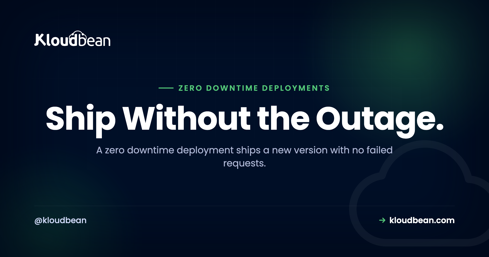

# Zero Downtime Deployment: How to Ship Without an Outage

By Kloudbean · Ship Without the Outage.

A zero downtime deployment means you ship a new version and not one user sees an error while you do it. No 503, no spinner that never resolves, no "we'll be right back" page. The naive way to deploy breaks that promise: you stop the old version, start the new one, and every request in the gap fails. This is how teams actually deploy without downtime. We'll cover the three real strategies (rolling, blue-green, canary), then the parts people quietly get wrong: health checks, graceful shutdown, and the database migration that takes you down even when your code is perfect.

> **The short version.** A zero downtime deployment ships a new version without a single failed request. The trick is overlap: never stop the old version before the new one is proven up. Run more than one instance behind a load balancer, only route traffic to an instance once its health check passes, drain the old ones gracefully so in-flight requests finish, and keep every database migration backward compatible. Rolling, blue-green, and canary are three ways to sequence that overlap. Pick the simplest one your app needs.

## Why do normal deploys cause downtime?

Picture the simplest possible deploy. Stop the app, swap the files, start it again. Clean, obvious, and it has a hole in the middle. Between "old process stopped" and "new process serving," nobody answers requests. If the new version boots in 150ms you might get away with it. Apps rarely boot that fast.

Real boots are slow. The process starts, opens a database pool, warms a cache, maybe runs a migration, loads config, then finally binds the port. That's a few seconds. Every request in that window gets a connection refused or a 503.

The worse case is a crash on startup: a missing environment variable, a bad config value, a half-finished migration. The old version is already gone and the new one won't come up, so the gap never closes. One typo, full outage. Zero downtime means never letting the count of healthy instances hit zero, so you keep the old version serving until the new one is proven and taking traffic. Every strategy below arranges that overlap.

## What is a zero downtime deployment, exactly?

Here's a definition you can quote. A zero downtime deployment is a release where the new version starts serving and the old version stops in an overlapping sequence, so at every instant at least one healthy instance is handling requests. Traffic shifts from old to new without a break.

Three things make that work, and you need all three: more than one place to run the app with a load balancer in front, a real health check so the balancer knows who's ready, and changes that are safe to run side by side, because for a moment both versions are live against the same database. Miss one and "zero downtime" quietly becomes "downtime, occasionally."

<!-- ADD IMAGE: a timeline of a naive deploy: old version stops, a red gap of failed requests, then the new version becomes healthy. Beside it, an overlapping deploy where the red gap is gone. -->

## Blue-green vs rolling deployment (and where canary fits)

Three strategies are worth knowing. They all overlap old and new. They differ in how much extra hardware they need and how fast you can undo a bad release. The comparison first, then the detail.

| Strategy | How it works | Extra capacity | Rollback | Best when |
| --- | --- | --- | --- | --- |
| Recreate (naive) | Stop the old version, then start the new one | None | Redeploy, more downtime | Local dev only. The outage baseline. |
| Rolling | Replace instances a few at a time behind a load balancer | A little headroom | Roll the previous build back through | Most production apps |
| Blue-green | Two full environments, flip traffic once the new one is verified | Double, briefly | Flip back to the old environment, near instant | Risky releases, you want instant undo |
| Canary | Send a small share of traffic to the new version, watch it, then ramp | A little | Route the slice back to stable | Catching a bad release early, at scale |

### Rolling deployment

Rolling is the workhorse, and it's what most teams should reach for first. You run several instances behind a load balancer. To deploy, you pull one instance from the pool, put the new version on it, wait for its health check, add it back, then move to the next. Old and new run together for the length of the rollout. It's cheap: no second environment, just enough headroom to lose one instance and keep serving. The catch is that mixed versions are live at once, so the new version has to be backward compatible with the old, same schema, responses the old front end can still read. Rollback is the roll in reverse.

### Blue-green deployment

Blue-green trades money for a cleaner switch. You keep two full environments. Blue is live. You deploy the new version to green, which sits idle, smoke-test it privately, then point the load balancer at green and all traffic moves in one motion. Blue stays warm and untouched. That's the whole point: if green misbehaves, flip back to blue and you're on the old version in seconds. The cost is real, you pay for two environments during the cutover. And the database is usually shared between blue and green, so schema changes still need care. Blue-green makes the app cutover instant. It does not make your migrations safe. People forget that and get burned.

### Canary deployment

Canary catches a bad release before it reaches everyone. You run the new version alongside the stable one and route a small slice of traffic to it, say 1 to 5%. Watch error rates, latency, logs. Healthy? Ramp to 25%, then 50%, then everyone. Ugly? Route the slice back to stable and only a sliver of users ever felt it. Canary is the most demanding of the three. It needs traffic splitting and, more important, monitoring good enough to make an honest go or no-go call. If you can't see the canary's error rate climb, you're not running a canary, you're running two versions and hoping.

<!-- DIAGRAM: blue-green deployment. Users -> load balancer. Blue environment ran the previous version and is now idle but kept warm for rollback. Green environment runs the new version, is verified, and receives all live traffic (solid green arrow). A dashed arrow to blue shows no traffic. A flip arrow between them labels rollback as switching traffic back to blue. Caption: the database is shared between blue and green, so schema changes still have to be backward compatible. Brand colors navy #000f27, purple #4F1AF3, green #40b75f. -->

## The health check is the whole game

Every strategy leans on one thing: the load balancer must never send traffic to an instance that isn't ready. That decision is the health check, and getting it honest is what separates a real zero downtime deployment from a hopeful one.

The trap is a lazy check. Plenty of apps expose `/health` as a route that returns 200 the instant the process starts. But the process starts before the app is usable: the database pool isn't connected, the cache is cold, config hasn't loaded. The balancer sees 200, marks the instance healthy, sends real users in, and they hit errors. You built a health check that lies.

Make it honest. A readiness check returns 200 only when the app can actually serve a request, usually including a quick database ping. Worth separating two ideas: liveness means the process is alive and shouldn't be killed, readiness means it's ready for traffic. During a deploy, readiness gates the cutover. The balancer runs that check on a schedule and routes only to instances that pass, the same mechanism that survives a bad node in normal operation. If that's new to you, the [plain-English load balancer explainer](https://www.kloudbean.com/blog/cloud-load-balancer-explained/) walks through how health checks pull a node from rotation.

## Graceful shutdown and connection draining

Health checks bring new instances up safely. The other half is taking the old ones down without dropping anyone: graceful shutdown on the app side, connection draining on the balancer side.

When it's time to retire an instance, the orchestrator sends it a `SIGTERM`. If your app dies instantly, every in-flight request gets cut off. So catch `SIGTERM`, stop accepting new connections, let active requests finish, close the database pool, then exit. The balancer drains in parallel: it stops sending new requests, waits for existing ones up to a timeout, then removes the instance. The shape of it in Node and Express:

```js
const server = app.listen(process.env.PORT);

// SIGTERM arrives when the platform wants this instance to go away.
process.on('SIGTERM', () => {
  // Stop taking new connections, let in-flight requests finish.
  server.close(() => {
    // Then close the DB pool and exit cleanly.
    pool.end(() => process.exit(0));
  });

  // Safety net: if a request hangs, do not block the deploy forever.
  setTimeout(() => process.exit(1), 10000).unref();
});
```

Two details. `server.close()` refuses new connections but lets active ones drain, which is what you want. And the timeout isn't optional: without it, one stuck request holds the whole deploy hostage. On Node with PM2 running multiple workers, `pm2 reload` restarts them one at a time so there's always a live worker, a genuine zero downtime reload on a single server. The full Express path is in the [deploy an Express app guide](https://www.kloudbean.com/blog/deploy-express-app/), and closing the pool cleanly ties into [how connection pooling works](https://www.kloudbean.com/blog/database-connection-pooling/).

<!-- ADD IMAGE: a deploy log showing the old instance receiving SIGTERM, draining in-flight requests, then exiting, while the new instance reports healthy. -->

## The part nobody warns you about: database migrations

This is the section I wish more guides led with, because it's where a zero downtime deployment most often falls apart, and the code is usually fine. The problem is the database.

During a rolling or blue-green deploy, old and new run at once against the same database. Say your release renames a column from `name` to `full_name`. The migration runs, and every old instance still serving traffic breaks instantly, because it's querying a column that no longer exists. You didn't take the app down. The migration did.

The rule: schema changes must be backward compatible, and destructive ones get split across deploys. The pattern is expand and contract (also called parallel change). Never rename or drop in one shot. Expand, migrate, contract, over separate releases:

```sql
-- Release 1, EXPAND: add the new column, nullable. No rewrite of old rows.
ALTER TABLE users ADD COLUMN full_name text;
-- Ship code that WRITES both name and full_name, still READS name.
-- Old instances only know name, and name is untouched, so they're fine.

-- Between releases, BACKFILL in batches so you don't lock the table.
UPDATE users SET full_name = name WHERE full_name IS NULL LIMIT 5000;
-- repeat until no rows remain

-- Release 2: ship code that READS full_name, still writes both.

-- Release 3, CONTRACT: nothing reads name anymore, so it's safe to drop.
ALTER TABLE users DROP COLUMN name;
```

Yes, it's more steps than a one-line rename. That's the price of changing a live schema with no maintenance window, and there's no shortcut that's also safe. Same shape for the rest. Adding a column? Make it nullable or give it a default, never `NOT NULL` with no default on a big table mid-deploy. Removing one? Stop reading it, ship, then drop it later. Changing a type? Add the new column, dual-write, backfill, switch, drop.

One more thing that bites at scale. Some migrations take a lock. Adding an index on a large table can block writes for its duration, a little outage of its own. On PostgreSQL, `CREATE INDEX CONCURRENTLY` avoids the heavy lock, and you batch backfills instead of one giant `UPDATE`. The [database migration guide](https://www.kloudbean.com/blog/database-migration-pg_dump-mysqldump/) covers moving data during a cutover. The anti-pattern to memorize: the most common zero downtime deploy failure isn't a code bug, it's a migration written as if only the new version were running.

## Always have a rollback

However careful the deploy, sometimes the new version is just bad. Slow, wrong, throwing errors under real load in a way staging never showed. A mature deploy process isn't one where this never happens. It's one where going back is boring.

Blue-green gives the cleanest rollback there is: flip traffic to the environment that was live a minute ago. For rolling and everything else, rollback means redeploying the previous known-good build, which is why a deployment history that maps each deploy to a commit earns its keep. You pick the last green one and redeploy. Feature flags add another layer: ship code in a dormant state and turn it on later, so you kill a bad feature by flipping a flag instead of running a whole deploy.

The uncomfortable part: rolling back code is easy, rolling back a destructive migration is not, because the data may already be gone. That's the second reason expand and contract matters. Every step is reversible right up until that final `DROP COLUMN`, so a bad release almost always rolls back at the code layer with the schema left alone. Plan the rollback before you deploy, not while the site is down, and if you want the order of operations spelled out, see [how to roll back a deployment safely without losing data](https://www.kloudbean.com/blog/roll-back-a-deployment-safely/).

## Do you actually need blue-green? An honest take

Here's an opinion, because teams over-build this. Most apps do not need canary releases and full blue-green on day one. I've watched people wire up elaborate traffic-splitting for an app serving a few hundred people a day. Effort in the wrong place.

For most teams this is enough: a rolling deploy behind a load balancer, an honest health check that pings the database, graceful shutdown, and backward-compatible migrations. That covers something like 95% of what production apps need, and it costs almost nothing beyond a little headroom. Canary earns its place when a bad release is genuinely expensive and you have the monitoring to judge one slice against another. Blue-green earns its when you need instant rollback and can afford double capacity for a few minutes. Add sophistication when a real incident asks for it, not because a conference talk did. Don't build a deployment platform you don't need.

## How to deploy without downtime on Kloudbean

Kloudbean doesn't ship a magic "zero downtime" button, and you should be a little suspicious of anyone who claims one. Zero downtime is a property of how you sequence a release, not a checkbox. What a platform gives you is the primitives. Here's what's there and how each maps to the strategies above.

**Managed CI/CD from Git.** Connect your repo and every push builds and deploys on the server, with the build log streaming live and a deployment history you can scroll back through. That history is your rollback: pick the last good commit and redeploy. It's also where you run migrations as part of the deploy so schema and code travel together. Full setup in the [auto-deploy from GitHub guide](https://www.kloudbean.com/blog/ci-cd-auto-deploy-from-github/).


**The built-in Flexible Load Balancer.** This is the horizontal primitive behind rolling and blue-green. It's built into every account, off by default, enable it when you need it. Put your instances in an application pool and the balancer runs health checks and routes only to healthy members, with SSL managed at the balancer and access logs. Health-gated cutover across instances is exactly what a rolling deploy needs, and it's the switch you flip for blue-green.


**PM2 multi-process for Node.** On a Node app, `pm2 reload` restarts your workers one at a time so there's always a live worker serving, a real single-server zero downtime reload with no load balancer required.

**Staging to verify first.** The safest deploy is one you already tested. Kloudbean has staging sites for WordPress and Laravel, so you can rehearse a release before it touches production. For other stacks, run a staging copy as [another app on the server you already own](https://www.kloudbean.com/blog/host-multiple-apps-one-server/), with its own database and env vars. And since a crash-on-boot from a missing value is such a common way to turn a deploy into an outage, get your [environment variables done right](https://www.kloudbean.com/blog/environment-variables-done-right/) before you lean on any automation.

One honest boundary. True autoscaling and Kubernetes-style orchestration are enterprise and custom-setup territory, not a standard-account toggle. For most teams that's fine, because a fixed pool behind the load balancer, deployed with rolling releases and backward-compatible migrations, is all a zero downtime deployment actually requires.

<!-- ADD IMAGE: a deployment history list with the current green deploy at the top and an older successful deploy below it, ready to redeploy as a rollback. -->

> **A calm deploy checklist.** Run more than one instance behind the load balancer. Make the health check ping the database, not just return 200. Handle `SIGTERM` and drain in-flight requests. Split every destructive migration into expand, backfill, contract. Keep the previous build one redeploy away. Rehearse on staging. That's a zero downtime deployment without any exotic tooling.

**Ship the new version without the outage.** Deploy from Git with a live build log and a rollback that's one redeploy away, put your instances behind a built-in load balancer with health checks, and rehearse on staging first. Start at [kloudbean.com](https://www.kloudbean.com/) and check server sizes on [pricing](https://www.kloudbean.com/pricing/).

Managed Git deploys · Deployment history · Built-in load balancer · Health checks · Staging · Free migration · Free trial

## FAQ

**What is a zero downtime deployment?**
It's a release where the new version starts serving and the old version stops in an overlapping sequence, so at every instant at least one healthy instance is handling requests. Users never hit a gap. You get there by running more than one instance behind a load balancer, gating traffic on health checks, and keeping database changes backward compatible.

**What is the difference between blue-green, rolling, and canary?**
Rolling replaces instances a few at a time behind a load balancer, so old and new run together, and it needs almost no extra capacity. Blue-green keeps two full environments and flips traffic once the new one is verified, which gives near-instant rollback but needs double capacity briefly. Canary sends a small share of traffic to the new version, watches its error rate, then ramps up, which is best for catching bad releases early but needs good monitoring.

**How do I deploy without downtime?**
Never let the number of healthy instances hit zero. Run at least two instances behind a load balancer, bring the new version up and only send it traffic after its health check passes, and drain the old instances gracefully so in-flight requests finish. Keep every schema change backward compatible so both versions can share the database during the overlap.

**How do I handle database migrations during a zero downtime deploy?**
Use expand and contract. Add new structure without removing the old, deploy code that writes to both, backfill the data, switch reads to the new column, and only drop the old column in a later release once nothing uses it. Never rename or drop a column in the same deploy that's still rolling, because the old version is still querying the old schema and breaks the moment the migration runs.

**What is connection draining and graceful shutdown?**
Graceful shutdown is the app catching SIGTERM, refusing new connections, letting in-flight requests finish, closing its database pool, then exiting. Connection draining is the load balancer side: it stops sending new requests to an instance and waits for existing ones to complete before removing it. Together they retire an old instance without dropping anyone mid-request. Always add a timeout so a hung request can't block the deploy forever.

**Why does a health check matter so much for zero downtime?**
Because it's what tells the load balancer an instance is actually ready, not just started. A lazy check that returns 200 the moment the process boots will route users to an app whose database isn't connected yet, and they get errors. A good readiness check returns 200 only when the app can truly serve a request, usually including a quick database ping.

**How do I roll back a bad deploy?**
With blue-green, flip traffic back to the environment that was live a minute ago. Otherwise redeploy the previous known-good build, which is easy when your deployment history maps each deploy to a commit. Remember that rolling back code is simple but rolling back a destructive migration is not, which is why you split schema changes into reversible steps.

**Do I need blue-green for a small app?**
Usually no. For most apps a rolling deploy behind a load balancer, with an honest health check, graceful shutdown, and backward-compatible migrations, covers what you need and costs very little. Reach for blue-green when you want instant rollback and can afford double capacity briefly, and for canary when a bad release is expensive and you have the monitoring to judge it.

By Kloudbean · Ship Without the Outage.
