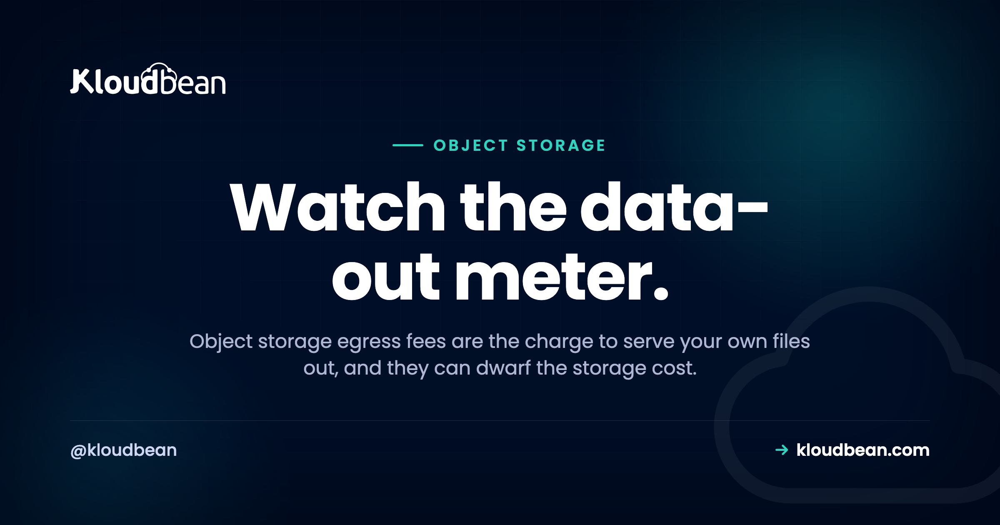

# Egress Fees: Why Downloading Your Own Files Can Cost a Fortune

The storage line on last month's cloud bill was three dollars. The bandwidth line was three hundred. Same files, same bucket. So what happened?

You paid **egress fees**. Egress is the charge many clouds apply for data leaving their storage, and object storage egress fees are one of the most misread costs in hosting because the number that gets advertised (cheap per-gigabyte storage) has almost nothing to do with the number that lands on the invoice. Let's take egress apart: what it is, the math that catches people out, why the big providers charge it, and what "zero egress object storage" actually changes.

> **Short answer:** Egress is the fee for data leaving your storage, every image loaded, video streamed, or backup restored. It's usually free to upload (ingress) and metered to serve out (egress). Because egress scales with traffic, it often becomes the biggest line on a storage bill. Some object storage doesn't meter egress at all, Kloudbean's built-in S3-compatible storage among them, so the bill reflects what you store, not how popular you get. Estimate your data-transfer-out before you pick a store, not after the bill.

## What "egress" actually means

Two directions of data movement matter here, and only one of them usually costs money:

- **Ingress** is data going in. Uploading files to a bucket. This is almost always free.
- **Egress** is data going out. Files downloaded, served to visitors, streamed, or copied to another region or provider. This is what commonly gets metered, often billed as "data transfer out."

So egress is the cost of actually *using* the files you stored. Every time an image loads on your site, a customer downloads an invoice, or a video plays, bytes leave the bucket and the meter ticks. And traffic is the entire reason you keep the files, so the cost is coupled to your success in the most irritating way possible.

<figure>
  <svg viewBox="0 0 720 350" width="100%" role="img" aria-labelledby="egress-title" xmlns="http://www.w3.org/2000/svg">
    <title id="egress-title">Data is cheap to put into a bucket and metered to pull out, which creates lock-in</title>
    <rect x="0" y="0" width="720" height="350" fill="#ffffff"></rect>
    <path d="M300 96 h120 l-14 150 h-92 z" fill="#000f27"></path>
    <ellipse cx="360" cy="96" rx="60" ry="15" fill="#16233f"></ellipse>
    <text x="360" y="180" text-anchor="middle" fill="#ffffff" font-family="Poppins,sans-serif" font-size="15" font-weight="600">Object</text>
    <text x="360" y="200" text-anchor="middle" fill="#ffffff" font-family="Poppins,sans-serif" font-size="15" font-weight="600">storage</text>
    <text x="70" y="120" fill="#2f9d4e" font-family="Poppins,sans-serif" font-size="14" font-weight="600">Your uploads</text>
    <path d="M70 150 H298" stroke="#40b75f" stroke-width="3" fill="none" marker-end="url(#in)"></path>
    <text x="150" y="140" fill="#2f9d4e" font-family="Poppins,sans-serif" font-size="13" font-weight="600">Ingress (in): free</text>
    <text x="560" y="120" fill="#4F1AF3" font-family="Poppins,sans-serif" font-size="14" font-weight="600">Users / CDN / restores</text>
    <path d="M422 150 H650" stroke="#4F1AF3" stroke-width="3" fill="none" marker-end="url(#out)"></path>
    <text x="560" y="140" fill="#4F1AF3" font-family="Poppins,sans-serif" font-size="13" font-weight="600">Egress (out): metered $</text>
    <ellipse cx="512" cy="176" rx="16" ry="6" fill="#4F1AF3"></ellipse>
    <ellipse cx="512" cy="169" rx="16" ry="6" fill="#6b3df6"></ellipse>
    <ellipse cx="512" cy="162" rx="16" ry="6" fill="#8a63f8"></ellipse>
    <text x="512" y="166" text-anchor="middle" fill="#ffffff" font-family="Poppins,sans-serif" font-size="12" font-weight="700">$</text>
    <rect x="150" y="270" width="420" height="52" rx="12" fill="#f6f7fb" stroke="#e6e9f2"></rect>
    <text x="360" y="293" text-anchor="middle" fill="#000f27" font-family="Poppins,sans-serif" font-size="13.5" font-weight="600">Cheap to put data in. Metered to get it out.</text>
    <text x="360" y="311" text-anchor="middle" fill="#5b6a86" font-family="Poppins,sans-serif" font-size="12.5">That asymmetry is the data-gravity lock-in.</text>
    <defs>
      <marker id="in" markerWidth="10" markerHeight="10" refX="7" refY="3" orient="auto"><path d="M0 0 L7 3 L0 6 Z" fill="#40b75f"></path></marker>
      <marker id="out" markerWidth="10" markerHeight="10" refX="7" refY="3" orient="auto"><path d="M0 0 L7 3 L0 6 Z" fill="#4F1AF3"></path></marker>
    </defs>
  </svg>
  <figcaption>Ingress is free, egress is metered. The gap between the two is what makes stored data expensive to move once it's in.</figcaption>
</figure>

## The math that surprises people

Make it concrete with commonly-seen big-cloud figures (roughly, as typically priced). Say storage runs about **$0.02 per GB per month** and egress about **$0.09 per GB**. Now you store **100 GB** of media, and over a month it gets served ten times over, so 1,000 GB leaves the bucket. That's a popular gallery, or a few videos with real viewership:

| Cost line | How it's counted | Monthly cost |
| --- | --- | --- |
| Storage (100 GB) | 100 GB × $0.02 | $2 |
| Egress (1,000 GB served) | 1,000 GB × $0.09 | $90 |
| **Total** | | **$92** |

Look at the split. The storage you thought you were paying for is $2. The egress you weren't thinking about is $90, more than 97% of the bill. Push the traffic up (a post goes viral, a video library gets busy, a download takes off) and egress runs into the hundreds or thousands while the storage line barely moves. The advertised per-gigabyte price told you almost nothing about what you'd actually pay.

<!-- ADD IMAGE: a simple bar chart, a short storage bar next to a tall egress bar for the same files -->

## Why the big clouds charge for it in the first place

It's a fair question, and there are two honest answers sitting on top of each other. One, moving data across a global network genuinely costs money, so some transfer pricing is real infrastructure cost. Two, and this is the part worth naming, egress is a retention tool. It's cheap to move data *into* a hyperscaler and pricey to move it *out*, which quietly discourages you from leaving. The industry even has a name for it: **data gravity**. The more data you accumulate in one cloud, the more it costs to move elsewhere, so you tend to stay and keep adding. That's not a conspiracy, it's just how the incentives line up. Understanding it is how you avoid getting stuck.

## The pushback: zero egress object storage

Enough people got burned that a category grew up around fixing it. Zero egress object storage (and its low-egress cousins) simply don't meter data leaving the bucket, or cap it generously. A couple of options that take this approach:

- **Kloudbean** doesn't charge egress on its built-in S3-compatible object storage, so serving your files out never turns into a transfer bill, and the buckets sit in the same dashboard as your servers, databases, and apps.
- **Backblaze B2** offers free egress up to a generous multiple of what you store, which covers most real workloads.

Run the same 1,000 GB scenario against a store that doesn't bill egress and the shape of the bill changes completely:

| Cost line | Egress-billed cloud | Zero / low-egress store |
| --- | --- | --- |
| Storage (100 GB) | $2 | about $2 |
| Egress (1,000 GB) | $90 | $0 |
| **Total** | **$92** | **about $2** |

The bucket behaves identically. Same S3 API, same tools, same objects. The only difference is that the bandwidth-out meter isn't running, so the bill reflects what you store rather than how popular you got. For anything media-heavy or download-heavy, that's the difference between a rounding error and a real line item.

<!-- ADD IMAGE: a cloud bill or cost breakdown with the data-transfer-out line circled next to a tiny storage line -->

## When egress bites hardest

Egress hurts most in exactly the situations you'd reach for object storage in the first place:

- **Media and video.** Large files, served constantly. High egress by nature.
- **Frequent downloads.** Installers, datasets, exports, anything users pull again and again.
- **CDN origin.** Every time your CDN misses its cache and fetches from the origin bucket, that's egress. A global audience means many origin pulls.
- **Backup restores.** Pulling a big backup out to restore it is egress, so the day you most need the backup is the day it costs the most on an egress-billed store. Worth remembering when you plan a [backup strategy](https://www.kloudbean.com/blog/server-backups-guide/).

## How to think about it before you pick a store

My honest advice: treat data-transfer-out as a first-class number, not a footnote. Before you commit to any storage, estimate roughly how many gigabytes will leave the bucket per month (visitors times page weight, downloads times file size) and price that against the egress rate. If the answer is scary, you've got options short of switching. A [CDN](https://www.kloudbean.com/blog/speed-up-wordpress/) in front of the bucket caches files at the edge so the origin is hit far less often, which cuts origin egress. Compressing files and serving right-sized images trims the gigabytes going out. Neither eliminates egress, but both soften it while you weigh a move. If serving files out is central to what you do, a zero or low-egress store is worth seeking out on purpose, and [the object-storage alternatives, compared](https://www.kloudbean.com/blog/cloud-storage-alternatives/), lays out the options side by side. All of this feeds the broader goal of [cutting your cloud bill](https://www.kloudbean.com/blog/how-to-cut-your-cloud-bill/) before it surprises you, the way one team did when they [took a runaway bill from thousands to about a hundred](https://www.kloudbean.com/blog/cut-saas-bill-4000-to-100/).

## Where Kloudbean fits

So where does Kloudbean sit in all this? Two things. First, Kloudbean doesn't meter egress on its built-in [S3-compatible object storage](https://www.kloudbean.com/blog/s3-compatible-object-storage/), so serving your files out doesn't turn into a transfer bill that scales with traffic. Second, it's consolidation: that storage lives in the same dashboard as your servers, managed databases, and apps, so your files and your stack share one login and one bill instead of being scattered across five providers. The storage is standard S3, the objects stay yours to export anytime, and it sits next to everything else you run rather than off in a separate account you forget about.

---

**Keep your files and your stack in one place.** Kloudbean gives you S3-compatible object storage in the same dashboard as your servers, managed databases, and apps, with no egress fees on your object storage. Standard S3 API, public and private buckets, objects you can export anytime. Start free at [kloudbean.com](https://www.kloudbean.com/) or see [pricing](https://www.kloudbean.com/pricing/).

S3-compatible buckets · No egress fees · Managed databases · Private networking · One dashboard · Free trial

## FAQ

**What are egress fees in cloud storage?**
Egress fees are charges for data leaving your storage: files downloaded, served to visitors, streamed, or transferred out, usually billed as data transfer out. Uploading data in (ingress) is normally free. Because egress scales with your traffic, it's often the largest part of a storage bill even though cheap storage is what gets advertised.

**Why is my object storage bill higher than expected?**
Almost always egress. Storage itself is cheap and fixed, but egress grows with how much your files are used. A modest amount of popular media or frequently downloaded files can generate a transfer bill many times the storage cost, because you're charged each time a file is served out.

**What is zero egress object storage?**
It's object storage that doesn't meter data leaving the bucket (or caps it generously), so you pay for what you store and serving it out is free or heavily discounted. It uses the same S3-compatible API as any other object storage. The only real difference is that the bandwidth-out meter isn't running, which keeps the bill from scaling with traffic.

**Which providers offer zero or low egress storage?**
Kloudbean's built-in S3-compatible object storage doesn't charge egress fees, so serving files out doesn't scale your bill, and it sits alongside your servers and databases in one dashboard. Backblaze B2 is another option, with free egress up to a generous multiple of what you store. Terms and limits vary and change, so read the current pricing for any provider before assuming a given workload will be free.

**How much are S3 egress fees?**
It depends on the provider and region, and it changes over time, so treat any figure as illustrative. As a common ballpark, big-cloud egress runs somewhere around $0.09 per GB for typical tiers while storage is a couple of cents per GB. The point isn't the exact number, it's that serving data out usually costs far more than storing it.

**When do egress fees matter most?**
When your files are served a lot: media and video, frequently downloaded files, acting as a CDN origin (each cache fill is egress), and restoring large backups. These are the everyday object-storage use cases, which is why egress can dominate the bill precisely when the storage is doing its job.

**How can I reduce egress costs?**
Put a CDN in front of the bucket so files are cached at the edge and the origin is fetched far less often. Compress files and serve right-sized images to cut the gigabytes leaving. Keep transfers inside one provider or region where possible. These don't remove egress, but they meaningfully reduce it, and for serving-heavy workloads a zero or low-egress store removes the variable entirely.

**Is egress the same on every provider?**
No. Egress pricing varies significantly between providers and can change, so always check the specific data-transfer-out rate rather than assuming. The pattern holds wherever it's charged: egress scales with traffic and is easy to overlook. Zero and low-egress options remove that variable and make the bill predictable.

**Does Kloudbean charge egress fees?**
No. Kloudbean's built-in S3-compatible object storage doesn't charge egress fees, so serving your files out doesn't add a data-transfer line that grows with traffic. You get it in one dashboard alongside your servers, apps, and managed databases, with the standard S3 API and objects you can export anytime.

---

*By Kloudbean · Managed multi-cloud hosting. Watch the data-out meter.*
