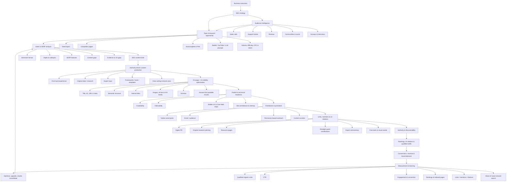
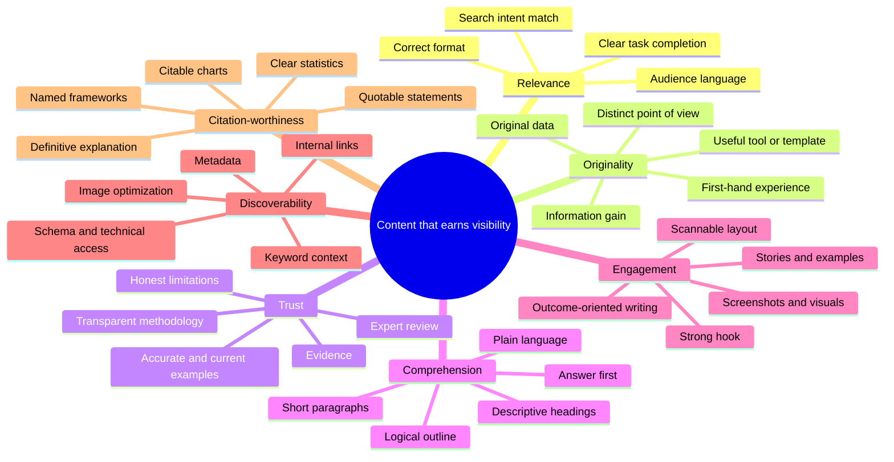
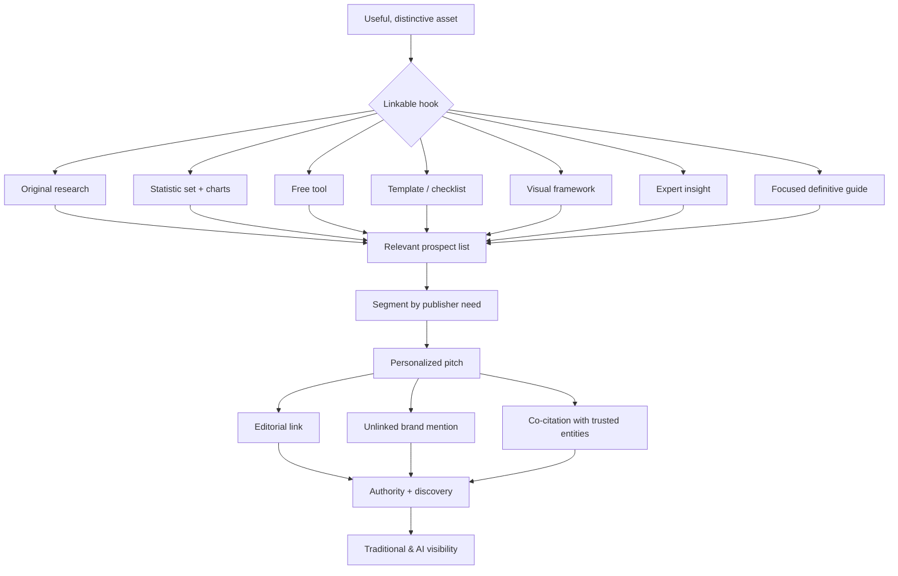
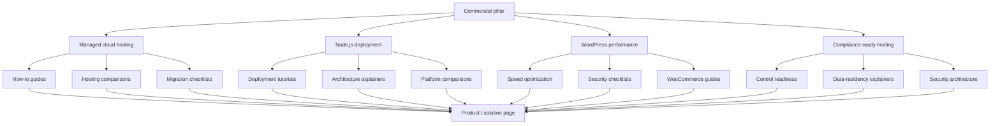

# SEO & Content Writing Knowledge Graph

> **Purpose:** A practical knowledge graph for planning, publishing, scaling, and measuring
> content that earns organic visibility, qualified demand, links, brand mentions, and AI citations.
>
> **Scope and provenance:** An independent operating model synthesised from publicly available
> SEO strategy, on-page SEO, content-writing, and link-building guidance, adapted for a cloud
> hosting SaaS. It is not a crawl or reproduction of any publisher's pages. See `README.md`
> in this folder for the restriction that governs use of this material.

---

## 1. Master Knowledge Graph



---

## 2. Entity Model

| Entity | Core attributes | Key relationships | Decision rule |
|---|---|---|---|
| **Business outcome** | Revenue, qualified demos, sales, CAC, awareness | Determines goals, keyword priorities, conversion pages, measurement | Start here, not with rankings |
| **Audience segment** | Job, sophistication, pain, desired outcome, objections, language | Produces queries; informs voice, examples, CTA, format | Use direct customer language whenever possible |
| **Topic cluster** | Core topic, subtopics, entities, questions, funnel stage | Contains pages; linked internally; maps to a business goal | Build topical depth without creating duplicate intent pages |
| **Keyword / query** | Intent, volume, difficulty, CPC, modifiers, SERP features | Maps to one primary page and supporting passages | Choose based on business value plus realistic ability to win |
| **Search intent** | Informational, commercial investigation, transactional, navigational; task to complete | Determines content type, scope, CTA and page design | Let dominant SERP format guide the primary format |
| **Content asset** | URL, format, target intent, unique angle, author, freshness, conversion role | Earns rankings, citations, links; connects via internal links | One page should have one clear primary job |
| **Information gain** | Original data, experience, examples, templates, tools, unique framing | Raises usefulness, citations, shares, links | Add something competitors cannot simply paraphrase |
| **Evidence** | Source, method, date, expert, case study, screenshot | Supports claims and E-E-A-T | Prefer verifiable, current, first-party proof |
| **On-page element** | Title, H1, headings, URL, copy, meta, links, images, schema | Helps machines and people interpret content | Optimize after the content's value and intent are right |
| **Authority signal** | Editorial backlinks, brand mentions, co-citations, expert coverage | Strengthens domain/entity association and discoverability | Relevance and editorial quality beat raw link counts |
| **Technical foundation** | Crawlability, indexation, speed, mobile usability, architecture, canonicals | Enables content discovery and user experience | Fix blockers before scaling content production |
| **Performance signal** | Impressions, CTR, positions, visits, engagement, leads, revenue, citations | Triggers optimization, upgrade, rewrite, or consolidation | Evaluate value to the business, not vanity traffic alone |

---

## 3. Production Graph: From Idea to Asset

```mermaid
flowchart LR
    A[Customer problem] --> B[Topic hypothesis]
    B --> C{Business fit?}
    C -- No --> X[Park or reject]
    C -- Yes --> D[Research demand across Google, communities, video and AI]
    D --> E[Score opportunity]
    E --> F{Can we create a better answer?}
    F -- No --> X
    F -- Yes --> G[Analyze SERP & cited sources]
    G --> H[Write content brief]
    H --> I[Define unique angle / information gain]
    I --> J[Collect evidence & SME input]
    J --> K[Build detailed outline]
    K --> L[Draft answer-first content]
    L --> M[Add visuals, examples, tools or templates]
    M --> N[Edit for clarity, accuracy, voice and conversion]
    N --> O[On-page / LLM optimization]
    O --> P[Technical QA and publish]
    P --> Q[Promote and pitch]
    Q --> R[Measure and improve]
```



### Opportunity score

Use a weighted score rather than choosing topics by volume alone. Score each factor 1 to 5:

```
Opportunity = Business Value + Intent Fit + Demand + Achievability
            + Differentiation Potential + Authority Leverage
```

For a SaaS business, **business value**, **intent fit**, and **differentiation potential**
should usually outweigh raw volume.

### Minimum viable SEO brief

- Target audience, customer stage, and job-to-be-done
- Primary query plus semantic and long-tail query set
- Intent, dominant SERP format, expected depth, SERP features
- Business purpose and next action / CTA
- Top competitor patterns and specific gaps
- Information-gain promise: data, benchmark, case study, tool, framework, template, or firsthand insight
- Evidence plan and SME contributor
- Required sections, visuals, internal links, external citations, and update date

---

## 4. Content Quality Graph



### The information-gain test

Before approving a draft, ask:

1. What would a reader learn here that the current top results do not give them?
2. What proof makes this claim credible?
3. What could a journalist, creator, buyer, or AI system extract and cite without needing extra context?
4. What practical output can the reader use immediately?

If the answers are weak, do not compensate by adding more generic words. Improve the research,
evidence, angle, or utility.

---

## 5. On-Page and AI Citation Graph

| Layer | Human goal | Search / AI interpretation goal | Implementation |
|---|---|---|---|
| Page promise | Instantly confirm relevance | Establish topic | Clear title tag, one descriptive H1, direct introduction |
| Answer layer | Solve the question fast | Create extractable answer passages | Give a concise answer immediately below relevant headings |
| Section layer | Let readers skim and act | Define semantic chunks | Descriptive H2/H3s, short paragraphs, lists, tables |
| Topic layer | Provide complete guidance | Establish semantic coverage | Natural related entities, subquestions, examples, context |
| Trust layer | Reduce risk | Demonstrate experience and credibility | Author expertise, citations, methods, case studies, original screenshots |
| Navigation layer | Help users continue | Distribute context and discovery | Contextual internal links with descriptive anchors |
| Visual layer | Make difficult ideas understandable | Add context and image-search eligibility | Useful diagrams, charts, screenshots; descriptive filenames and alt text |
| SERP layer | Earn the click without misleading | Improve result comprehension | Unique title/meta, concise URL, appropriate structured data |
| Performance layer | Avoid friction | Preserve crawlability and user experience | Mobile-first design, optimized media, indexable pages, fast rendering |

### LLM-ready passage pattern

```text
## How to [complete a specific task]

[One- to two-sentence direct answer that is complete on its own.]

1. [Action with a concrete condition or example]
2. [Action with a concrete condition or example]
3. [Action with a concrete condition or example]

Why it matters: [brief evidence, limitation, or tradeoff].
```

Use this only where it serves the reader. The objective is clarity and contextual
completeness, not writing mechanically for models.

---

## 6. Authority and Link-Earning Graph



### Outreach principles

- Pitch only credible, topically relevant publications, resource pages, journalists, and communities.
- Lead with the recipient's audience benefit: a useful stat, visual, quote, explanation, or resource.
- Personalize the opening and make **one** explicit ask.
- Keep the pitch concise; for research, put the strongest finding near the top.
- Track prospects, opens, replies, earned links, mention quality, authority/relevance, and time-to-placement.

Avoid paid or manipulative link schemes, mass generic outreach, and guest-post farms. A relevant
editorial mention can have strategic value even when it is unlinked or nofollowed.

---

## 7. Measurement and Refresh Loop

| Signal | What it diagnoses | Typical response |
|---|---|---|
| Impressions rising, CTR weak | Snippet or intent mismatch | Test clearer titles/meta, improve promise alignment |
| Rankings 6 to 20 with strong intent fit | Authority, completeness, or on-page gap | Add evidence, sections, internal links, visuals; earn relevant mentions |
| Traffic high, conversions weak | Wrong audience, weak commercial bridge, or page UX | Improve CTA, product context, comparison/case-study support, next-step path |
| Rankings or traffic declining | Freshness, competitor improvement, technical issue, SERP shift | Run a content health check and choose optimize, upgrade, rewrite, or consolidate |
| Multiple pages compete | Cannibalization / fragmented authority | Merge strategically, redirect where appropriate, re-map intent |
| Little indexing or discovery | Technical or architecture blocker | Check crawl paths, canonicals, sitemap, robots directives, internal links |
| Links or mentions absent | Asset lacks a reference-worthy hook or outreach fit | Create original data, tool, visual, template, or sharper angle |
| AI citations absent | Weak entity authority, unclear chunks, no distinctive evidence | Improve answer-first sections, evidence, brand mentions, and citation-worthy assets |

### Update hierarchy

1. **Optimization:** Small changes. Internal links, metadata, CTA, image, wording, missing subquestion.
2. **Upgrade:** Meaningful refresh. New examples or data, added sections, better visuals, stronger proof.
3. **Rewrite:** Rebuild the angle, structure, or intent fit when the old page no longer serves the query.
4. **Consolidation:** Combine overlapping pages into one stronger asset when a single page better satisfies the intent.

---

## 8. SaaS Application: Kloudbean

### Cluster architecture



### High-leverage asset types

- **Original benchmark:** Cloud or Node.js deployment performance study with transparent methodology and downloadable data.
- **Interactive tool:** Hosting-cost, migration-risk, or compliance-readiness calculator.
- **Decision framework:** Managed hosting versus self-managed cloud matrix with scenarios, trade-offs, and owner effort.
- **Operational template:** Deployment checklist, WordPress hardening checklist, or recovery playbook.
- **First-hand case study:** Before and after reliability, page-speed, deployment time, or support-load outcome, with constraints and method disclosed.

> **Kloudbean note on interactive tools.** The owner has directed that we do not ship
> interactive JS tools in articles, particularly anything that recommends competitors. Treat
> "interactive tool" in this framework as a *linkable-asset category to consider*, not a
> standing instruction. Static checklists, tables, and diagrams serve the same purpose here.

---

## 9. Editorial Gate Checklist

A page is ready only when it can answer **yes** to all applicable questions:

- Is there a clear business outcome and reader job-to-be-done?
- Does the page match the dominant search intent and format?
- Does it contain information gain beyond a generic AI summary?
- Are important claims supported with current, verifiable evidence or firsthand experience?
- Is the primary answer visible quickly, and is every section easy to scan?
- Are headings descriptive enough to function as a table of contents?
- Are target and related terms used naturally in meaningful places?
- Are internal links helpful, contextual, and directed toward priority pages?
- Do visuals explain something rather than decorate the page?
- Are title, URL, meta description, H1, images, schema, mobile UX, and indexation checked?
- Is there a non-intrusive but clear next step for the appropriate reader stage?
- Is there a promotion or outreach plan proportional to the asset's value?
- Is an owner and review date assigned?

---

## Operating Principle

**SEO is an evidence-driven visibility system, not a publishing volume contest.** Start with
business outcomes and customer reality; create the clearest, most useful, most credible answer
to a specific intent; make it technically accessible and easy to interpret; then earn
recognition across the web and continuously improve what works.
